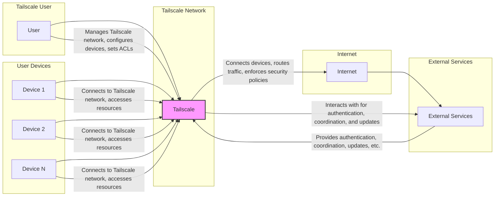
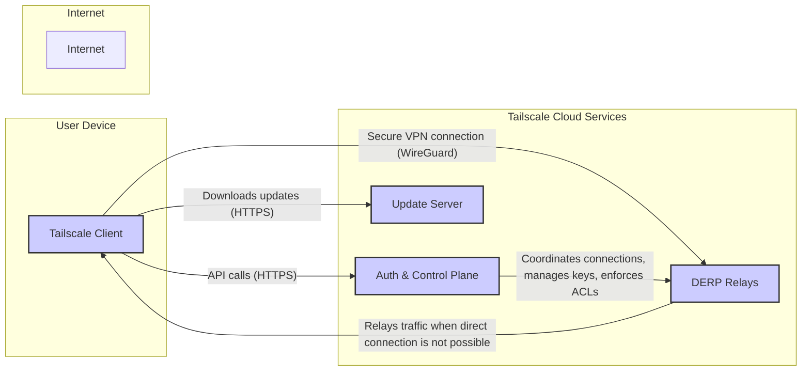

# BUSINESS POSTURE

- Business Priorities and Goals:
  - Provide secure and easy-to-use virtual private network (VPN) solutions.
  - Simplify network configuration and management for individuals and organizations.
  - Enable secure remote access to resources and devices.
  - Offer a performant and reliable networking experience.
  - Support a wide range of platforms and devices.
  - Grow user base and expand market share in the VPN and secure networking space.

- Business Risks:
  - Data breaches and unauthorized access to user data or networks.
  - Service unavailability and disruptions impacting user connectivity.
  - Performance issues and latency affecting user experience.
  - Security vulnerabilities in the software leading to exploitation.
  - Reputational damage due to security incidents or privacy concerns.
  - Legal and compliance risks related to data privacy and security regulations.
  - Competition from other VPN providers and networking solutions.
  - Difficulty in maintaining user trust and confidence in the security of the service.

# SECURITY POSTURE

- Existing Security Controls:
  - security control: End-to-end encryption using WireGuard protocol. (Implementation details in Tailscale documentation and code)
  - security control: Mutual authentication between devices using cryptographic keys. (Implementation details in Tailscale documentation and code)
  - security control: Access control lists (ACLs) to manage network access. (Configurable by users through Tailscale admin panel or CLI)
  - security control: Regular security audits and penetration testing. (Mentioned in Tailscale's security practices)
  - security control: Secure software development lifecycle (SSDLC) practices. (Implied by the project's maturity and security focus)
  - security control: Automated testing and continuous integration (CI) pipelines. (Visible in GitHub repository workflows)
  - security control: Vulnerability disclosure program. (Tailscale security page)
  - security control: Code reviews. (Standard practice in software development, likely used in Tailscale)
  - security control: Dependency scanning. (Likely part of the CI/CD pipeline)
  - security control: Static Application Security Testing (SAST). (Likely part of the CI/CD pipeline)
  - security control: Dynamic Application Security Testing (DAST). (Likely performed periodically)
  - security control: Infrastructure security controls provided by cloud providers (e.g., AWS, GCP, Azure). (Underlying infrastructure security)

- Accepted Risks:
  - accepted risk: Reliance on third-party dependencies and potential vulnerabilities within them. (Mitigated by dependency scanning and updates)
  - accepted risk: User misconfiguration of ACLs leading to unintended access. (Mitigated by documentation and user interface design)
  - accepted risk: Social engineering attacks targeting users' credentials. (Mitigated by strong authentication and user education)
  - accepted risk: Zero-day vulnerabilities in WireGuard or other core components. (Mitigated by proactive security measures and incident response plan)

- Recommended Security Controls:
  - security control: Implement Runtime Application Self-Protection (RASP) for enhanced runtime security monitoring and attack prevention.
  - security control: Enhance logging and monitoring capabilities for security events and anomalies.
  - security control: Implement a Security Information and Event Management (SIEM) system for centralized security monitoring and incident response.
  - security control: Conduct regular security awareness training for developers and operations teams.
  - security control: Implement a robust incident response plan and conduct regular drills.
  - security control: Explore and implement code signing for binaries to enhance software supply chain security.
  - security control: Implement more granular role-based access control (RBAC) within the Tailscale management plane.

- Security Requirements:
  - Authentication:
    - requirement: Securely authenticate users and devices attempting to join the Tailscale network.
    - requirement: Support multi-factor authentication (MFA) for enhanced user account security.
    - requirement: Implement robust session management to prevent unauthorized access after initial authentication.
  - Authorization:
    - requirement: Enforce granular authorization policies based on user roles, device identity, and network context.
    - requirement: Implement least privilege access control to limit user and device permissions.
    - requirement: Regularly review and update authorization policies to reflect changing security needs.
  - Input Validation:
    - requirement: Validate all user inputs and API requests to prevent injection attacks (e.g., command injection, SQL injection).
    - requirement: Sanitize user-provided data before storing or displaying it to prevent cross-site scripting (XSS) vulnerabilities.
    - requirement: Implement input validation at multiple layers (client-side and server-side) for defense in depth.
  - Cryptography:
    - requirement: Utilize strong cryptographic algorithms and protocols for data encryption in transit and at rest.
    - requirement: Securely manage cryptographic keys and certificates throughout their lifecycle.
    - requirement: Adhere to cryptographic best practices and industry standards (e.g., NIST guidelines).
    - requirement: Regularly review and update cryptographic implementations to address new vulnerabilities and advancements.

# DESIGN

## C4 CONTEXT



- Context Diagram Elements:
  - - Name: User
    - Type: Person
    - Description: Individuals or organizations that use Tailscale to create and manage secure private networks.
    - Responsibilities:
      - Manage their Tailscale network configuration.
      - Invite and manage users and devices on their network.
      - Define access control lists (ACLs) to control network access.
      - Install and configure Tailscale client software on their devices.
    - Security controls:
      - Strong password policy for Tailscale account.
      - Multi-factor authentication (MFA) for Tailscale account.
      - Secure management of Tailscale admin credentials.
  - - Name: Tailscale
    - Type: Software System
    - Description: A mesh VPN system that creates secure, private networks between devices, regardless of their physical location. It handles device authentication, key exchange, network routing, and security policy enforcement.
    - Responsibilities:
      - Authenticate and authorize devices joining the network.
      - Establish secure VPN tunnels between devices using WireGuard.
      - Route network traffic between connected devices.
      - Enforce access control lists (ACLs) defined by users.
      - Provide a management interface for users to configure their network.
      - Handle key exchange and distribution for secure communication.
      - Provide software updates to clients and servers.
    - Security controls:
      - End-to-end encryption using WireGuard.
      - Mutual authentication between devices.
      - Access control list (ACL) enforcement.
      - Secure key management.
      - Regular security updates and patching.
      - Secure coding practices.
      - Infrastructure security controls.
  - - Name: Device 1, Device 2, ..., Device N
    - Type: Software System
    - Description: Computing devices (laptops, desktops, servers, mobile devices, etc.) running the Tailscale client software and participating in the Tailscale network.
    - Responsibilities:
      - Run the Tailscale client application.
      - Establish and maintain VPN connections to other devices in the network.
      - Forward network traffic through the Tailscale VPN tunnel.
      - Enforce local security policies.
      - Receive and apply Tailscale software updates.
    - Security controls:
      - Device operating system security controls (firewall, antivirus, etc.).
      - Tailscale client software security features.
      - Secure storage of Tailscale client credentials and keys.
      - Regular patching of operating system and applications.
  - - Name: Internet
    - Type: Environment
    - Description: The public internet, used as the underlying network infrastructure for Tailscale to establish connections between devices and to communicate with external services.
    - Responsibilities:
      - Provide network connectivity between devices and external services.
      - Route network traffic.
    - Security controls:
      - Not directly controlled by Tailscale, relies on general internet security and underlying network infrastructure security.
  - - Name: External Services
    - Type: Software System
    - Description: External services that Tailscale relies on for various functionalities, such as authentication, coordination servers, update servers, and potentially third-party integrations.
    - Responsibilities:
      - Provide authentication services for Tailscale users and devices.
      - Facilitate coordination between Tailscale clients (e.g., DERP servers for relaying traffic).
      - Host and distribute Tailscale software updates.
      - Potentially integrate with other third-party services.
    - Security controls:
      - Authentication and authorization controls.
      - Secure communication protocols (HTTPS, TLS).
      - Infrastructure security controls.
      - Regular security updates and patching.
      - Data encryption at rest and in transit.

## C4 CONTAINER



- Container Diagram Elements:
  - - Name: Tailscale Client
    - Type: Application
    - Description: Software application installed on user devices (desktop, mobile, server) that establishes and manages the Tailscale VPN connection. It handles user authentication, key exchange, WireGuard tunnel management, and local network integration.
    - Responsibilities:
      - User authentication and device registration.
      - Establishing and maintaining WireGuard VPN tunnels.
      - Routing network traffic through the VPN tunnel.
      - Enforcing local security policies.
      - Communicating with Auth & Control Plane for configuration and coordination.
      - Handling software updates.
    - Security controls:
      - Secure storage of cryptographic keys and credentials (e.g., using OS-level keychains).
      - Input validation and sanitization.
      - Memory safety and protection against buffer overflows.
      - Regular security updates and patching.
      - Secure communication with Auth & Control Plane and DERP relays (TLS, WireGuard).
  - - Name: Auth & Control Plane
    - Type: Application
    - Description: Cloud-based service responsible for user authentication, device authorization, key management, network configuration, and access control list (ACL) enforcement. It acts as the central control point for the Tailscale network.
    - Responsibilities:
      - User and device authentication and authorization.
      - Key generation, distribution, and management.
      - Network configuration management.
      - Access control list (ACL) enforcement.
      - Coordination of connections between clients.
      - Management API for users and administrators.
      - Logging and monitoring of network activity.
    - Security controls:
      - Strong authentication and authorization mechanisms.
      - Secure key management system (HSM or similar).
      - Access control to management interfaces and data.
      - Input validation and sanitization.
      - Regular security audits and penetration testing.
      - Infrastructure security controls (cloud provider security).
      - Data encryption at rest and in transit.
      - DDoS protection.
  - - Name: DERP Relays (Decentralized Encrypted Relay Protocol)
    - Type: Application
    - Description: Globally distributed servers that act as relays for network traffic when direct peer-to-peer connections between Tailscale clients are not possible (e.g., due to NAT or firewalls). They ensure connectivity even in complex network environments. Traffic through DERP relays is still end-to-end encrypted.
    - Responsibilities:
      - Relaying encrypted network traffic between Tailscale clients.
      - Maintaining connectivity in challenging network environments.
      - Minimizing latency and maximizing throughput for relayed traffic.
    - Security controls:
      - Secure communication protocols (WireGuard).
      - Access control to relay servers.
      - Infrastructure security controls.
      - DDoS protection.
      - Regular security monitoring.
  - - Name: Update Server
    - Type: Application
    - Description: Service responsible for hosting and distributing Tailscale client software updates. Ensures that clients are running the latest versions with security patches and new features.
    - Responsibilities:
      - Hosting Tailscale client software packages.
      - Distributing software updates to clients.
      - Ensuring integrity and authenticity of software updates.
    - Security controls:
      - Secure storage of software packages.
      - Code signing of software packages.
      - HTTPS for update downloads.
      - Access control to update server infrastructure.

## DEPLOYMENT

- Deployment Architecture Options:
  - Option 1: Cloud-based deployment (Tailscale managed cloud). This is the primary and recommended deployment model where Tailscale manages the Auth & Control Plane, DERP relays, and Update Servers in their cloud infrastructure (e.g., AWS, GCP, Azure). Users only need to deploy the Tailscale client on their devices.
  - Option 2: Self-hosted deployment (Headscale). For users who require more control or have specific compliance needs, Tailscale offers Headscale, an open-source implementation of the Tailscale control server. Users can deploy and manage Headscale on their own infrastructure. DERP relays and Update Servers are still typically managed by Tailscale or can be self-hosted with more effort.

- Detailed Deployment Architecture (Cloud-based - Option 1):

```mermaid
graph LR
    subgraph "User Environment"
        subgraph "Device 1"
            DC1[Tailscale Client]
            OS1[Operating System]
            HW1[Hardware]
        end
        subgraph "Device 2"
            DC2[Tailscale Client]
            OS2[Operating System]
            HW2[Hardware]
        end
        subgraph "Device N"
            DCN[Tailscale Client]
            OSN[Operating System]
            HWN[Hardware]
        end
    end
    subgraph "Tailscale Cloud Infrastructure (AWS, GCP, Azure)"
        subgraph "Control Plane Zone"
            AC_LB[Load Balancer]
            AC1[Auth & Control Plane Instance 1]
            AC2[Auth & Control Plane Instance 2]
        end
        subgraph "Relay Zone (Global DERP Network)"
            DR1[DERP Relay Instance 1]
            DR2[DERP Relay Instance 2]
            DRN[DERP Relay Instance N]
        end
        subgraph "Update Zone"
            US_LB[Load Balancer]
            US1[Update Server Instance 1]
            US2[Update Server Instance 2]
        end
        DB[Database (for Control Plane)]
        CACHE[Cache (for Control Plane)]
    end
    INET[Internet]

    DC1 -- "VPN & HTTPS" --> INET
    DC2 -- "VPN & HTTPS" --> INET
    DCN -- "VPN & HTTPS" --> INET

    INET -- "HTTPS" --> AC_LB
    AC_LB --> AC1
    AC_LB --> AC2
    AC1 --> DB
    AC2 --> DB
    AC1 --> CACHE
    AC2 --> CACHE

    INET -- "VPN (WireGuard)" --> DR1
    INET -- "VPN (WireGuard)" --> DR2
    INET -- "VPN (WireGuard)" --> DRN

    INET -- "HTTPS" --> US_LB
    US_LB --> US1
    US_LB --> US2

    style DC1 fill:#ccf,stroke:#333,stroke-width:1px
    style DC2 fill:#ccf,stroke:#333,stroke-width:1px
    style DCN fill:#ccf,stroke:#333,stroke-width:1px
    style AC1 fill:#ccf,stroke:#333,stroke-width:1px
    style AC2 fill:#ccf,stroke:#333,stroke-width:1px
    style DR1 fill:#ccf,stroke:#333,stroke-width:1px
    style DR2 fill:#ccf,stroke:#333,stroke-width:1px
    style DRN fill:#ccf,stroke:#333,stroke-width:1px
    style US1 fill:#ccf,stroke:#333,stroke-width:1px
    style US2 fill:#ccf,stroke:#333,stroke-width:1px
    style DB fill:#eee,stroke:#333,stroke-width:1px
    style CACHE fill:#eee,stroke:#333,stroke-width:1px
    style AC_LB fill:#eee,stroke:#333,stroke-width:1px
    style US_LB fill:#eee,stroke:#333,stroke-width:1px
    style OS1 fill:#eee,stroke:#333,stroke-width:1px
    style OS2 fill:#eee,stroke:#333,stroke-width:1px
    style OSN fill:#eee,stroke:#333,stroke-width:1px
    style HW1 fill:#eee,stroke:#333,stroke-width:1px
    style HW2 fill:#eee,stroke:#333,stroke-width:1px
    style HWN fill:#eee,stroke:#333,stroke-width:1px
```

- Deployment Diagram Elements:
  - - Name: Device 1, Device 2, ..., Device N
    - Type: Physical/Virtual Machine
    - Description: User devices (physical or virtual machines) where the Tailscale client software is installed.
    - Responsibilities:
      - Run the Tailscale client application.
      - Provide the execution environment for the Tailscale client.
    - Security controls:
      - Operating system security controls.
      - Hardware security features (TPM, Secure Boot, etc.).
      - Physical security of the device.
  - - Name: Tailscale Client (DC1, DC2, DCN)
    - Type: Software Application
    - Description: Tailscale client application running on user devices.
    - Responsibilities:
      - Establish VPN connections.
      - Route traffic.
      - Authenticate with Control Plane.
    - Security controls:
      - Application-level security controls (as described in Container section).
      - Secure configuration and updates.
  - - Name: Auth & Control Plane Load Balancer (AC_LB)
    - Type: Load Balancer
    - Description: Load balancer distributing traffic to Auth & Control Plane instances.
    - Responsibilities:
      - Distribute incoming requests across Auth & Control Plane instances.
      - Ensure high availability and scalability of the Control Plane.
    - Security controls:
      - DDoS protection.
      - Access control to management interfaces.
      - TLS termination.
  - - Name: Auth & Control Plane Instance 1, 2 (AC1, AC2)
    - Type: Virtual Machine/Container
    - Description: Instances of the Auth & Control Plane application running in the cloud.
    - Responsibilities:
      - User and device authentication.
      - Key management.
      - ACL enforcement.
      - Network coordination.
    - Security controls:
      - Application-level security controls (as described in Container section).
      - Infrastructure security controls provided by cloud provider.
      - Regular security patching and updates.
  - - Name: Database (DB)
    - Type: Database Service
    - Description: Persistent storage for Auth & Control Plane data (user accounts, network configuration, keys, etc.).
    - Responsibilities:
      - Store and retrieve Control Plane data.
      - Ensure data persistence and availability.
    - Security controls:
      - Database access control and authentication.
      - Data encryption at rest and in transit.
      - Regular backups and disaster recovery.
      - Database security hardening.
  - - Name: Cache (CACHE)
    - Type: Cache Service
    - Description: Caching layer to improve performance and reduce load on the database.
    - Responsibilities:
      - Cache frequently accessed data.
      - Improve response times for Control Plane operations.
    - Security controls:
      - Access control to cache service.
      - Data encryption in transit (if applicable).
  - - Name: DERP Relay Instance 1, 2, ..., N (DR1, DR2, DRN)
    - Type: Virtual Machine/Container
    - Description: Instances of DERP relay servers distributed globally.
    - Responsibilities:
      - Relay encrypted traffic between clients.
      - Provide connectivity in NATed environments.
    - Security controls:
      - Application-level security controls (as described in Container section).
      - Infrastructure security controls.
      - DDoS protection.
  - - Name: Update Server Load Balancer (US_LB)
    - Type: Load Balancer
    - Description: Load balancer distributing traffic to Update Server instances.
    - Responsibilities:
      - Distribute download requests across Update Server instances.
      - Ensure high availability and scalability of the Update Service.
    - Security controls:
      - DDoS protection.
      - Access control to management interfaces.
      - TLS termination.
  - - Name: Update Server Instance 1, 2 (US1, US2)
    - Type: Virtual Machine/Container
    - Description: Instances of the Update Server application.
    - Responsibilities:
      - Host and serve Tailscale client software updates.
    - Security controls:
      - Application-level security controls (as described in Container section).
      - Secure storage of software packages.
      - Infrastructure security controls.

## BUILD

```mermaid
graph LR
    subgraph "Developer Workstation"
        DEV[Developer]
        CODE[Source Code]
    end
    subgraph "GitHub"
        VC[Version Control (GitHub)]
    end
    subgraph "CI/CD Pipeline (GitHub Actions)"
        BC[Build Container]
        TEST[Automated Tests]
        SAST[SAST Scanner]
        DAST[DAST Scanner]
        DEP_SCAN[Dependency Scanner]
        BUILD_ARTIFACTS[Build Artifacts]
    end
    subgraph "Artifact Repository"
        AR[Artifact Repository (e.g., GitHub Releases, Cloud Storage)]
    end

    DEV --> CODE
    CODE --> VC
    VC --> BC
    BC --> TEST
    BC --> SAST
    BC --> DAST
    BC --> DEP_SCAN
    BC --> BUILD_ARTIFACTS
    BUILD_ARTIFACTS --> AR

    style DEV fill:#ccf,stroke:#333,stroke-width:1px
    style CODE fill:#eee,stroke:#333,stroke-width:1px
    style VC fill:#eee,stroke:#333,stroke-width:1px
    style BC fill:#eee,stroke:#333,stroke-width:1px
    style TEST fill:#eee,stroke:#333,stroke-width:1px
    style SAST fill:#eee,stroke:#333,stroke-width:1px
    style DAST fill:#eee,stroke:#333,stroke-width:1px
    style DEP_SCAN fill:#eee,stroke:#333,stroke-width:1px
    style BUILD_ARTIFACTS fill:#eee,stroke:#333,stroke-width:1px
    style AR fill:#eee,stroke:#333,stroke-width:1px
```

- Build Process Elements:
  - - Name: Developer
    - Type: Person
    - Description: Software developers who write and maintain the Tailscale codebase.
    - Responsibilities:
      - Write, review, and commit code changes.
      - Participate in code reviews.
      - Fix bugs and address security vulnerabilities.
    - Security controls:
      - Secure coding practices training.
      - Secure workstation configuration.
      - Multi-factor authentication for code repository access.
  - - Name: Source Code
    - Type: Data
    - Description: The source code of the Tailscale project, stored in a version control system.
    - Responsibilities:
      - Represent the codebase of the project.
      - Track changes and revisions.
    - Security controls:
      - Access control to the code repository.
      - Code review process.
      - Branching and merging strategies to control code changes.
  - - Name: Version Control (GitHub)
    - Type: Software System
    - Description: GitHub repository hosting the Tailscale source code and managing version control.
    - Responsibilities:
      - Store and manage source code.
      - Track code changes and history.
      - Facilitate collaboration among developers.
      - Trigger CI/CD pipelines.
    - Security controls:
      - Access control and authentication (GitHub permissions).
      - Audit logging of code changes.
      - Branch protection rules.
      - Security features provided by GitHub platform.
  - - Name: CI/CD Pipeline (GitHub Actions)
    - Type: Automation System
    - Description: Automated CI/CD pipeline using GitHub Actions to build, test, and package Tailscale software.
    - Responsibilities:
      - Automate the build process.
      - Run automated tests (unit, integration, etc.).
      - Perform security scans (SAST, DAST, dependency scanning).
      - Build and package software artifacts.
      - Publish build artifacts to artifact repository.
    - Security controls:
      - Secure pipeline configuration and access control.
      - Use of secure build environments (containerized builds).
      - Security scanning tools integration (SAST, DAST, dependency scanning).
      - Code signing of build artifacts.
      - Audit logging of pipeline activities.
  - - Name: Build Container
    - Type: Software Container
    - Description: Containerized build environment used by the CI/CD pipeline to ensure consistent and reproducible builds.
    - Responsibilities:
      - Provide a consistent build environment.
      - Isolate build processes.
    - Security controls:
      - Minimal container image with only necessary build tools.
      - Regular updates of container base images.
      - Security scanning of container images.
  - - Name: Automated Tests
    - Type: Software Application
    - Description: Suite of automated tests (unit, integration, end-to-end) executed during the CI/CD pipeline.
    - Responsibilities:
      - Verify code functionality and correctness.
      - Detect regressions and bugs.
      - Improve code quality and reliability.
    - Security controls:
      - Secure test data management.
      - Test environment isolation.
  - - Name: SAST Scanner (Static Application Security Testing)
    - Type: Security Tool
    - Description: Static analysis security testing tool integrated into the CI/CD pipeline to scan source code for potential security vulnerabilities.
    - Responsibilities:
      - Identify potential security vulnerabilities in source code.
      - Provide reports and recommendations for remediation.
    - Security controls:
      - Regularly updated vulnerability rules and signatures.
      - Secure configuration and integration with CI/CD pipeline.
  - - Name: DAST Scanner (Dynamic Application Security Testing)
    - Type: Security Tool
    - Description: Dynamic analysis security testing tool (potentially used in a later stage or separate pipeline) to scan running applications for vulnerabilities.
    - Responsibilities:
      - Identify runtime security vulnerabilities.
      - Simulate attacks to detect weaknesses.
    - Security controls:
      - Secure configuration and deployment of DAST scanner.
      - Controlled testing environment.
  - - Name: Dependency Scanner
    - Type: Security Tool
    - Description: Tool to scan project dependencies for known vulnerabilities.
    - Responsibilities:
      - Identify vulnerable dependencies.
      - Alert developers to update dependencies.
    - Security controls:
      - Regularly updated vulnerability database.
      - Integration with CI/CD pipeline.
  - - Name: Build Artifacts
    - Type: Data
    - Description: Compiled binaries, packages, and other outputs of the build process.
    - Responsibilities:
      - Represent the distributable software.
    - Security controls:
      - Code signing to ensure integrity and authenticity.
      - Secure storage and transfer of artifacts.
  - - Name: Artifact Repository (e.g., GitHub Releases, Cloud Storage)
    - Type: Storage System
    - Description: Repository for storing and distributing build artifacts (e.g., GitHub Releases, cloud storage buckets).
    - Responsibilities:
      - Store build artifacts securely.
      - Distribute artifacts to users or deployment environments.
    - Security controls:
      - Access control to artifact repository.
      - Integrity checks for artifacts.
      - Secure distribution channels (HTTPS).

# RISK ASSESSMENT

- Critical Business Processes:
  - Securely connecting users and devices to private networks.
  - Authenticating and authorizing users and devices.
  - Managing network configurations and access control policies.
  - Providing reliable and performant VPN service.
  - Distributing software updates securely.
  - Protecting user data and privacy.

- Data to Protect and Sensitivity:
  - User credentials (hashed passwords, API keys): Highly sensitive, confidentiality and integrity are critical.
  - Cryptographic keys (WireGuard keys, etc.): Highly sensitive, confidentiality and integrity are critical.
  - Network configuration data (ACLs, device lists): Sensitive, confidentiality and integrity are important.
  - User activity logs (connection logs, etc.): Moderately sensitive, confidentiality and integrity are important for auditing and troubleshooting.
  - Personal information (email addresses, usernames): Moderately sensitive, confidentiality is important for privacy.
  - Source code: Sensitive, confidentiality and integrity are important to prevent unauthorized modifications and intellectual property theft.
  - Build artifacts: Sensitive, integrity and authenticity are critical to prevent supply chain attacks.

# QUESTIONS & ASSUMPTIONS

- Questions:
  - What is the specific threat model that Tailscale is designed to address?
  - What are the key compliance requirements for Tailscale (e.g., GDPR, SOC 2)?
  - What is the incident response plan for security incidents?
  - What is the process for managing and patching vulnerabilities in third-party dependencies?
  - Are there specific security certifications or attestations that Tailscale has obtained or is pursuing?
  - What is the user awareness training provided to Tailscale users regarding security best practices?
  - What is the data retention policy for user data and logs?

- Assumptions:
  - BUSINESS POSTURE:
    - Security and ease of use are top priorities for Tailscale.
    - User privacy is a significant concern.
    - Reliability and performance are crucial for user satisfaction.
  - SECURITY POSTURE:
    - Tailscale follows secure software development lifecycle practices.
    - Security is a core design principle.
    - Regular security audits and penetration testing are conducted.
    - Tailscale has a vulnerability disclosure program.
  - DESIGN:
    - Tailscale uses a cloud-based architecture for its control plane and relay infrastructure.
    - WireGuard is the primary VPN protocol used for secure communication.
    - End-to-end encryption is a fundamental security feature.
    - Tailscale relies on external services for some functionalities (e.g., cloud providers).
    - Automated CI/CD pipelines are used for building and deploying software.