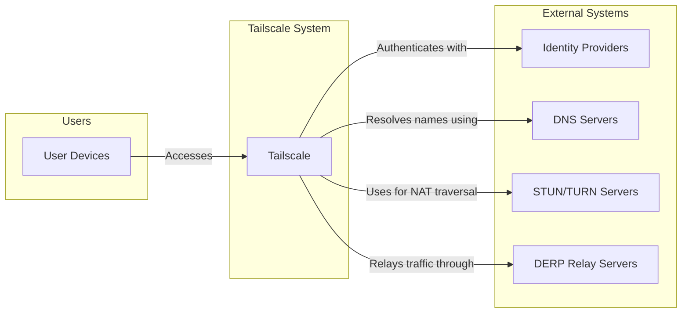
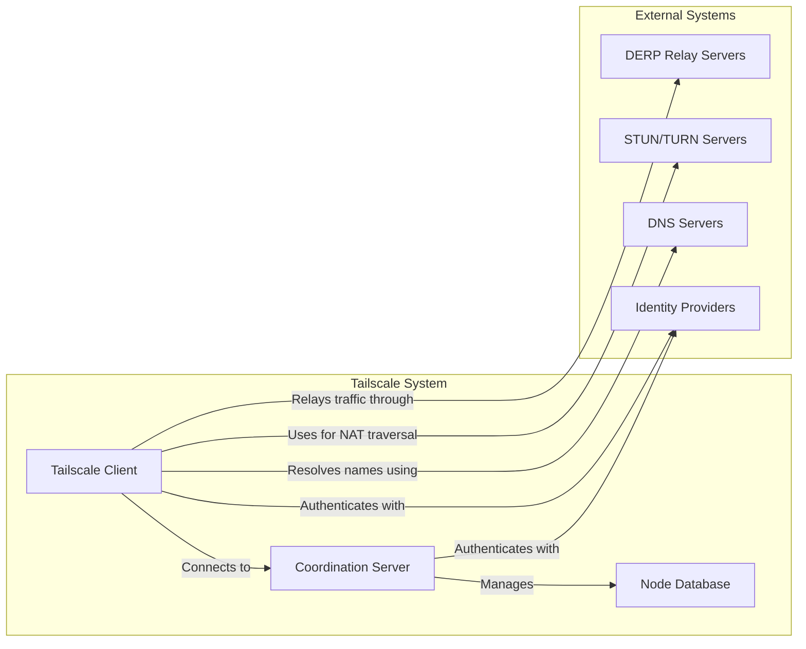
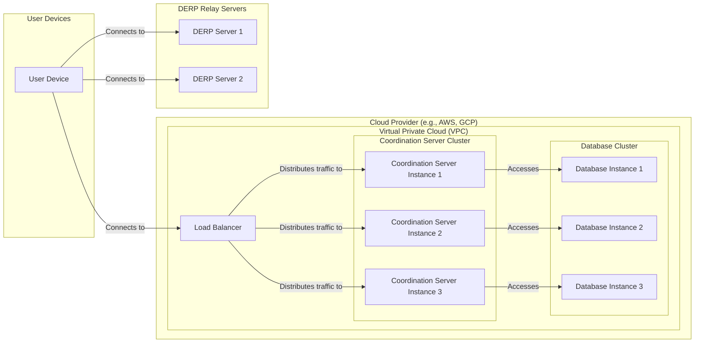

Okay, let's create a design document for the Tailscale project based on the provided GitHub repository.

# BUSINESS POSTURE

Tailscale's primary business goal is to provide a secure and user-friendly VPN service that simplifies network connectivity for individuals and organizations.  It aims to replace traditional, complex VPN setups with a zero-configuration, peer-to-peer mesh network built on WireGuard.  The value proposition centers around ease of use, security, and performance.  The project appears to be targeting a wide range of users, from individual developers to large enterprises.  This suggests a need for scalability and reliability.  Given the nature of the product (a VPN), security is paramount, and any compromise could have significant repercussions for users.

Business Priorities:

*   Provide a secure and reliable VPN service.
*   Simplify network configuration and management.
*   Offer a user-friendly experience across multiple platforms.
*   Ensure scalability to support a growing user base.
*   Maintain high performance and low latency.

Business Goals:

*   Become a leading provider of modern VPN solutions.
*   Attract and retain a large and diverse user base.
*   Establish a reputation for security and trustworthiness.
*   Generate revenue through subscription models.

Most Important Business Risks:

*   Compromise of Tailscale's infrastructure or code, leading to user data breaches or network disruptions.
*   Inability to scale the service to meet growing demand.
*   Reputational damage due to security vulnerabilities or service outages.
*   Failure to maintain a competitive advantage in terms of features, performance, or pricing.
*   Legal or regulatory challenges related to data privacy or network security.

# SECURITY POSTURE

Tailscale leverages several existing security controls and acknowledges certain risks.

Existing Security Controls:

*   security control: Uses WireGuard protocol for encrypted communication. (Described in documentation and source code).
*   security control: Employs a peer-to-peer mesh network architecture, minimizing central points of failure. (Described in documentation and design).
*   security control: Implements Mutual TLS (mTLS) for authentication and authorization. (Described in documentation and source code).
*   security control: Uses short-lived, single-use authentication keys. (Described in documentation).
*   security control: Offers features like MagicDNS for simplified service discovery. (Described in documentation and source code).
*   security control: Supports multi-factor authentication (MFA) for user accounts. (Described in documentation).
*   security control: Provides access control lists (ACLs) for managing network permissions. (Described in documentation and source code).
*   security control: Regular security audits and penetration testing. (Mentioned in documentation and blog posts).
*   security control: Open-source codebase, allowing for community review and scrutiny. (GitHub repository).
*   security control: Uses memory safe language (Go) to reduce memory corruption vulnerabilities. (Source code).

Accepted Risks:

*   accepted risk: Reliance on third-party identity providers (e.g., Google, Microsoft, GitHub) for user authentication. A compromise of these providers could potentially impact Tailscale user accounts.
*   accepted risk: Potential for denial-of-service (DoS) attacks against Tailscale's coordination server or relay servers. While the mesh network mitigates this, the central infrastructure remains a potential target.
*   accepted risk: User error in configuring ACLs or sharing access keys could lead to unauthorized access.
*   accepted risk: Vulnerabilities in the underlying operating systems or device firmware could compromise the security of Tailscale clients.

Recommended Security Controls:

*   Implement a robust vulnerability disclosure program (VDP) with clear reporting channels and timely response mechanisms.
*   Conduct regular threat modeling exercises to identify and address potential security weaknesses.
*   Implement network segmentation and isolation within Tailscale's infrastructure to limit the impact of potential breaches.
*   Provide detailed security guidance and best practices for users, particularly regarding ACL configuration and key management.
*   Consider implementing a Software Bill of Materials (SBOM) to track and manage dependencies, enhancing supply chain security.

Security Requirements:

*   Authentication:
    *   All users and devices must be strongly authenticated before accessing the Tailscale network.
    *   Support for multi-factor authentication (MFA) should be enforced where possible.
    *   Authentication mechanisms must be resistant to common attacks like phishing and credential stuffing.
*   Authorization:
    *   Access to network resources should be governed by granular access control lists (ACLs).
    *   The principle of least privilege should be applied, granting users only the minimum necessary access.
    *   Authorization decisions should be logged and auditable.
*   Input Validation:
    *   All input received from clients or external sources must be validated to prevent injection attacks and other vulnerabilities.
    *   Input validation should be performed on both the client-side and server-side.
*   Cryptography:
    *   All network traffic must be encrypted using strong, modern cryptographic protocols (WireGuard).
    *   Key management should be secure and follow best practices, including regular key rotation.
    *   Cryptographic algorithms and implementations should be regularly reviewed and updated to address emerging threats.

# DESIGN

## C4 CONTEXT



C4 Context Element Descriptions:

*   Users:
    *   1.  Name: User Devices
    *   2.  Type: Person
    *   3.  Description: Devices (laptops, phones, servers) running the Tailscale client software.
    *   4.  Responsibilities: Initiate connections, authenticate with Tailscale, access network resources.
    *   5.  Security controls: Tailscale client software, OS-level security controls, user authentication.

*   Tailscale System:
    *   1.  Name: Tailscale
    *   2.  Type: Software System
    *   3.  Description: The core Tailscale system, including the coordination server and client software.
    *   4.  Responsibilities: Manage network membership, coordinate peer-to-peer connections, enforce ACLs.
    *   5.  Security controls: WireGuard encryption, mTLS authentication, ACLs, regular security audits.

*   External Systems:
    *   1.  Name: Identity Providers
    *   2.  Type: Software System
    *   3.  Description: Third-party services (Google, Microsoft, GitHub, etc.) used for user authentication.
    *   4.  Responsibilities: Authenticate users and provide identity information to Tailscale.
    *   5.  Security controls: Rely on the security controls of the respective identity providers.

    *   1.  Name: DNS Servers
    *   2.  Type: Software System
    *   3.  Description: Standard DNS servers used for name resolution.
    *   4.  Responsibilities: Resolve domain names to IP addresses.
    *   5.  Security controls: Standard DNS security practices (e.g., DNSSEC).

    *   1.  Name: STUN/TURN Servers
    *   2.  Type: Software System
    *   3.  Description: Servers used for NAT traversal to establish peer-to-peer connections.
    *   4.  Responsibilities: Facilitate communication between clients behind NATs.
    *   5.  Security controls: Standard STUN/TURN security practices.

    *   1.  Name: DERP Relay Servers
    *   2.  Type: Software System
    *   3.  Description: Tailscale's relay servers used when direct peer-to-peer connections cannot be established.
    *   4.  Responsibilities: Relay encrypted traffic between Tailscale clients.
    *   5.  Security controls: WireGuard encryption, regular security audits.

## C4 CONTAINER



C4 Container Element Descriptions:

*   Tailscale System:
    *   1.  Name: Coordination Server
    *   2.  Type: Web Application
    *   3.  Description: The central server that manages network membership, distributes configuration, and coordinates peer connections.
    *   4.  Responsibilities: User authentication, node registration, ACL enforcement, key exchange.
    *   5.  Security controls: mTLS, regular security audits, input validation, rate limiting.

    *   1.  Name: Tailscale Client
    *   2.  Type: Application
    *   3.  Description: The software installed on user devices that establishes and maintains the VPN connection.
    *   4.  Responsibilities: Connect to the coordination server, establish peer-to-peer connections, encrypt and decrypt traffic.
    *   5.  Security controls: WireGuard encryption, mTLS, secure key storage.

    *   1.  Name: Node Database
    *   2.  Type: Database
    *   3.  Description: Stores information about registered nodes, their public keys, and ACLs.
    *   4.  Responsibilities: Persist node data, provide data to the coordination server.
    *   5.  Security controls: Database access controls, encryption at rest, regular backups.

*   External Systems:
    *   1.  Name: Identity Providers
    *   2.  Type: Software System
    *   3.  Description: Third-party services (Google, Microsoft, GitHub, etc.) used for user authentication.
    *   4.  Responsibilities: Authenticate users and provide identity information to Tailscale.
    *   5.  Security controls: Rely on the security controls of the respective identity providers.

    *   1.  Name: DNS Servers
    *   2.  Type: Software System
    *   3.  Description: Standard DNS servers used for name resolution.
    *   4.  Responsibilities: Resolve domain names to IP addresses.
    *   5.  Security controls: Standard DNS security practices (e.g., DNSSEC).

    *   1.  Name: STUN/TURN Servers
    *   2.  Type: Software System
    *   3.  Description: Servers used for NAT traversal to establish peer-to-peer connections.
    *   4.  Responsibilities: Facilitate communication between clients behind NATs.
    *   5.  Security controls: Standard STUN/TURN security practices.

    *   1.  Name: DERP Relay Servers
    *   2.  Type: Software System
    *   3.  Description: Tailscale's relay servers used when direct peer-to-peer connections cannot be established.
    *   4.  Responsibilities: Relay encrypted traffic between Tailscale clients.
    *   5.  Security controls: WireGuard encryption, regular security audits.

## DEPLOYMENT

Tailscale can be deployed in several ways:

1.  Self-hosted coordination server: Users can run their own coordination server, giving them full control over their network.
2.  Tailscale-hosted coordination server: Users can use Tailscale's managed coordination server, simplifying setup and maintenance.
3.  Headscale: An open-source implementation of the Tailscale coordination server.

We will describe the Tailscale-hosted coordination server deployment model, as it is the most common and managed by Tailscale.



Deployment Element Descriptions:

*   Cloud Provider (e.g., AWS, GCP):
    *   1.  Name: Cloud Provider
    *   2.  Type: Infrastructure
    *   3.  Description: The cloud provider hosting Tailscale's infrastructure.
    *   4.  Responsibilities: Provide compute, storage, and networking resources.
    *   5.  Security controls: Cloud provider's security controls (e.g., IAM, VPC security groups).

*   Virtual Private Cloud (VPC):
    *   1.  Name: Virtual Private Cloud (VPC)
    *   2.  Type: Network
    *   3.  Description: An isolated network within the cloud provider's infrastructure.
    *   4.  Responsibilities: Provide network isolation and security.
    *   5.  Security controls: VPC security groups, network ACLs.

*   Coordination Server Cluster:
    *   1.  Name: Coordination Server Instance 1, 2, 3
    *   2.  Type: Virtual Machine
    *   3.  Description: Instances of the Tailscale coordination server running on virtual machines.
    *   4.  Responsibilities: Manage network membership, coordinate peer connections, enforce ACLs.
    *   5.  Security controls: mTLS, regular security audits, input validation, rate limiting, OS hardening.

*   Database Cluster:
    *   1.  Name: Database Instance 1, 2, 3
    *   2.  Type: Database Instance
    *   3.  Description: Instances of the database used to store node information.
    *   4.  Responsibilities: Persist node data, provide data to the coordination server.
    *   5.  Security controls: Database access controls, encryption at rest, regular backups, OS hardening.

*   Load Balancer:
    *   1.  Name: Load Balancer
    *   2.  Type: Load Balancer
    *   3.  Description: Distributes incoming traffic across the coordination server instances.
    *   4.  Responsibilities: Improve availability and scalability.
    *   5.  Security controls: SSL termination, DDoS protection.

*   DERP Relay Servers:
    *   1.  Name: DERP Server 1, 2
    *   2.  Type: Virtual Machine
    *   3.  Description: Instances of Tailscale's DERP relay servers.
    *   4.  Responsibilities: Relay encrypted traffic between Tailscale clients.
    *   5.  Security controls: WireGuard encryption, regular security audits, OS hardening.

*   User Devices:
    *   1.  Name: User Device
    *   2.  Type: Device
    *   3.  Description: Devices running the Tailscale client software.
    *   4.  Responsibilities: Initiate connections, authenticate with Tailscale, access network resources.
    *   5.  Security controls: Tailscale client software, OS-level security controls, user authentication.

## BUILD

Tailscale's build process is primarily managed through its GitHub repository and utilizes Go's build system.

```mermaid
graph LR
    subgraph "Developer Workstation"
        DEV[Developer]
    end
    subgraph "GitHub"
        GH[GitHub Repository]
        GHA[GitHub Actions]
    end
    subgraph "Build Artifacts"
        BA[Build Artifacts (Binaries, Packages)]
    end

    DEV -- Pushes code to --> GH
    GH -- Triggers --> GHA
    GHA -- Builds --> BA
```

Build Process Description:

1.  Developers write code and push changes to the Tailscale GitHub repository.
2.  GitHub Actions, configured within the repository, are triggered by these pushes.
3.  GitHub Actions workflows perform various tasks:
    *   Linting: Code style checks using tools like `go fmt` and `go vet`.
    *   Testing: Running unit and integration tests.
    *   Building: Compiling the Go code into binaries for various platforms.
    *   Packaging: Creating packages (e.g., `.deb`, `.rpm`) for different operating systems.
    *   Security Scanning: While not explicitly visible in the basic repository structure, it's highly recommended (and likely implemented internally) to include static analysis security testing (SAST) using tools like `gosec` or similar.
4.  The resulting build artifacts (binaries and packages) are made available for download or deployment.

Security Controls in Build Process:

*   security control: Use of a memory-safe language (Go) reduces the risk of memory corruption vulnerabilities.
*   security control: Automated build process ensures consistency and repeatability.
*   security control: Linting and testing help identify potential bugs and vulnerabilities early in the development lifecycle.
*   security control: (Recommended) Integration of SAST tools into the build pipeline to detect security vulnerabilities in the code.
*   security control: (Recommended) Software Composition Analysis (SCA) to identify and manage vulnerabilities in third-party dependencies.
*   security control: (Recommended) Code signing of build artifacts to ensure their integrity and authenticity.

# RISK ASSESSMENT

Critical Business Processes:

*   User authentication and authorization.
*   Secure communication between Tailscale clients.
*   Management of network membership and ACLs.
*   Availability and reliability of the coordination server and DERP relay servers.

Data to Protect and Sensitivity:

*   User account information (email addresses, usernames): Personally Identifiable Information (PII) - Medium sensitivity.
*   Node public keys: Used for establishing secure connections - High sensitivity.
*   ACLs: Determine network access permissions - High sensitivity.
*   Network traffic metadata (source and destination IP addresses, timestamps): Potentially sensitive, depending on usage - Medium sensitivity.
*   Network traffic content: Encrypted by WireGuard, but the fact that communication is occurring between specific nodes could be sensitive - High sensitivity.

# QUESTIONS & ASSUMPTIONS

Questions:

*   What specific SAST and SCA tools are used in the build process?
*   What are the specific procedures for handling security vulnerabilities discovered in Tailscale's code or dependencies?
*   What are the details of the security audits and penetration testing performed on Tailscale's infrastructure and code?
*   What are the disaster recovery and business continuity plans for Tailscale's services?
*   What is the process for rotating cryptographic keys used by Tailscale?
*   What monitoring and logging capabilities are in place to detect and respond to security incidents?
*   Are there any specific compliance requirements (e.g., GDPR, HIPAA) that Tailscale needs to adhere to?

Assumptions:

*   BUSINESS POSTURE: Tailscale prioritizes security and reliability above all else.
*   BUSINESS POSTURE: Tailscale aims to maintain a balance between user-friendliness and robust security.
*   SECURITY POSTURE: Tailscale's internal security practices are consistent with industry best practices.
*   SECURITY POSTURE: Tailscale has a process for responding to security incidents and vulnerabilities.
*   DESIGN: The Tailscale-hosted coordination server is the primary deployment model used by most users.
*   DESIGN: GitHub Actions is the primary CI/CD platform used by Tailscale.
*   DESIGN: Tailscale uses a robust monitoring and logging system.