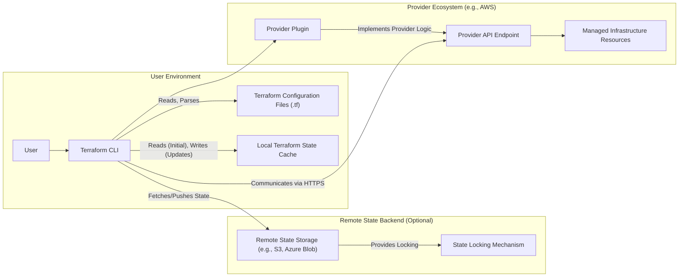

# Project Design Document: Terraform

**Version:** 1.1
**Date:** October 26, 2023
**Author:** AI Architecture Expert

## 1. Introduction

This document provides an enhanced architectural overview of Terraform, an open-source infrastructure-as-code (IaC) software tool developed by HashiCorp. This detailed design serves as a crucial foundation for subsequent threat modeling exercises, enabling a comprehensive understanding of the system's components and potential vulnerabilities. It meticulously outlines the key components, data flows, and interactions within the Terraform ecosystem, providing a clear picture of its operational mechanics.

## 2. Goals and Objectives

*   Deliver a refined and more detailed description of Terraform's architecture, enhancing clarity and understanding.
*   Thoroughly identify and explain the functionalities of each key component within the Terraform ecosystem.
*   Clearly illustrate the typical workflow and the intricate data flow pathways within Terraform operations.
*   Emphasize critical security considerations that are directly relevant and actionable for effective threat modeling.
*   Establish a robust and reliable reference point for security assessments, vulnerability analysis, and the development of security strategies.

## 3. High-Level Architecture

Terraform operates on a principle of orchestrating infrastructure through interactions between a client (the Terraform CLI) and various infrastructure providers. While not a traditional client-server model with a persistent server component, the interaction pattern and the role of the providers resemble a server-side function. The core of Terraform's operation involves the Terraform CLI interpreting configuration and directing providers to manage infrastructure.

## 4. Key Components

*   **Terraform CLI (Command Line Interface):**
    *   The primary tool through which users interact with Terraform.
    *   Responsible for:
        *   Parsing and interpreting Terraform configuration files written in HCL.
        *   Planning infrastructure changes by comparing the desired state with the current state.
        *   Applying the planned changes to the target infrastructure providers.
        *   Managing authentication and authorization with the configured providers using provided credentials.
        *   Interacting with the Terraform state, both locally and remotely.

*   **Terraform Configuration Files (.tf):**
    *   Declarative files written in HashiCorp Configuration Language (HCL).
    *   Define the desired state of the infrastructure, specifying:
        *   Resources to be created, modified, or deleted.
        *   The providers responsible for managing those resources.
        *   Data sources to fetch information from providers or external systems.
        *   Variables to parameterize configurations.

*   **Terraform State File (.tfstate):**
    *   A crucial JSON file that stores the current state of the managed infrastructure.
    *   Maintains a mapping between Terraform configurations and the real-world resources provisioned by providers.
    *   Used by Terraform to:
        *   Track changes and determine the necessary actions during subsequent `apply` operations.
        *   Understand the current attributes and dependencies of managed resources.
    *   Can be stored:
        *   Locally (not recommended for collaboration or production).
        *   Remotely in a backend (strongly recommended) for:
            *   Collaboration among team members.
            *   Enhanced security and durability.
            *   Enabling state locking.

*   **Terraform Providers:**
    *   Plugins that extend Terraform's capabilities to interact with specific infrastructure platforms, services, and APIs.
    *   Contain the implementation logic for:
        *   Authenticating with the target platform.
        *   Translating Terraform resource definitions into API calls.
        *   Creating, reading, updating, and deleting resources on the target platform.
    *   Examples include: AWS Provider, Azure Provider, Google Cloud Provider, Kubernetes Provider.

*   **Modules:**
    *   Self-contained packages of Terraform configurations that are treated as a single unit.
    *   Promote reusability, organization, and maintainability of infrastructure code.
    *   Can be sourced from:
        *   Local file paths.
        *   The public Terraform Registry.
        *   Private module registries.
        *   Git repositories.

*   **Terraform Registry:**
    *   A public platform for discovering and sharing Terraform providers and modules.
    *   Facilitates the reuse of pre-built infrastructure components and best practices.
    *   Includes both official HashiCorp-maintained providers and community-contributed modules.

*   **Remote State Backends:**
    *   Services used to store the Terraform state file remotely.
    *   Offer benefits such as:
        *   Collaboration: Enables multiple users to work on the same infrastructure.
        *   State Locking: Prevents concurrent modifications to the state, avoiding corruption.
        *   Security: Provides options for encryption and access control.
        *   Durability: Ensures the state file is not lost due to local machine issues.
    *   Examples include: AWS S3, Azure Blob Storage, Google Cloud Storage, HashiCorp Consul.

## 5. Terraform Workflow

The standard Terraform workflow involves a series of distinct stages to manage infrastructure:

1. **Write:** Users author Terraform configuration files (`.tf`) defining the desired infrastructure state using HCL. This includes specifying resources, providers, and any necessary configurations.
2. **Init:** The `terraform init` command initializes the Terraform working directory. This involves:
    *   Downloading the necessary provider plugins based on the configuration.
    *   Setting up the backend for state storage, if configured.
3. **Plan:** The `terraform plan` command compares the desired state (defined in the configuration files) with the current state (stored in the state file). It then generates an execution plan outlining the specific actions Terraform will take to achieve the desired state. This plan is typically reviewed by the user before applying.
4. **Apply:** The `terraform apply` command executes the plan generated in the previous step. This involves:
    *   Terraform making API calls to the configured providers.
    *   Providers provisioning, updating, or deleting infrastructure resources according to the plan.
5. **State:** After the `apply` operation, Terraform updates the state file to reflect the actual state of the infrastructure as reported by the providers. This ensures the state file remains synchronized with the real-world infrastructure.

```mermaid
graph LR
    A["Write/Modify Configuration (.tf)"] --> B["terraform init"]
    B -- "Downloads Plugins, Sets Up Backend" --> C["Provider Plugins & Backend Configured"]
    C --> D["terraform plan"]
    D -- "Compares Desired vs. Current State" --> E["Execution Plan"]
    E -- "Review & Approve" --> F["terraform apply"]
    F -- "Makes API Calls" --> G["Provider APIs"]
    G -- "Provisions/Updates/Deletes Resources" --> H["Infrastructure Resources"]
    H --> I["Update Remote State (.tfstate)"]
    I --> J["Infrastructure in Desired State"]
```

## 6. Data Flow

Understanding the data flow within Terraform is crucial for identifying potential security vulnerabilities. Here's a breakdown of the key data flows during a typical `terraform apply` operation:

*   **User to Terraform CLI:** The user inputs Terraform commands and provides configuration files, which may contain sensitive information like resource names or configurations.
*   **Terraform CLI to Configuration Files:** The CLI reads and parses the `.tf` files to understand the desired infrastructure blueprint. These files might contain sensitive data or references to secrets.
*   **Terraform CLI to Local State Cache:** The CLI reads the locally cached state file (if present) to compare with the desired state. It also writes updates to this cache.
*   **Terraform CLI to Remote State Backend:** The CLI fetches the latest state from the remote backend (if configured) before planning and applying. After applying changes, it pushes the updated state back to the backend. This data includes resource attributes and potentially sensitive information.
*   **Terraform CLI to Provider Plugin:** The CLI communicates with the appropriate provider plugin, sending resource definitions and configuration details. This communication often includes sensitive credentials for authentication.
*   **Provider Plugin to Provider API:** The provider plugin translates Terraform resource definitions into specific API calls to the infrastructure provider. These API calls carry the necessary information to create, update, or delete resources.
*   **Provider API to Infrastructure Resources:** The provider API interacts with the underlying infrastructure platform to provision and manage resources based on the received requests.
*   **Provider API to Provider Plugin:** The provider API returns information about the created or modified resources, including resource IDs, attributes, and potentially sensitive outputs.
*   **Provider Plugin to Terraform CLI:** The provider plugin relays the information received from the provider API back to the Terraform CLI.
*   **Terraform CLI to Remote State Backend:** The CLI updates the remote state file with the latest resource information received from the provider.

## 7. Security Considerations

Security is paramount when using infrastructure-as-code tools like Terraform. Here are key security considerations for threat modeling:

*   **State File Security:**
    *   **Threat:** Unauthorized access, modification, or deletion of the state file. This can lead to:
        *   Exposure of sensitive infrastructure details.
        *   Ability to manipulate or destroy infrastructure.
        *   Loss of synchronization between the declared and actual infrastructure.
    *   **Mitigation:**
        *   Store state files remotely in secure backends (e.g., AWS S3 with SSE-KMS, Azure Blob Storage with encryption at rest, Google Cloud Storage with CMEK).
        *   Enforce strict access controls (IAM policies, ACLs) to the state backend, limiting access to authorized users and systems.
        *   Enable encryption at rest and in transit for state data.
        *   Implement state locking mechanisms provided by the backend to prevent concurrent modifications and data corruption.
        *   Regularly back up the state file.

*   **Provider Credentials Management:**
    *   **Threat:** Compromised provider credentials granting unauthorized access to the infrastructure.
    *   **Mitigation:**
        *   **Never hardcode credentials in Terraform configuration files.**
        *   Utilize secure credential management techniques:
            *   Environment variables (with appropriate security considerations for the environment).
            *   Dedicated secrets management tools like HashiCorp Vault, AWS Secrets Manager, Azure Key Vault, Google Secret Manager.
            *   Instance profiles or managed identities for cloud environments where Terraform is running.
        *   Implement the principle of least privilege when granting permissions to Terraform.
        *   Rotate credentials regularly.

*   **Configuration File Security:**
    *   **Threat:** Exposure of sensitive information (e.g., API keys, connection strings, passwords) embedded within configuration files.
    *   **Mitigation:**
        *   Avoid storing sensitive data directly in configuration files.
        *   Use variables and input values to parameterize configurations and inject secrets at runtime.
        *   Store configuration files in secure version control systems with appropriate access controls.
        *   Utilize tools like `git-secrets` or similar to prevent accidental commit of secrets.

*   **Provider Plugin Security:**
    *   **Threat:** Malicious or compromised provider plugins potentially introducing vulnerabilities or backdoors.
    *   **Mitigation:**
        *   Use official and verified provider plugins from the Terraform Registry.
        *   Implement mechanisms to verify the integrity of downloaded plugins (e.g., using checksums).
        *   Keep provider plugins updated to the latest versions to patch known vulnerabilities.

*   **Remote Backend Security:**
    *   **Threat:** Security vulnerabilities or misconfigurations in the remote state backend itself.
    *   **Mitigation:**
        *   Choose reputable and secure backend providers.
        *   Follow the security best practices recommended by the backend provider.
        *   Regularly audit the security configuration of the backend.

*   **Network Security:**
    *   **Threat:** Man-in-the-middle attacks or eavesdropping on communication between Terraform CLI and provider APIs.
    *   **Mitigation:**
        *   Ensure all communication with provider APIs occurs over HTTPS.
        *   Restrict network access to the Terraform execution environment.

*   **Input Validation:**
    *   **Threat:** Injection attacks or unexpected behavior due to insufficient validation of user-provided input in Terraform configurations.
    *   **Mitigation:**
        *   Implement proper input validation and sanitization for variables and data sources.

*   **Access Control and Authorization (Terraform Execution):**
    *   **Threat:** Unauthorized users executing Terraform commands and making unintended changes to infrastructure.
    *   **Mitigation:**
        *   Implement role-based access control (RBAC) for the environment where Terraform is executed.
        *   Utilize features like Terraform Cloud workspaces or similar to manage access and permissions.

*   **Logging and Auditing:**
    *   **Threat:** Lack of visibility into Terraform operations, making it difficult to detect and respond to security incidents.
    *   **Mitigation:**
        *   Enable detailed logging for Terraform operations and provider API calls.
        *   Integrate with security information and event management (SIEM) systems for monitoring and alerting.

## 8. Deployment Considerations

*   **Execution Environment:** Terraform CLI can be executed from:
    *   Developer workstations (for local development and testing).
    *   Dedicated CI/CD pipelines (for automated infrastructure deployments).
    *   Server environments.
*   **State Management:**
    *   Local state storage is suitable for individual experimentation but not recommended for team collaboration or production.
    *   Remote backends are essential for team collaboration, security, and reliability.
*   **Collaboration:**
    *   Utilize remote backends with state locking to enable concurrent work.
    *   Consider using Terraform Cloud or Terraform Enterprise for enhanced collaboration features, version control for state, and policy enforcement.
*   **Automation:** Integrate Terraform into CI/CD pipelines for automated infrastructure provisioning and management.
*   **Security Best Practices:** Enforce security best practices throughout the deployment process, including secure credential management and access controls.

## 9. Future Considerations

*   **Enhanced Policy as Code Integration:** Deeper integration with policy-as-code tools like Open Policy Agent (OPA) or HashiCorp Sentinel for more granular and automated enforcement of security and compliance policies.
*   **Improved Secret Management Integration:** More seamless and secure integration with various secrets management providers directly within Terraform workflows.
*   **Advanced State Management Features:** Potential enhancements to state management, such as more sophisticated conflict resolution mechanisms or state versioning.
*   **Enhanced Observability and Monitoring:** Improved tools and integrations for monitoring the health and performance of Terraform-managed infrastructure.
*   **Further Development of the Terraform Registry Ecosystem:** Continued growth and curation of the Terraform Registry, providing a wider range of high-quality, secure, and reusable modules and providers.

This enhanced document provides a more comprehensive and detailed understanding of Terraform's architecture, crucial for effective threat modeling and security analysis. It highlights key components, data flows, and critical security considerations to facilitate the identification of potential vulnerabilities and the development of robust mitigation strategies.