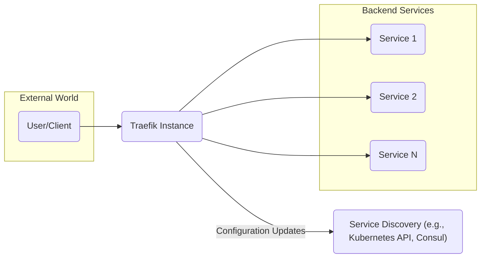
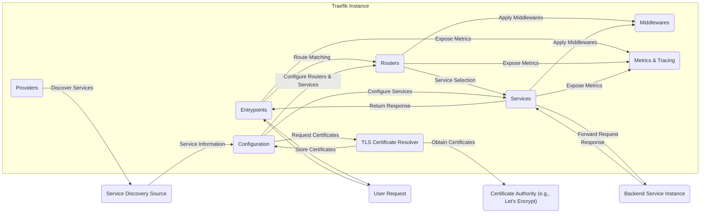

# Project Design Document: Traefik

**Version:** 1.1
**Date:** October 26, 2023
**Author:** AI Software Architect

## 1. Introduction

This document provides a detailed design overview of Traefik, a modern, cloud-native edge router that automates and simplifies the process of publishing services. This document aims to capture the key architectural components, data flows, and functionalities of Traefik to facilitate subsequent threat modeling activities. It focuses on the core aspects of Traefik's operation and its interactions with external systems, providing a clear understanding of its internal workings.

## 2. Goals

*   Provide a comprehensive and easily understandable architectural overview of Traefik.
*   Clearly identify key components and delineate their specific responsibilities within the system.
*   Accurately describe the data flow for both request processing and configuration updates within Traefik.
*   Outline the interactions and dependencies between Traefik and external systems.
*   Serve as a solid and reliable foundation for future threat modeling exercises, enabling the identification of potential vulnerabilities.

## 3. Scope

This document covers the core functionalities of Traefik as a dynamic reverse proxy and load balancer. It includes:

*   Intelligent request routing and forwarding based on various criteria.
*   Dynamic service discovery mechanisms, adapting to changes in backend service availability.
*   Flexible configuration management, supporting both static and dynamic sources.
*   Automated TLS termination and certificate management, ensuring secure communication.
*   Basic metrics and observability features for monitoring and troubleshooting.

This document does not cover:

*   Implementation details specific to individual provider integrations (e.g., the intricacies of the Kubernetes Ingress controller or Docker socket interaction).
*   In-depth analysis of specific middleware implementations or their configuration options.
*   Detailed instructions for specific deployment scenarios or infrastructure configurations.
*   Low-level code implementation details or internal algorithms.

## 4. High-Level Architecture

*   **User/Client:** Represents any external entity, such as a web browser or another application, initiating requests to services managed by Traefik.
*   **Traefik Instance:** The central component, acting as the intelligent reverse proxy and load balancer, responsible for routing incoming requests.
*   **Backend Services:** The actual applications or services providing the functionality that Traefik routes traffic to. These can be microservices, web applications, or other network services.
*   **Service Discovery:** An external system or API that Traefik integrates with to automatically discover and monitor the availability and location of backend services.

## 5. Detailed Architecture

### 5.1. Key Components

*   **Entrypoints:**
    *   Define the network interfaces where Traefik listens for incoming requests. This includes specifying the protocol (e.g., HTTP, TCP, UDP) and the port number.
    *   Act as the initial point of contact for all incoming traffic, handling connection establishment and request reception.

*   **Routers:**
    *   Evaluate incoming requests against a set of predefined rules to determine the appropriate backend service. These rules can be based on hostnames, URL paths, headers, and other request attributes.
    *   Implement the core routing logic, matching requests to services based on the configured rules.
    *   Direct matched requests to the corresponding service for further processing.

*   **Services:**
    *   Represent the abstraction of a backend application or service. They hold information about the available instances of that service, including their network addresses and health status.
    *   Implement load balancing algorithms to distribute traffic across multiple healthy instances of a backend service, ensuring high availability and performance.
    *   Can be configured with specific load balancing strategies (e.g., round-robin, weighted).

*   **Providers:**
    *   Enable Traefik to dynamically discover and monitor backend services without manual configuration.
    *   Connect to various service discovery backends like Kubernetes API, Docker, Consul, Etcd, or even read configuration from files.
    *   Continuously monitor the configured service discovery sources for changes in service availability, metadata, and configuration, automatically updating Traefik's internal state.

*   **Configuration:**
    *   Stores all the necessary settings that govern Traefik's behavior, including routing rules, service definitions, middleware configurations, and TLS settings.
    *   Can be sourced statically from configuration files (e.g., YAML, TOML) or dynamically through providers.
    *   Provides a unified view of the system's desired state, ensuring consistent routing and service management.

*   **Middlewares:**
    *   Offer a mechanism to intercept, inspect, and modify requests and responses as they flow through Traefik.
    *   Provide a wide range of functionalities, including authentication, authorization, rate limiting, header manipulation, compression, and more.
    *   Can be chained together to implement complex request processing pipelines, adding flexibility and extensibility to Traefik.

*   **TLS Certificate Resolver:**
    *   Automates the process of obtaining and renewing TLS certificates, enabling secure HTTPS connections.
    *   Supports integration with various Certificate Authorities (CAs) like Let's Encrypt using the ACME protocol.
    *   Manages the lifecycle of certificates, ensuring they are always valid and up-to-date.

*   **Metrics & Tracing:**
    *   Collects and exposes valuable metrics about Traefik's performance, including request rates, latency, error counts, and resource utilization.
    *   Supports integration with popular monitoring and tracing systems like Prometheus, InfluxDB, and Jaeger, providing insights into the health and performance of the routed applications.

## 6. Data Flow

### 6.1. Request Processing

1. An incoming **User Request** arrives at a configured **Entrypoint** on the Traefik instance.
2. The **Entrypoint** receives the request and forwards it to the **Routers** component for processing.
3. **Routers** evaluate the request against their defined routing rules (e.g., host, path, headers) to find a matching route.
4. Once a matching router is found, it selects the associated **Service** that represents the target backend application.
5. The selected **Service** applies its configured load balancing strategy to choose a healthy **Backend Service Instance** to handle the request.
6. The request is then forwarded to the chosen **Backend Service Instance**.
7. The **Backend Service Instance** processes the request and sends a **Response** back to the originating **Service** within Traefik.
8. The **Service** may apply configured response **Middlewares** to modify the response before sending it back to the **Entrypoint**.
9. Finally, the **Entrypoint** sends the processed **Response** back to the initial **User**.

### 6.2. Configuration Updates

1. **Providers** actively monitor their configured **Service Discovery Source** for any changes in the backend service landscape.
2. When changes are detected (e.g., new service instances, removed instances, updated metadata), the **Providers** retrieve the updated **Service Information**.
3. The **Providers** translate this service information into Traefik's internal **Configuration** format, representing the current state of the backend services.
4. This updated **Configuration** is then applied to the **Routers** and **Services**, dynamically adjusting the routing rules and service definitions to reflect the changes in the backend environment.
5. The **TLS Certificate Resolver** may also be triggered by configuration changes, such as the addition of new hostnames requiring TLS certificates, initiating the process to **Request Certificates** from a **Certificate Authority**.

## 7. Security Considerations (For Threat Modeling)

*   **Exposure of Entrypoints:** Entrypoints are the primary entry points for external traffic, making them a significant attack surface.
    *   Potential Threats: DDoS attacks, brute-force attacks, exploitation of vulnerabilities in the underlying network stack.
    *   Considerations: Implement rate limiting, network segmentation, and intrusion detection/prevention systems.
*   **Configuration Vulnerabilities:** Misconfigurations in routing rules, service definitions, or middleware settings can introduce security flaws.
    *   Potential Threats: Open redirects, access control bypasses, exposure of sensitive information.
    *   Considerations: Implement robust configuration validation, follow security best practices for middleware configuration, and regularly audit configurations.
*   **Provider Security:** The security of the service discovery sources and the authentication mechanisms used by providers is critical.
    *   Potential Threats: Compromised service discovery can lead to incorrect routing, denial of service, or injection of malicious services.
    *   Considerations: Secure access to service discovery APIs, use strong authentication and authorization, and monitor for unauthorized changes.
*   **TLS Termination:** Vulnerabilities in TLS configuration or certificate management can compromise the confidentiality and integrity of communication.
    *   Potential Threats: Man-in-the-middle attacks, exposure of sensitive data transmitted over HTTPS.
    *   Considerations: Enforce strong TLS versions and cipher suites, properly manage and secure private keys, and utilize automated certificate management.
*   **Middleware Security:** Insecurely implemented or configured middlewares can introduce various vulnerabilities.
    *   Potential Threats: Authentication bypass, authorization flaws, injection vulnerabilities (e.g., SQL injection, cross-site scripting).
    *   Considerations: Carefully select and configure middlewares, follow secure coding practices for custom middlewares, and regularly update middleware components.
*   **Access Control to Traefik API:** If Traefik exposes an API for management or monitoring, securing access to this API is essential.
    *   Potential Threats: Unauthorized access to configuration, leading to manipulation of routing rules or service definitions.
    *   Considerations: Implement strong authentication and authorization mechanisms for the API, restrict access based on the principle of least privilege.
*   **Denial of Service (DoS):** Traefik needs to be resilient against DoS attacks targeting its entrypoints or its ability to discover services.
    *   Potential Threats: Resource exhaustion, making the reverse proxy unavailable.
    *   Considerations: Implement rate limiting, connection limits, and resource quotas.
*   **Metrics and Monitoring Exposure:** Ensure that exposed metrics endpoints do not inadvertently reveal sensitive information about the backend services or the infrastructure.
    *   Potential Threats: Information disclosure, providing attackers with insights into the system's architecture and potential vulnerabilities.
    *   Considerations: Secure access to metrics endpoints, sanitize or filter sensitive data before exposing metrics.

## 8. Technologies Used

*   **Go:** The primary programming language in which Traefik is developed.
*   **HTTP/HTTPS:** The core protocols for routing web traffic.
*   **TCP/UDP:** Support for routing non-HTTP traffic, enabling broader application support.
*   **TLS (Transport Layer Security):** For encrypting communication and ensuring secure connections.
*   **Various Service Discovery APIs:**  Integration with different service discovery platforms depends on the configured providers (e.g., Kubernetes API, Consul API, Docker API, etcd API).
*   **ACME (Automated Certificate Management Environment) Protocol:** Used for automatic certificate acquisition and renewal, often with Let's Encrypt.
*   **Metrics Formats:** Support for exporting metrics in various formats like Prometheus, InfluxDB, StatsD, and others.

## 9. Deployment Considerations

*   **Containerized Deployment:** Traefik is commonly deployed as a containerized application using Docker or within container orchestration platforms like Kubernetes. This simplifies deployment, scaling, and management.
*   **Standalone Binary:** Traefik can also be deployed as a standalone binary on various operating systems, offering flexibility for different environments.
*   **High Availability (HA):** For production environments, deploying multiple Traefik instances behind a load balancer ensures high availability and fault tolerance.
*   **Configuration Management:** Configuration can be managed through static files (YAML, TOML), command-line arguments, environment variables, or dynamically through providers. Choosing the appropriate method depends on the deployment environment and operational preferences.

## 10. Future Considerations (Out of Scope for Initial Threat Model)

*   Advanced traffic management features such as canary deployments, blue/green deployments, and A/B testing capabilities.
*   Deeper integration with advanced security features like Web Application Firewalls (WAFs) and intrusion prevention systems (IPS).
*   Enhanced observability and tracing capabilities with more granular insights into request flow and performance.
*   Expanding support for a wider range of service discovery mechanisms and backend platforms.

This document provides a comprehensive design overview of Traefik, detailing its architecture, data flow, and key considerations. This information serves as a crucial foundation for conducting a thorough threat modeling exercise to proactively identify and mitigate potential security vulnerabilities.
