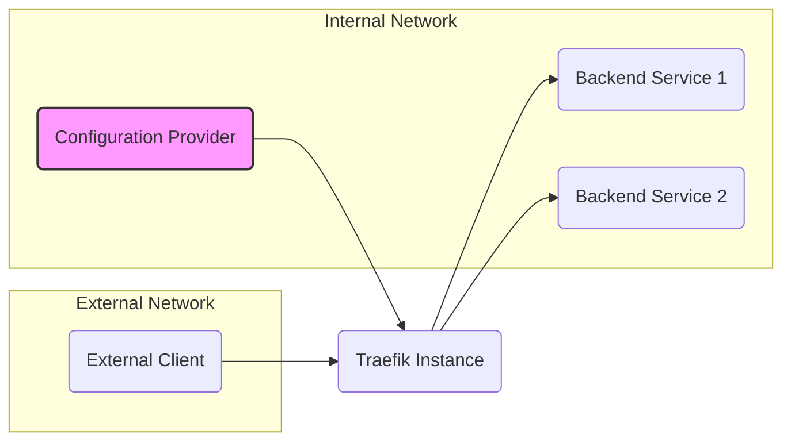
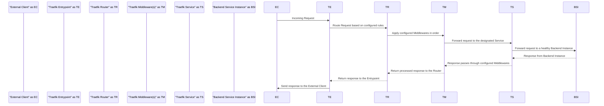

## Project Design Document: Traefik - Cloud-Native Edge Router

**Version:** 1.1
**Date:** October 26, 2023
**Author:** AI Software Architect

### 1. Introduction

This document provides an enhanced architectural design of the Traefik project, a modern, cloud-native edge router designed for ease of service publishing and dynamic configuration. This detailed design serves as a foundational resource for subsequent threat modeling exercises, clearly outlining the key components, data flow, and interactions within the Traefik ecosystem.

### 2. Goals and Objectives

The primary goals of Traefik are to:

* **Simplify and Automate Service Exposure:**  Enable automatic discovery and configuration of services for external accessibility, reducing manual intervention.
* **Provide Highly Dynamic Configuration:** Adapt in real-time to changes in the underlying infrastructure and service deployments without requiring restarts or downtime.
* **Offer a Modern, Declarative, and User-Friendly Experience:** Provide intuitive configuration options, often expressed declaratively, and simplified operational management.
* **Enhance Application Security at the Edge:** Offer built-in features like TLS termination, various authentication mechanisms, and authorization capabilities.
* **Seamlessly Integrate with Cloud-Native Environments:** Provide native integration and automatic configuration within container orchestration platforms such as Kubernetes and Docker.

### 3. High-Level Architecture

Traefik operates as an intelligent and dynamic reverse proxy and load balancer positioned at the network edge. It intelligently routes incoming requests to the appropriate backend services based on dynamically discovered configurations and defined routing rules.

* **External Client:** Any user, application, or system initiating requests intended for services managed by Traefik.
* **Traefik Instance:** The core runtime process of Traefik, responsible for request routing, load balancing, and applying configured middlewares.
* **Backend Service 1/2:** The internal applications or services to which Traefik directs incoming traffic.
* **Configuration Provider:** The source of truth for Traefik's dynamic configuration, such as Kubernetes API server, Docker daemon, or configuration files.

### 4. Component Details

This section provides a detailed breakdown of the key components within a Traefik instance:

* **Entrypoints:**
    * Definition:  Represent the network entry points (ports and protocols) where Traefik listens for incoming client requests. Examples include HTTP on port 80 and HTTPS on port 443.
    * Functionality:  Responsible for accepting incoming network connections and initiating the request processing pipeline.
    * Configuration: Defined through static configuration files, command-line arguments, or dynamic configuration sources.

* **Providers:**
    * Definition:  Components that dynamically discover and monitor the availability and configuration of backend services.
    * Functionality:  Continuously watch for changes in the underlying infrastructure (e.g., new Kubernetes Pods, updated Docker container labels, file modifications) and update Traefik's routing configuration accordingly. This often involves subscribing to event streams or polling APIs.
    * Examples:
        * `kubernetes`:  Monitors Kubernetes API for Ingresses, Services, Endpoints, and other relevant Custom Resource Definitions (CRDs).
        * `docker`:  Inspects Docker containers for labels that define routing rules and service configurations.
        * `file`:  Reads configuration from static YAML or TOML files, allowing for manual configuration.
        * `consulcatalog`:  Discovers services registered within a HashiCorp Consul service discovery system.
    * Configuration: Enabled and configured through static configuration, specifying the provider type and connection details.

* **Routers:**
    * Definition:  Components that act as intelligent traffic directors, matching incoming requests to specific backend services based on a set of defined rules.
    * Functionality: Evaluate various attributes of an incoming request (e.g., Host header, URL path, headers, query parameters) against configured matching rules to determine the appropriate service to forward the request to.
    * Configuration: Primarily generated dynamically by providers based on discovered service configurations. Static router definitions are also possible.
    * Key Attributes:
        * `Rule`:  A logical expression defining the matching criteria for a request (e.g., `Host(\`app.example.com\`)`, `PathPrefix(\`/api\`)`, `Headers(\`X-Custom-Header\`, \`value\`)`).
        * `Service`:  The name of the target service to which matching requests should be forwarded.
        * `Priority`:  An integer value used to determine the order in which routers are evaluated when multiple routers match a single request. Higher priority routers are evaluated first.

* **Services:**
    * Definition:  Represent the abstract definition of a backend application or service to which Traefik can route traffic.
    * Functionality:  Define how Traefik should connect to the actual backend instances. This includes specifying the backend server addresses, ports, and load balancing strategies.
    * Configuration:  Typically generated dynamically by providers, reflecting the available backend instances. Static service definitions are also supported.
    * Key Attributes:
        * `LoadBalancer`:  Configuration settings for distributing traffic across multiple backend instances, including algorithms like `wrr` (weighted round robin), `drr` (dynamic round robin), and `sticky`.
        * `Servers`:  A list of backend server addresses (IP addresses or hostnames) and ports.
        * `HealthCheck`:  Configuration for periodically checking the health of backend instances to ensure traffic is only routed to healthy servers.

* **Middlewares:**
    * Definition:  Components that intercept and modify requests and responses as they flow through Traefik, enabling a wide range of functionalities.
    * Functionality:  Provide a modular and extensible way to apply transformations and policies to traffic. Middlewares are chained together and executed in a defined order.
    * Examples:
        * **Authentication:** `BasicAuth`, `DigestAuth`, `ForwardAuth` (delegating authentication to an external service), `OAuth2`.
        * **Authorization:**  Checking permissions based on headers or other request attributes.
        * **Request/Response Manipulation:** Adding, modifying, or removing headers; rewriting URLs.
        * **Redirection:**  Redirecting requests based on specific criteria.
        * **Rate Limiting:**  Limiting the number of requests from a specific source within a given time window.
        * **Circuit Breaker:**  Temporarily stopping traffic to unhealthy backend services to prevent cascading failures.
        * **Compression:**  Compressing responses to reduce bandwidth usage.
        * **Buffering:**  Buffering requests or responses.
        * **Security Headers:**  Adding HTTP security headers like `Strict-Transport-Security`, `X-Frame-Options`, `Content-Security-Policy`, and `X-XSS-Protection`.
    * Configuration: Defined dynamically by providers or statically. Applied to routers, specifying the middleware type and its parameters.

### 5. Data Flow

The typical lifecycle of a request processed by Traefik involves the following steps:

1. **Incoming Request:** An external client initiates a request, which arrives at a configured Traefik Entrypoint.
2. **Route Request:** The Entrypoint hands the request to the Router component. The Router analyzes the request attributes and attempts to match it against its configured routing rules.
3. **Apply Middlewares:** Once a matching Router is found, any associated Middlewares are applied to the request in the defined order. This may involve authentication, authorization, header manipulation, and other transformations.
4. **Forward to Service:** After middleware processing, the Router forwards the (potentially modified) request to the designated Service.
5. **Forward to Backend Instance:** The Service component, based on its load balancing configuration, selects a healthy Backend Service Instance and forwards the request.
6. **Response from Backend Instance:** The Backend Service Instance processes the request and returns a response to Traefik's Service component.
7. **Response through Middlewares:** The response travels back through the same chain of Middlewares (in reverse order for some types of middleware) for any post-processing or modifications.
8. **Return processed response to the Router:** The Middlewares return the processed response to the Router.
9. **Return response to the Entrypoint:** The Router sends the final response back to the Entrypoint.
10. **Send response to the External Client:** The Entrypoint transmits the response back to the originating External Client.

### 6. Security Considerations

Security is a paramount concern in the design and operation of Traefik. Key security aspects include:

* **TLS Termination and HTTPS Enforcement:**
    * Traefik can terminate TLS connections, decrypting incoming HTTPS traffic.
    * Certificates can be managed automatically using Let's Encrypt (ACME protocol) or loaded from static files or secret stores.
    * **Threats:** Weak TLS configurations (e.g., outdated TLS versions, weak ciphers) can expose traffic to eavesdropping. Improper certificate management can lead to man-in-the-middle attacks.
    * **Mitigations:** Enforce strong TLS configurations, regularly update certificates, and securely manage private keys.

* **Authentication:**
    * Traefik's Middlewares provide various authentication mechanisms to verify the identity of clients.
    * **Threats:** Brute-force attacks against authentication endpoints, credential stuffing, and insecure storage of authentication credentials.
    * **Mitigations:** Implement strong password policies, use multi-factor authentication where possible, and securely store credentials (e.g., using secrets management tools). Consider rate limiting authentication attempts.

* **Authorization:**
    * Middlewares can enforce authorization policies to control access to specific resources based on the authenticated user's permissions.
    * **Threats:** Unauthorized access to sensitive resources due to misconfigured authorization rules or vulnerabilities in authorization logic.
    * **Mitigations:** Implement a robust authorization framework, follow the principle of least privilege, and regularly review and audit authorization configurations.

* **Rate Limiting and DoS Protection:**
    * Middlewares can limit the rate of requests from specific sources to mitigate denial-of-service attacks.
    * **Threats:** Application-level DoS attacks that can overwhelm backend services.
    * **Mitigations:** Configure appropriate rate limits based on expected traffic patterns. Consider deploying Traefik behind a dedicated DDoS protection service for more comprehensive protection.

* **Security Headers:**
    * Middlewares can add security-related HTTP headers to protect against common web vulnerabilities.
    * **Threats:** Cross-Site Scripting (XSS), Clickjacking, and other client-side vulnerabilities.
    * **Mitigations:** Configure appropriate security headers like `Strict-Transport-Security`, `X-Frame-Options`, `Content-Security-Policy`, and `X-XSS-Protection`.

* **Input Validation:**
    * While Traefik primarily routes traffic, it's crucial that backend services perform thorough input validation to prevent injection attacks.
    * **Threats:** SQL injection, command injection, and other injection vulnerabilities.
    * **Mitigations:** Implement robust input validation and sanitization on backend services.

* **Secrets Management:**
    * Securely managing sensitive information like TLS private keys and authentication credentials is critical.
    * **Threats:** Exposure of sensitive information if stored insecurely.
    * **Mitigations:** Utilize dedicated secrets management tools (e.g., HashiCorp Vault, Kubernetes Secrets) to store and manage secrets securely. Avoid storing secrets directly in configuration files.

* **Updates and Patching:**
    * Regularly updating Traefik to the latest version is essential to patch security vulnerabilities.
    * **Threats:** Exploitation of known vulnerabilities in older versions of Traefik.
    * **Mitigations:** Establish a process for regularly updating Traefik and its dependencies.

* **Configuration Security:**
    * Access to Traefik's configuration should be restricted to authorized personnel to prevent unauthorized modifications.
    * **Threats:** Malicious or accidental misconfiguration leading to security vulnerabilities or service disruptions.
    * **Mitigations:** Implement access controls for Traefik's configuration files and APIs.

### 7. Deployment Considerations

Traefik's deployment can vary depending on the environment:

* **Containerized Environments (Docker, Kubernetes):**  The most common deployment method, leveraging automatic service discovery and integration with container orchestration platforms.
    * **Considerations:** Utilize Kubernetes Ingress resources or CRDs for dynamic configuration. Leverage container security best practices.
* **Virtual Machines:** Traefik can be deployed as a standalone process on virtual machines.
    * **Considerations:** Manage configuration through files or command-line arguments. Ensure proper network configuration.
* **Bare Metal:** Deployment on bare metal servers is also possible.
    * **Considerations:** Similar to VM deployments, manage configuration and network settings manually.

Key deployment considerations for security and reliability:

* **High Availability (HA):** Deploy multiple Traefik instances behind a load balancer to ensure service availability in case of instance failures.
* **Scalability:** Design the deployment to allow for horizontal scaling by adding more Traefik instances to handle increased traffic.
* **Monitoring and Logging:** Implement comprehensive monitoring and logging to track performance, identify issues, and detect potential security incidents. Integrate with centralized logging and monitoring systems.
* **Resource Allocation:**  Properly size the resources (CPU, memory) allocated to Traefik instances based on expected traffic load.

### 8. Future Considerations

Potential future enhancements and areas for development in Traefik include:

* **Enhanced Observability and Tracing:** Deeper integration with distributed tracing systems (e.g., Jaeger, Zipkin) for improved request tracing and performance analysis.
* **Advanced Traffic Management Capabilities:** More sophisticated routing strategies, traffic shaping, and canary deployments.
* **Improved Security Features:** Integration with Web Application Firewalls (WAFs) and more granular authorization controls.
* **Service Mesh Integration:**  Deeper integration with service mesh technologies for enhanced security and observability within the mesh.

This enhanced design document provides a more detailed and comprehensive understanding of the Traefik project's architecture, specifically tailored for threat modeling purposes. By clearly outlining the components, data flow, and security considerations, this document facilitates the identification and mitigation of potential security vulnerabilities.