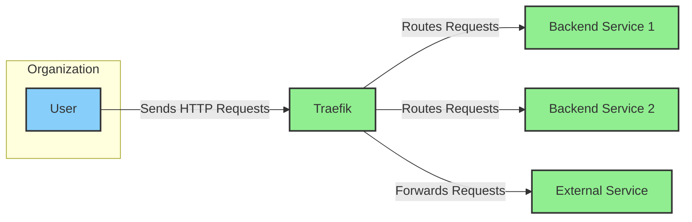
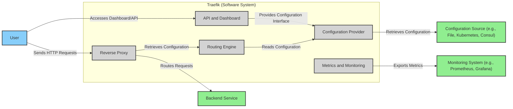
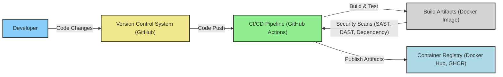

# BUSINESS POSTURE

Traefik is a modern reverse proxy and load balancer designed to simplify the deployment and management of microservices and containerized applications.

- Business Priorities and Goals:
  - Simplify infrastructure management for application deployments.
  - Automate configuration and reduce manual intervention in routing and load balancing.
  - Provide a dynamic and scalable solution for modern application architectures.
  - Enhance application availability and performance through intelligent routing and load balancing.
  - Support various infrastructure providers and deployment environments.

- Business Risks:
  - Misconfiguration of Traefik leading to service disruptions or security vulnerabilities.
  - Performance bottlenecks in Traefik impacting application responsiveness.
  - Security breaches through Traefik exposing backend services or sensitive data.
  - Dependency on Traefik for critical application routing, creating a single point of failure if not properly managed.
  - Complexity in managing Traefik at scale across large and distributed environments.

# SECURITY POSTURE

- Existing Security Controls:
  - security control: HTTPS support for secure communication. Implemented through TLS configuration in Traefik.
  - security control: Access control mechanisms for the Traefik dashboard and API. Implemented through authentication and authorization configurations in Traefik.
  - security control: Support for various authentication providers (e.g., basic auth, OAuth, forward auth). Configurable in Traefik.
  - security control: Rate limiting and circuit breakers to protect backend services from overload. Configurable in Traefik.
  - security control: Regular security audits and vulnerability scanning of the Traefik codebase. Described in Traefik's security policies and release notes.
  - security control: Signed releases and checksums for binary distributions to ensure integrity. Part of Traefik's release process.
  - security control: Community support and active security response for reported vulnerabilities. Evident in Traefik's community forums and GitHub issue tracker.

- Accepted Risks:
  - accepted risk: Potential for misconfiguration by users leading to security vulnerabilities. Mitigated by documentation and best practices, but user error remains a risk.
  - accepted risk: Reliance on third-party libraries and dependencies, which may introduce vulnerabilities. Mitigated by dependency scanning and updates, but inherent risk exists.
  - accepted risk: Exposure of Traefik management interfaces (dashboard, API) if not properly secured. Mitigated by access controls, but risk remains if misconfigured or credentials are compromised.

- Recommended Security Controls:
  - security control: Implement Web Application Firewall (WAF) in front of Traefik to provide an additional layer of security against common web attacks.
  - security control: Integrate with Security Information and Event Management (SIEM) systems for centralized logging and security monitoring of Traefik and related infrastructure.
  - security control: Regularly perform penetration testing on Traefik deployments to identify and remediate potential vulnerabilities.
  - security control: Enforce least privilege principles for Traefik service accounts and access to configuration files.
  - security control: Implement automated configuration validation and security checks as part of the deployment pipeline for Traefik configurations.

- Security Requirements:
  - Authentication:
    - Requirement: Secure authentication mechanisms for accessing the Traefik dashboard and API.
    - Requirement: Support for integration with enterprise identity providers for centralized authentication.
    - Requirement: Strong password policies and multi-factor authentication options for administrative access.
  - Authorization:
    - Requirement: Role-based access control (RBAC) to manage permissions for different users and services interacting with Traefik.
    - Requirement: Fine-grained authorization policies to control access to specific routes and functionalities.
    - Requirement: Secure delegation of authorization to backend services where appropriate.
  - Input Validation:
    - Requirement: Robust input validation for all configuration parameters and API requests to prevent injection attacks.
    - Requirement: Input sanitization and encoding to mitigate cross-site scripting (XSS) vulnerabilities.
    - Requirement: Protection against common web application attacks such as SQL injection and command injection.
  - Cryptography:
    - Requirement: Strong encryption for all sensitive data in transit and at rest, including TLS for HTTPS and encryption of secrets.
    - Requirement: Secure key management practices for TLS certificates and other cryptographic keys.
    - Requirement: Support for modern and secure cryptographic algorithms and protocols.

# DESIGN

## C4 CONTEXT



- Context Diagram Elements:
  - - Name: User
    - Type: Person
    - Description: End-users accessing applications behind Traefik.
    - Responsibilities: Sends HTTP requests to access applications.
    - Security controls: User authentication at the application level (handled by backend services, not directly by Traefik in context).
  - - Name: Traefik
    - Type: Software System
    - Description: The reverse proxy and load balancer, routing traffic to backend services.
    - Responsibilities:
      - Receive incoming HTTP/HTTPS requests.
      - Route requests to appropriate backend services based on configured rules.
      - Load balance traffic across multiple instances of backend services.
      - Terminate TLS connections.
      - Provide observability and metrics.
    - Security controls:
      - TLS termination.
      - Access control for dashboard and API.
      - Rate limiting.
      - Authentication and authorization middleware support.
  - - Name: Backend Service 1
    - Type: Software System
    - Description: Example backend application service behind Traefik.
    - Responsibilities:
      - Process business logic for a specific application.
      - Serve application content to users.
    - Security controls:
      - Application-level authentication and authorization.
      - Input validation.
      - Data encryption.
  - - Name: Backend Service 2
    - Type: Software System
    - Description: Another example backend application service behind Traefik.
    - Responsibilities:
      - Process business logic for a different application.
      - Serve application content to users.
    - Security controls:
      - Application-level authentication and authorization.
      - Input validation.
      - Data encryption.
  - - Name: External Service
    - Type: Software System
    - Description: External services that Traefik might forward requests to, such as third-party APIs.
    - Responsibilities:
      - Provide external functionalities or data.
    - Security controls:
      - API authentication and authorization.
      - Secure communication protocols (HTTPS).

## C4 CONTAINER



- Container Diagram Elements:
  - - Name: Reverse Proxy
    - Type: Container
    - Description: The core component of Traefik responsible for receiving and forwarding requests. Implemented in Go.
    - Responsibilities:
      - Accept incoming HTTP/HTTPS connections.
      - Terminate TLS.
      - Apply middleware (e.g., authentication, rate limiting).
      - Forward requests to backend services based on routing rules.
    - Security controls:
      - TLS configuration and management.
      - HTTP security headers.
      - Input validation for HTTP requests.
      - Rate limiting and circuit breaking.
  - - Name: Configuration Provider
    - Type: Container
    - Description: Manages the configuration sources and provides configuration data to the Routing Engine. Implemented in Go.
    - Responsibilities:
      - Read configuration from various sources (files, Kubernetes, Consul, etc.).
      - Parse and validate configuration.
      - Provide configuration data to the Routing Engine.
      - Watch for configuration changes and update the Routing Engine dynamically.
    - Security controls:
      - Secure access to configuration sources.
      - Validation of configuration data to prevent misconfigurations.
      - Secure storage of sensitive configuration data (e.g., API keys, certificates).
  - - Name: Routing Engine
    - Type: Container
    - Description:  The component that makes routing decisions based on the configuration. Implemented in Go.
    - Responsibilities:
      - Process configuration data from the Configuration Provider.
      - Build and maintain routing tables.
      - Match incoming requests to routing rules.
      - Select appropriate backend services for requests.
    - Security controls:
      - Secure processing of routing rules to prevent bypasses or unintended routing.
      - Protection against denial-of-service attacks through efficient routing logic.
  - - Name: Metrics and Monitoring
    - Type: Container
    - Description: Exposes metrics and monitoring data for Traefik's operation. Implemented in Go with libraries like Prometheus client.
    - Responsibilities:
      - Collect metrics about request handling, backend service health, and internal operations.
      - Expose metrics in Prometheus format or other monitoring systems.
      - Provide health check endpoints.
    - Security controls:
      - Access control for metrics endpoints to prevent unauthorized access to monitoring data.
      - Secure export of metrics data to monitoring systems.
  - - Name: API and Dashboard
    - Type: Container
    - Description: Provides an HTTP API and web-based dashboard for managing and monitoring Traefik. Implemented in Go.
    - Responsibilities:
      - Expose an API for configuration management and status monitoring.
      - Provide a user-friendly web dashboard for visualizing Traefik's state and configuration.
      - Allow users to interact with Traefik for management tasks.
    - Security controls:
      - Authentication and authorization for API and dashboard access.
      - Input validation for API requests.
      - Protection against common web application vulnerabilities in the dashboard.
      - Secure session management for dashboard users.

## DEPLOYMENT

Deployment Solution: Kubernetes Deployment

```mermaid
flowchart LR
    subgraph "Kubernetes Cluster"
        subgraph "Nodes"
            A["Node 1"]:::node
            B["Node 2"]:::node
        end
        subgraph "Namespaces"
            subgraph "traefik-namespace"
                C["Traefik Pod 1"]:::pod -- "Reverse Proxy Container"
                D["Traefik Pod 2"]:::pod -- "Reverse Proxy Container"
                E["Traefik Service"]:::k8s_service
            end
            subgraph "app-namespace"
                F["App Pod 1"]:::pod -- "Backend Service Container"
                G["App Pod 2"]:::pod -- "Backend Service Container"
                H["App Service"]:::k8s_service
            end
        end
        I["Kubernetes API Server"]:::k8s_component
    end
    J["External User"]:::person
    K["Load Balancer (Cloud Provider)"]:::infrastructure

    J -- "Sends HTTP Requests" --> K
    K -- "Forwards to NodePort" --> E
    E -- "Routes to Pod" --> C & D
    C & D -- "Proxies Requests" --> H
    H -- "Routes to Pod" --> F & G
    C & D -- "Watches for Configuration" --> I

    classDef person fill:#87CEFA,stroke:#333,stroke-width:2px
    classDef infrastructure fill:#F0E68C,stroke:#333,stroke-width:2px
    classDef node fill:#FAEBD7,stroke:#333,stroke-width:2px
    classDef pod fill:#D3D3D3,stroke:#333,stroke-width:2px
    classDef k8s_service fill:#ADD8E6,stroke:#333,stroke-width:2px
    classDef k8s_component fill:#FFA07A,stroke:#333,stroke-width:2px
```

- Deployment Diagram Elements:
  - - Name: Kubernetes Cluster
    - Type: Infrastructure
    - Description: The Kubernetes cluster where Traefik and backend applications are deployed.
    - Responsibilities:
      - Orchestrate container deployments.
      - Provide networking and service discovery.
      - Manage resource allocation and scaling.
    - Security controls:
      - Network policies to isolate namespaces and control traffic flow.
      - RBAC for access control to Kubernetes API and resources.
      - Pod security policies/admission controllers to enforce security standards for pods.
  - - Name: Node 1 & Node 2
    - Type: Infrastructure (Node)
    - Description: Worker nodes in the Kubernetes cluster.
    - Responsibilities:
      - Run containerized applications (Pods).
      - Provide compute resources.
    - Security controls:
      - Host-level security hardening.
      - Container runtime security (e.g., containerd, CRI-O).
      - Regular patching and updates.
  - - Name: traefik-namespace
    - Type: Kubernetes Namespace
    - Description: Dedicated namespace for deploying Traefik components.
    - Responsibilities:
      - Provide isolation for Traefik resources within the cluster.
    - Security controls:
      - Network policies to restrict traffic to and from the namespace.
      - RBAC policies to control access to resources within the namespace.
  - - Name: Traefik Pod 1 & Traefik Pod 2
    - Type: Kubernetes Pod
    - Description: Instances of Traefik running as pods in the Kubernetes cluster.
    - Responsibilities:
      - Run Traefik containers (Reverse Proxy, Configuration Provider, etc.).
      - Handle incoming traffic and route to backend services.
    - Security controls:
      - Container image security scanning.
      - Least privilege security context for containers.
      - Resource limits to prevent resource exhaustion.
  - - Name: Traefik Service
    - Type: Kubernetes Service
    - Description: Kubernetes service exposing Traefik pods.
    - Responsibilities:
      - Provide a stable endpoint for accessing Traefik pods.
      - Load balance traffic across Traefik pods.
    - Security controls:
      - Service type configuration (e.g., LoadBalancer, NodePort) to control external exposure.
      - Network policies to restrict access to the service.
  - - Name: app-namespace
    - Type: Kubernetes Namespace
    - Description: Dedicated namespace for deploying backend application services.
    - Responsibilities:
      - Provide isolation for application resources.
    - Security controls:
      - Network policies to restrict traffic to and from the namespace.
      - RBAC policies to control access to resources within the namespace.
  - - Name: App Pod 1 & App Pod 2
    - Type: Kubernetes Pod
    - Description: Instances of backend application services running as pods.
    - Responsibilities:
      - Run backend application containers.
      - Serve application content.
    - Security controls:
      - Application-level security controls (authentication, authorization, input validation).
      - Container image security scanning.
      - Least privilege security context for containers.
  - - Name: App Service
    - Type: Kubernetes Service
    - Description: Kubernetes service exposing backend application pods.
    - Responsibilities:
      - Provide a stable endpoint for accessing application pods within the cluster.
      - Load balance traffic across application pods.
    - Security controls:
      - Service type configuration (e.g., ClusterIP).
      - Network policies to restrict access to the service.
  - - Name: Kubernetes API Server
    - Type: Kubernetes Component
    - Description: The central control plane component of Kubernetes.
    - Responsibilities:
      - Expose the Kubernetes API.
      - Manage cluster state and configuration.
    - Security controls:
      - Secure API access control (authentication and authorization).
      - Audit logging of API requests.
      - TLS encryption for API communication.
  - - Name: External User
    - Type: Person
    - Description: Users accessing applications through Traefik.
    - Responsibilities:
      - Send HTTP requests to access applications.
    - Security controls:
      - User authentication at the application level.
  - - Name: Load Balancer (Cloud Provider)
    - Type: Infrastructure (Load Balancer)
    - Description: Cloud provider's load balancer in front of the Kubernetes cluster.
    - Responsibilities:
      - Expose Kubernetes services to the external network.
      - Load balance traffic across Kubernetes nodes.
    - Security controls:
      - Network access control lists (ACLs) to restrict access to the load balancer.
      - DDoS protection.
      - TLS termination (optional, can be done at Traefik level).

## BUILD



- Build Process Elements:
  - - Name: Developer
    - Type: Person
    - Description: Software developers contributing to the Traefik project.
    - Responsibilities:
      - Write and commit code changes.
      - Perform local testing.
      - Participate in code reviews.
    - Security controls:
      - Secure development workstations.
      - Code review process to identify potential vulnerabilities.
      - Security awareness training.
  - - Name: Version Control System (GitHub)
    - Type: VCS
    - Description: GitHub repository hosting the Traefik source code.
    - Responsibilities:
      - Store and manage source code.
      - Track code changes and history.
      - Facilitate collaboration among developers.
    - Security controls:
      - Access control to the repository (authentication and authorization).
      - Branch protection rules.
      - Audit logging of repository activities.
  - - Name: CI/CD Pipeline (GitHub Actions)
    - Type: CI/CD
    - Description: Automated CI/CD pipeline using GitHub Actions for building, testing, and publishing Traefik.
    - Responsibilities:
      - Automate the build process.
      - Run unit and integration tests.
      - Perform security scans (SAST, DAST, dependency scanning).
      - Build and publish container images and binaries.
    - Security controls:
      - Secure pipeline configuration and access control.
      - Secrets management for API keys and credentials.
      - Security scanning tools integration (SAST, DAST, dependency check).
      - Build process isolation and integrity.
  - - Name: Build Artifacts (Docker Image)
    - Type: Artifact
    - Description: Docker container images built by the CI/CD pipeline.
    - Responsibilities:
      - Package Traefik application and dependencies.
      - Serve as deployment units.
    - Security controls:
      - Minimal base images to reduce attack surface.
      - Security scanning of container images for vulnerabilities.
      - Image signing and verification.
  - - Name: Container Registry (Docker Hub, GHCR)
    - Type: Registry
    - Description: Container registry for storing and distributing Traefik Docker images.
    - Responsibilities:
      - Store container images.
      - Provide access to container images for deployment.
    - Security controls:
      - Access control to the registry (authentication and authorization).
      - Vulnerability scanning of stored images.
      - Image signing and verification.
      - Secure communication (HTTPS).

# RISK ASSESSMENT

- Critical Business Processes:
  - Application Delivery: Traefik is critical for routing traffic to applications, ensuring application availability and accessibility.
  - Service Discovery: Traefik dynamically discovers and configures routing for backend services, essential for microservices architectures.
  - API Gateway Functionality: Traefik can act as an API gateway, managing access and routing for APIs, crucial for API-driven businesses.

- Data Sensitivity:
  - Configuration Data: Traefik configuration may contain sensitive information such as TLS certificates, API keys, and authentication credentials. Exposure or compromise of this data could lead to security breaches.
  - Access Logs: Traefik access logs may contain information about user requests, including IP addresses, requested URLs, and user agents. While not highly sensitive in isolation, aggregated logs could reveal usage patterns and potentially sensitive information.
  - Metrics Data: Metrics data collected by Traefik can provide insights into application performance and usage. While generally not sensitive, exposure could reveal operational details.

# QUESTIONS & ASSUMPTIONS

- Questions:
  - What are the specific compliance requirements for the project (e.g., PCI DSS, HIPAA, GDPR)?
  - What is the organization's risk tolerance for security vulnerabilities in the reverse proxy and load balancer?
  - Are there specific performance requirements or SLAs for Traefik deployments?
  - What monitoring and logging solutions are currently in place or planned for integration with Traefik?
  - What is the process for managing and rotating TLS certificates used by Traefik?

- Assumptions:
  - BUSINESS POSTURE: The primary business goal is to provide a reliable, scalable, and secure reverse proxy and load balancer solution. Security and stability are high priorities.
  - SECURITY POSTURE: The organization values security and is willing to invest in implementing recommended security controls. Secure software development lifecycle practices are in place or desired.
  - DESIGN: Traefik will be deployed in a containerized environment, likely Kubernetes, and will handle sensitive application traffic. The build process is automated and includes security checks.