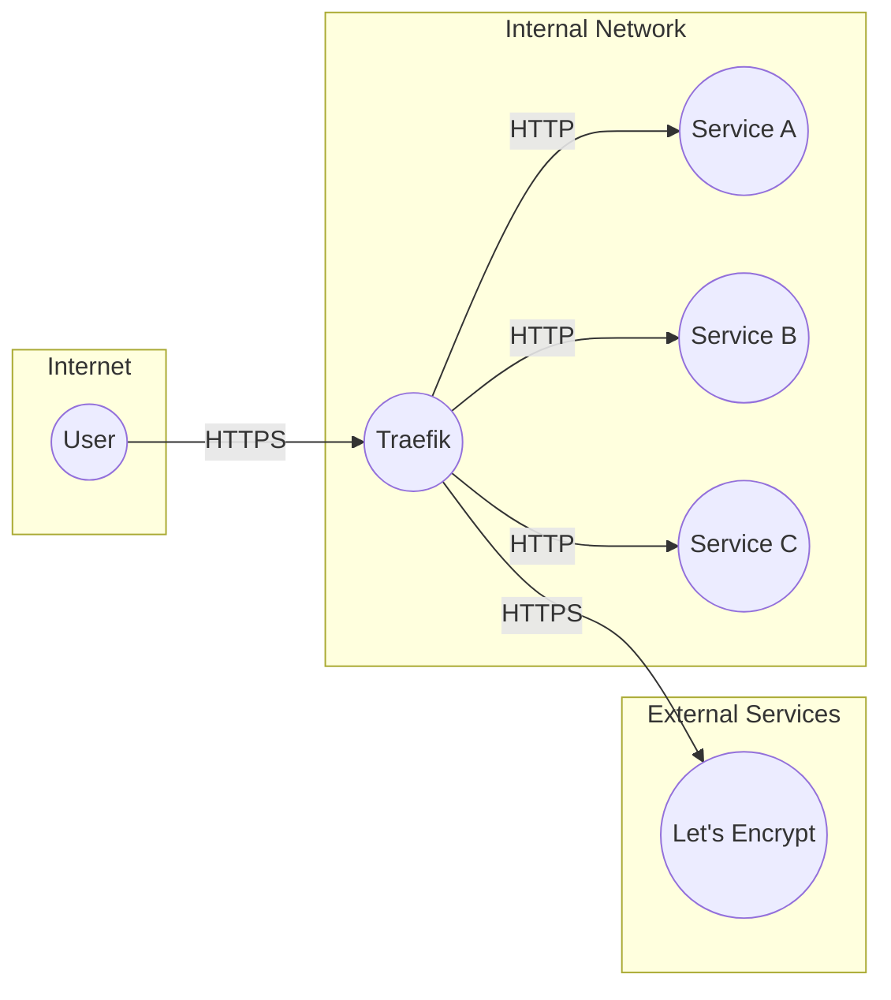
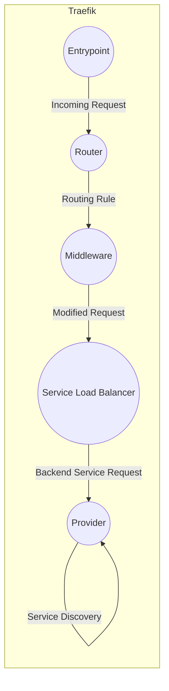
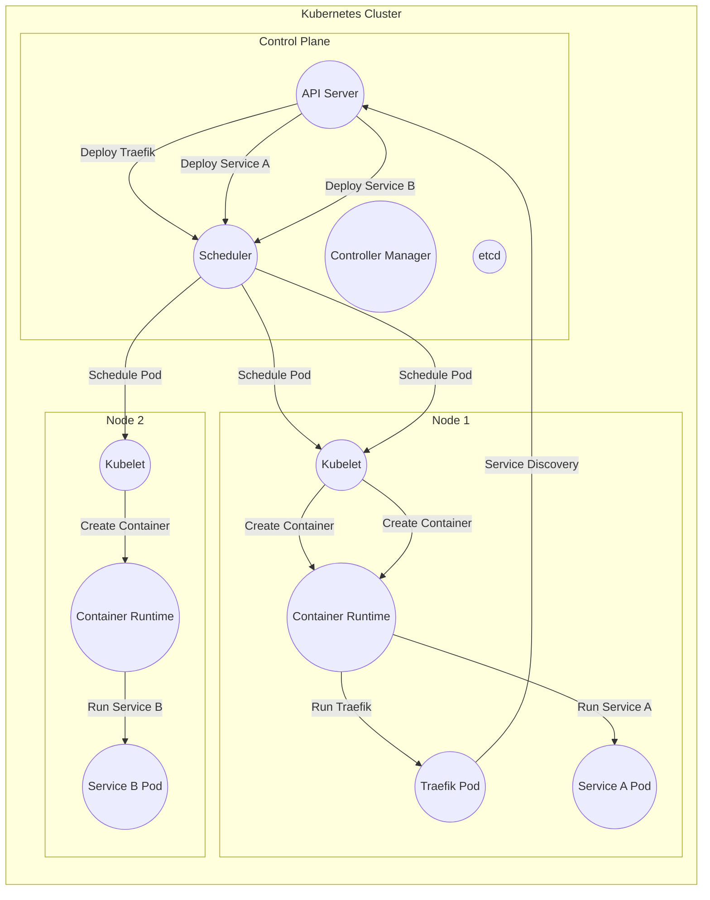
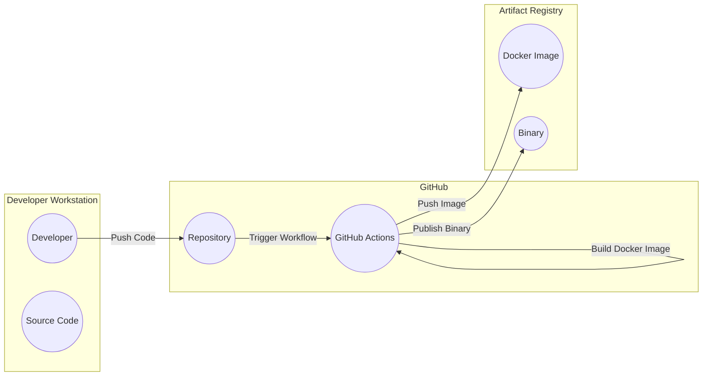

# BUSINESS POSTURE

Traefik is a widely used, open-source, cloud-native edge router and load balancer. It's designed to handle the complexities of routing traffic to services in dynamic, containerized environments.  The business priorities and goals that Traefik addresses are:

*   Simplified Service Deployment and Management:  Automating the configuration of routing rules, making it easier to deploy and update services without manual intervention.
*   High Availability and Scalability:  Ensuring that services remain available and responsive even under heavy load or during failures.
*   Observability: Providing insights into traffic flow, performance, and potential issues.
*   Modern Infrastructure Support:  Seamlessly integrating with container orchestrators (Kubernetes, Docker Swarm, etc.) and cloud platforms.
*   Security: Offering features like automatic HTTPS (via Let's Encrypt), access control, and rate limiting.

Based on these priorities, the most important business risks that need to be addressed are:

*   Service Outages:  Any disruption to Traefik's operation can lead to downtime for the services it manages, impacting business operations and user experience.
*   Configuration Errors:  Incorrect Traefik configurations can expose services to security vulnerabilities or cause routing failures.
*   Performance Bottlenecks:  If Traefik becomes a bottleneck, it can degrade the performance of all services behind it.
*   Security Breaches:  Vulnerabilities in Traefik or its configuration could be exploited to gain unauthorized access to backend services or sensitive data.
*   Lack of Observability:  Insufficient monitoring and logging can make it difficult to diagnose problems and ensure optimal performance.
*   Supply Chain Attacks: Compromised dependencies or build processes could introduce vulnerabilities.

# SECURITY POSTURE

Existing security controls and accepted risks, based on the provided GitHub repository and common practices for similar projects:

*   security control: Automatic HTTPS (Let's Encrypt integration):  Simplifies certificate management and enables encrypted communication by default. Implemented within Traefik's core functionality, configurable via providers.
*   security control: Access Control (Middlewares):  Traefik supports various middlewares for authentication (Basic Auth, Digest Auth, Forward Auth) and authorization. Described in Traefik's documentation and configured via providers/routers.
*   security control: Rate Limiting (Middleware):  Helps prevent abuse and protect backend services from overload. Described in Traefik's documentation and configured via providers/routers.
*   security control: Circuit Breaker (Middleware): Protects failing services and prevents cascading failures. Described in Traefik's documentation and configured via providers/routers.
*   security control: Input Validation: Traefik performs input validation on configuration parameters and incoming requests to prevent common injection attacks. Implemented in Traefik's code.
*   security control: Regular Security Audits and Penetration Testing: While not explicitly stated in the repository, it's a standard practice for projects of this nature.
*   security control: Secure Development Practices: The project likely follows secure coding guidelines and uses static analysis tools, although this isn't explicitly detailed in the repository's top-level view.
*   security control: Dependency Management: The project uses Go modules, which helps manage dependencies and their versions.  This is visible in the `go.mod` and `go.sum` files.
*   security control: Containerization (Docker):  Traefik is commonly deployed as a Docker container, providing isolation and portability.  Dockerfiles are present in the repository.
*   accepted risk: Complexity of Configuration:  Traefik's flexibility can lead to complex configurations, increasing the risk of misconfiguration.  Mitigation relies on thorough documentation, community support, and careful configuration management.
*   accepted risk: Reliance on Third-Party Libraries:  Like any software, Traefik depends on external libraries, which could introduce vulnerabilities.  Mitigation relies on regular updates and vulnerability scanning.
*   accepted risk: Potential for Zero-Day Exploits:  As with any software, there's always a risk of undiscovered vulnerabilities. Mitigation relies on rapid response to security advisories and updates.

Recommended Security Controls (High Priority):

*   Implement a robust vulnerability management program, including regular scanning of dependencies and container images.
*   Enable and configure Web Application Firewall (WAF) capabilities, either through Traefik plugins or integration with external WAF solutions.
*   Implement robust logging and monitoring, including security event logging, to detect and respond to potential threats.
*   Enforce the principle of least privilege for Traefik's access to backend services and infrastructure resources.
*   Implement network segmentation to isolate Traefik and the services it manages.
*   Provide Security Hardening Guide.

Security Requirements:

*   Authentication:
    *   Support for strong authentication mechanisms for accessing the Traefik dashboard and API.
    *   Integration with existing identity providers (e.g., OAuth 2.0, OpenID Connect, LDAP).
    *   Support for multi-factor authentication (MFA).
*   Authorization:
    *   Fine-grained access control to restrict access to specific routes and services based on user roles or attributes.
    *   Support for attribute-based access control (ABAC).
*   Input Validation:
    *   Strict validation of all input parameters, including headers, query parameters, and request bodies.
    *   Protection against common web vulnerabilities (e.g., cross-site scripting (XSS), SQL injection, command injection).
*   Cryptography:
    *   Use of strong, industry-standard cryptographic algorithms and protocols (e.g., TLS 1.3, AES-256).
    *   Secure storage of sensitive data, such as API keys and secrets.
    *   Proper key management practices.
    *   Support for Hardware Security Modules (HSMs) for storing and managing cryptographic keys.

# DESIGN

## C4 CONTEXT

Element Descriptions:

*   Element:
    *   Name: User
    *   Type: Person
    *   Description: Represents a user accessing services through Traefik.
    *   Responsibilities: Initiates requests to services.
    *   Security controls: Browser security features, HTTPS.
*   Element:
    *   Name: Traefik
    *   Type: Software System
    *   Description: The Traefik edge router/load balancer.
    *   Responsibilities: Routes traffic to backend services, handles TLS termination, enforces security policies.
    *   Security controls: Automatic HTTPS, access control, rate limiting, input validation, circuit breaker.
*   Element:
    *   Name: Service A
    *   Type: Software System
    *   Description: A backend service.
    *   Responsibilities: Provides specific functionality.
    *   Security controls: Application-specific security controls, network segmentation.
*   Element:
    *   Name: Service B
    *   Type: Software System
    *   Description: A backend service.
    *   Responsibilities: Provides specific functionality.
    *   Security controls: Application-specific security controls, network segmentation.
*   Element:
    *   Name: Service C
    *   Type: Software System
    *   Description: A backend service.
    *   Responsibilities: Provides specific functionality.
    *   Security controls: Application-specific security controls, network segmentation.
*   Element:
    *   Name: Let's Encrypt
    *   Type: External Service
    *   Description: Certificate Authority providing free TLS certificates.
    *   Responsibilities: Issues and renews TLS certificates.
    *   Security controls: Standard CA security practices.

## C4 CONTAINER

Element Descriptions:

*   Element:
    *   Name: Entrypoint
    *   Type: Container
    *   Description: Receives incoming requests (e.g., HTTP, HTTPS).
    *   Responsibilities: Handles initial connection, TLS termination.
    *   Security controls: TLS configuration, connection limits.
*   Element:
    *   Name: Router
    *   Type: Container
    *   Description: Analyzes incoming requests and matches them to routing rules.
    *   Responsibilities: Determines which service should handle the request.
    *   Security controls: Rule-based access control.
*   Element:
    *   Name: Middleware
    *   Type: Container
    *   Description: Modifies requests or responses (e.g., authentication, rate limiting).
    *   Responsibilities: Enforces security policies, modifies headers, etc.
    *   Security controls: Authentication, authorization, rate limiting, request/response modification.
*   Element:
    *   Name: Provider
    *   Type: Container
    *   Description: Discovers backend services (e.g., Kubernetes, Docker).
    *   Responsibilities: Dynamically updates Traefik's configuration based on service discovery.
    *   Security controls: Access control to service discovery API.
*   Element:
    *   Name: Service Load Balancer
    *   Type: Container
    *   Description: Distributes traffic across multiple instances of a backend service.
    *   Responsibilities: Load balancing, health checks.
    *   Security controls: Health check configuration.

## DEPLOYMENT

Possible deployment solutions:

1.  Docker Standalone: Traefik is deployed as a single Docker container on a single host.
2.  Docker Swarm: Traefik is deployed as a service within a Docker Swarm cluster.
3.  Kubernetes: Traefik is deployed as a pod within a Kubernetes cluster, often using a Deployment or DaemonSet.
4.  HashiCorp Nomad: Traefik can be deployed as a task within a Nomad cluster.
5.  Cloud Provider-Specific Solutions:  Using managed load balancing services (e.g., AWS Application Load Balancer, Azure Application Gateway) in conjunction with Traefik.

Chosen solution for detailed description: Kubernetes

Element Descriptions:

*   Element:
    *   Name: API Server
    *   Type: Node
    *   Description: Kubernetes API server.
    *   Responsibilities: Exposes the Kubernetes API.
    *   Security controls: Authentication, authorization, TLS.
*   Element:
    *   Name: Scheduler
    *   Type: Node
    *   Description: Kubernetes scheduler.
    *   Responsibilities: Schedules pods to nodes.
    *   Security controls: RBAC.
*   Element:
    *   Name: Controller Manager
    *   Type: Node
    *   Description: Kubernetes controller manager.
    *   Responsibilities: Runs controller processes.
    *   Security controls: RBAC.
*   Element:
    *   Name: etcd
    *   Type: Node
    *   Description: Kubernetes etcd.
    *   Responsibilities: Stores cluster state.
    *   Security controls: TLS, authentication, authorization.
*   Element:
    *   Name: Traefik Pod
    *   Type: Node
    *   Description: Kubernetes pod running Traefik.
    *   Responsibilities: Runs the Traefik container.
    *   Security controls: Kubernetes pod security policies, network policies.
*   Element:
    *   Name: Service A Pod
    *   Type: Node
    *   Description: Kubernetes pod running Service A.
    *   Responsibilities: Runs the Service A container.
    *   Security controls: Kubernetes pod security policies, network policies.
*   Element:
    *   Name: Service B Pod
    *   Type: Node
    *   Description: Kubernetes pod running Service B.
    *   Responsibilities: Runs the Service B container.
    *   Security controls: Kubernetes pod security policies, network policies.
*   Element:
    *   Name: Kubelet
    *   Type: Node
    *   Description: Kubernetes kubelet.
    *   Responsibilities: Manages pods on a node.
    *   Security controls: TLS, authentication.
*   Element:
    *   Name: Container Runtime
    *   Type: Node
    *   Description: Container runtime (e.g., Docker, containerd).
    *   Responsibilities: Runs containers.
    *   Security controls: Container runtime security features.
*   Element:
    *   Name: Kubelet2
    *   Type: Node
    *   Description: Kubernetes kubelet.
    *   Responsibilities: Manages pods on a node.
    *   Security controls: TLS, authentication.
*   Element:
    *   Name: Container Runtime2
    *   Type: Node
    *   Description: Container runtime (e.g., Docker, containerd).
    *   Responsibilities: Runs containers.
    *   Security controls: Container runtime security features.

## BUILD

Traefik's build process leverages Go modules and GitHub Actions for automation and security.

Build Process Description:

1.  Developers write code and push changes to the Traefik GitHub repository.
2.  GitHub Actions workflows are triggered by events (e.g., push, pull request).
3.  The workflow checks out the code.
4.  Unit and integration tests are executed.
5.  Static analysis security testing (SAST) tools (e.g., GoSec) are run to identify potential vulnerabilities in the code.
6.  Linters (e.g., gofmt, govet) are used to enforce code style and identify potential issues.
7.  The Traefik binary is built.
8.  A Docker image is built, incorporating the compiled binary.
9.  The Docker image is pushed to a container registry (e.g., Docker Hub, GitHub Container Registry).
10. The binary is published as a release artifact.

Security Controls in Build Process:

*   Automated Build: GitHub Actions ensures consistent and reproducible builds.
*   Dependency Management: Go modules manage dependencies and their versions, reducing the risk of using vulnerable libraries.
*   Static Analysis: SAST tools scan the code for vulnerabilities.
*   Testing: Automated tests help ensure code quality and prevent regressions.
*   Code Review: Pull requests are likely reviewed before merging, providing an additional layer of security scrutiny (although not explicitly shown in the diagram).
*   Signed Commits: Developers may use signed commits to verify the authenticity of code changes.
*   Supply Chain Security: Using trusted base images for Docker builds and verifying the integrity of dependencies.

# RISK ASSESSMENT

*   Critical Business Processes:
    *   Service Availability: Ensuring that services remain accessible to users.
    *   Service Performance: Maintaining optimal performance of services.
    *   Secure Communication: Protecting data in transit between users and services.
    *   Data Integrity: Preventing unauthorized modification of data.

*   Data Sensitivity:
    *   Configuration Data: Traefik's configuration may contain sensitive information, such as API keys, secrets, and access control rules. Sensitivity: High.
    *   Traffic Data: Traefik handles traffic to and from backend services, which may include sensitive user data, business transactions, or personal information. Sensitivity: Varies depending on the specific services.
    *   Logs: Traefik's logs may contain sensitive information, such as IP addresses, request details, and error messages. Sensitivity: Medium to High.
    *   Metrics: Traefik collects metrics on traffic and performance, which may reveal sensitive information about service usage patterns. Sensitivity: Low to Medium.

# QUESTIONS & ASSUMPTIONS

*   Questions:
    *   What specific compliance requirements (e.g., PCI DSS, HIPAA, GDPR) apply to the services managed by Traefik?
    *   What is the expected traffic volume and growth rate?
    *   What are the existing security policies and procedures for the organization?
    *   What is the level of expertise of the team managing Traefik?
    *   Are there any specific threat models or attack scenarios that are of particular concern?
    *   What are the specific monitoring and alerting requirements?
    *   What level of support is provided by Traefik Labs (the company behind Traefik)?
    *   What is the process for handling security incidents and vulnerabilities?
    *   What kind of WAF is used?
    *   What kind of secrets management solution is used?

*   Assumptions:
    *   BUSINESS POSTURE: The organization prioritizes service availability and security.
    *   SECURITY POSTURE: The organization has a basic understanding of security best practices. Secure development lifecycle is followed.
    *   DESIGN: Traefik will be deployed in a Kubernetes environment. The organization has a basic understanding of Kubernetes.