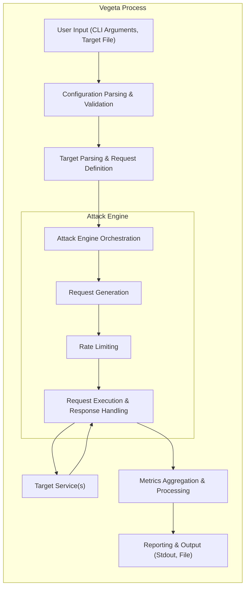
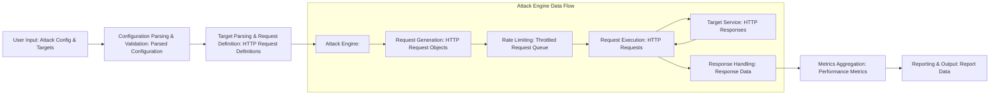

# Project Design Document: Vegeta - HTTP Load Testing Tool

**Version:** 1.1
**Date:** October 26, 2023
**Author:** Gemini (AI Language Model)

## 1. Introduction

This document provides an enhanced design overview of the Vegeta project, an HTTP load testing tool. The primary objective is to furnish a detailed understanding of the system's architecture, constituent components, and the flow of data within it. This detailed design serves as a crucial foundation for subsequent threat modeling exercises, enabling security analysts and developers to effectively identify and address potential vulnerabilities.

## 2. Goals

The refined goals of Vegeta are:

*   To efficiently generate a high volume of configurable HTTP requests against specified target service endpoints.
*   To empower users with comprehensive control over attack parameters, including:
    *   Request rate (requests per unit of time).
    *   Test duration.
    *   HTTP method (GET, POST, PUT, DELETE, etc.).
    *   Custom headers.
    *   Request bodies (for methods like POST and PUT).
    *   TLS configuration.
*   To accurately collect and report a comprehensive suite of performance metrics, such as:
    *   Request latency (minimum, maximum, average, and various percentiles).
    *   Throughput (requests per second).
    *   Error rates (categorized by HTTP status codes).
    *   Total number of requests sent and received.
    *   Connection metrics (e.g., connection errors).
*   To offer a user-friendly and efficient command-line interface (CLI) for seamless interaction and control.
*   To provide robust support for various HTTP methods and diverse request body types, including JSON, XML, and plain text.

## 3. Target Audience

This document is intended for a diverse group of stakeholders:

*   Security analysts and engineers who will leverage this document to conduct thorough threat modeling and security assessments of the Vegeta tool itself and its potential impact on target systems.
*   Software developers actively contributing to the Vegeta project, requiring a clear and detailed understanding of the system's internal design and component interactions.
*   Operations teams responsible for the deployment, configuration, and ongoing management of Vegeta within their infrastructure.
*   Quality assurance and performance testing engineers who utilize Vegeta to evaluate the performance and resilience of their applications and services.

## 4. System Architecture

Vegeta employs a command-line interface (CLI) as its central control point, orchestrating the entire load testing process. It accepts user-defined target specifications and attack configurations as input. Internally, it generates HTTP requests based on these inputs, executes these requests concurrently against the target service(s), and then aggregates the resulting performance data.

## 5. Data Flow

The movement of data within Vegeta follows a distinct path:

*   **User Provides Attack Configuration & Targets:** The user initiates the process by providing input through command-line arguments. This input includes:
    *   Attack parameters (e.g., `-rate`, `-duration`).
    *   The location of the target definition (e.g., a file containing URLs or request specifications).
*   **Vegeta Parses Configuration & Validates Input:** The `Configuration Parsing & Validation` component takes the raw user input and transforms it into structured configuration data. This stage also performs crucial validation checks to ensure the input is valid and within acceptable ranges.
*   **Target Parsing & Request Definition:** The `Target Parsing & Request Definition` component processes the target input (from a file or standard input). This involves:
    *   Reading and interpreting the target format (e.g., a simple URL or a more complex structure with method, headers, and body).
    *   Constructing internal representations of the HTTP requests to be sent.
*   **Attack Engine Orchestrates Request Generation and Execution:** The `Attack Engine Orchestration` component manages the core load generation process. It coordinates:
    *   **Request Generation:** Based on the parsed target definitions, the `Request Generation` component creates individual HTTP request objects.
    *   **Rate Limiting:** The `Rate Limiting` component ensures that the requests are sent at the specified rate, preventing overwhelming the target service or the machine running Vegeta.
    *   **Request Execution & Response Handling:** The `Request Execution & Response Handling` component takes the generated requests and sends them to the `Target Service(s)`. It then receives and processes the responses from the target, capturing relevant information like status codes, latency, and error details.
*   **Target Service Processes Requests & Sends Responses:** The external HTTP service(s) receive the requests generated by Vegeta, process them according to their logic, and send back HTTP responses.
*   **Metrics Aggregator Processes Response Data:** The `Metrics Aggregation & Processing` component receives the response data from the `Attack Engine`. It calculates and aggregates various performance metrics, including latency distributions, throughput, and error rates.
*   **Vegeta Outputs Performance Metrics:** Finally, the `Reporting & Output` component formats the aggregated metrics and presents them to the user, typically through standard output or by writing them to a specified file. The output format can be configured (e.g., text, JSON).

## 6. Components

A more detailed breakdown of Vegeta's components:

*   **Command-Line Interface (CLI):**
    *   Provides the primary interface for user interaction.
    *   Utilizes libraries like `spf13/cobra` for command parsing and handling.
    *   Accepts various flags and arguments to configure the attack.
    *   Manages the overall lifecycle of the Vegeta process.
*   **Configuration Parser & Validator:**
    *   Responsible for interpreting command-line arguments and configuration files.
    *   Validates user-provided parameters to ensure they are within acceptable limits and of the correct type.
    *   Handles default values for missing configuration options.
    *   Returns a structured configuration object for use by other components.
*   **Target Parser:**
    *   Reads and interprets the source of target HTTP requests.
    *   Supports various input formats, including plain text files with URLs and more structured formats specifying request details.
    *   Parses each target definition and constructs an internal representation of the HTTP request (method, URL, headers, body).
    *   May perform pre-processing or validation of target URLs.
*   **Attack Engine:** The core of the load testing functionality, comprising several sub-components:
    *   **Request Generator:**
        *   Creates `http.Request` objects based on the parsed target definitions.
        *   Handles dynamic content generation or parameterization if supported.
    *   **Rate Limiter:**
        *   Controls the rate at which requests are sent to the target service.
        *   Implements algorithms (e.g., token bucket) to enforce the specified rate.
        *   Prevents overwhelming the target service.
    *   **Request Executor:**
        *   Manages a pool of goroutines to send HTTP requests concurrently.
        *   Handles connection management (e.g., connection pooling, keep-alives).
        *   Executes the `http.Request` objects using the `net/http` package.
        *   Captures response details (status code, headers, body, latency).
*   **Metrics Aggregator:**
    *   Receives response data from the `Request Executor`.
    *   Calculates and aggregates various performance metrics in real-time.
    *   Maintains running statistics for latency, throughput, and error counts.
    *   May use data structures like histograms or percentiles to track latency distributions.
*   **Reporter:**
    *   Formats the aggregated metrics for output.
    *   Supports various output formats (e.g., text, JSON, CSV).
    *   Writes the formatted metrics to standard output or a specified file.
    *   May provide options for customizing the output format and the metrics included.

## 7. Security Considerations (Detailed)

Expanding on potential security risks:

*   **Input Validation Vulnerabilities:**
    *   **Malicious URLs:**  Improper validation of target URLs could allow attackers to inject arbitrary commands or access unintended resources on the target server (e.g., Server-Side Request Forgery - SSRF).
    *   **Crafted Request Bodies/Headers:** Lack of validation on request bodies or headers could lead to vulnerabilities like Cross-Site Scripting (XSS) if the target service reflects these inputs, or SQL Injection if the target uses the input in database queries.
*   **Resource Exhaustion of Vegeta Host:**
    *   **Excessive Rate/Connections:**  A malicious user could configure Vegeta to generate an extremely high request rate or open a large number of connections, potentially overwhelming the machine running Vegeta and causing a denial of service.
    *   **Memory Exhaustion:**  If Vegeta doesn't properly manage memory when handling a large number of concurrent requests or large responses, it could lead to memory exhaustion and crashes.
*   **Credential Handling Risks:**
    *   **Exposure of Credentials:** If Vegeta is used to test authenticated endpoints, the handling of credentials (e.g., in headers or request bodies) needs to be secure. Storing credentials in configuration files or command-line arguments without proper protection is a risk.
    *   **Insecure Transmission:** If HTTPS is not enforced when sending requests with credentials, they could be intercepted.
*   **Output Security:**
    *   **Exposure of Sensitive Data:**  Vegeta's output reports might inadvertently contain sensitive information from the target service's responses (e.g., API keys, personal data). Proper sanitization or filtering of output is necessary.
*   **Unintentional Denial of Service (DoS) against Target:**
    *   **Misconfiguration:** Incorrectly configured attack parameters (e.g., excessively high rate) can unintentionally cause a DoS attack against the target service, disrupting its availability for legitimate users.
*   **Dependency Vulnerabilities:**
    *   **Third-party Libraries:** Vegeta relies on external libraries. Vulnerabilities in these dependencies could be exploited if not regularly updated and managed.
*   **Code Injection:**
    *   Although less likely in a compiled language like Go, vulnerabilities in how Vegeta processes user-provided scripts or extensions (if any are added in the future) could lead to code injection.

## 8. Future Considerations

Potential future enhancements that could influence Vegeta's architecture and security:

*   **Distributed Load Generation:** Implementing the ability to distribute the load generation process across multiple machines to simulate larger-scale attacks. This would introduce new challenges related to inter-node communication and coordination.
*   **Advanced Reporting and Visualization:** Integrating with monitoring and logging systems (e.g., Prometheus, Grafana) or providing built-in visualization capabilities to offer more insightful performance analysis.
*   **Protocol Support Expansion:** Extending support beyond HTTP to encompass other protocols like gRPC or WebSockets, requiring new components for request generation and response handling for those protocols.
*   **GUI Interface Development:** Creating a graphical user interface (GUI) as an alternative to the command-line interface to improve usability for some users. This would introduce a new layer of the application and associated security considerations.
*   **Scripting and Extensibility:** Allowing users to write custom scripts or plugins to extend Vegeta's functionality, such as defining more complex attack patterns or custom metric collection. This would require careful consideration of security implications and sandboxing.

This enhanced design document provides a more in-depth understanding of the Vegeta project. This detailed information is essential for conducting thorough threat modeling and proactively addressing potential security vulnerabilities.