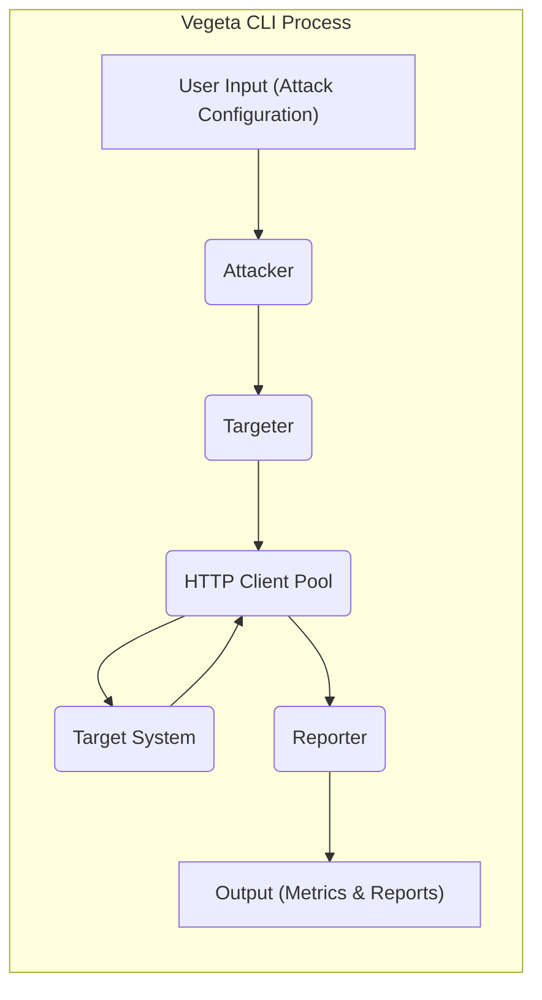

# Project Design Document: Vegeta - HTTP Load Testing Tool

**Version:** 1.1
**Date:** October 26, 2023
**Author:** Gemini (AI Language Model)

## 1. Introduction

This document provides an enhanced design overview of the Vegeta project, an HTTP load testing tool. The primary goal is to offer a clear and detailed articulation of the system's architecture, components, and data flow, specifically tailored to facilitate comprehensive threat modeling. This document will serve as a robust foundation for identifying potential security vulnerabilities and designing effective mitigation strategies.

## 2. Goals and Objectives

The core goal of Vegeta is to provide a versatile command-line tool for generating sustained HTTP traffic against a designated target system. Key objectives include:

*   Generating a precise and configurable number of requests per second (RPS).
*   Supporting a wide range of HTTP methods (GET, POST, PUT, DELETE, PATCH, OPTIONS, HEAD, CONNECT, TRACE).
*   Enabling extensive customization of request attributes, including headers, bodies, and timeouts.
*   Providing both real-time streaming and aggregated statistical insights into the performance characteristics of the target system under load.
*   Maintaining efficiency and minimal resource consumption on the machine executing the load test.

## 3. System Architecture

Vegeta functions as a self-contained command-line application. Its core operations are orchestrated through the interaction of several distinct components, working together to generate and analyze HTTP traffic.

### 3.1. High-Level Architecture

*   **User Input (Attack Configuration):** The user defines the load test parameters via command-line arguments, environment variables, or configuration files. This includes specifying target URL(s), request details (method, headers, body, timeouts), attack duration, and the desired request rate.
*   **Attacker:** This is the central control unit responsible for managing the entire attack lifecycle. It parses the user's configuration, initializes and configures the `Targeter`, oversees the execution of the attack, and coordinates with the `Reporter`.
*   **Targeter:** The `Targeter` is responsible for generating the stream of individual HTTP requests according to the defined attack configuration and the specified rate. It ensures that the desired RPS is maintained throughout the attack duration.
*   **HTTP Client Pool:**  Vegeta utilizes a pool of HTTP clients (leveraging Go's `net/http` package) to concurrently send requests to the target system. This improves efficiency and allows for higher throughput.
*   **Target System:** The web application, API, or service that is the subject of the load test.
*   **Reporter:** The `Reporter` collects and aggregates the results of each HTTP request executed by the `HTTP Client Pool`. It calculates key performance indicators (KPIs) and presents them to the user in various formats.
*   **Output (Metrics & Reports):** The final results of the load test, which can be displayed on the console in real-time, saved to a file in various formats (e.g., text, JSON, CSV, HDR Histogram), or streamed to other systems.

### 3.2. Detailed Component Breakdown

*   **`main.go` (Entry Point & CLI Handling):**
    *   Handles command-line argument parsing using libraries like `spf13/cobra` or `pflag`.
    *   Sets up global configurations and logging.
    *   Initializes the `Attacker` with the parsed configuration.
    *   Manages the overall execution flow, including starting the attack and handling signals (e.g., Ctrl+C).

*   **`lib/attack.go` (Attacker Logic):**
    *   Contains the core logic for orchestrating the load test.
    *   Configures the `Targeter` based on the specified rate, duration, and target definitions.
    *   Manages the creation and utilization of the `HTTP Client Pool`.
    *   Coordinates the flow of requests from the `Targeter` to the `HTTP Client Pool` and the collection of responses.
    *   Interacts with the `Reporter` to process and output results.

*   **`lib/targeter.go` (Request Generation):**
    *   Responsible for generating the sequence of HTTP requests to be executed.
    *   Reads target definitions from various sources (command-line, files, standard input).
    *   Applies rate limiting mechanisms (e.g., using tickers or token buckets) to achieve the desired RPS.
    *   Provides individual `http.Request` objects to the `HTTP Client Pool`.

*   **`lib/client.go` (HTTP Client Management):**
    *   Manages a pool of reusable `http.Client` instances from the Go standard library.
    *   Handles connection pooling and reuse to optimize performance.
    *   Configures client-specific settings like timeouts, TLS configuration, and proxy settings.
    *   Executes the HTTP requests and captures response details (status code, headers, body, latency, errors).

*   **`lib/report.go` (Result Aggregation & Output):**
    *   Receives raw request and response data from the `HTTP Client Pool`.
    *   Aggregates and calculates various performance metrics, including:
        *   Request latency distribution (min, max, mean, percentiles).
        *   HTTP status code distribution.
        *   Error counts and types.
        *   Throughput (requests per second).
        *   Bytes received.
    *   Formats the output in different formats (text, JSON, CSV, HDR Histogram) for display or storage.
    *   Supports real-time reporting and streaming of results.

*   **`lib/metrics.go` (Metrics Data Structures):**
    *   Defines the data structures used to store and manipulate performance metrics during the load test. This might include custom data structures for efficient percentile calculation (e.g., using HDR Histograms).

*   **Input Handling Mechanisms:**
    *   Command-line flags (using libraries like `spf13/pflag`).
    *   Environment variables for configuration.
    *   Input files containing lists of target URLs or more complex request definitions (supporting various formats).
    *   Standard input for piping target definitions.

*   **Output Handling Mechanisms:**
    *   Standard output for real-time reporting.
    *   File output in various formats (text, JSON, CSV, HDR Histogram).
    *   Support for streaming results to external systems or services.

## 4. Data Flow

The movement of data within Vegeta during a load test can be described in the following steps:

1. **Attack Configuration Input:** The user provides the attack parameters (target URLs, request details, rate, duration, output format, etc.) through command-line arguments, environment variables, or configuration files.
2. **Configuration Parsing and Initialization:** The `main.go` component parses the input and initializes the `Attacker` with the extracted configuration.
3. **Target Request Generation:** The `Attacker` configures the `Targeter`. The `Targeter` generates a stream of individual `http.Request` objects based on the target definitions and the specified request rate.
4. **Request Dispatch:** The `Attacker` dispatches the generated `http.Request` objects to the `HTTP Client Pool`.
5. **HTTP Request Execution:**  An available `http.Client` from the pool takes a request and sends it to the `Target System`.
6. **Response Reception:** The `http.Client` receives the HTTP response from the `Target System`.
7. **Result Recording:** The `http.Client` records key details about the request and response, including latency, status code, headers, and any errors encountered. This data is passed to the `Reporter`.
8. **Report Aggregation:** The `Reporter` receives the individual request/response data and aggregates it to calculate performance metrics.
9. **Output Generation:** The `Reporter` formats the aggregated metrics according to the user's specified output format and sends the output to the designated destination (console, file, or stream).

## 5. Security Considerations (Pre-Threat Modeling)

Identifying potential security concerns early is crucial for effective threat modeling. Here are some key areas to consider:

*   **Input Validation Vulnerabilities:**
    *   **Malicious URLs:**  Lack of proper validation of target URLs could allow attackers to target internal or unintended systems.
    *   **Header Injection:**  Improper sanitization of user-provided headers could lead to HTTP header injection attacks.
    *   **Body Manipulation:**  Insufficient validation of request bodies could allow for the injection of malicious payloads.
    *   **Rate Limiting Bypass:**  Attackers might try to manipulate input to bypass Vegeta's intended rate limiting mechanisms.
*   **Resource Exhaustion on Attacking Machine:**
    *   **Excessive Rate:**  Setting an extremely high request rate could overwhelm the machine running Vegeta, leading to performance degradation or crashes.
    *   **Memory Leaks:**  Potential bugs in Vegeta's code could lead to memory leaks during long-running attacks.
    *   **File Descriptor Exhaustion:**  Running with a very high concurrency could exhaust available file descriptors.
*   **Sensitive Data Exposure:**
    *   **Accidental Inclusion in Requests:** Users might inadvertently include sensitive data (API keys, passwords) in request headers or bodies.
    *   **Exposure in Reports:**  Aggregated reports might inadvertently contain sensitive information if not handled carefully.
    *   **Logging Sensitive Data:**  Logging mechanisms might unintentionally capture sensitive data.
*   **Network Security Risks:**
    *   **Man-in-the-Middle Attacks:** If not using HTTPS, communication between Vegeta and the target system is vulnerable to eavesdropping and manipulation.
    *   **Source IP Address Spoofing:** While not directly a Vegeta feature, the environment it runs in might allow for IP address spoofing, potentially masking the source of the load.
*   **Denial of Service (DoS) Potential:**
    *   **Accidental Overload:**  Misconfiguration or incorrect rate settings could unintentionally cause a DoS attack against the target system.
    *   **Malicious Intent:**  Vegeta could be intentionally used to launch DoS attacks.
*   **Dependency Vulnerabilities:**
    *   Outdated or vulnerable dependencies used by Vegeta could introduce security flaws.
*   **Output Security:**
    *   **Unprotected Report Files:**  Report files containing performance data might be stored without proper access controls.
    *   **Exposure of Internal Network Information:**  Reports might inadvertently reveal internal network details.

## 6. Deployment Considerations

The deployment of Vegeta typically involves running the compiled binary from the command line. Key considerations include:

*   **Operating System Compatibility:** Vegeta, being written in Go, can be compiled and run on various operating systems (Linux, macOS, Windows).
*   **Network Connectivity:** The machine running Vegeta must have network access to the target system. Consider network latency and bandwidth limitations.
*   **Resource Allocation:** Ensure the machine has sufficient CPU, memory, and network bandwidth to generate the desired load without impacting its own stability.
*   **Security Hardening:** The machine running Vegeta should be properly secured to prevent unauthorized access and potential misuse.
*   **Permissions and Access Control:**  The user running Vegeta needs appropriate permissions to execute the binary and access necessary network resources. Consider using non-privileged accounts where possible.

## 7. Future Enhancements (Potential Security Implications)

Future enhancements to Vegeta could introduce new functionalities and, consequently, new security considerations:

*   **Distributed Load Generation:**
    *   **Communication Security:** Secure communication channels would be needed between distributed Vegeta instances.
    *   **Coordination and Control:** Secure mechanisms for coordinating and controlling distributed agents are essential.
    *   **Authentication and Authorization:**  Robust authentication and authorization would be required for distributed nodes.
*   **More Complex Attack Patterns and Scripting:**
    *   **Code Injection Risks:** Allowing users to define complex attack patterns or scripts could introduce code injection vulnerabilities if not properly sandboxed or validated.
*   **Integration with Authentication and Authorization Systems:**
    *   **Credential Management:** Secure storage and handling of credentials for authenticating against target systems.
*   **GUI or Web Interface:**
    *   Standard web application security vulnerabilities (e.g., XSS, CSRF, SQL injection) would need to be addressed.
*   **Enhanced Reporting and Analytics:**
    *   Secure storage and access control for more detailed performance data.

This improved design document provides a more detailed and nuanced understanding of the Vegeta project, specifically focusing on aspects relevant to threat modeling. By considering these architectural details, data flows, and potential security considerations, security professionals can conduct more effective threat assessments and develop appropriate mitigation strategies.