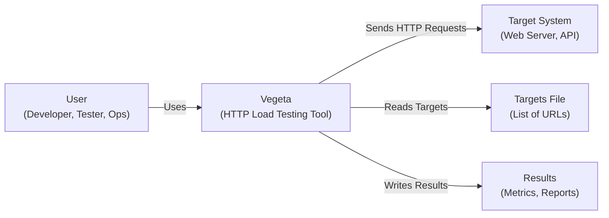
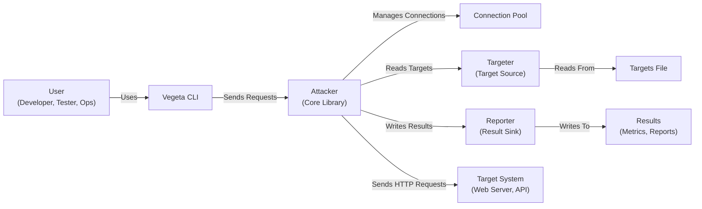
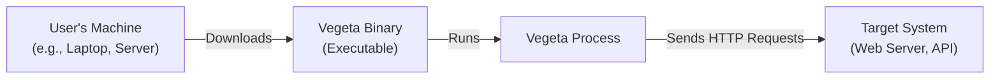
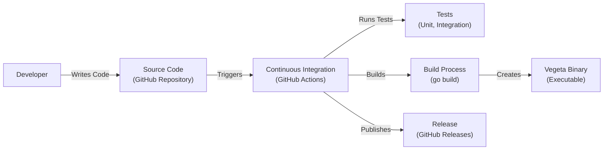

# BUSINESS POSTURE

Business Priorities and Goals:

The Vegeta project aims to provide a versatile and high-performance HTTP load testing tool. It prioritizes ease of use, accuracy, and extensibility, enabling users to effectively assess and improve the performance of their web services. The project is designed to be used by developers, testers, and operations engineers.

Business Risks:

-   Inaccurate Load Testing Results: If Vegeta provides inaccurate or misleading load testing results, users may make incorrect decisions about their system's capacity and performance, potentially leading to service outages or performance degradation in production.
-   Tool Misuse: Vegeta, like any load testing tool, can be misused to launch denial-of-service (DoS) attacks. While the project itself cannot prevent misuse, clear documentation and responsible user behavior are crucial.
-   Lack of Adoption: If Vegeta fails to gain sufficient adoption due to complexity, lack of features, or competition, its development and maintenance may become unsustainable.
-   Security Vulnerabilities in Dependencies: As a Go project, Vegeta relies on external libraries. Vulnerabilities in these dependencies could expose users to security risks.
-   Platform Compatibility Issues: If Vegeta is not compatible with a wide range of operating systems and architectures, its usability and adoption may be limited.

# SECURITY POSTURE

Existing Security Controls:

-   security control: Input Validation: Vegeta validates command-line arguments and input files (e.g., target files) to prevent unexpected behavior or crashes. (Implemented in Go code using libraries like `flag` and custom validation logic).
-   security control: Rate Limiting: Vegeta provides built-in rate limiting capabilities to control the request rate during load tests, preventing overwhelming target systems. (Implemented in Go code using the `rate` package).
-   security control: Timeouts: Vegeta allows users to configure timeouts for requests, preventing tests from hanging indefinitely due to unresponsive targets. (Implemented in Go code using the `http.Client` and context timeouts).
-   security control: Open Source: Being open source allows for community review and contributions, potentially leading to faster identification and resolution of security vulnerabilities. (Project repository on GitHub).

Accepted Risks:

-   accepted risk: Denial of Service (DoS) by Design: Vegeta is a load testing tool, and its primary function is to generate a high volume of HTTP requests. This inherent capability can be misused for malicious purposes. Mitigation relies on responsible usage and network-level security controls.
-   accepted risk: Dependency Vulnerabilities: Vegeta, like any software, depends on third-party libraries. While efforts are made to keep dependencies updated, there's always a risk of zero-day vulnerabilities in these libraries.

Recommended Security Controls:

-   security control: Regularly update dependencies to mitigate known vulnerabilities. Implement automated dependency scanning and updates.
-   security control: Implement robust error handling and logging to aid in debugging and identifying potential security issues.
-   security control: Consider adding support for authentication and authorization mechanisms to allow testing of secured endpoints.
-   security control: Provide clear documentation and guidelines on responsible use of the tool to minimize the risk of misuse.
-   security control: Conduct regular security audits and penetration testing of the Vegeta codebase.

Security Requirements:

-   Authentication:
    -   If Vegeta is extended to support testing of secured endpoints, it should support various authentication mechanisms like Basic Auth, API Keys, OAuth 2.0, and custom headers.
-   Authorization:
    -   Vegeta should not handle authorization logic itself. It should simply pass the provided authentication credentials to the target system. The target system is responsible for authorization.
-   Input Validation:
    -   All user-provided inputs, including target files, command-line arguments, and configuration files, must be strictly validated to prevent injection attacks or unexpected behavior.
-   Cryptography:
    -   If Vegeta handles sensitive data (e.g., API keys, passwords), it should store and transmit them securely. For example, if storing credentials in a configuration file, consider encryption. When making HTTPS requests, ensure TLS is used with strong ciphers.
-   Reporting:
    -   Reports generated by Vegeta should not include sensitive information unless explicitly configured by the user. Sanitize output to prevent accidental leakage of credentials or other sensitive data.

# DESIGN

## C4 CONTEXT

Element Descriptions:

-   Element:
    -   Name: User
    -   Type: Person
    -   Description: A person (developer, tester, or operations engineer) who uses Vegeta to perform load testing.
    -   Responsibilities: Configures and runs Vegeta, analyzes results.
    -   Security controls: Responsible for using Vegeta ethically and securely.
-   Element:
    -   Name: Vegeta
    -   Type: Software System
    -   Description: The Vegeta HTTP load testing tool.
    -   Responsibilities: Generates HTTP requests, measures performance, produces reports.
    -   Security controls: Input validation, rate limiting, timeouts.
-   Element:
    -   Name: Target System
    -   Type: Software System
    -   Description: The web server or API being load tested.
    -   Responsibilities: Responds to HTTP requests.
    -   Security controls: Relies on its own security mechanisms (e.g., authentication, authorization, input validation, rate limiting).
-   Element:
    -   Name: Targets File
    -   Type: File
    -   Description: A file containing a list of URLs to be targeted during the load test.
    -   Responsibilities: Provides input to Vegeta.
    -   Security controls: Input validation within Vegeta.
-   Element:
    -   Name: Results
    -   Type: File/Output
    -   Description: The output of the load test, including metrics and reports.
    -   Responsibilities: Provides information about the performance of the target system.
    -   Security controls: Output sanitization within Vegeta.

## C4 CONTAINER

Element Descriptions:

-   Element:
    -   Name: User
    -   Type: Person
    -   Description: A person who uses Vegeta to perform load testing.
    -   Responsibilities: Configures and runs Vegeta, analyzes results.
    -   Security controls: Responsible for using Vegeta ethically and securely.
-   Element:
    -   Name: Vegeta CLI
    -   Type: Command-Line Interface
    -   Description: The command-line interface for interacting with Vegeta.
    -   Responsibilities: Parses command-line arguments, configures the load test, starts the attack, displays results.
    -   Security controls: Input validation.
-   Element:
    -   Name: Attacker
    -   Type: Library
    -   Description: The core Vegeta library responsible for generating and sending HTTP requests.
    -   Responsibilities: Manages the attack process, sends requests, collects results.
    -   Security controls: Rate limiting, timeouts.
-   Element:
    -   Name: Connection Pool
    -   Type: Component
    -   Description: Manages a pool of HTTP connections to the target system.
    -   Responsibilities: Reuses connections to improve performance.
    -   Security controls: None specific, relies on standard HTTP security.
-   Element:
    -   Name: Targeter
    -   Type: Component
    -   Description: Provides a stream of HTTP requests to be sent to the target system.
    -   Responsibilities: Reads targets from a file or other source.
    -   Security controls: Input validation (of target file contents).
-   Element:
    -   Name: Reporter
    -   Type: Component
    -   Description: Processes and outputs the results of the load test.
    -   Responsibilities: Generates reports in various formats (text, JSON, etc.).
    -   Security controls: Output sanitization.
-   Element:
    -   Name: Targets File
    -   Type: File
    -   Description: A file containing a list of URLs to be targeted.
    -   Responsibilities: Provides input to the Targeter.
    -   Security controls: Input validation within Vegeta.
-   Element:
    -   Name: Results
    -   Type: File/Output
    -   Description: The output of the load test.
    -   Responsibilities: Provides information about the performance of the target system.
    -   Security controls: Output sanitization within Vegeta.
-   Element:
    -   Name: Target System
    -   Type: Software System
    -   Description: The web server or API being load tested.
    -   Responsibilities: Responds to HTTP requests.
    -   Security controls: Relies on its own security mechanisms.

## DEPLOYMENT

Possible Deployment Solutions:

1.  Standalone Binary: Vegeta is typically distributed as a single, statically linked binary executable. This is the simplest and most common deployment method.
2.  Docker Container: Vegeta can be packaged and run within a Docker container. This provides isolation and portability.
3.  Kubernetes: Vegeta can be deployed as a pod within a Kubernetes cluster, potentially for distributed load testing.

Chosen Solution (Standalone Binary):

Element Descriptions:

-   Element:
    -   Name: User's Machine
    -   Type: Infrastructure Node
    -   Description: The machine where the user downloads and runs the Vegeta binary.
    -   Responsibilities: Provides the execution environment for Vegeta.
    -   Security controls: Operating system security, user account security.
-   Element:
    -   Name: Vegeta Binary
    -   Type: Executable File
    -   Description: The statically linked Vegeta executable.
    -   Responsibilities: Contains the compiled Vegeta code.
    -   Security controls: Code signing (if implemented), integrity checks.
-   Element:
    -   Name: Vegeta Process
    -   Type: Process
    -   Description: The running instance of the Vegeta binary.
    -   Responsibilities: Executes the load test.
    -   Security controls: Inherits security controls from the Vegeta binary and the operating system.
-   Element:
    -   Name: Target System
    -   Type: Software System/Infrastructure Node
    -   Description: The system being load tested.
    -   Responsibilities: Responds to HTTP requests.
    -   Security controls: Relies on its own security mechanisms.

## BUILD

Build Process Description:

1.  Developer: A developer writes code and pushes changes to the Vegeta GitHub repository.
2.  Source Code: The source code is hosted on GitHub.
3.  Continuous Integration (GitHub Actions): GitHub Actions is used as the CI/CD system. Commits and pull requests trigger automated workflows.
4.  Tests: The CI workflow runs unit and integration tests to ensure code quality and prevent regressions.
5.  Build Process: The `go build` command is used to compile the Go source code into a statically linked binary executable.
6.  Vegeta Binary: The output of the build process is the Vegeta binary.
7.  Release: The CI workflow creates a new release on GitHub Releases, including the compiled binary and release notes.

Security Controls in Build Process:

-   security control: Automated Testing: Unit and integration tests are run automatically on every commit and pull request, helping to catch bugs and vulnerabilities early. (Implemented in GitHub Actions workflow).
-   security control: Static Analysis: Go's built-in tooling (e.g., `go vet`, `go lint`) can be used for static analysis to identify potential code quality and security issues. (Can be integrated into the GitHub Actions workflow).
-   security control: Dependency Management: Go modules are used for dependency management, allowing for reproducible builds and tracking of dependencies. (Implemented using `go.mod` and `go.sum` files).
-   security control: Dependency Scanning: Tools like `dependabot` or `snyk` can be integrated into the CI workflow to automatically scan dependencies for known vulnerabilities. (Can be integrated into the GitHub Actions workflow).
-   security control: Code Signing: The released binaries could be digitally signed to ensure their integrity and authenticity. (Requires setting up a code signing infrastructure).

# RISK ASSESSMENT

Critical Business Processes:

-   Accurate Performance Assessment: Providing users with reliable and accurate performance metrics for their web services is the core business process.
-   Tool Availability and Maintainability: Ensuring that Vegeta remains available, well-maintained, and up-to-date is crucial for its continued use and adoption.

Data Sensitivity:

-   Target URLs: The list of URLs being tested may reveal information about the target system's architecture and endpoints. Sensitivity depends on the nature of the target system. Publicly accessible URLs are generally low sensitivity, while internal or pre-production URLs may be more sensitive.
-   HTTP Request Data: If Vegeta is configured to send custom headers or request bodies, these may contain sensitive data, such as API keys, authentication tokens, or personally identifiable information (PII). The sensitivity depends on the specific data being sent.
-   Performance Metrics: The performance metrics generated by Vegeta (e.g., response times, error rates) are generally not considered sensitive, but they could potentially reveal information about the target system's performance characteristics.
-   Reports: Reports generated by Vegeta may contain target URLs, request data, and performance metrics. The sensitivity of the report depends on the sensitivity of the data it contains.

# QUESTIONS & ASSUMPTIONS

Questions:

-   Are there any specific compliance requirements (e.g., PCI DSS, HIPAA) that apply to the use of Vegeta or the systems being tested?
-   What is the expected scale of load testing (e.g., number of concurrent users, requests per second)?
-   Will Vegeta be used to test internal systems, external systems, or both?
-   Are there any existing security tools or processes in place that should be integrated with Vegeta?
-   What level of support and documentation is expected for Vegeta users?

Assumptions:

-   BUSINESS POSTURE: The primary goal is to provide a reliable and accurate load testing tool.
-   BUSINESS POSTURE: Users are responsible for using Vegeta ethically and securely.
-   SECURITY POSTURE: The target systems being tested have their own security controls in place.
-   SECURITY POSTURE: Users are aware of the potential risks of load testing and take appropriate precautions.
-   DESIGN: Vegeta is primarily used as a command-line tool.
-   DESIGN: The most common deployment method is using the standalone binary.
-   DESIGN: GitHub Actions is used for continuous integration and releases.