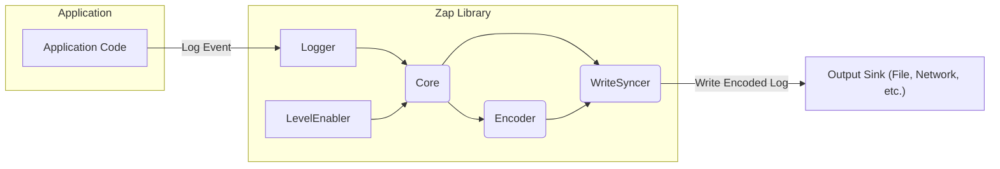
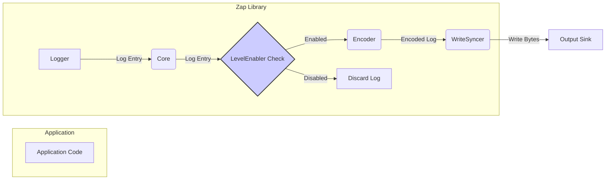

## Project Design Document: Uber-Go/Zap Logging Library

**Version:** 1.1
**Date:** October 26, 2023
**Author:** AI Software Architect

### 1. Project Overview

The `uber-go/zap` project is a high-performance, structured logging library for Go. Its design emphasizes speed and efficiency, making it well-suited for applications requiring low overhead logging. `zap` offers features like leveled logging, various output formats (JSON, console), customizable encoders, and the ability to direct logs to multiple sinks. This document details the architecture and key components of `zap` to facilitate a comprehensive threat modeling exercise.

### 2. Goals of this Document

* Provide a clear and detailed explanation of the `uber-go/zap` library's architecture and its constituent parts.
* Illustrate the flow of log data within the library, from its creation to its final output.
* Identify potential entry points, data processing stages, and output mechanisms that are relevant for security analysis and the identification of potential threats.
* Serve as a foundational document for security engineers and developers to understand the attack surface and potential vulnerabilities associated with using `zap`.

### 3. Scope

This document focuses on the core architectural elements and operational flow of the `uber-go/zap` library. The scope includes:

* The primary components of the library and their interactions.
* The lifecycle of a log message as it is processed by `zap`.
* Different mechanisms for outputting logs (sinks).
* The processes of encoding and formatting log messages.
* Configuration aspects that have implications for security.

This document does not cover:

* Specific examples of how `zap` is used within particular applications.
* Detailed performance metrics or benchmarking data.
* The intricate implementation details of every function or method within the library.

### 4. Architectural Overview

`zap`'s architecture is built for speed and flexibility. Its core components work in concert to efficiently process and deliver log messages. The key architectural elements are:

* **Logger:** The primary interface used by application code to generate log entries. It encapsulates configuration settings and manages the underlying `Core`.
* **Core:** The central processing unit within `zap`. It evaluates if a log message meets the configured level and then routes it to the appropriate `Encoder` and `WriteSyncer`. This is a critical point for filtering and routing.
* **Encoder:** Responsible for transforming the log message into a specific output format (e.g., JSON, human-readable console output). The choice of encoder impacts how log data is represented and potentially parsed by downstream systems.
* **WriteSyncer:** Handles the actual writing of the encoded log message to the designated output destination (the sink). This component interacts directly with the external environment.
* **LevelEnabler:** Determines the minimum severity level for log messages to be processed by a given `Core`. This acts as an initial filter.

### 5. Key Components

* **Logger:**
    * Provides methods (e.g., `Debug`, `Info`, `Warn`, `Error`) for creating log entries at different severity levels.
    * Can be configured with options such as sampling (to reduce log volume), adding caller information (source code location), and operating in development mode (more verbose output).
    * Holds a reference to one or more `Core` instances, allowing for routing logs to different outputs based on configuration.
    * Offers methods for adding structured context (key-value pairs as fields) to log messages.
    * **Security Relevance:**  The configuration of the `Logger` dictates what information is potentially logged. Improper configuration could lead to the logging of sensitive data.

* **Core:**
    * Receives log entries from the `Logger`.
    * Evaluates the log entry's severity level against the `LevelEnabler`'s threshold.
    * Selects an `Encoder` based on the configured output format for this `Core`.
    * Selects a `WriteSyncer` for the designated output destination.
    * Marshals the log entry into the chosen format using the `Encoder`.
    * Passes the encoded output to the `WriteSyncer`.
    * **Security Relevance:** The `Core` is responsible for filtering logs based on level. A misconfigured `LevelEnabler` could lead to either insufficient logging or excessive logging, both with security implications.

* **Encoder:**
    * Transforms the internal representation of a log entry (including level, message, fields, timestamp, and caller information) into a specific output format.
    * Common encoders include:
        * `JSONEncoder`: Outputs logs in JSON format, suitable for machine parsing.
        * `ConsoleEncoder`: Outputs human-readable logs, often used for development.
        * Custom encoders can be implemented to support specific needs.
    * Configuration options for encoders include:
        * Timestamp format.
        * Field naming conventions.
        * Whether to include caller information.
        * Handling of special characters and escaping.
    * **Security Relevance:** The `Encoder` determines how log data is represented. Improper encoding could lead to log injection vulnerabilities if user-supplied data is not properly escaped. The choice of encoder also affects the ease of parsing and analysis by security tools.

* **WriteSyncer:**
    * An abstraction for writing byte slices to an output destination.
    * Handles buffering, flushing, and synchronizing writes to ensure data is persisted.
    * Common `WriteSyncer` implementations include:
        * `os.File`: Writes logs to a file on the local file system.
        * `os.Stdout`, `os.Stderr`: Writes logs to standard output or standard error streams.
        * Network connections (e.g., writing to a remote syslog server or a log aggregation service).
        * Custom `WriteSyncer` implementations can be created to integrate with specific storage or transport mechanisms.
    * **Security Relevance:** The `WriteSyncer` interacts directly with external systems. The security of the chosen sink (e.g., file permissions, network encryption) is critical. Vulnerabilities in custom `WriteSyncer` implementations could expose sensitive log data.

* **LevelEnabler:**
    * Defines the minimum logging level that will be processed by an associated `Core`.
    * Allows for filtering log messages based on their severity.
    * Can be configured globally or independently for different `Core` instances, enabling fine-grained control over logging output.
    * **Security Relevance:**  A poorly configured `LevelEnabler` can result in either too much information being logged (potentially including sensitive data) or critical security events being missed due to insufficient logging.

### 6. Data Flow of a Log Message

The lifecycle of a log message within `zap` involves the following steps:

1. **Log Event Initiation:** Application code invokes a logging method on the `Logger` (e.g., `logger.Info("User logged in", zap.String("username", username))`).
2. **Entry Creation:** The `Logger` creates an internal representation of the log entry, including the message, severity level, timestamp, and any provided structured fields.
3. **Core Evaluation:** The `Logger` passes the log entry to its associated `Core`.
4. **Level Check:** The `Core` compares the log entry's level against the `LevelEnabler`'s threshold. If the log level is below the threshold, the process stops here, and the log is discarded.
5. **Encoding:** If the log level is enabled, the `Core` selects the appropriate `Encoder` based on its configuration. The `Encoder` formats the log entry into a byte slice according to the chosen format (e.g., JSON, plain text). This is where user-provided data is potentially incorporated into the log output.
6. **Writing to Sink:** The `Core` uses the configured `WriteSyncer` to write the encoded byte slice to the designated output destination (the sink). This involves interaction with the underlying operating system or network.
7. **Output:** The log message is written to the specified sink (e.g., a file, the console, a network socket).

### 7. External Interfaces

`zap` interacts with the external environment through several key interfaces:

* **Application Code Interface:** The `Logger` API provides the primary means for applications to generate log messages. This is the main entry point for data into the logging system.
    * **Security Relevance:**  Vulnerabilities in the application code that lead to the logging of sensitive data or the injection of malicious content into log messages are relevant here.
* **Output Sinks Interface:** `zap` writes log messages to various destinations via `WriteSyncer` implementations. These sinks represent potential points of data exposure or attack.
    * **Security Relevance:** The security of the chosen sink is paramount. This includes file system permissions for file-based sinks, encryption for network-based sinks, and access controls for cloud logging services.
* **Configuration Interface:** `zap`'s behavior is controlled through configuration options, which can be set programmatically or through external configuration mechanisms.
    * **Security Relevance:**  Insecurely managed or overly permissive logging configurations can create significant security risks. Access to configuration settings should be restricted.
* **Custom Encoder/WriteSyncer Interface:** `zap` allows for the implementation of custom `Encoder` and `WriteSyncer` components, extending its functionality.
    * **Security Relevance:**  Security vulnerabilities in custom components can directly impact the security of the logging system. These components should be thoroughly reviewed and tested.

### 8. Security Considerations (For Threat Modeling)

When performing threat modeling for applications using `zap`, consider the following potential threats and vulnerabilities:

* **Exposure of Sensitive Information in Logs:**
    * **Threat:** Unintentional logging of sensitive data (e.g., passwords, API keys, personal identifiable information) by the application.
    * **Attack Vectors:**  Developer error, insufficient data sanitization before logging, logging exceptions that reveal sensitive data.
    * **Mitigation Strategies:** Implement secure logging practices, sanitize log messages to remove sensitive data, use structured logging to separate data and context, consider using secrets management solutions and avoiding logging secrets directly.

* **Log Injection Attacks:**
    * **Threat:** Attackers injecting malicious content into log messages through user-controlled input that is subsequently logged. This can lead to vulnerabilities in log analysis tools or dashboards (e.g., cross-site scripting).
    * **Attack Vectors:**  Logging unsanitized user input directly into log messages.
    * **Mitigation Strategies:** Sanitize user inputs before logging, use structured logging with distinct fields to prevent interpretation of log data as code, ensure log analysis tools are protected against injection attacks.

* **Log Tampering and Deletion:**
    * **Threat:** Unauthorized modification or deletion of log files, potentially to hide malicious activity or disrupt forensic investigations.
    * **Attack Vectors:**  Compromised systems with write access to log files, insider threats.
    * **Mitigation Strategies:** Implement appropriate file system permissions to restrict access to log files, consider using immutable logging solutions or secure log aggregation services with integrity checks.

* **Denial of Service (DoS) through Excessive Logging:**
    * **Threat:** An attacker triggering excessive logging to consume disk space, CPU resources, or network bandwidth, leading to service disruption.
    * **Attack Vectors:**  Exploiting application features that generate a large volume of logs, sending malicious requests designed to trigger excessive logging.
    * **Mitigation Strategies:** Implement rate limiting for logging, configure appropriate logging levels to avoid unnecessary verbosity, monitor log volume and resource consumption, implement input validation to prevent malicious requests.

* **Configuration Vulnerabilities:**
    * **Threat:** Misconfigured logging settings that create security weaknesses (e.g., overly permissive logging levels, insecure output destinations, logging to publicly accessible locations).
    * **Attack Vectors:**  Exploiting default or weak configurations, unauthorized access to configuration files or settings.
    * **Mitigation Strategies:** Follow security best practices for configuration management, regularly review logging configurations, restrict access to log configuration settings, use secure defaults.

* **Insecure Log Sinks:**
    * **Threat:** Using insecure output destinations that expose log data to unauthorized access or interception (e.g., unencrypted network connections, publicly accessible file shares).
    * **Attack Vectors:**  Man-in-the-middle attacks on network connections, unauthorized access to file systems or cloud storage.
    * **Mitigation Strategies:** Secure communication channels for network sinks (e.g., use TLS), implement proper access controls for file-based sinks, use secure storage options for cloud-based logging.

* **Vulnerabilities in Custom Encoders or WriteSyncers:**
    * **Threat:** Security flaws in custom `Encoder` or `WriteSyncer` implementations that could lead to information disclosure, code execution, or other vulnerabilities.
    * **Attack Vectors:**  Exploiting bugs or weaknesses in custom code.
    * **Mitigation Strategies:** Thoroughly review and test custom encoder and `WriteSyncer` implementations, follow secure coding practices, perform security audits.

### 9. Diagrams

The diagrams in sections 4 and 6 provide visual representations of the architecture and data flow, which are essential for understanding the system's components and their interactions during the threat modeling process. These diagrams help to identify potential attack surfaces and data flow paths that need careful consideration.

### 10. Conclusion

This document provides a comprehensive design overview of the `uber-go/zap` logging library, focusing on aspects relevant to security. By understanding the architecture, key components, data flow, and external interfaces, security engineers and developers can effectively identify potential threats and implement appropriate security measures to protect applications utilizing `zap`. This document serves as a crucial input for conducting thorough threat modeling exercises.