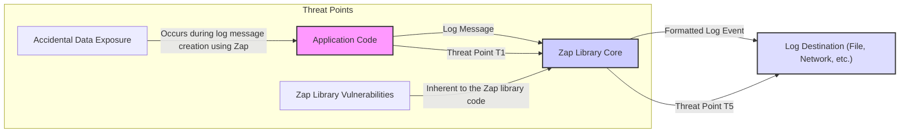

### High and Critical Threats Directly Involving uber-go/zap

Here's an updated threat list focusing on high and critical severity threats directly related to the `uber-go/zap` logging library:

* **Threat:** Accidental Exposure of Sensitive Information in Logs
    * **Description:**
        * **Attacker Action:** An attacker gains access to log files or a centralized logging system where sensitive information has been inadvertently logged due to the application's use of `zap`. This access could be through compromised servers, exposed logging endpoints, or insider threats.
        * **How:** Developers using `zap`'s logging functions might log variables or data structures containing sensitive information like API keys, passwords, PII, session tokens, or internal system details without proper sanitization or redaction. The ease of use of `zap`'s logging functions can inadvertently lead to this if developers are not cautious.
    * **Impact:**
        * **Impact:** Data breaches, compliance violations (e.g., GDPR, HIPAA), reputational damage, financial loss, and potential legal repercussions. Exposed credentials could lead to unauthorized access to other systems.
    * **Affected Zap Component:**
        * **Component:** Core logging functions like `SugaredLogger.Infof`, `Logger.Info`, `Any`, `Reflect`, and custom encoders if not implemented carefully. The flexibility of `zap`'s structured logging can be a risk if not used with security in mind.
    * **Risk Severity:** High
    * **Mitigation Strategies:**
        * Implement strict code review processes with a focus on identifying and preventing the logging of sensitive data when using `zap`.
        * Utilize `zap`'s structured logging capabilities to explicitly define and control what data is logged, avoiding logging entire objects or data structures without careful consideration. Leverage `zap`'s ability to add context fields selectively.
        * Employ scrubbing or masking techniques for sensitive data *before* passing it to `zap`'s logging functions. Consider using `zap`'s `Stringer` interface or custom encoding to redact or hash sensitive fields.
        * Educate developers on secure logging practices specific to `zap`, emphasizing the importance of not directly logging sensitive information.
        * Implement access controls and encryption for log files and logging infrastructure where `zap`'s output is stored.

* **Threat:** Vulnerabilities in Zap Library Itself
    * **Description:**
        * **Attacker Action:** An attacker exploits a security vulnerability within the `uber-go/zap` library itself.
        * **How:** This could involve exploiting a bug in the parsing of log messages, the handling of specific input passed to `zap`'s functions, or other internal mechanisms of the library.
    * **Impact:**
        * **Impact:** Depending on the nature of the vulnerability, this could lead to remote code execution within the application using `zap`, denial of service of the application, information disclosure by manipulating `zap`'s output, or other forms of compromise.
    * **Affected Zap Component:**
        * **Component:** Any part of the `zap` library code, including the core, `zapcore`, encoders, and sinks, depending on the specific vulnerability.
    * **Risk Severity:** Varies (can be Critical to High depending on the vulnerability)
    * **Mitigation Strategies:**
        * Stay updated with the latest versions of `zap` to benefit from security patches and bug fixes released by the maintainers.
        * Monitor security advisories and vulnerability databases (like GitHub Security Advisories) for any reported issues with `zap`.
        * Consider using static analysis tools and Software Composition Analysis (SCA) tools to identify known vulnerabilities in `zap` and other dependencies.
        * Implement a process for promptly patching or updating dependencies, including `zap`, when vulnerabilities are discovered.

Here's the updated Mermaid flowchart, still relevant as it shows the data flow involving `zap`:

