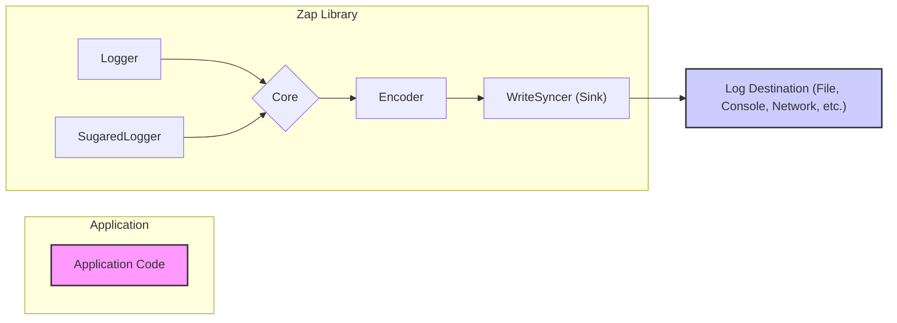
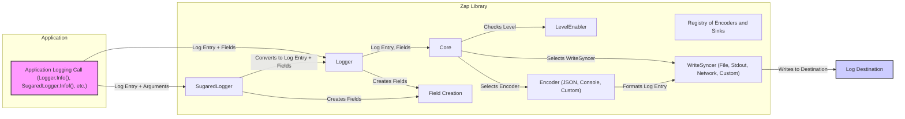

# Project Design Document: Uber-go/Zap Logging Library

**Version:** 1.1
**Date:** October 26, 2023
**Author:** Gemini (AI Language Model)
**Project:** Uber-go/Zap

## 1. Introduction

This document provides a detailed design overview of the `uber-go/zap` logging library. It outlines the architecture, components, and data flow within the library, with a specific focus on aspects relevant to security threat modeling.

`zap` is a high-performance, structured, and leveled logging library for Go. Its design prioritizes speed and efficiency, making it a popular choice for performance-sensitive applications. This document aims to dissect the library's internal workings to facilitate the identification of potential security vulnerabilities and attack vectors.

## 2. Goals and Non-Goals

**Goals:**

*   Provide a clear and comprehensive description of the architectural components within the `zap` library.
*   Illustrate the detailed data flow of log messages from creation to output.
*   Identify key interfaces, data structures, and their interactions.
*   Offer sufficient technical detail to enable effective and targeted threat modeling exercises.

**Non-Goals:**

*   Present an exhaustive line-by-line code analysis of the `zap` library.
*   Document every possible configuration option available within `zap`.
*   Conduct performance benchmarking or analysis of the library.
*   Provide a comparative analysis against other Go logging libraries.

## 3. System Architecture

The `zap` library's architecture can be broken down into several interacting components:

*   **Logger:** This is the primary interface developers use to emit log messages from their application code. It offers type-safe methods for logging at various severity levels (Debug, Info, Warn, Error, DPanic, Panic, Fatal) and allows attaching structured data as key-value pairs (`Field`s). The `Logger` is designed to be efficient and minimize allocations in performance-critical paths.
*   **SugaredLogger:** A developer-friendly, higher-level abstraction built on top of the core `Logger`. It provides a more convenient, printf-style API for logging, handling the conversion of arguments into structured `Field`s before delegating to the underlying `Logger`. This abstraction simplifies common logging scenarios but introduces a layer of formatting.
*   **Core:** The central processing unit of `zap`. It receives log entries from the `Logger` (or `SugaredLogger`), applies filtering based on configured `LevelEnabler`s, and then dispatches the entries to the appropriate `Encoder`s and `WriteSyncer`s. A `Core` can be configured with multiple output destinations.
*   **Encoder:** Responsible for transforming the internal representation of a log entry (including its message and attached `Field`s) into a specific output format. `zap` provides built-in `Encoder`s for JSON and console output. Users can also implement custom `Encoder`s to support other formats. The encoding process involves serializing data, which can be a point of vulnerability if not handled correctly.
*   **WriteSyncer (Sink):**  An interface representing the destination where the encoded log output is written. Common implementations include writing to files, standard output, or network connections. `zap` provides several built-in `WriteSyncer` implementations, and users can create custom ones. The security of the logging infrastructure heavily relies on the security properties of the chosen `WriteSyncer`.
*   **LevelEnabler:** Determines the minimum log level that a specific `Core` will process. This allows for filtering out less important log messages, reducing overhead and the volume of logs. `LevelEnabler`s are crucial for controlling what information is logged, which has security implications.
*   **Field:** Represents a single key-value pair of structured data associated with a log message. `Field`s are a core concept in `zap`, enabling structured logging that is easier to parse and analyze. The types and values of `Field`s are handled by the `Encoder`.

### 3.1. High-Level Architecture Diagram

### 3.2. Component-Level Architecture Diagram

## 4. Data Flow

The journey of a log message within `zap` can be described as follows:

*   **Log Initiation:** The application code initiates a logging event by calling a method on either a `Logger` or a `SugaredLogger` instance. This call includes the log message and any associated data intended to be logged as structured `Field`s.
*   **SugaredLogger Processing (if applicable):** If the `SugaredLogger` is used, the provided arguments are processed and converted into structured `Field`s. This involves formatting and type conversion. Potential vulnerabilities might arise if the formatting logic is flawed or if untrusted input is used in the arguments.
*   **Entry to Core:** The `Logger` (or the underlying `Logger` of the `SugaredLogger`) receives the log message and the collection of `Field`s. This information is encapsulated in an internal log entry structure.
*   **Level Filtering:** The log entry is passed to the configured `Core`. The `Core` first checks the log entry's severity level against the configured `LevelEnabler`. If the log level is below the threshold defined by the `LevelEnabler`, the log entry is discarded, preventing it from being processed further. This filtering mechanism is crucial for controlling log volume and the information logged.
*   **Encoding:** If the log entry passes the level check, the `Core` selects the appropriate `Encoder` based on its configuration. The `Encoder` takes the log entry and its associated `Field`s and transforms them into the desired output format (e.g., JSON, console-friendly text). This encoding process involves serializing the data, and vulnerabilities could exist in the encoding logic itself or if the data being encoded contains malicious content.
*   **Writing to Sink:** The encoded log output is then passed to the selected `WriteSyncer`. The `WriteSyncer` is responsible for actually writing the formatted log output to its designated destination. The security of this step depends heavily on the implementation of the `WriteSyncer` and the security of the destination. For example, writing to a file requires appropriate file permissions, and writing to a network socket requires secure communication protocols.
*   **Log Destination:** The `WriteSyncer` persists the log data to its final destination, which could be a file on disk, standard output, a network logging service, or any other supported output. The security of the logged data at rest is the responsibility of the system managing the log destination.

## 5. Key Interfaces and Data Structures

*   **`Logger` Interface:**
    *   Provides methods for emitting log messages at various severity levels: `Debug`, `Info`, `Warn`, `Error`, `DPanic`, `Panic`, `Fatal`.
    *   Offers methods for adding structured context to log messages: `With(fields ...Field)`, `Named(name string)`.
    *   Designed for performance with minimal overhead.
*   **`SugaredLogger` Interface:**
    *   Offers convenient, printf-style logging methods: `Debugf(template string, args ...interface{})`, `Infof(template string, args ...interface{})`, etc.
    *   Includes methods for adding structured context.
    *   Internally uses the `Logger` after converting arguments to `Field`s.
*   **`Core` Interface:**
    *   `Enabled(Level)`: Determines if logging is enabled for a given severity level.
    *   `Check(Entry, *CheckedEntry)`: Performs pre-allocation and checks before potentially expensive encoding and writing operations.
    *   `Write(Entry, []Field)`: The core method for processing and dispatching a log entry.
    *   `Sync() error`: Flushes any buffered log output to ensure data persistence.
*   **`Encoder` Interface:**
    *   Defines methods for adding various data types to the encoded output: `AddString(key, value string)`, `AddInt64(key string, value int64)`, `AddBool(key string, value bool)`, `AddObject(key string, marshaler LogMarshaler) error`, etc.
    *   `EncodeEntry(Entry, []Field) (*buffer.Buffer, error)`: Encodes a complete log entry into a buffer.
*   **`WriteSyncer` Interface:**
    *   `Write(p []byte) (n int, err error)`: Writes the encoded log output to the underlying destination.
    *   `Sync() error`: Flushes any buffered data to the underlying storage or transport.
*   **`Entry` Struct:**
    *   Contains core information about a log event: `Time`, `Level`, `Message`, `LoggerName`, `Caller`.
*   **`Field` Struct:**
    *   Represents a key-value pair of structured data. Contains the `Key`, the `Type` of the value, and the `Interface` holding the actual value.
*   **`Level` Type:**
    *   An enumerated type representing the different log severity levels.

## 6. Security Considerations (For Threat Modeling)

This section details potential security vulnerabilities and attack vectors related to the `zap` logging library:

*   **Log Injection Attacks:**
    *   **Vulnerability:** If user-controlled input is directly incorporated into log messages without proper sanitization, attackers can inject malicious content. This is particularly relevant when using `SugaredLogger`'s format strings.
    *   **Threat:** Injected content could be interpreted as legitimate log entries by downstream log aggregation and analysis systems, potentially leading to misinterpretations, false alerts, or the execution of unintended commands if logs are processed automatically.
    *   **Example:** A malicious username like `"%s%s%s%s%s"` could cause issues if used in an `Infof` call without proper handling.
*   **Information Disclosure through Excessive or Uncontrolled Logging:**
    *   **Vulnerability:** Overly permissive log levels or a lack of control over what data is logged can lead to the unintentional logging of sensitive information.
    *   **Threat:** Attackers gaining access to log files could retrieve confidential data such as passwords, API keys, session tokens, or personally identifiable information (PII).
    *   **Example:** Logging the complete request body or headers without filtering could expose sensitive data.
*   **Denial of Service (DoS) via Log Flooding:**
    *   **Vulnerability:** An attacker might be able to trigger a large volume of log messages, potentially overwhelming the logging infrastructure and consuming excessive resources (CPU, disk I/O, network bandwidth).
    *   **Threat:** This can lead to performance degradation or even the unavailability of the application or the logging system itself.
    *   **Example:** Repeatedly triggering error conditions that result in verbose error logging.
*   **Log Tampering and Data Integrity Issues:**
    *   **Vulnerability:** If log files are not stored securely with appropriate access controls and integrity checks, attackers might be able to modify or delete log entries.
    *   **Threat:** This can hinder forensic investigations, obscure malicious activity, and compromise audit trails.
    *   **Example:** An attacker gaining access to the log storage directory and directly editing log files.
*   **Unauthorized Access to Log Data:**
    *   **Vulnerability:** If the log destinations (e.g., log files, network logging servers) are not properly secured, unauthorized individuals could gain access to sensitive log data.
    *   **Threat:** This can lead to the compromise of confidential information and a breach of privacy.
    *   **Example:** Log files stored with world-readable permissions or network logs transmitted over unencrypted channels.
*   **Security Risks in Custom Encoders and Sinks:**
    *   **Vulnerability:** If developers implement custom `Encoder` or `WriteSyncer` components, vulnerabilities in these custom implementations could introduce security flaws.
    *   **Threat:** This could range from information disclosure to remote code execution, depending on the nature of the vulnerability.
    *   **Example:** A custom `Encoder` that fails to properly sanitize data before serialization, leading to injection vulnerabilities.
*   **Configuration Management Vulnerabilities:**
    *   **Vulnerability:** Misconfigurations of the `zap` library, such as setting overly verbose log levels in production or using insecure `WriteSyncer` configurations, can create security weaknesses.
    *   **Threat:** This can expose sensitive information or make the logging infrastructure a target for attacks.
    *   **Example:** Configuring `zap` to log at the `Debug` level in a production environment, exposing a large amount of potentially sensitive data.
*   **Dependency Chain Risks:**
    *   **Vulnerability:** While `zap` has minimal direct dependencies, vulnerabilities in its indirect dependencies could potentially be exploited.
    *   **Threat:** This could indirectly affect the security of applications using `zap`.
    *   **Example:** A vulnerability in a low-level library used for file I/O by a `WriteSyncer`.

## 7. Deployment Considerations

*   `zap` is typically integrated as a library directly within Go applications.
*   Configuration of `zap` (e.g., setting log levels, output paths, encoding formats) is usually performed programmatically during application initialization or through configuration files loaded at startup.
*   Different `Core` configurations might be used for different deployment environments (e.g., more detailed logging in development/testing, less verbose in production).
*   Log outputs are commonly directed to local files, standard output/error streams (often captured by process managers), or centralized logging systems via network protocols.
*   Secure storage and transport mechanisms should be employed for log data, especially when dealing with sensitive information.

## 8. Future Considerations

*   Further analysis of the security implications of different built-in and custom `WriteSyncer` implementations.
*   Detailed examination of potential vulnerabilities within custom `Encoder` implementations and best practices for secure custom component development.
*   Investigation of robust mechanisms for sanitizing and masking sensitive data before it is logged.
*   Evaluation of the security implications of asynchronous logging and potential race conditions or data loss scenarios.
*   Consideration of integrating security auditing features directly into the `zap` library.

This improved design document provides a more in-depth understanding of the `uber-go/zap` logging library, specifically tailored for security threat modeling. By elaborating on the components, data flow, and potential vulnerabilities, this document aims to empower security professionals to conduct more effective and targeted threat assessments.