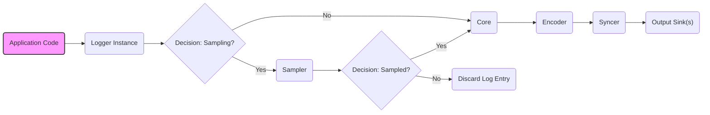
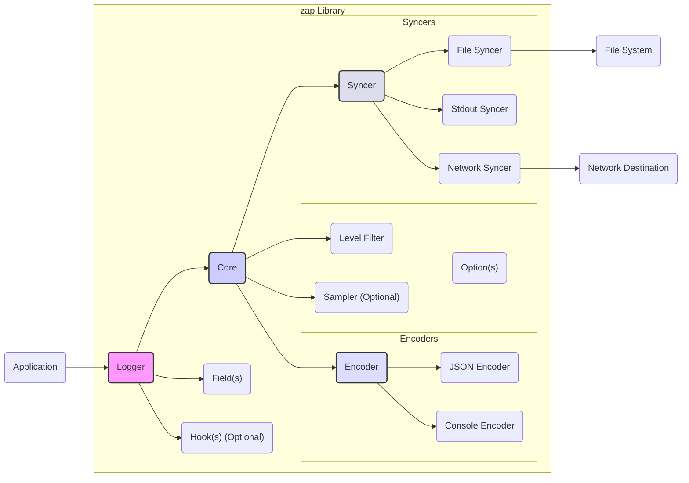
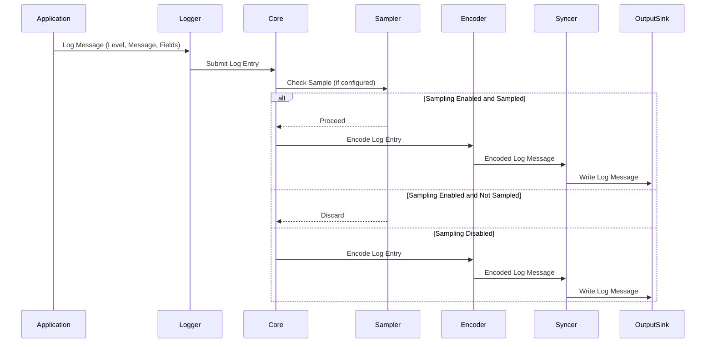

# Project Design Document: uber-go/zap Logging Library

**Version:** 1.1
**Date:** October 26, 2023
**Author:** AI Software Architect

## 1. Introduction

This document provides an enhanced and more detailed design overview of the `uber-go/zap` logging library. Building upon the previous version, this document further clarifies the architecture, component interactions, and data flow, with a stronger emphasis on aspects relevant to security threat modeling. The aim is to provide a robust foundation for identifying potential vulnerabilities and security risks associated with the library's use.

## 2. Goals

*   Provide a comprehensive and refined architectural overview of the `uber-go/zap` library.
*   Clearly identify key components, their responsibilities, and their interactions within the logging process.
*   Describe the complete data flow within the library, highlighting critical stages.
*   Thoroughly analyze aspects relevant to security, detailing potential vulnerabilities and threat vectors.
*   Serve as a precise and actionable input for subsequent threat modeling exercises.

## 3. Non-Goals

*   Provide a line-by-line code-level implementation guide or API documentation.
*   Offer exhaustive performance benchmarking data or detailed optimization strategies.
*   Document every single configurable option or edge case scenario.
*   Include a comprehensive catalog of all possible error conditions and their handling.

## 4. Architectural Overview

The `zap` library is engineered as a high-performance, structured logging library for Go applications. Its core design revolves around efficiency and flexibility. Applications utilizing `zap` instantiate loggers, which then process log messages, format them, and output them to various configurable destinations.

### 4.1. High-Level Architecture Diagram

This diagram illustrates how an application interacts with the `zap` library to generate and output logs.

### 4.2. Component-Level Architecture

The `zap` library is composed of several interconnected components, each with a specific role in the logging pipeline.

*   **Logger:** The primary interface through which applications emit log messages. It encapsulates a `Core` and offers convenient methods corresponding to different log levels.
*   **Core:** The central engine of the logger. It receives log entries, applies level-based filtering, and dispatches them to the appropriate `Encoder` and `Syncer`. A `Logger` can be configured with multiple `Core` instances for teeing output.
*   **Encoder:** Responsible for transforming the structured log entry into a specific output format, such as JSON or human-readable console output. Different encoder implementations can be selected.
*   **Syncer:** Manages the actual writing of the encoded log message to the designated output destination. This involves handling file I/O, writing to standard output, or transmitting data over network connections. Syncers often incorporate buffering and flushing mechanisms for performance.
*   **Level:** Represents the severity of a log message, enabling filtering based on importance (e.g., Debug, Info, Warn, Error).
*   **Field:** Represents a structured key-value pair associated with a log message, providing rich contextual information.
*   **Sampler:** An optional component used to reduce the volume of logs by selectively processing only a subset of log entries based on configurable criteria.
*   **Hook:** Allows for the execution of custom logic at specific points in the logging process, such as before or after a log entry is processed. This can be used for adding contextual information, triggering alerts, or performing other side effects.
*   **Option:** Configuration settings that customize the behavior of various components within the `zap` library, such as encoder settings, syncer configurations, and sampling parameters.

### 4.3. Component Diagram

This diagram illustrates the relationships and dependencies between the key components of the `zap` library.

## 5. Data Flow

The journey of a log message within the `zap` library follows a defined path, from its creation in the application code to its eventual output.

1. **Log Call Initiation:** The application code invokes a logging method on a `Logger` instance, providing the log level, message, and any associated fields (e.g., `logger.Info("User logged in", zap.String("username", username))`).
2. **Level Evaluation:** The `Logger` checks if the log message's level meets or exceeds the minimum configured level for the associated `Core`. If not, the message is discarded.
3. **Sampling Decision (Conditional):** If a `Sampler` is configured, it determines whether the log entry should be processed based on its defined sampling logic. This helps manage log volume.
4. **Hook Execution (Conditional):** If any `Hooks` are registered with the `Core`, they are executed at this stage. Hooks can modify the log entry, add additional context, or trigger external actions.
5. **Encoding Process:** The `Core` passes the log entry and its fields to the designated `Encoder`. The `Encoder` formats the data according to its configured output format (e.g., JSON encoding with specific timestamp formats).
6. **Syncing Operation:** The encoded log message is then passed to the configured `Syncer`.
7. **Output to Sink:** The `Syncer` handles the actual writing of the formatted log message to the specified output sink. This could involve writing to a local file, standard output, or sending the log message over a network connection. Syncers often employ buffering to optimize write operations and periodically flush the buffer to ensure data persistence.

### 5.1. Data Flow Diagram

This sequence diagram illustrates the steps involved in processing a log message within the `zap` library.

## 6. Key Components in Detail

*   **Logger:**
    *   Provides the primary API for application interaction with the logging framework.
    *   Manages the underlying `Core` instance(s).
    *   Offers type-safe logging methods for various severity levels (Debug, Info, Warn, Error, DPanic, Panic, Fatal).
    *   Facilitates the addition of structured fields to log messages, enabling richer contextual information.
    *   Supports creating child loggers with inherited or added context through methods like `With`.

*   **Core:**
    *   Acts as the central processing unit for log entries.
    *   Performs level-based filtering to determine if a log message should be processed further.
    *   Dispatches accepted log entries to the configured `Encoder` and `Syncer`.
    *   Enables "teeing" functionality, allowing a single `Logger` to write to multiple independent outputs by associating it with multiple `Core` instances.

*   **Encoder:**
    *   Transforms the internal representation of a log entry into a specific output format suitable for storage or consumption.
    *   Common encoder implementations include JSON encoder (for structured, machine-readable logs) and console encoder (for human-readable output).
    *   Handles the formatting of timestamps, log levels, messages, and associated fields according to the chosen format.
    *   Offers configuration options to customize the output format, such as indentation, quoting of values, and ordering of fields.

*   **Syncer:**
    *   Manages the physical act of writing the encoded log message to the designated output destination.
    *   Abstracts the underlying I/O operations, whether writing to files, standard output, or network sockets.
    *   Often implements buffering mechanisms to improve performance by reducing the frequency of system calls.
    *   Provides a `Sync()` method to explicitly flush any buffered log messages, ensuring immediate persistence.

## 7. Security Considerations

A thorough understanding of the `zap` library's architecture and data flow is crucial for identifying potential security vulnerabilities. The following points highlight key areas to consider during threat modeling:

*   **Logging of Sensitive Information:** Applications might inadvertently log sensitive data (e.g., API keys, passwords, personal identifiable information) through `zap`. This poses a risk if log files are not adequately protected or if logs are transmitted insecurely.
    *   **Threat:** Exposure of sensitive data through log files or during transmission.
    *   **Mitigation:** Implement strict controls over what data is logged, utilize log redaction techniques, and ensure secure storage and transmission of logs.
*   **Log Injection Vulnerabilities:** If user-provided data is directly incorporated into log messages without proper sanitization or encoding, attackers could inject malicious content into log files.
    *   **Threat:** Manipulation of log data, potentially leading to misleading analysis or exploitation of log processing systems.
    *   **Mitigation:** Sanitize or encode user inputs before including them in log messages. Utilize structured logging with fields to avoid direct string concatenation.
*   **Output Sink Security:** The security of the configured output sinks is paramount.
    *   **File Syncers:** Inadequate file permissions can allow unauthorized access, modification, or deletion of log files.
        *   **Threat:** Compromise of log integrity, denial of service through log deletion.
        *   **Mitigation:** Implement appropriate file system permissions and access controls. Consider log rotation and secure archiving.
    *   **Network Syncers:** Transmitting logs over unencrypted network connections exposes them to interception.
        *   **Threat:** Confidentiality breach, potential for man-in-the-middle attacks.
        *   **Mitigation:** Utilize secure protocols like TLS for network log transmission. Implement authentication and authorization mechanisms at the receiving end.
*   **Configuration Management Risks:** Misconfiguration of `zap` can introduce security vulnerabilities.
    *   **Overly Verbose Logging:** Setting the logging level too low can expose excessive debug information, potentially revealing sensitive internal details.
        *   **Threat:** Information disclosure.
        *   **Mitigation:** Carefully manage logging levels based on the environment and security requirements.
    *   **Insecure Output Sink Configuration:** Incorrectly configured network syncers or file paths can lead to data leaks or unauthorized access.
        *   **Threat:** Data breaches, unauthorized access.
        *   **Mitigation:** Implement secure configuration practices and validate configurations.
*   **Dependency Chain Vulnerabilities:** While `zap` has minimal direct dependencies, vulnerabilities in the broader application's dependencies could indirectly impact logging if those dependencies are involved in log processing or output.
    *   **Threat:** Indirect exploitation through vulnerable dependencies.
    *   **Mitigation:** Regularly audit and update application dependencies.
*   **Error Handling and Information Leaks:** How `zap` handles errors during the logging process is important. Error messages should not inadvertently reveal sensitive information about the application's internal state or configuration.
    *   **Threat:** Information disclosure through error messages.
    *   **Mitigation:** Ensure error handling within `zap` and its integrations does not expose sensitive details.
*   **Resource Exhaustion through Logging:** Excessive logging or inefficient syncer configurations can lead to performance degradation or resource exhaustion, potentially causing denial-of-service conditions.
    *   **Threat:** Availability impact, denial of service.
    *   **Mitigation:** Implement appropriate log rotation, sampling, and efficient syncer configurations. Monitor logging resource consumption.
*   **Security of Custom Hooks:** If custom hooks are implemented, their security is paramount. Malicious or poorly written hooks could introduce vulnerabilities or compromise the integrity of the logging process.
    *   **Threat:** Introduction of vulnerabilities through custom code.
    *   **Mitigation:** Thoroughly review and test custom hooks. Adhere to secure coding practices.

## 8. Deployment Considerations

The security of `zap` logging is also influenced by how it is deployed and managed within the application environment.

*   **Secure Configuration Management:** Employ secure methods for managing `zap` configurations, especially in production environments. Avoid storing sensitive configuration details in plain text.
*   **Log Aggregation and Security:** When using log aggregation systems, ensure secure transmission and storage of logs. Implement access controls to restrict who can access and analyze log data.
*   **Monitoring and Alerting for Security Events:** Configure monitoring and alerting systems to detect unusual logging patterns or errors that might indicate security incidents.

## 9. Future Considerations

Potential future enhancements to `zap` that could impact its design and security profile include:

*   **Built-in Log Redaction Capabilities:** Native support for redacting sensitive information before it is written to logs.
*   **Log Encryption at Rest and in Transit:** Options for encrypting log data both when stored and during network transmission.
*   **Advanced Sampling and Filtering Mechanisms:** More sophisticated techniques for controlling log volume while retaining important security-related events.

This enhanced design document provides a more detailed and security-focused overview of the `uber-go/zap` logging library. It serves as a valuable resource for conducting comprehensive threat modeling and identifying potential security risks associated with its use.