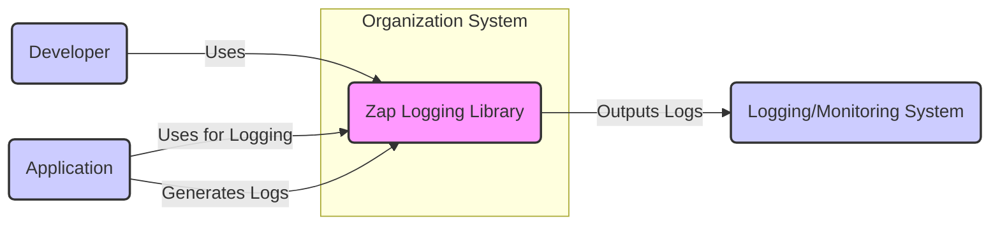
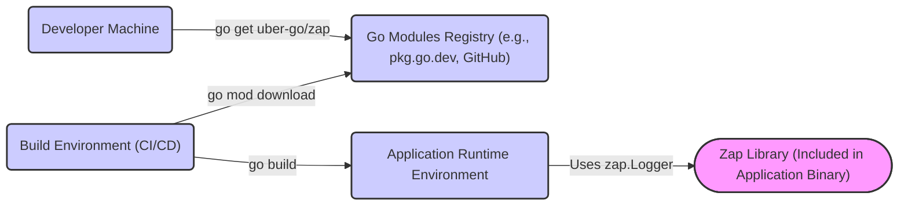
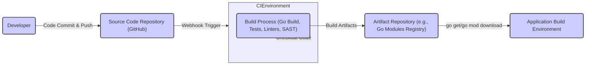

# BUSINESS POSTURE

This project, `uber-go/zap`, provides a high-performance structured logging library for Go.

- Business Priorities and Goals:
  - Provide a robust and efficient logging solution for Go applications.
  - Enable developers to easily integrate structured logging into their applications.
  - Offer flexibility and customization through various encoders and output sinks.
  - Improve application observability and debugging capabilities.
  - Enhance application performance by minimizing logging overhead.

- Business Risks:
  - Application instability or failure due to logging library bugs.
  - Performance degradation in applications using the logging library if not used correctly.
  - Security vulnerabilities in the logging library itself could be exploited in applications using it.
  - Improper handling or exposure of sensitive data logged by applications using the library.
  - Dependency on an open-source project with potential for discontinued maintenance or security issues.

# SECURITY POSTURE

- Security Controls:
  - security control: Code review process for contributions (implicit in open-source contribution model).
  - security control: Unit and integration testing to ensure code quality and identify bugs (evident in repository).
  - security control: Static analysis tools and linters used during development (likely, though not explicitly documented).
  - security control: Dependency management using `go.mod` and `go.sum` to ensure dependency integrity.
  - security control: Publicly accessible vulnerability reports and issue tracking on GitHub.

- Accepted Risks:
  - accepted risk: Reliance on community contributions for security vulnerability discovery and patching.
  - accepted risk: Potential delay in security patch availability compared to commercial solutions.
  - accepted risk: Open-source nature implies public disclosure of vulnerabilities.

- Recommended Security Controls:
  - security control: Implement automated security scanning (SAST, DAST, dependency scanning) in the CI/CD pipeline for the library itself.
  - security control: Formalize a security vulnerability disclosure and response process.
  - security control: Consider code signing or checksum verification for releases to ensure integrity.
  - security control: Provide guidelines and best practices for secure logging practices to users of the library, emphasizing data sanitization and sensitive data handling.

- Security Requirements:
  - Authentication: Not applicable for a logging library itself. Authentication is relevant for systems that consume logs, which is outside the scope of this library.
  - Authorization: Not applicable for a logging library itself. Authorization is relevant for systems that consume logs.
  - Input Validation: Input validation is crucial within the library to prevent injection attacks or unexpected behavior when processing log messages and configurations. This should be implemented in the encoding and output stages.
  - Cryptography: Cryptography might be relevant if the library is extended to support encrypted logging or secure log transport. Currently, it's not a core requirement of the library itself, but could be a future enhancement.

# DESIGN

## C4 CONTEXT



- Context Diagram Elements:
  - - Name: Developer
    - Type: Person
    - Description: Software developers who use the Zap logging library in their Go applications.
    - Responsibilities: Integrate and configure Zap in their applications, utilize Zap's API for logging.
    - Security controls: Secure development practices, secure coding guidelines when using logging libraries.
  - - Name: Application
    - Type: Software System
    - Description: Go applications that utilize the Zap logging library to generate logs.
    - Responsibilities: Generate log events, pass log data to Zap library, handle application logic.
    - Security controls: Application-level security controls, input validation, secure data handling, access control.
  - - Name: Zap Logging Library
    - Type: Software System
    - Description: The `uber-go/zap` structured logging library for Go.
    - Responsibilities: Provide efficient and flexible logging capabilities, encode and output log messages to configured destinations.
    - Security controls: Input validation, secure coding practices in library development, dependency management, security testing.
  - - Name: Logging/Monitoring System
    - Type: Software System
    - Description: External systems that collect, store, analyze, and visualize logs generated by applications using Zap. Examples include Elasticsearch, Splunk, CloudWatch Logs, etc.
    - Responsibilities: Ingest, store, process, and present log data, provide monitoring and alerting capabilities.
    - Security controls: Access control, data encryption at rest and in transit, audit logging, security monitoring.

## C4 CONTAINER

```mermaid
flowchart LR
    subgraph "Zap Logging Library"
        subgraph Core
            Logger("Logger")
            Encoder("Encoder")
            LevelEnabler("Level Enabler")
            Sampler("Sampler")
        end
        subgraph Sinks
            ConsoleSink("Console Sink")
            FileSink("File Sink")
            NetworkSink("Network Sink")
            CustomSink("Custom Sink")
        end
        API("Zap API")

        API --> Logger
        Logger --> LevelEnabler
        Logger --> Sampler
        Logger --> Encoder
        Logger --> Sinks
        Encoder --> Sinks

    end
    Application("Application")

    Application -->|Uses Zap API| API
    Sinks -->|Outputs Logs| LoggingSystem("Logging/Monitoring System")

    style "Zap Logging Library" fill:#f9f,stroke:#333,stroke-width:2px
    style Core fill:#eef,stroke:#333,stroke-width:1px,dasharray: 5 5
    style Sinks fill:#eef,stroke:#333,stroke-width:1px,dasharray: 5 5
    style API fill:#ccf,stroke:#333,stroke-width:2px
    style Logger fill:#ccf,stroke:#333,stroke-width:2px
    style Encoder fill:#ccf,stroke:#333,stroke-width:2px
    style LevelEnabler fill:#ccf,stroke:#333,stroke-width:2px
    style Sampler fill:#ccf,stroke:#333,stroke-width:2px
    style ConsoleSink fill:#ccf,stroke:#333,stroke-width:2px
    style FileSink fill:#ccf,stroke:#333,stroke-width:2px
    style NetworkSink fill:#ccf,stroke:#333,stroke-width:2px
    style CustomSink fill:#ccf,stroke:#333,stroke-width:2px
    style Application fill:#ccf,stroke:#333,stroke-width:2px
    style LoggingSystem fill:#ccf,stroke:#333,stroke-width:2px
```

- Container Diagram Elements:
  - - Name: Zap API
    - Type: Library Interface
    - Description: Public API exposed by the Zap library for applications to interact with.
    - Responsibilities: Provide methods for logging at different levels, adding fields to logs, configuring the logger.
    - Security controls: Input validation on API parameters, rate limiting (if applicable in configuration).
  - - Name: Logger
    - Type: Core Component
    - Description: The central component responsible for processing log requests.
    - Responsibilities: Receive log requests from the API, determine log level, apply sampling, encode log messages, and send them to sinks.
    - Security controls: Input validation, error handling, resource management.
  - - Name: Encoder
    - Type: Core Component
    - Description: Responsible for encoding log messages into different formats (JSON, console, etc.).
    - Responsibilities: Convert structured log data into a specific format for output.
    - Security controls: Input validation to prevent injection attacks during encoding, handling of potentially sensitive data during encoding.
  - - Name: Level Enabler
    - Type: Core Component
    - Description: Determines if a log message at a given level should be logged based on the configured logging level.
    - Responsibilities: Filter log messages based on severity level.
    - Security controls: Configuration validation to ensure valid log levels are set.
  - - Name: Sampler
    - Type: Core Component
    - Description: Optionally samples log messages to reduce logging volume, especially for high-frequency logs.
    - Responsibilities: Implement sampling logic to control the rate of log output.
    - Security controls: Configuration validation for sampling parameters.
  - - Name: Console Sink
    - Type: Sink Component
    - Description: Outputs log messages to the standard output or standard error streams.
    - Responsibilities: Write log messages to the console.
    - Security controls: Limited, primarily relies on the security of the system's console output.
  - - Name: File Sink
    - Type: Sink Component
    - Description: Writes log messages to files.
    - Responsibilities: Manage log file creation, rotation, and writing.
    - Security controls: File system permissions, access control to log files, secure file handling to prevent path traversal or other file-related vulnerabilities.
  - - Name: Network Sink
    - Type: Sink Component
    - Description: Sends log messages over the network to remote logging systems.
    - Responsibilities: Establish network connections, transmit log data over the network.
    - Security controls: Encryption of log data in transit (TLS/SSL), authentication and authorization for network connections, secure configuration of network destinations.
  - - Name: Custom Sink
    - Type: Sink Component
    - Description: Allows users to implement custom log output destinations.
    - Responsibilities: Delegate log output to user-defined sinks.
    - Security controls: Depends on the security implementation of the custom sink. Users are responsible for securing their custom sinks.

## DEPLOYMENT

Deployment for a library is different from a standalone application. Zap is deployed by being included as a dependency in Go applications.

- Deployment Architecture Options:
  - Option 1: Direct inclusion in application code (most common).
  - Option 2: Vendoring as part of application dependencies.
  - Option 3: Using Go modules dependency management.

- Detailed Deployment (Option 3 - Go Modules):



- Deployment Diagram Elements:
  - - Name: Developer Machine
    - Type: Environment
    - Description: Developer's local machine where they develop Go applications.
    - Responsibilities: Development, code integration, dependency management using Go modules.
    - Security controls: Developer machine security, code repository access control.
  - - Name: Go Modules Registry
    - Type: Infrastructure
    - Description: Public or private Go module registries where Go libraries are hosted and downloaded from. Examples include pkg.go.dev, GitHub, private module proxies.
    - Responsibilities: Host and serve Go modules, ensure module availability and integrity.
    - Security controls: Registry security, module integrity verification (go.sum), access control (for private registries).
  - - Name: Build Environment (CI/CD)
    - Type: Environment
    - Description: Automated build environment used for compiling and building Go applications.
    - Responsibilities: Automated build process, dependency resolution, compilation, testing, packaging.
    - Security controls: Secure build pipeline, dependency scanning, vulnerability checks, access control to build environment.
  - - Name: Application Runtime Environment
    - Type: Environment
    - Description: Environment where the Go application is executed (e.g., servers, containers, cloud instances).
    - Responsibilities: Execute the application, run application logic, generate logs using the included Zap library.
    - Security controls: Runtime environment security, access control, network security, monitoring.
  - - Name: Zap Library (Included in Application Binary)
    - Type: Software Component
    - Description: The Zap library code is compiled and included directly into the application binary.
    - Responsibilities: Provide logging functionality within the application runtime.
    - Security controls: Security of the library code itself, input validation, secure coding practices.

## BUILD



- Build Process Description:
  - Developer commits and pushes code changes to the Source Code Repository (GitHub).
  - A webhook in the Source Code Repository triggers the CI Environment (e.g., GitHub Actions).
  - The CI Environment checks out the code from the repository.
  - The Build Process is executed, which includes:
    - Go build: Compiles the Go code.
    - Unit and integration tests: Executes automated tests.
    - Linters: Runs code linters and static analysis tools to check code quality and style.
    - SAST (Static Application Security Testing): Performs static security scans to identify potential vulnerabilities in the code.
  - Build Artifacts (in this case, primarily the Go module metadata and potentially compiled binaries for distribution) are produced.
  - Artifacts are published to an Artifact Repository (e.g., Go Modules Registry like pkg.go.dev or GitHub Packages).
  - Applications can then download and use the Zap library from the Artifact Repository using `go get` or `go mod download`.

- Build Process Security Controls:
  - security control: Secure Source Code Repository (GitHub) with access control and audit logging.
  - security control: CI Environment (GitHub Actions) with secure configuration and access control.
  - security control: Automated build process to ensure consistent and repeatable builds.
  - security control: Dependency scanning in the build process to identify vulnerable dependencies.
  - security control: SAST (Static Application Security Testing) tools integrated into the build process to detect code-level vulnerabilities.
  - security control: Code linters and static analysis tools to enforce code quality and security best practices.
  - security control: Unit and integration tests to verify code functionality and prevent regressions.
  - security control: Secure Artifact Repository (Go Modules Registry) with access control and integrity checks (go.sum).
  - security control: Code signing or checksum generation for releases to ensure artifact integrity (recommended enhancement).

# RISK ASSESSMENT

- Critical Business Processes Protected:
  - Application Monitoring and Observability: Logging is crucial for monitoring application health, performance, and identifying issues in production.
  - Incident Response and Debugging: Logs are essential for diagnosing and resolving application errors and incidents.
  - Security Auditing and Forensics: Logs can provide valuable information for security audits, incident investigations, and forensic analysis.
  - Business Analytics and Reporting: Logs can be used to collect data for business analytics and reporting purposes (depending on what is logged).

- Data to Protect and Sensitivity:
  - Log Data: The data being protected is the log data generated by applications using the Zap library.
  - Sensitivity of Log Data: The sensitivity of log data varies greatly depending on what is being logged by the application. Logs can contain:
    - Non-sensitive operational data (e.g., timestamps, request IDs, component names).
    - Potentially sensitive data (e.g., user IDs, IP addresses, request paths).
    - Highly sensitive data (e.g., API keys, passwords, personal identifiable information - PII) - **logging highly sensitive data should be avoided**.
  - Data Sensitivity Classification:  Log data sensitivity should be classified based on the application and the data being logged. Organizations should have policies and guidelines for handling sensitive data in logs.

# QUESTIONS & ASSUMPTIONS

- Questions:
  - What are the specific types of applications that will be using this logging library? (e.g., web applications, microservices, backend systems).
  - What are the primary logging destinations (sinks) that will be used? (e.g., console, files, centralized logging systems).
  - Are there any specific compliance requirements related to logging (e.g., GDPR, HIPAA, PCI DSS)?
  - What is the organization's risk appetite regarding open-source dependencies?
  - Are there existing security policies or guidelines that need to be considered for logging practices?

- Assumptions:
  - BUSINESS POSTURE: The primary business goal is to provide a reliable and efficient logging solution to improve application observability and debugging.
  - SECURITY POSTURE: The organization values security and is concerned about potential vulnerabilities in open-source dependencies and secure logging practices. It is assumed that standard secure development practices are generally followed for open-source projects.
  - DESIGN: The library will be used in a variety of Go applications and will output logs to various destinations, including centralized logging systems. The deployment model is primarily focused on Go modules dependency management. The build process utilizes standard CI/CD practices and includes basic security checks.