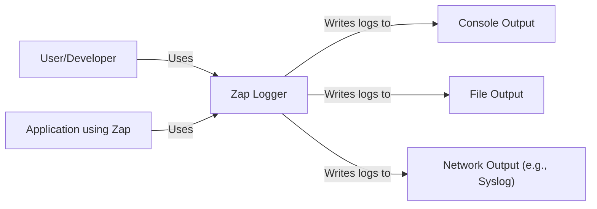
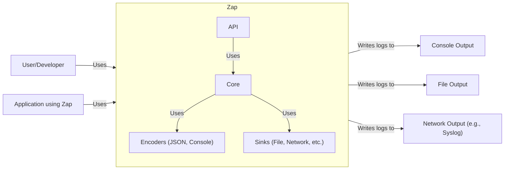
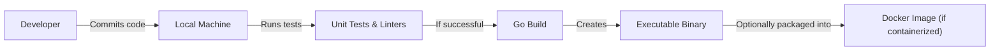

# BUSINESS POSTURE

Business Priorities and Goals:

*   Provide a fast, structured, leveled logging library for Go applications.
*   Offer a flexible API that allows developers to easily configure and use the logger.
*   Minimize performance overhead compared to the standard Go `log` package.
*   Provide different levels of logging (debug, info, warn, error, dpanic, panic, fatal).
*   Support structured logging with key-value pairs.
*   Offer different output formats (console, JSON).
*   Allow customization of log levels and output destinations.
*   Integrate well with other Go libraries and frameworks.
*   Be easy to use and understand for developers of all skill levels.

Business Risks:

*   Inadequate logging can hinder debugging and troubleshooting of production issues, leading to increased downtime and customer dissatisfaction.
*   Performance bottlenecks in the logging library can negatively impact the overall performance of applications using it.
*   Lack of structured logging can make it difficult to analyze logs and extract meaningful insights.
*   Poorly configured logging can lead to excessive log volume, increasing storage costs and making it harder to find relevant log entries.
*   Security vulnerabilities in the logging library could potentially be exploited by attackers.
*   Lack of flexibility in configuration can limit the usefulness of the library in different environments and use cases.
*   Inconsistent or confusing API can lead to developer errors and misuse of the library.

# SECURITY POSTURE

Existing Security Controls:

*   security control: The library itself does not directly handle sensitive data. It primarily deals with formatting and outputting log messages. (Implicit in the library's design)
*   security control: The library provides mechanisms for configuring log levels, allowing developers to control the verbosity of logging and potentially avoid logging sensitive information at higher levels. (Described in the documentation and examples)
*   security control: The library supports different output formats, including JSON, which can be easily parsed and processed by security information and event management (SIEM) systems. (Described in the documentation)
*   security control: Go as a language provides memory safety features that reduce the risk of buffer overflows and other memory-related vulnerabilities. (Implicit in the use of Go)
*   security control: The project uses GitHub for version control and issue tracking, which provides some level of security and auditability. (Implicit in the use of GitHub)
*   security control: The project has a testing suite, which helps to identify and prevent bugs, including potential security vulnerabilities. (Present in the repository)

Accepted Risks:

*   accepted risk: The library does not encrypt log messages. Sensitive data should be handled carefully and not logged directly.
*   accepted risk: The library does not provide built-in mechanisms for log rotation or archiving. This must be handled externally.
*   accepted risk: The library does not implement any specific authentication or authorization mechanisms. Access control to log files is the responsibility of the operating system or deployment environment.

Recommended Security Controls:

*   security control: Implement a mechanism to sanitize or redact sensitive data from log messages before they are written. This could involve using a configuration file to specify patterns to be masked or replaced.
*   security control: Consider adding support for structured logging with specific fields for security-relevant events, such as authentication attempts, authorization failures, and input validation errors.
*   security control: Provide guidance and examples in the documentation on how to securely configure and use the library, including best practices for handling sensitive data.
*   security control: Regularly review and update dependencies to address any known security vulnerabilities.
*   security control: Conduct security audits and penetration testing of the library to identify and address any potential weaknesses.

Security Requirements:

*   Authentication: Not directly applicable to the logging library itself. Authentication should be handled by the application using the library.
*   Authorization: Not directly applicable to the logging library itself. Authorization should be handled by the application using the library.
*   Input Validation: The library should handle potentially malicious input gracefully, such as very long strings or invalid characters, without crashing or causing unexpected behavior.
*   Cryptography: The library should not handle cryptographic operations directly. If encryption of log data is required, it should be handled externally.

# DESIGN

## C4 CONTEXT

Element Descriptions:

*   Element:
    *   Name: User/Developer
    *   Type: Person
    *   Description: A developer who integrates and configures Zap within their Go application, or a user interacting with an application that uses Zap.
    *   Responsibilities: Configures Zap, uses Zap's API to write log messages, and reviews logs.
    *   Security controls: Not directly applicable.

*   Element:
    *   Name: Zap Logger
    *   Type: Software System
    *   Description: The Zap logging library.
    *   Responsibilities: Provides a fast, structured, leveled logging interface for Go applications.
    *   Security controls: Input validation, configurable log levels, support for structured logging.

*   Element:
    *   Name: Console Output
    *   Type: External System
    *   Description: Standard output (stdout) or standard error (stderr) of the application.
    *   Responsibilities: Displays log messages to the console.
    *   Security controls: Access control to the console is managed by the operating system.

*   Element:
    *   Name: File Output
    *   Type: External System
    *   Description: A file on the local filesystem.
    *   Responsibilities: Stores log messages persistently.
    *   Security controls: File system permissions control access to the log file.

*   Element:
    *   Name: Network Output (e.g., Syslog)
    *   Type: External System
    *   Description: A remote logging service or server, such as Syslog.
    *   Responsibilities: Receives and stores log messages sent over the network.
    *   Security controls: Network security protocols (e.g., TLS) and access control mechanisms on the remote server.

*   Element:
    *   Name: Application using Zap
    *   Type: Software System
    *   Description: Go application that uses Zap for logging.
    *   Responsibilities: Performs its business logic and uses Zap to log events.
    *   Security controls: Application-specific security controls, including authentication, authorization, and input validation.

## C4 CONTAINER

Since Zap is a library, the container diagram is essentially the same as the context diagram, with the addition of internal components within the Zap library itself.

Element Descriptions:

*   Elements outside `Zap` subgraph are the same as in C4 CONTEXT diagram.

*   Element:
    *   Name: API
    *   Type: Component
    *   Description: The public interface of the Zap library.
    *   Responsibilities: Provides functions and methods for creating loggers, configuring options, and writing log messages.
    *   Security controls: Input validation for configuration options.

*   Element:
    *   Name: Core
    *   Type: Component
    *   Description: The core logic of the Zap library.
    *   Responsibilities: Handles log level filtering, routing of log messages to appropriate encoders and sinks, and manages internal state.
    *   Security controls: Internal consistency checks.

*   Element:
    *   Name: Encoders (JSON, Console)
    *   Type: Component
    *   Description: Components responsible for formatting log messages.
    *   Responsibilities: Convert log entries into specific formats, such as JSON or plain text.
    *   Security controls: Escaping of special characters to prevent injection vulnerabilities.

*   Element:
    *   Name: Sinks (File, Network, etc.)
    *   Type: Component
    *   Description: Components responsible for writing log messages to different output destinations.
    *   Responsibilities: Write formatted log messages to files, network connections, or other outputs.
    *   Security controls: Handling of errors when writing to outputs.

## DEPLOYMENT

Zap, being a library, is not deployed independently. It is embedded within the application that uses it. Therefore, the deployment diagram reflects the deployment of the *application* using Zap.

Possible deployment solutions:

1.  Standalone executable: The Go application, with Zap embedded, is compiled into a single executable file and deployed directly to a server.
2.  Containerized deployment (e.g., Docker): The application is packaged into a Docker container and deployed to a container orchestration platform (e.g., Kubernetes, Docker Swarm).
3.  Serverless deployment (e.g., AWS Lambda): The application is deployed as a serverless function.

Chosen solution (for detailed description): Containerized deployment (Docker + Kubernetes)

```mermaid
graph LR
    Developer["Developer"] -- "Pushes code to" --> GitRepository["Git Repository (e.g., GitHub)"]
    GitRepository -- "Triggers" --> CI_CD["CI/CD Pipeline (e.g., GitHub Actions)"]
    CI_CD -- "Builds" --> DockerImage["Docker Image"]
    DockerImage -- "Pushed to" --> ContainerRegistry["Container Registry (e.g., Docker Hub, ECR)"]
    ContainerRegistry -- "Pulled by" --> KubernetesCluster["Kubernetes Cluster"]
    KubernetesCluster -- "Runs" --> ApplicationPod["Application Pod"]
    ApplicationPod -- "Writes logs to" -->  StdOut["Stdout/Stderr"]
    StdOut -- "Collected by" --> LogAggregator["Log Aggregator (e.g., Fluentd, Splunk)"]
    LogAggregator -- "Sends logs to" --> LogStorage["Log Storage (e.g., Elasticsearch, CloudWatch)"]

```

Element Descriptions:

*   Element:
    *   Name: Developer
    *   Type: Person
    *   Description: The developer writing and deploying the application.
    *   Responsibilities: Writes code, commits changes, and initiates the deployment process.
    *   Security controls: Access control to the Git repository.

*   Element:
    *   Name: Git Repository (e.g., GitHub)
    *   Type: Software System
    *   Description: The source code repository.
    *   Responsibilities: Stores the application code and tracks changes.
    *   Security controls: Access control, branch protection rules.

*   Element:
    *   Name: CI/CD Pipeline (e.g., GitHub Actions)
    *   Type: Software System
    *   Description: The continuous integration and continuous deployment pipeline.
    *   Responsibilities: Automates the build, test, and deployment process.
    *   Security controls: Secure configuration of the pipeline, access control to secrets.

*   Element:
    *   Name: Docker Image
    *   Type: Artifact
    *   Description: The packaged application, including Zap and all dependencies.
    *   Responsibilities: Provides a consistent and reproducible runtime environment for the application.
    *   Security controls: Image signing, vulnerability scanning.

*   Element:
    *   Name: Container Registry (e.g., Docker Hub, ECR)
    *   Type: Software System
    *   Description: A repository for storing and managing Docker images.
    *   Responsibilities: Stores Docker images and makes them available for deployment.
    *   Security controls: Access control, image scanning.

*   Element:
    *   Name: Kubernetes Cluster
    *   Type: Infrastructure
    *   Description: The container orchestration platform.
    *   Responsibilities: Manages the deployment, scaling, and networking of application containers.
    *   Security controls: Network policies, role-based access control (RBAC).

*   Element:
    *   Name: Application Pod
    *   Type: Container
    *   Description: A running instance of the application container.
    *   Responsibilities: Executes the application code and uses Zap for logging.
    *   Security controls: Pod security policies.

*   Element:
    *   Name: Stdout/Stderr
    *   Type: Output Stream
    *   Description: Standard output and standard error streams of the application container.
    *   Responsibilities: Captures log output from the application.
    *   Security controls: Access control to container logs.

*   Element:
    *   Name: Log Aggregator (e.g., Fluentd, Splunk)
    *   Type: Software System
    *   Description: A tool for collecting and forwarding logs from multiple sources.
    *   Responsibilities: Collects logs from container stdout/stderr and sends them to a central log storage.
    *   Security controls: Secure communication with log sources and storage.

*   Element:
    *   Name: Log Storage (e.g., Elasticsearch, CloudWatch)
    *   Type: Software System
    *   Description: A system for storing and analyzing logs.
    *   Responsibilities: Stores logs, provides search and analysis capabilities.
    *   Security controls: Access control, encryption of data at rest and in transit.

## BUILD

Build Process Description:

1.  Developer commits code changes to their local machine.
2.  Local build process is initiated (either manually or automatically via a pre-commit hook).
3.  Unit tests and linters (e.g., `go test`, `golangci-lint`) are executed to ensure code quality and identify potential issues.
4.  If tests and linters pass, the Go compiler (`go build`) is used to create an executable binary.
5.  Optionally, if the application is containerized, the executable is packaged into a Docker image using a Dockerfile. This step might involve additional security measures, such as:
    *   Using a minimal base image (e.g., Alpine Linux) to reduce the attack surface.
    *   Scanning the image for vulnerabilities using a container image scanner (e.g., Trivy, Clair).
    *   Using multi-stage builds to avoid including build tools and dependencies in the final image.
6. Build artifacts (executable or Docker image) are ready for deployment.

Security Controls in Build Process:

*   security control: Unit tests help to identify and prevent bugs, including potential security vulnerabilities.
*   security control: Linters enforce coding standards and best practices, which can help to prevent common security flaws.
*   security control: Dependency management tools (e.g., Go modules) help to ensure that the application uses known and trusted versions of dependencies.
*   security control: (If containerized) Container image scanning helps to identify and mitigate vulnerabilities in the application's dependencies and runtime environment.
*   security control: (If containerized) Using minimal base images and multi-stage builds reduces the attack surface of the container.
*   security control: (If CI environment is used) Secure configuration of the CI/CD pipeline, including access control to secrets and build environments.

# RISK ASSESSMENT

Critical Business Processes:

*   Application functionality that relies on Zap for logging. The availability and reliability of the application depend on the proper functioning of the logging system.
*   Debugging and troubleshooting of production issues. Inadequate or unavailable logging can significantly hinder the ability to diagnose and resolve problems.
*   Security monitoring and auditing. Logs are often a critical source of information for security investigations and compliance audits.

Data Sensitivity:

*   Log messages themselves may contain sensitive data, depending on how the application uses Zap. This could include:
    *   Personally identifiable information (PII)
    *   Financial data
    *   Authentication credentials (if logged incorrectly)
    *   Internal system details
    *   Business-sensitive information
*   The sensitivity of the log data depends entirely on the application's context and what it chooses to log. Zap, as a library, does not inherently handle any specific type of data. It is the responsibility of the application developer to ensure that sensitive data is not logged inappropriately.

# QUESTIONS & ASSUMPTIONS

Questions:

*   Are there any specific regulatory compliance requirements (e.g., GDPR, HIPAA) that apply to the logging of data by applications using Zap?
*   What are the expected log volumes and retention policies?
*   Are there any existing logging infrastructure or tools that Zap needs to integrate with?
*   What level of support and maintenance will be provided for the library?
*   What is the process for reporting and addressing security vulnerabilities in the library?
*   Are there any specific performance requirements or benchmarks that the library needs to meet?

Assumptions:

*   BUSINESS POSTURE: The primary goal is to provide a fast and reliable logging library. Performance and ease of use are prioritized over advanced security features.
*   SECURITY POSTURE: Developers using Zap are responsible for handling sensitive data appropriately and not logging it directly. The library is assumed to be used in a generally secure environment.
*   DESIGN: The library will be used primarily in Go applications deployed in various environments, including standalone servers, containers, and serverless functions. The design should be flexible enough to accommodate these different deployment models.