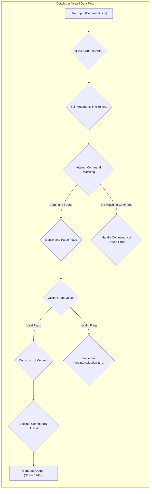

# Project Design Document: urfave/cli Library

**Version:** 1.1
**Date:** October 26, 2023
**Author:** AI Software Architect

## 1. Introduction

This document provides an enhanced and more detailed design overview of the `urfave/cli` library (available at [https://github.com/urfave/cli](https://github.com/urfave/cli)). This revised document is specifically tailored to serve as a robust foundation for subsequent threat modeling activities. It offers a deeper exploration of the library's architecture, key components, data flow, and potential interaction points, with a stronger emphasis on security considerations.

`urfave/cli` is a widely used Go package designed to streamline the creation of command-line interface (CLI) applications. It offers a declarative and intuitive approach to defining commands, flags (options), and associated actions, significantly simplifying the development of user-friendly and well-structured command-line tools.

## 2. Goals and Objectives

The core design goals of the `urfave/cli` library are centered around:

* **Ease of Use:** Providing a straightforward and intuitive API that minimizes the learning curve for developers building CLI applications.
* **Expressiveness:** Enabling developers to define complex command structures, including nested subcommands and a variety of flag types, to cater to diverse application needs.
* **Performance:** Offering an efficient and performant solution for parsing command-line arguments, ensuring responsiveness even in applications with numerous options.
* **Maintainability and Readability:**  Promoting a well-structured, documented, and easily understandable codebase, facilitating collaboration and long-term maintenance.
* **Extensibility:** Allowing for some level of customization and extension to accommodate specific application requirements.

## 3. Architectural Overview

`urfave/cli` employs a structured, component-based architecture to manage the lifecycle of command-line argument processing. The key components interact in a defined sequence to parse user input and execute the corresponding actions.

```mermaid
graph LR
    subgraph "CLI Application Flow"
        direction LR
        A["User Input (Command Line Arguments)"] -- "Invocation" --> B("`cli.App` Instance");
        B -- "Configuration & Setup" --> C{"Argument Parsing & Initial Validation"};
        C -- "Command Name Recognition" --> D{"Command Matching"};
        D -- "Flag Identification" --> E{"Flag Parsing & Type Conversion"};
        E -- "Constraint Checks" --> F{"Flag Validation"};
        F -- "All Checks Passed" --> G{"Action Execution"};
        F -- "Validation Failed" --> H["Error Reporting & Exit"];
        G -- "Operation Completion" --> I["Output (Standard Output/Error)"];
    end
```

## 4. Key Components (Detailed)

A more in-depth look at the core structures within the library:

* **`cli.App`:** The top-level container representing the entire CLI application. It serves as the entry point for processing command-line arguments and orchestrates the execution flow. Key responsibilities include:
    * Holding global application metadata (name, version, description).
    * Managing a collection of `cli.Command` definitions.
    * Defining global flags applicable to all commands.
    * Implementing the core argument parsing logic.
    * Providing hooks for application lifecycle events (e.g., before and after actions).
* **`cli.Command`:** Represents a specific action or subcommand that the application can perform. Each command encapsulates:
    * A unique name for invocation.
    * An optional short description and detailed help text.
    * A set of associated `cli.Flag` definitions specific to that command.
    * An `Action` function to be executed when the command is invoked.
    * The ability to define nested subcommands, creating hierarchical command structures.
* **`cli.Flag`:** Defines a command-line option that modifies the behavior of a command or the application. `urfave/cli` supports various flag types, including:
    * **`StringFlag`:** Accepts string values.
    * **`BoolFlag`:** Represents a boolean switch (true if present).
    * **`IntFlag`:** Accepts integer values.
    * **`Float64Flag`:** Accepts floating-point numbers.
    * **`StringSliceFlag`:** Accepts multiple string values.
    * **`IntSliceFlag`:** Accepts multiple integer values.
    * **Custom Flag Types:**  Allows developers to define their own flag types with custom parsing logic.
    * Each flag can have attributes like name, aliases, usage description, default value, and placeholder.
* **`cli.Action`:** A function with a specific signature that is executed when a corresponding command is successfully matched and its arguments are parsed and validated. It receives a `cli.Context` object.
* **`cli.Context`:** Provides contextual information relevant to the current command execution. This includes:
    * Access to parsed command-line arguments (both flags and positional arguments).
    * Methods to retrieve flag values by name and type.
    * Access to the parent context for nested commands.
    * Information about the currently executing command.
* **`cli.Args`:** An interface representing the non-flag arguments passed to a command. It provides methods to access arguments by index and check the number of arguments.

## 5. Data Flow (Detailed)

A more granular breakdown of the data flow within an application utilizing `urfave/cli`:

1. **User Input Reception:** The application receives command-line arguments as a string slice from the operating system.
2. **`cli.App` Initialization and Configuration:** The developer instantiates `cli.App` and configures it with application metadata, defines commands and their associated flags, and sets up any global flags.
3. **Argument Parsing Initiation (`cli.App.Run()`):** The `Run()` method is invoked, triggering the argument parsing process.
4. **Initial Argument Splitting and Tokenization:** The raw command-line string is split into individual arguments (tokens).
5. **Command Matching Logic:** The library iterates through the defined commands to find a match based on the first non-flag argument(s). This includes handling nested subcommands.
6. **Flag Identification and Parsing:** Once a command is matched, the library identifies potential flags based on prefixes (e.g., `-` or `--`). It then attempts to parse the values associated with these flags, performing type conversions based on the flag definitions.
7. **Flag Validation:** After parsing, flag values are validated against their defined types and any custom validation rules (if implemented by the application developer). This step ensures that the provided input conforms to the expected format and constraints.
8. **`Action` Execution:** If a matching command is found and all flag validations pass, the corresponding `Action` function associated with the command is executed. The `cli.Context` object is passed to the `Action` function, providing access to the parsed arguments and flags.
9. **Output Generation:** The `Action` function performs its intended task and typically generates output, which is written to the standard output or standard error streams.
10. **Error Handling and Reporting:** If any errors occur during parsing, validation, or action execution, the library provides mechanisms for error reporting. The application developer can customize error messages and handling logic.



## 6. Security Considerations (Expanded)

Given the role of `urfave/cli` in processing user-provided input, several security considerations are paramount:

* **Input Validation (Crucial):** While `urfave/cli` provides basic type checking for flags, comprehensive input validation is the responsibility of the application developer within the `Action` functions. Failure to do so can lead to:
    * **Command Injection:** If flag or argument values are directly incorporated into shell commands without proper sanitization (e.g., using `os/exec`). **Example:** A flag intended for a filename could be crafted to include shell commands.
    * **Path Traversal Vulnerabilities:** If file paths are accepted as input without validation, attackers could potentially access or modify files outside the intended directory. **Example:**  `--file ../../../etc/passwd`.
    * **SQL Injection (Indirect):** If the CLI application interacts with a database and user-provided input is used in SQL queries without proper parameterization.
    * **Integer Overflow/Underflow:**  If integer flag values are not checked against expected ranges, leading to unexpected behavior or vulnerabilities in subsequent calculations.
    * **Denial of Service (DoS):**  Maliciously crafted input could potentially cause excessive resource consumption or program crashes.
* **Dependency Management (Supply Chain Security):**  While `urfave/cli` has minimal direct dependencies, it's essential to keep the library itself updated to patch any potential vulnerabilities discovered within it. Furthermore, applications built with `urfave/cli` will have their own dependencies, which need to be managed and regularly updated to mitigate supply chain risks.
* **Error Handling (Information Disclosure):**  Carefully consider the verbosity of error messages. Avoid exposing sensitive information (e.g., internal paths, database credentials) in error messages displayed to the user.
* **Default Values (Potential for Misconfiguration):**  Review the default values assigned to flags. Insecure defaults could lead to unintended behavior or security weaknesses if users are not explicitly setting those flags.
* **Configuration Handling (If Applicable):** If the CLI application uses `urfave/cli` in conjunction with configuration files, ensure these files are stored securely and parsed safely to prevent injection attacks or unauthorized access to sensitive configuration data.
* **Permissions and Privilege Management:** The principle of least privilege should be applied to the deployed CLI application. It should only have the necessary permissions to perform its intended tasks. Avoid running CLI tools with elevated privileges unnecessarily.
* **Secure Handling of Secrets:**  Avoid hardcoding secrets (API keys, passwords) within the CLI application's code. Consider using environment variables or secure secret management solutions.
* **Code Injection via Custom Flag Types:** If custom flag types are implemented, ensure the parsing logic is robust and does not introduce vulnerabilities by executing arbitrary code based on user input.

## 7. Deployment Considerations (Security Focused)

Security considerations during deployment are crucial for protecting the CLI application and the environment it runs in:

* **Binary Integrity:** Ensure the distributed binary is not tampered with. Use checksums or digital signatures to verify integrity.
* **Secure Distribution Channels:** Distribute the application through trusted channels to prevent attackers from distributing malicious versions.
* **Permissions on Executable:** Set appropriate file permissions on the executable to prevent unauthorized modification or execution.
* **Sandboxing/Containerization:** Consider deploying the application within a sandbox or container to isolate it from the host system and limit the impact of potential security breaches.
* **Regular Security Audits:** Periodically conduct security audits of the deployed application and its configuration.
* **Monitoring and Logging:** Implement logging to track the application's activity and detect suspicious behavior. Monitor system resources for anomalies.

## 8. Dependencies

`urfave/cli` intentionally maintains a minimal dependency footprint, primarily relying on the Go standard library. This reduces the attack surface and simplifies dependency management. Always refer to the `go.mod` file for the specific version being used to confirm the exact dependencies.

## 9. Future Considerations (Security Perspective)

From a security standpoint, potential future enhancements to `urfave/cli` could include:

* **Built-in Input Sanitization Functions:** Providing optional, built-in functions for common sanitization tasks to help developers mitigate injection vulnerabilities.
* **Enhanced Validation Capabilities:** Expanding the built-in validation options for flags, such as regular expression matching or custom validation functions directly within flag definitions.
* **Security-Focused Linters/Analyzers:** Tools that can analyze code using `urfave/cli` to identify potential security vulnerabilities related to input handling.
* **Formal Security Audits:** Regular, independent security audits of the library codebase to proactively identify and address potential weaknesses.
* **Guidance on Secure Coding Practices:**  Providing more comprehensive documentation and best practices for developers using `urfave/cli` to build secure CLI applications.

This enhanced design document provides a more detailed and security-focused overview of the `urfave/cli` library. This information is intended to be a valuable resource for conducting thorough threat modeling and implementing appropriate security measures in applications built using this library.