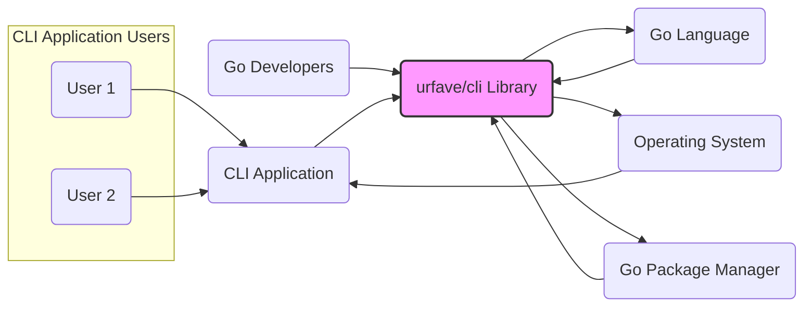
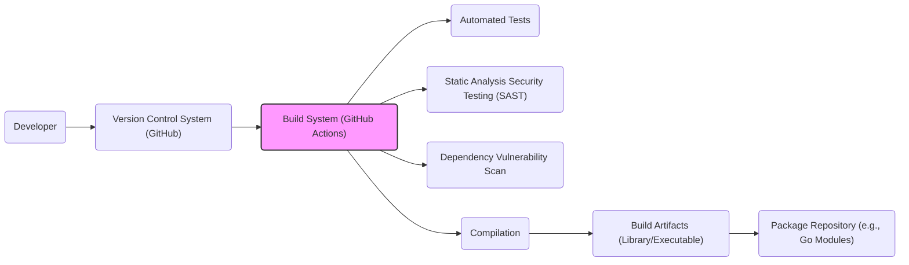

# BUSINESS POSTURE

The urfave/cli repository provides a simple, fast, and fun package for building command line apps in Go. It is designed to make command-line interface development easier and more enjoyable for Go developers.

Business Priorities and Goals:
- Simplify command-line application development in Go.
- Provide a robust and feature-rich library for parsing command-line arguments and options.
- Offer a developer-friendly API that is easy to learn and use.
- Ensure the library is performant and efficient.
- Maintain the library's stability and reliability for widespread adoption.
- Foster a community around the library to encourage contributions and improvements.

Business Risks:
- Vulnerabilities in the library could be exploited by applications using it, leading to security issues in those applications.
- Poorly designed or implemented features could lead to instability or unexpected behavior in applications using the library.
- Lack of maintenance or community support could lead to the library becoming outdated or unusable.
- Incompatibility with future versions of Go or other dependencies could break existing applications.
- Security vulnerabilities introduced through dependencies or build process.

# SECURITY POSTURE

Existing Security Controls:
- security control: Code review process for contributions (inferred from typical open-source project practices).
- security control: Unit and integration testing (inferred from typical software development practices).
- security control: Dependency management using `go.mod` and `go.sum` to track and verify dependencies.
- accepted risk: Reliance on community contributions for security vulnerability identification and patching.
- accepted risk: Potential for vulnerabilities in dependencies that are not directly controlled by the project.

Recommended Security Controls:
- security control: Implement automated static application security testing (SAST) in the CI/CD pipeline to identify potential vulnerabilities in the code.
- security control: Implement dependency vulnerability scanning to identify and address vulnerabilities in third-party libraries.
- security control: Establish a clear process for reporting and handling security vulnerabilities, including a security policy and contact information.
- security control: Regularly update dependencies to incorporate security patches.
- security control: Consider fuzz testing to identify potential input validation vulnerabilities.

Security Requirements:
- Authentication: Not directly applicable to a CLI library itself. Authentication is typically handled by the applications built using the library.
- Authorization: Not directly applicable to a CLI library itself. Authorization is typically handled by the applications built using the library based on parsed commands and options.
- Input Validation: The library must perform robust input validation to prevent vulnerabilities such as command injection or unexpected behavior due to malformed input. This is critical as the library is designed to parse user-provided command-line arguments.
- Cryptography: Not a primary requirement for a CLI parsing library. Cryptographic functionalities would be implemented by applications using the library if needed. However, if the library provides any utilities that involve handling sensitive data (e.g., parsing configuration files with secrets), secure handling of cryptographic keys and data should be considered.

# DESIGN

## C4 CONTEXT



Context Diagram Elements:

- Name: Go Developers
  - Type: Person
  - Description: Software developers who use the urfave/cli library to build command-line applications in the Go programming language.
  - Responsibilities: Utilize the urfave/cli library to create CLI applications, integrate the library into their projects, and contribute to the library's development.
  - Security controls: Secure development practices, code review within their own projects.

- Name: urfave/cli Library
  - Type: Software System
  - Description: A Go library that provides tools and functionalities for building command-line applications. It handles argument parsing, command routing, and help generation.
  - Responsibilities: Provide a robust and easy-to-use API for building CLI applications, parse command-line arguments, handle errors, and generate help documentation.
  - Security controls: Input validation, secure coding practices, vulnerability scanning (recommended).

- Name: Go Language
  - Type: Technology
  - Description: The Go programming language, which is the runtime environment for the urfave/cli library and applications built with it.
  - Responsibilities: Provide the runtime environment for Go applications, manage memory, and execute code.
  - Security controls: Go language security features, standard library security.

- Name: Operating System
  - Type: Technology
  - Description: The operating system on which CLI applications built with urfave/cli are executed. Examples include Linux, macOS, and Windows.
  - Responsibilities: Provide system resources, manage processes, handle file system access, and provide security features like user permissions and process isolation.
  - Security controls: Operating system security features, user access controls, firewalls.

- Name: Go Package Manager
  - Type: Software System
  - Description: Tools like `go mod` used to manage dependencies for Go projects, including downloading and managing the urfave/cli library.
  - Responsibilities: Resolve and download dependencies, manage project dependencies, and ensure dependency integrity.
  - Security controls: Checksum verification of downloaded packages, dependency vulnerability scanning (recommended in development environments).

- Name: CLI Application
  - Type: Software System
  - Description: A command-line application built by Go developers using the urfave/cli library.
  - Responsibilities: Implement specific application logic, interact with users through the command line, and utilize the urfave/cli library for argument parsing and command handling.
  - Security controls: Application-specific security controls, input validation (using urfave/cli and application-level), authorization, authentication (if required by the application).

- Name: CLI Application Users
  - Type: Person
  - Description: End-users who interact with the CLI applications built using the urfave/cli library.
  - Responsibilities: Provide input to CLI applications, execute commands, and consume the output of CLI applications.
  - Security controls: User education on safe usage of CLI applications, principle of least privilege when running applications.

## C4 CONTAINER

```mermaid
flowchart LR
    subgraph "CLI Application"
        CLI_LIB("urfave/cli Library")
        APP_CODE("Application Code")
        CLI_LIB -->> APP_CODE : Uses
    end
    GO_RUNTIME("Go Runtime") --> CLI_LIB
    GO_RUNTIME --> APP_CODE
    USER("User Input") --> APP_CODE : Command Line Args
    APP_CODE --> OS_API("OS API") : System Calls
    style CLI_LIB fill:#f9f,stroke:#333,stroke-width:2px
```

Container Diagram Elements:

- Name: urfave/cli Library
  - Type: Library
  - Description: The core library providing functionalities for command-line argument parsing, command routing, and help generation. Implemented in Go.
  - Responsibilities: Parse command-line arguments, define command structures, handle flags and options, generate help messages, and provide an API for application code to access parsed arguments and commands.
  - Security controls: Input validation within the library to handle potentially malicious or malformed command-line arguments, secure coding practices in library development.

- Name: Application Code
  - Type: Application Component
  - Description: The custom Go code written by developers that utilizes the urfave/cli library to build a specific command-line application. This code implements the application's business logic and uses the parsed arguments from the library.
  - Responsibilities: Implement the core functionality of the CLI application, process user requests based on parsed commands and arguments, interact with other systems or data sources, and handle application-specific errors.
  - Security controls: Input validation (application-level, in addition to library validation), authorization logic, authentication mechanisms (if required), secure handling of sensitive data, output encoding to prevent injection vulnerabilities.

- Name: Go Runtime
  - Type: Runtime Environment
  - Description: The Go runtime environment that executes both the urfave/cli library code and the application code.
  - Responsibilities: Provide the execution environment for Go code, manage memory, handle concurrency, and provide access to system resources.
  - Security controls: Go runtime security features, memory safety, protection against buffer overflows and other memory-related vulnerabilities.

- Name: User Input
  - Type: External Input
  - Description: Command-line arguments provided by the user when running the CLI application.
  - Responsibilities: Provide instructions and data to the CLI application through command-line arguments.
  - Security controls: User education on safe command-line practices, principle of least privilege when running applications.

- Name: OS API
  - Type: System Interface
  - Description: Operating System Application Programming Interface used by the application code to interact with the underlying operating system for tasks like file access, network communication, and process management.
  - Responsibilities: Provide access to operating system functionalities for the application code.
  - Security controls: Operating system security controls, access control lists, system call filtering (potentially at the OS level).

## DEPLOYMENT

Deployment of a library like `urfave/cli` is not about deploying the library itself, but rather deploying applications that *use* the library. CLI applications built with `urfave/cli` can be deployed in various ways depending on their purpose and target environment. Common deployment methods include:

- **Standalone Executables:** Compiling the Go application into a single executable binary that can be distributed and run on target operating systems. This is the most common deployment method for CLI tools.
- **Containerized Deployment (Docker):** Packaging the CLI application within a Docker container for consistent execution across different environments. This is suitable for more complex applications or when environment isolation is required.
- **Package Managers (OS-specific):** Distributing the CLI application through operating system package managers (e.g., apt, yum, brew) for easier installation and updates on specific platforms.
- **Cloud Functions/Serverless:** In some cases, CLI-like functionality can be adapted and deployed as serverless functions in cloud environments, triggered by events or API calls.

For simplicity, let's focus on the **Standalone Executables** deployment scenario.

```mermaid
flowchart LR
    subgraph "Deployment Environment"
        HOST_OS("Operating System")
        HARDWARE("Server/Desktop Hardware")
        EXECUTABLE("CLI Application Executable")
        HOST_OS --> EXECUTABLE : Runs on
        HARDWARE --> HOST_OS
    end
    USER("End User") --> EXECUTABLE : Executes
    INTERNET("Internet (Optional)") -.-> EXECUTABLE : Updates/Data
    style EXECUTABLE fill:#f9f,stroke:#333,stroke-width:2px
```

Deployment Diagram Elements (Standalone Executable):

- Name: CLI Application Executable
  - Type: Software Artifact
  - Description: A compiled, standalone executable binary of the CLI application built using urfave/cli. Contains all necessary code to run the application.
  - Responsibilities: Execute the CLI application logic when run by a user, process command-line arguments, and interact with the operating system.
  - Security controls: Code signing of the executable, distribution through secure channels (HTTPS), application-level security controls embedded within the executable.

- Name: Operating System
  - Type: Infrastructure Software
  - Description: The operating system (e.g., Linux, macOS, Windows) on the target machine where the CLI application is deployed and executed.
  - Responsibilities: Provide the runtime environment for the executable, manage system resources, and enforce security policies.
  - Security controls: Operating system security hardening, access control lists, firewalls, security updates.

- Name: Server/Desktop Hardware
  - Type: Infrastructure Hardware
  - Description: The physical or virtual hardware (servers, desktops, laptops) where the operating system and the CLI application executable are hosted.
  - Responsibilities: Provide the physical resources (CPU, memory, storage) for the operating system and the application to run.
  - Security controls: Physical security of the hardware, hardware-level security features (e.g., TPM, secure boot).

- Name: End User
  - Type: Person
  - Description: The user who downloads, installs, and executes the CLI application executable on their machine.
  - Responsibilities: Run the executable, provide command-line input, and use the application's functionality.
  - Security controls: User awareness of downloading executables from trusted sources, running executables with appropriate privileges.

- Name: Internet (Optional)
  - Type: Network
  - Description: The internet network, which may be used by the CLI application for optional functionalities like updates, downloading data, or communicating with remote services.
  - Responsibilities: Provide network connectivity for optional application features.
  - Security controls: HTTPS for secure communication, input validation for data received from the internet, network firewalls.

## BUILD

The build process for the `urfave/cli` library itself, and for applications using it, typically involves the following steps:



Build Process Elements:

- Name: Developer
  - Type: Person
  - Description: A software developer who writes and modifies the code for the urfave/cli library or applications using it.
  - Responsibilities: Write code, commit changes to version control, and potentially trigger build processes.
  - Security controls: Secure coding practices, code review, local development environment security.

- Name: Version Control System (GitHub)
  - Type: Software System
  - Description: GitHub repository hosting the source code of the urfave/cli library.
  - Responsibilities: Store and manage source code, track changes, facilitate collaboration, and trigger CI/CD pipelines.
  - Security controls: Access control to the repository, branch protection, audit logs, two-factor authentication for developers.

- Name: Build System (GitHub Actions)
  - Type: Automation System
  - Description: GitHub Actions or similar CI/CD system used to automate the build, test, and security checks for the project.
  - Responsibilities: Automate build process, run tests, perform security scans, compile code, and generate build artifacts.
  - Security controls: Secure configuration of CI/CD pipelines, access control to CI/CD system, secrets management for credentials, isolation of build environments.

- Name: Automated Tests
  - Type: Software Component
  - Description: Unit tests, integration tests, and other automated tests designed to verify the functionality and correctness of the code.
  - Responsibilities: Detect functional regressions, ensure code quality, and provide confidence in the software.
  - Security controls: Test coverage for security-relevant functionalities, regular execution of tests in CI/CD.

- Name: Static Analysis Security Testing (SAST)
  - Type: Security Tool
  - Description: SAST tools used to automatically scan the source code for potential security vulnerabilities (e.g., code flaws, injection vulnerabilities).
  - Responsibilities: Identify potential security vulnerabilities early in the development lifecycle.
  - Security controls: Integration into CI/CD pipeline, regular scans, configuration to detect relevant vulnerability types.

- Name: Dependency Vulnerability Scan
  - Type: Security Tool
  - Description: Tools that scan project dependencies for known security vulnerabilities.
  - Responsibilities: Identify vulnerable dependencies and alert developers to update or mitigate them.
  - Security controls: Integration into CI/CD pipeline, regular scans, automated alerts for vulnerable dependencies.

- Name: Compilation
  - Type: Build Process
  - Description: The process of compiling the Go source code into executable binaries or library packages.
  - Responsibilities: Translate source code into machine code, optimize code for performance, and generate build artifacts.
  - Security controls: Secure compiler toolchain, build environment integrity, prevention of supply chain attacks during compilation.

- Name: Build Artifacts (Library/Executable)
  - Type: Software Artifact
  - Description: The output of the build process, which can be a library package (for urfave/cli itself) or an executable binary (for applications using it).
  - Responsibilities: Package the compiled code and necessary resources for distribution and deployment.
  - Security controls: Integrity checks (checksums) for build artifacts, secure storage and distribution of artifacts.

- Name: Package Repository (e.g., Go Modules)
  - Type: Software System
  - Description: A repository where the built library package is published and made available for developers to download and use (e.g., Go Modules registry).
  - Responsibilities: Host and distribute the library package, manage versions, and ensure package availability.
  - Security controls: Secure repository infrastructure, access control, package signing, vulnerability scanning of hosted packages.

# RISK ASSESSMENT

Critical Business Processes:
- Development and maintenance of the `urfave/cli` library itself.
- Usage of the `urfave/cli` library by developers to build CLI applications.
- Distribution and consumption of CLI applications built with `urfave/cli`.

Data to Protect and Sensitivity:
- Source code of the `urfave/cli` library: High sensitivity. Compromise could lead to vulnerabilities being introduced into the library and propagated to many applications.
- Build artifacts (library packages, executables): Medium sensitivity. Integrity is important to ensure users are downloading and using legitimate and uncompromised versions.
- Dependency information: Low to Medium sensitivity. Knowing dependencies can help attackers identify potential vulnerabilities, but this information is often publicly available.

# QUESTIONS & ASSUMPTIONS

Questions:
- What is the process for reporting and handling security vulnerabilities in `urfave/cli`? Is there a security policy or contact information available?
- Are there any existing automated security scans (SAST, dependency scanning) in the project's CI/CD pipeline?
- What is the process for reviewing and merging code contributions, especially from external contributors?
- Are there any specific security considerations or threat models that have been previously considered for `urfave/cli`?

Assumptions:
- The project aims to follow secure coding practices in general software development.
- Code contributions are reviewed before being merged, although the depth and rigor of security-focused reviews are unknown.
- The project relies on the Go language's inherent security features and standard library security.
- The primary users of this design document are interested in understanding the security posture of applications built using `urfave/cli`, and potentially the library itself.
- The business posture is focused on providing a useful and reliable tool for the Go developer community, with security being an important but potentially secondary consideration compared to functionality and ease of use for a library of this nature.