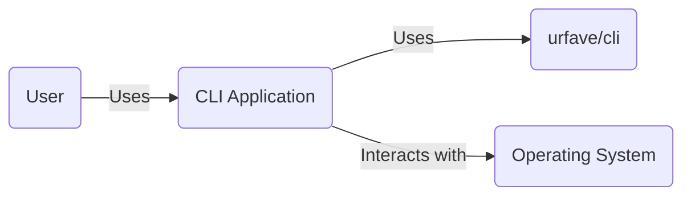
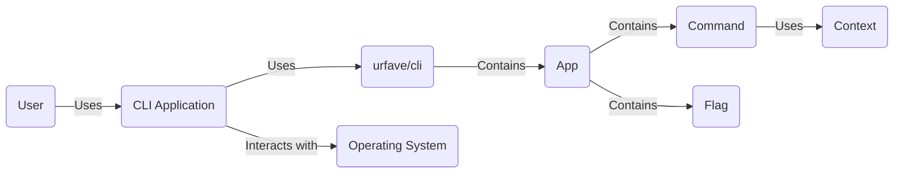
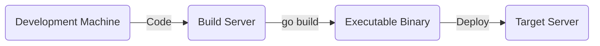
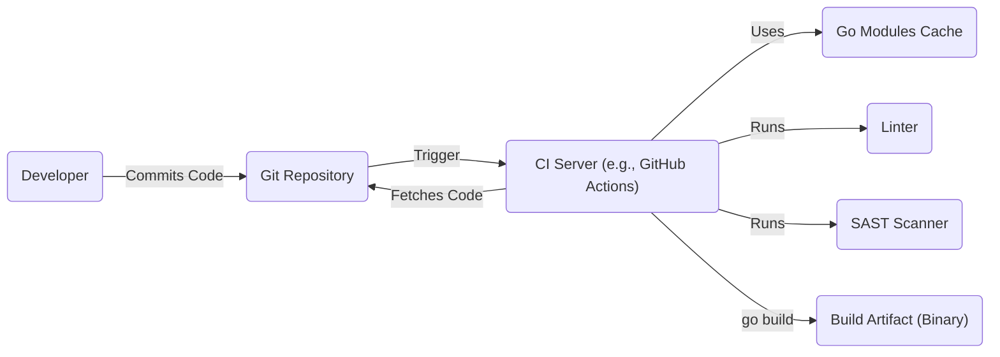

# BUSINESS POSTURE

Business Priorities and Goals:

*   Provide a simple, fast, and fun package for building command-line applications in Go.
*   Enable developers to create elegant and user-friendly command-line interfaces (CLIs) with minimal effort.
*   Offer a flexible and extensible framework that supports various CLI features like flags, subcommands, and argument parsing.
*   Maintain a well-documented and actively maintained project to ensure ease of use and community support.
*   Reduce development time for creating command-line tools.
*   Improve the user experience of interacting with command-line tools.

Most Important Business Risks:

*   Malicious code injection through compromised dependencies or build processes, leading to supply chain attacks.
*   Vulnerabilities in the library that could be exploited by attackers to gain unauthorized access or control over systems using the CLI application.
*   Insecure handling of user inputs, potentially leading to command injection or other injection attacks.
*   Lack of proper documentation or support, hindering adoption and increasing the risk of misuse.
*   Lack of input validation, leading to unexpected behavior or crashes.

# SECURITY POSTURE

Existing Security Controls:

*   security control: Dependency management: The project uses Go Modules (go.mod and go.sum) to manage dependencies and ensure version pinning, mitigating some supply chain risks. (Described in go.mod and go.sum files)
*   security control: Code reviews: Contributions are subject to code review before merging, reducing the risk of introducing vulnerabilities. (Described in GitHub pull request process)
*   security control: Testing: The project includes unit tests and integration tests to verify functionality and prevent regressions. (Described in \_test.go files)
*   security control: Community vigilance: A large and active user base helps identify and report potential security issues. (Described in GitHub issues and discussions)

Accepted Risks:

*   accepted risk: The library relies on external dependencies, which may introduce vulnerabilities beyond the project's direct control.
*   accepted risk: The library's primary focus is on functionality and ease of use, and while security is considered, it may not be as hardened as specialized security libraries.

Recommended Security Controls:

*   security control: Implement regular security audits and penetration testing to identify and address potential vulnerabilities.
*   security control: Integrate static application security testing (SAST) tools into the build process to automatically detect common security flaws.
*   security control: Implement dynamic application security testing (DAST) to assess the running application for vulnerabilities.
*   security control: Consider adopting a Software Bill of Materials (SBOM) to track and manage all components and dependencies.
*   security control: Provide clear security guidelines and best practices for developers using the library.

Security Requirements:

*   Authentication: Not directly applicable, as this is a CLI library, not an application with user accounts. Authentication is the responsibility of applications built using this library.
*   Authorization: Not directly applicable, as this is a CLI library. Authorization is the responsibility of applications built using this library.
*   Input Validation:
    *   The library should provide mechanisms for validating user inputs, such as flags and arguments, to prevent common injection attacks.
    *   Input validation should be configurable and extensible to allow developers to define custom validation rules.
    *   The library should provide clear error messages when input validation fails.
*   Cryptography:
    *   If the library handles sensitive data, it should use appropriate cryptographic algorithms and libraries to protect that data.
    *   Cryptographic keys should be managed securely.
    *   The library should not implement its own cryptographic primitives but rely on well-vetted libraries.
*   Error Handling:
    *   The library should handle errors gracefully and provide informative error messages to the user.
    *   Error messages should not reveal sensitive information about the system.

# DESIGN

## C4 CONTEXT

Element Descriptions:

*   Element:
    *   Name: User
    *   Type: Person
    *   Description: A person who interacts with the CLI application.
    *   Responsibilities: Provides input to the CLI application, views output from the CLI application.
    *   Security controls: None (external to the system).

*   Element:
    *   Name: CLI Application
    *   Type: Software System
    *   Description: A command-line application built using the urfave/cli library.
    *   Responsibilities: Parses command-line arguments and flags, executes commands, interacts with the operating system.
    *   Security controls: Input validation, error handling, any application-specific security controls implemented by the developer.

*   Element:
    *   Name: urfave/cli
    *   Type: Library
    *   Description: The urfave/cli library for building command-line applications in Go.
    *   Responsibilities: Provides a framework for defining commands, flags, and arguments, handles parsing of command-line inputs.
    *   Security controls: Input validation helpers, error handling.

*   Element:
    *   Name: Operating System
    *   Type: System
    *   Description: The underlying operating system on which the CLI application runs.
    *   Responsibilities: Provides system resources, executes system calls.
    *   Security controls: OS-level security controls (e.g., file permissions, user accounts).

## C4 CONTAINER

Element Descriptions:

*   Element:
    *   Name: User
    *   Type: Person
    *   Description: A person who interacts with the CLI application.
    *   Responsibilities: Provides input to the CLI application, views output from the CLI application.
    *   Security controls: None (external to the system).

*   Element:
    *   Name: CLI Application
    *   Type: Software System
    *   Description: A command-line application built using the urfave/cli library.
    *   Responsibilities: Parses command-line arguments and flags, executes commands, interacts with the operating system.
    *   Security controls: Input validation, error handling, any application-specific security controls implemented by the developer.

*   Element:
    *   Name: urfave/cli
    *   Type: Library
    *   Description: The urfave/cli library.
    *   Responsibilities: Provides building blocks for CLI applications.
    *   Security controls: Input validation helpers, error handling.

*   Element:
    *   Name: App
    *   Type: Container
    *   Description: Represents the main application instance.
    *   Responsibilities: Initializes the application, defines commands and flags, starts the application.
    *   Security controls: Entry point for security configurations.

*   Element:
    *   Name: Command
    *   Type: Container
    *   Description: Represents a specific command within the application.
    *   Responsibilities: Executes the logic associated with the command.
    *   Security controls: Command-specific input validation and security checks.

*   Element:
    *   Name: Flag
    *   Type: Container
    *   Description: Represents a command-line flag.
    *   Responsibilities: Stores flag values, performs flag-specific validation.
    *   Security controls: Input validation for flag values.

*   Element:
    *   Name: Context
    *   Type: Container
    *   Description: Provides contextual information to commands, such as flag values and arguments.
    *   Responsibilities: Holds parsed input data.
    *   Security controls: Can be used to enforce access control based on context.

*   Element:
    *   Name: Operating System
    *   Type: System
    *   Description: The underlying operating system.
    *   Responsibilities: Provides system resources.
    *   Security controls: OS-level security.

## DEPLOYMENT

Possible Deployment Solutions:

1.  Standalone Binary: Compile the Go application into a single executable binary for the target operating system and architecture. This is the most common and simplest deployment method.
2.  Containerization (Docker): Package the application and its dependencies into a Docker container. This provides portability and consistency across different environments.
3.  Cloud-Specific Deployments (e.g., AWS Lambda, Google Cloud Functions): Deploy the application as a serverless function. This requires adapting the application to the specific cloud provider's requirements.

Chosen Solution (Standalone Binary):

Element Descriptions:

*   Element:
    *   Name: Development Machine
    *   Type: Workstation
    *   Description: The developer's local machine where the code is written and tested.
    *   Responsibilities: Code development, local testing.
    *   Security controls: Local security measures (e.g., firewall, antivirus).

*   Element:
    *   Name: Build Server
    *   Type: Server
    *   Description: A server responsible for building the executable binary. This could be a dedicated build server or a CI/CD pipeline.
    *   Responsibilities: Compiling the code, running tests, creating the binary.
    *   Security controls: Access control, secure build environment, dependency scanning.

*   Element:
    *   Name: Executable Binary
    *   Type: File
    *   Description: The compiled Go application.
    *   Responsibilities: Runs the CLI application.
    *   Security controls: Code signing (optional).

*   Element:
    *   Name: Target Server
    *   Type: Server
    *   Description: The server where the CLI application will be deployed and executed.
    *   Responsibilities: Running the CLI application.
    *   Security controls: OS-level security, network security, access control.

## BUILD

Build Process Description:

1.  Developer commits code to the Git repository (e.g., GitHub).
2.  A commit to the repository triggers the CI server (e.g., GitHub Actions, Jenkins).
3.  The CI server fetches the code from the repository.
4.  The CI server uses Go Modules to download and cache dependencies.
5.  The CI server runs a linter (e.g., golangci-lint) to check for code style and potential errors.
6.  The CI server runs a SAST scanner (e.g., GoSec) to identify potential security vulnerabilities in the code.
7.  If all checks pass, the CI server runs `go build` to compile the code into an executable binary (the build artifact).
8.  The build artifact can then be deployed to the target environment.

Security Controls in Build Process:

*   Dependency Management: Go Modules ensures that dependencies are tracked and versioned, reducing the risk of using vulnerable or compromised packages.
*   Linting: Linters help enforce code style and identify potential errors, which can indirectly improve security by reducing the likelihood of bugs.
*   Static Application Security Testing (SAST): SAST scanners analyze the source code for potential security vulnerabilities, such as injection flaws, buffer overflows, and insecure configurations.
*   CI/CD Pipeline: Automating the build process through a CI/CD pipeline ensures consistency and reduces the risk of manual errors.
*   Build Artifact Verification: (Optional) The build artifact can be signed to ensure its integrity and authenticity.

# RISK ASSESSMENT

Critical Business Processes:

*   Providing a reliable and functional CLI framework for developers.
*   Maintaining the reputation and trust of the urfave/cli project.
*   Ensuring the security of applications built using the library.

Data to Protect and Sensitivity:

*   Source code: The source code of the urfave/cli library itself is publicly available, but its integrity is crucial. Unauthorized modifications could introduce vulnerabilities. Sensitivity: Medium (due to potential impact on downstream applications).
*   Dependencies: The list of dependencies and their versions (go.mod and go.sum) is critical. Compromised dependencies could lead to supply chain attacks. Sensitivity: High.
*   User Input (in applications built *using* the library): Applications built with urfave/cli may handle sensitive user input. The library itself doesn't store this data, but it's crucial for developers using the library to handle it securely. Sensitivity: Varies depending on the application.

# QUESTIONS & ASSUMPTIONS

Questions:

*   Are there any specific compliance requirements (e.g., GDPR, HIPAA) that applications built using this library are expected to meet?
*   What is the expected threat model for applications built using this library? (e.g., Who are the potential attackers, and what are their motivations?)
*   What level of security expertise is expected from developers using this library?
*   Are there any plans to integrate fuzz testing into the development process?

Assumptions:

*   BUSINESS POSTURE: The primary goal is to provide a user-friendly and functional CLI library. Security is a concern, but not the absolute top priority.
*   SECURITY POSTURE: Developers using the library are expected to have some basic security awareness and implement appropriate security measures in their applications.
*   DESIGN: The library is primarily used for building standalone CLI applications, not long-running services or network-facing applications.
*   The project is open source and community-driven.
*   The build process will use Go Modules for dependency management.
*   A CI/CD system will be used for automated builds and testing.