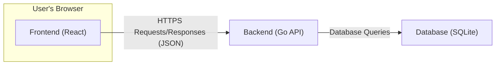
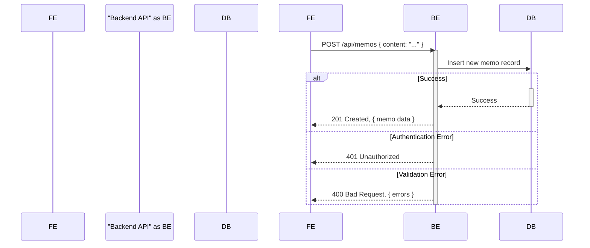
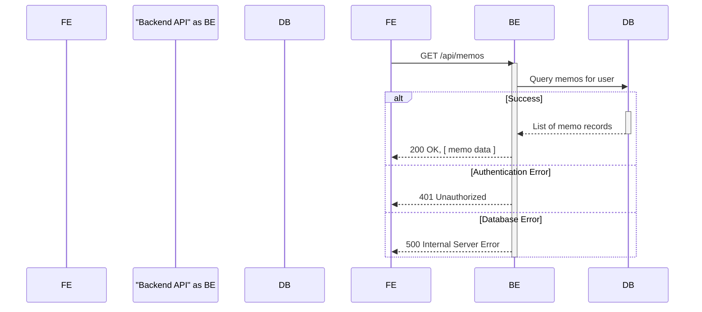
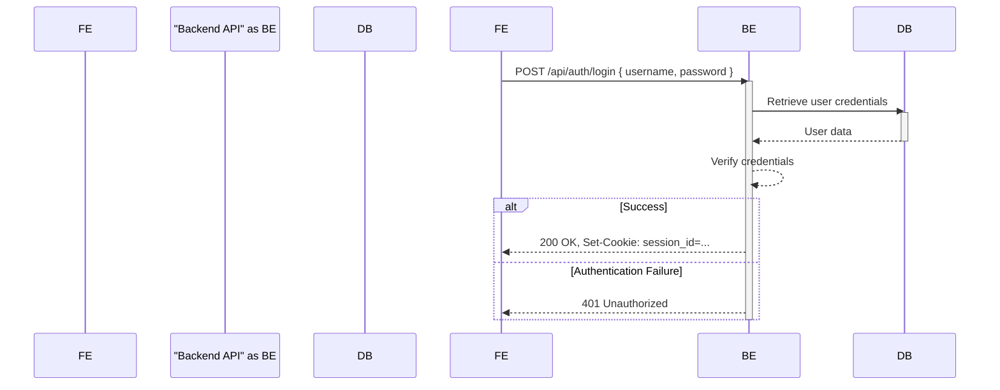

## Project Design Document: Memos - A Privacy-Focused Note-Taking Application

**Version:** 1.1
**Date:** October 26, 2023
**Author:** AI Software Architect

### 1. Introduction

This document outlines the improved design of the Memos project, a privacy-focused, open-source note-taking application. This document serves as a foundation for understanding the system's architecture, components, and data flow, which will be crucial for subsequent threat modeling activities. The design is based on the publicly available codebase at [https://github.com/usememos/memos](https://github.com/usememos/memos). This version expands on the initial design with more detail and clarity.

### 2. Goals

* Provide a clear and concise overview of the Memos application architecture.
* Identify key components and their interactions with greater detail.
* Describe the data flow within the system, including potential error scenarios.
* Highlight initial security considerations relevant for threat modeling, with more specific examples.
* Outline deployment considerations.

### 3. High-Level Architecture

Memos follows a typical client-server architecture. The core components are:

* **Frontend:** A web application providing the user interface for interacting with memos, likely a Single Page Application (SPA).
* **Backend:** An API server responsible for handling requests from the frontend, managing data, and enforcing business logic.
* **Database:** A persistent storage mechanism for storing memos, user data, and other application state.

### 4. Component Details

#### 4.1. Frontend

* **Technology:** Primarily built using React.js, potentially utilizing state management libraries like Zustand or Redux.
* **Responsibilities:**
    * Rendering the user interface components for creating, reading, updating, and deleting memos.
    * Handling user interactions (e.g., button clicks, form submissions, keyboard events).
    * Making asynchronous HTTPS API calls to the backend to fetch and manipulate data, typically using `fetch` or `axios`.
    * Managing user sessions and authentication state, likely through browser cookies (with `HttpOnly` and `Secure` flags) or local storage for short-lived tokens.
    * Implementing client-side routing and navigation.
    * Potentially handling some client-side validation of user input.
* **Key Considerations for Threat Modeling:**
    * Potential for Cross-Site Scripting (XSS) vulnerabilities if user-generated content is not properly sanitized before rendering. This includes both stored XSS (from the database) and reflected XSS (from URL parameters).
    * Security of API keys or tokens if stored client-side (local storage is generally less secure than `HttpOnly` cookies).
    * Vulnerabilities in third-party JavaScript libraries used (e.g., outdated libraries with known security flaws).
    * Risk of Cross-Site Request Forgery (CSRF) if proper anti-CSRF tokens are not implemented.
    * Potential for exposing sensitive information through client-side debugging or browser extensions.

#### 4.2. Backend

* **Technology:** Developed using Go, likely utilizing a web framework like Gin or Echo for routing and middleware.
* **Responsibilities:**
    * Exposing a RESTful API (or similar) for the frontend to interact with, defining endpoints for memo management, user authentication, and potentially other features.
    * Handling user authentication (e.g., verifying credentials against a database) and authorization (e.g., ensuring users can only access their own memos).
    * Implementing core business logic for memo management, including data validation, processing, and manipulation.
    * Interacting with the SQLite database to persist and retrieve data using libraries like `database/sql` or an ORM.
    * Potentially handling file uploads (attachments) with appropriate security measures (e.g., content type validation, size limits, storage in a secure location).
    * Implementing middleware for tasks like logging, authentication, and request processing.
* **Key Considerations for Threat Modeling:**
    * Authentication and authorization flaws allowing unauthorized access or manipulation of data (e.g., broken authentication, insecure direct object references).
    * API endpoint vulnerabilities such as injection attacks (SQL injection if dynamic queries are used without proper sanitization, command injection if executing external commands based on user input), and mass assignment vulnerabilities.
    * Input validation issues on the backend leading to data corruption, denial-of-service, or security breaches. This includes validating data types, formats, and ranges.
    * Secure handling of file uploads to prevent malicious file execution (e.g., virus scanning, preventing execution of uploaded scripts).
    * Rate limiting and request throttling to prevent denial-of-service attacks and brute-force attempts.
    * Secure handling of sensitive data like passwords (using strong hashing algorithms like bcrypt).
    * Proper error handling to avoid leaking sensitive information in error messages.

#### 4.3. Database

* **Technology:** Uses SQLite, a file-based database.
* **Responsibilities:**
    * Persistently storing memos, user accounts (usernames, hashed passwords, potentially email addresses), and potentially other application settings and metadata.
    * Providing mechanisms for querying and managing data through SQL.
    * Ensuring data integrity and consistency.
* **Key Considerations for Threat Modeling:**
    * SQL injection vulnerabilities if user input is directly incorporated into SQL queries without proper parameterization or escaping.
    * Security of the database file itself: access controls on the file system to prevent unauthorized access or modification. If deployed in a shared environment, the database file needs to be protected.
    * Lack of built-in encryption at rest in standard SQLite, requiring consideration for file system level encryption if data sensitivity warrants it.
    * Backup and recovery mechanisms are crucial to prevent data loss.
    * Potential for denial-of-service if the database file becomes corrupted or if there are performance issues due to unoptimized queries.

### 5. Data Flow

The following outlines the typical data flow for common user actions, including potential error scenarios:

#### 5.1. Creating a Memo

1. User enters memo content in the frontend.
2. Frontend sends an HTTPS POST request to the backend API (e.g., `/api/memos`) with the memo content in the request body (likely as JSON).
3. The backend API authenticates the user (e.g., by verifying a session cookie or bearer token).
4. The backend validates the input data (e.g., checking for empty content, maximum length).
5. **Success:** The backend creates a new record in the database with the memo content and associated metadata (e.g., timestamp, user ID).
6. **Success:** The backend sends an HTTPS response (e.g., 201 Created) back to the frontend, potentially including the newly created memo object in the response body.
7. **Error:** If authentication fails, the backend returns a 401 Unauthorized response.
8. **Error:** If validation fails, the backend returns a 400 Bad Request response with details about the validation errors.
9. The frontend updates the UI to display the new memo or displays an error message to the user.

#### 5.2. Retrieving Memos

1. User navigates to the memo list view in the frontend.
2. Frontend sends an HTTPS GET request to the backend API (e.g., `/api/memos`).
3. The backend API authenticates the user.
4. The backend queries the database for memos associated with the user (potentially with filtering, sorting, or pagination parameters).
5. **Success:** The database returns the requested memo records to the backend.
6. **Success:** The backend sends an HTTPS response (e.g., 200 OK) back to the frontend, containing the list of memos in the response body (likely as JSON).
7. **Error:** If authentication fails, the backend returns a 401 Unauthorized response.
8. **Error:** If there's a database error, the backend might return a 500 Internal Server Error.
9. The frontend renders the list of memos in the UI or displays an error message.

#### 5.3. User Authentication

1. User provides login credentials (username/password) in the frontend.
2. Frontend sends an HTTPS POST request to the backend API (e.g., `/api/auth/login`) with the credentials in the request body.
3. The backend API receives the credentials.
4. The backend queries the database to retrieve the user's stored credentials (hashed password).
5. The backend verifies the provided password against the stored hashed password.
6. **Success:** If authentication is successful, the backend creates a session (e.g., storing a session ID in memory or a database) or issues a token (e.g., a JWT).
7. **Success:** The backend sends an HTTPS response (e.g., 200 OK) back to the frontend, potentially including a `Set-Cookie` header with the session ID (with `HttpOnly` and `Secure` flags) or the authentication token in the response body.
8. **Error:** If authentication fails (invalid credentials), the backend returns a 401 Unauthorized response.
9. The frontend stores the session information (e.g., the cookie is automatically handled by the browser) or the token for subsequent requests.

### 6. Security Considerations (Detailed)

This section expands on the initial security considerations, providing more specific examples of potential threats.

* **Authentication and Authorization:**
    * **Threat:** Brute-force attacks on login endpoints to guess user passwords. **Mitigation:** Implement rate limiting and account lockout mechanisms.
    * **Threat:** Session fixation attacks if session IDs are predictable or exposed in URLs. **Mitigation:** Use strong, randomly generated session IDs and regenerate them after login.
    * **Threat:** Insecure password storage if passwords are not properly hashed and salted. **Mitigation:** Use strong, well-vetted hashing algorithms like bcrypt or Argon2.
    * **Threat:** Privilege escalation if authorization checks are flawed, allowing users to access or modify data they shouldn't. **Mitigation:** Implement robust role-based access control (RBAC) or attribute-based access control (ABAC).
    * **Threat:** Lack of HTTPS leading to credentials being transmitted in plaintext. **Mitigation:** Enforce HTTPS for all communication.

* **Data Security:**
    * **Threat:** Man-in-the-middle (MITM) attacks if HTTPS is not used, allowing attackers to intercept and potentially modify data in transit. **Mitigation:** Enforce HTTPS and use HSTS headers.
    * **Threat:** Exposure of sensitive data in error messages or logs. **Mitigation:** Implement proper error handling and logging practices, avoiding the inclusion of sensitive information.
    * **Threat:** Unauthorized access to the SQLite database file if file permissions are not properly configured. **Mitigation:** Restrict file system permissions to the application user. Consider file system level encryption.
    * **Threat:** Data breaches due to SQL injection vulnerabilities. **Mitigation:** Use parameterized queries or ORMs to prevent the injection of malicious SQL code.

* **Input Validation:**
    * **Threat:** Cross-Site Scripting (XSS) attacks if user-provided content is rendered without proper sanitization. **Mitigation:** Sanitize user input on both the frontend and backend before rendering it in the UI. Use context-aware output encoding.
    * **Threat:** SQL injection attacks if user input is directly used in database queries. **Mitigation:** Use parameterized queries or ORMs.
    * **Threat:** Command injection attacks if the application executes system commands based on user input. **Mitigation:** Avoid executing system commands based on user input. If necessary, carefully sanitize and validate the input.
    * **Threat:** Buffer overflow vulnerabilities if input validation does not prevent excessively long inputs. **Mitigation:** Enforce limits on input sizes.

* **API Security:**
    * **Threat:** Lack of authentication on API endpoints allowing unauthorized access. **Mitigation:** Implement authentication middleware for all sensitive API endpoints.
    * **Threat:** Cross-Site Request Forgery (CSRF) attacks if the backend does not verify the origin of requests. **Mitigation:** Implement anti-CSRF tokens.
    * **Threat:** Denial-of-service (DoS) attacks by overwhelming the API with requests. **Mitigation:** Implement rate limiting and request throttling.

* **Frontend Security:**
    * **Threat:** Dependency vulnerabilities in third-party JavaScript libraries. **Mitigation:** Regularly update dependencies and use tools to scan for known vulnerabilities. Implement a Content Security Policy (CSP) to mitigate certain types of attacks.
    * **Threat:** Leaking sensitive information through client-side JavaScript code or debugging tools. **Mitigation:** Avoid storing sensitive information directly in client-side code.

* **Database Security:**
    * **Threat:** Unauthorized access to the database server if it's exposed to the internet. **Mitigation:** Ensure the database server is not directly accessible from the internet and is behind a firewall.
    * **Threat:** Data loss due to lack of backups. **Mitigation:** Implement regular database backup and recovery procedures.

### 7. Deployment Considerations

* **Environment:** Memos can be deployed on various platforms, including:
    * **Self-hosted:** Running directly on a server or virtual machine.
    * **Containerized:** Using Docker and container orchestration platforms like Kubernetes.
    * **Platform-as-a-Service (PaaS):** Services like Heroku or Railway.
* **Database Location:** The SQLite database file will reside on the same server or within the container as the backend application. Security of the host system is crucial.
* **Reverse Proxy:** A reverse proxy (e.g., Nginx, Apache) is recommended for handling SSL termination, load balancing, and routing requests to the backend application.
* **Security Best Practices:** Ensure the deployment environment is hardened according to security best practices, including regular security updates and firewall configurations.

### 8. Assumptions and Constraints

* This design document assumes a standard web application deployment model.
* The analysis is based on the publicly available information and may not reflect all internal implementation details.
* The use of SQLite as the database has implications for scalability and concurrency in high-traffic scenarios.
* Security considerations are based on common web application vulnerabilities and best practices. A thorough security audit and penetration testing are recommended.

### 9. Future Considerations

* **Scalability:** Consider migrating to a more scalable database solution (e.g., PostgreSQL, MySQL) if the user base grows significantly.
* **Monitoring and Logging:** Implement comprehensive monitoring and logging to detect and respond to security incidents and performance issues.
* **Security Audits:** Conduct regular security audits and penetration testing to identify and address potential vulnerabilities.
* **Feature Enhancements:** Future features might introduce new security considerations that need to be addressed.