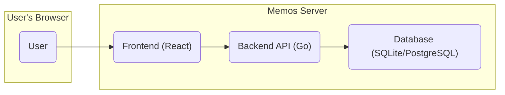
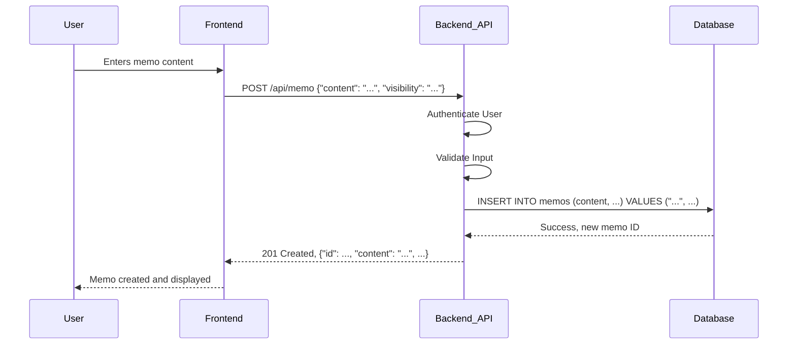
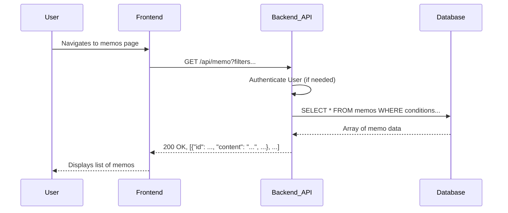
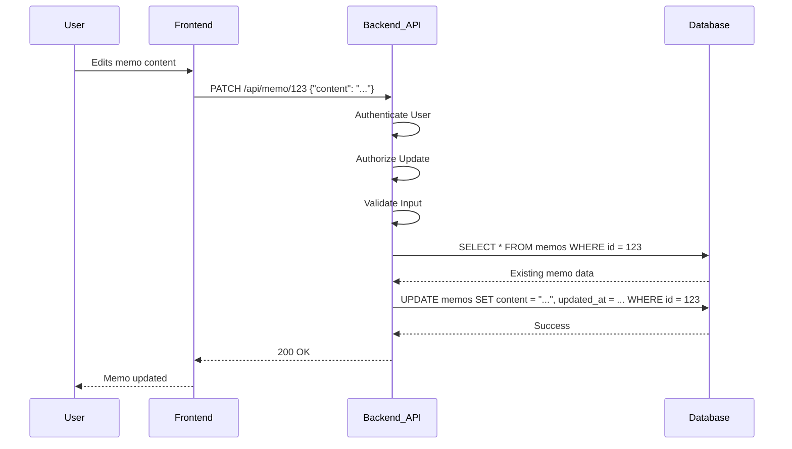
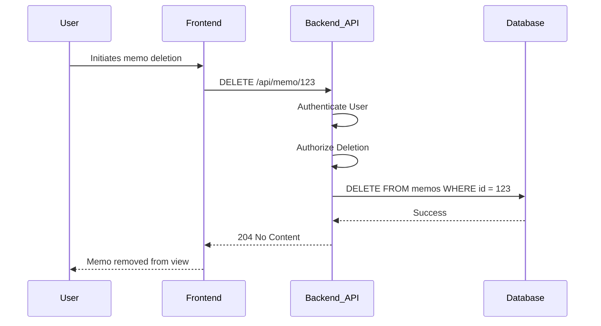
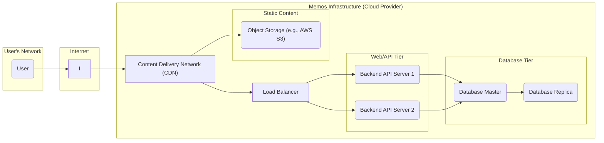

# Project Design Document: Memos

**Version:** 1.1
**Date:** October 26, 2023
**Prepared By:** [Your Name/Organization]

## 1. Introduction

This document provides a detailed design overview of the Memos project, an open-source, privacy-first, lightweight note-taking service. This document aims to clearly articulate the system's architecture, components, and data flow to facilitate subsequent threat modeling activities. This version includes more detail on component responsibilities and potential security considerations.

## 2. Goals and Objectives

*   Provide a clear and comprehensive description of the Memos system architecture.
*   Identify key components and their specific responsibilities and technologies.
*   Outline the data flow within the system, including API interactions.
*   Serve as a robust foundation for identifying potential security vulnerabilities during threat modeling.

## 3. Target Audience

This document is intended for:

*   Security engineers and architects involved in threat modeling and security assessments.
*   Developers actively contributing to the Memos project.
*   Operations teams responsible for deploying, maintaining, and scaling Memos instances.

## 4. System Architecture

The Memos application employs a standard three-tier architecture, promoting separation of concerns:

*   **Presentation Tier (Frontend):**  The user interface, providing users with a way to interact with the application. This is a Single Page Application (SPA) primarily built with React.
*   **Application Tier (Backend API):**  The core logic of the application, handling requests from the frontend, interacting with the data storage, enforcing business rules, and managing authentication and authorization. This is a Go-based RESTful API, likely utilizing a framework such as Gin or Echo.
*   **Data Tier (Database):**  Responsible for the persistent storage of application data, including memo content, user accounts, and related metadata. Memos currently supports SQLite for simpler deployments and PostgreSQL for more robust setups.

## 5. Data Flow

The following details the data flow for key user actions, including specific API endpoints and data exchanged.

### 5.1. Creating a Memo

1. The user enters memo content and visibility settings in the frontend UI.
2. The frontend sends an HTTP POST request to the backend API endpoint `/api/memo`.
    *   Request Body (example): `{"content": "My new memo", "visibility": "public"}`
3. The backend API receives the request, authenticates the user (verifying a valid session or token), and validates the request body against expected schema and constraints.
4. The backend API interacts with the database to insert a new record into the `memos` table.
    *   Data inserted might include: `content`, `creator_id`, `created_at`, `updated_at`, `visibility`.
5. The database stores the memo data and returns a success confirmation to the backend API.
6. The backend API sends an HTTP 201 Created response back to the frontend, often including the newly created memo's ID.
    *   Response Body (example): `{"id": 123, "content": "My new memo", "visibility": "public", ...}`
7. The frontend updates the user interface to display the newly created memo, potentially adding it to the list of visible memos.

### 5.2. Reading Memos

1. The user navigates to a page displaying memos or performs a search.
2. The frontend sends an HTTP GET request to the backend API. Examples:
    *   `/api/memo`: To retrieve a list of memos based on default or user-defined filters.
    *   `/api/memo?creatorId=456`: To retrieve memos created by a specific user.
    *   `/api/memo?visibility=public`: To retrieve all public memos.
3. The backend API receives the request, authenticates the user (if necessary, depending on the requested memos' visibility), and parses any query parameters to determine the filtering criteria.
4. The backend API queries the database to retrieve the requested memos from the `memos` table, applying the specified filters.
5. The database returns the matching memo data to the backend API.
6. The backend API processes the data (e.g., formatting, filtering sensitive information if necessary) and sends it as an HTTP 200 OK response to the frontend.
    *   Response Body (example): `[{"id": 123, "content": "...", "visibility": "public", ...}, {"id": 124, "content": "...", ...}]`
7. The frontend renders the received memos in the user interface, displaying the content and relevant metadata.

### 5.3. Updating a Memo

1. The user edits an existing memo in the frontend UI.
2. The frontend sends an HTTP PATCH or PUT request to the backend API endpoint `/api/memo/{id}`, where `{id}` is the ID of the memo being updated.
    *   Request Body (example): `{"content": "Updated memo content"}`
3. The backend API receives the request, authenticates the user, and validates that the user has permission to update the specified memo (likely by checking the `creator_id`). It also validates the request body.
4. The backend API retrieves the existing memo from the database using its ID.
5. The backend API updates the corresponding record in the `memos` table with the new content and potentially updates the `updated_at` timestamp.
6. The database stores the updated memo data and returns a success confirmation.
7. The backend API sends an HTTP 200 OK response back to the frontend.
    *   Response Body (optional): The updated memo data.
8. The frontend updates the user interface to reflect the changes made to the memo.

### 5.4. Deleting a Memo

1. The user initiates the deletion of a memo in the frontend UI.
2. The frontend sends an HTTP DELETE request to the backend API endpoint `/api/memo/{id}`.
3. The backend API receives the request, authenticates the user, and verifies that the user has permission to delete the specified memo.
4. The backend API deletes the corresponding record from the `memos` table in the database.
5. The database confirms the deletion.
6. The backend API sends an HTTP 204 No Content response back to the frontend, indicating successful deletion without returning any data.
7. The frontend updates the user interface to remove the deleted memo from the view.

## 6. Key Components

*   **Frontend (React Application):**
    *   **Responsibilities:** Rendering the user interface, handling user input and interactions, managing client-side routing and state, communicating with the backend API via HTTP requests.
    *   **Technologies:** React, JavaScript (ES6+), HTML, CSS, potentially libraries like Redux or Zustand for state management, and a routing library like React Router.
*   **Backend API (Go Application):**
    *   **Responsibilities:** Handling user authentication and authorization, implementing core business logic for memo management, providing a RESTful API, interacting with the database, and handling request validation and error handling.
    *   **Technologies:** Go programming language, potentially frameworks like Gin or Echo for routing and middleware, an ORM or database/SQL library for database interaction (e.g., GORM, sqlx), and libraries for JWT or session management for authentication.
*   **Database (SQLite or PostgreSQL):**
    *   **Responsibilities:** Persistent storage of application data, including memo content, user accounts, and metadata. Ensuring data integrity and providing efficient data retrieval and manipulation.
    *   **Technologies:** SQLite (for simpler setups and local development) or PostgreSQL (for more robust deployments and features).
*   **Authentication Module:**
    *   **Responsibilities:** Verifying user identities, managing user credentials (passwords, API keys), issuing and validating authentication tokens or sessions.
    *   **Implementation Details:** Likely involves username/password authentication with password hashing (e.g., bcrypt) and potentially session-based authentication or JWT (JSON Web Tokens) for stateless authentication.
*   **Authorization Module:**
    *   **Responsibilities:** Determining if an authenticated user has the necessary permissions to perform a specific action on a particular resource (e.g., updating a specific memo). Enforcing access control policies based on user roles or ownership.
    *   **Implementation Details:** Could involve role-based access control (RBAC) or attribute-based access control (ABAC). For Memos, a simpler approach based on memo ownership might be used.
*   **Reverse Proxy (Optional, e.g., Nginx or Caddy):**
    *   **Responsibilities:** Handling incoming requests, routing them to the appropriate backend service instances, providing SSL/TLS termination, load balancing, and potentially acting as a web server for static assets.
    *   **Technologies:** Nginx or Caddy are common choices for reverse proxies due to their performance and features.

## 7. Security Considerations (More Detailed)

This section expands on the initial security considerations, providing more specific potential threats and mitigation strategies.

*   **Authentication and Authorization:**
    *   **Threats:** Brute-force attacks on login, credential stuffing, session hijacking, privilege escalation.
    *   **Mitigations:** Strong password policies, rate limiting on login attempts, secure session management (e.g., HTTP-only and Secure flags on cookies), using HTTPS, implementing proper authorization checks on all API endpoints.
*   **Data Privacy:**
    *   **Threats:** Unauthorized access to private memos, data breaches exposing memo content.
    *   **Mitigations:** Enforce access control based on memo visibility settings, consider encryption at rest for sensitive data in the database, use HTTPS to protect data in transit.
*   **Data Integrity:**
    *   **Threats:** Data modification by unauthorized users, data corruption.
    *   **Mitigations:** Proper authorization checks for data modification operations, input validation to prevent malicious data injection, database backups and recovery mechanisms.
*   **Input Validation:**
    *   **Threats:** Cross-Site Scripting (XSS), SQL Injection, Command Injection.
    *   **Mitigations:** Sanitize user input on the frontend and validate and sanitize input on the backend before processing and storing it in the database. Use parameterized queries or ORM features to prevent SQL injection. Employ Content Security Policy (CSP) to mitigate XSS.
*   **Secure Communication:**
    *   **Threats:** Man-in-the-middle attacks, eavesdropping on communication.
    *   **Mitigations:** Enforce HTTPS for all communication between the client and the server. Ensure proper SSL/TLS configuration.
*   **Protection against Common Web Attacks:**
    *   **Threats:** Cross-Site Request Forgery (CSRF).
    *   **Mitigations:** Implement CSRF protection mechanisms (e.g., using anti-CSRF tokens).
*   **Rate Limiting:**
    *   **Threats:** Denial-of-service attacks.
    *   **Mitigations:** Implement rate limiting on API endpoints to prevent excessive requests from a single source.
*   **Secure Storage of Credentials:**
    *   **Threats:** Exposure of user passwords in case of a data breach.
    *   **Mitigations:** Store passwords using strong, one-way hashing algorithms (e.g., bcrypt or Argon2) with unique salts for each user.

## 8. Deployment Diagram (More Detailed Example)

This diagram illustrates a potential deployment scenario, including more details about the infrastructure.

## 9. Future Considerations

*   Support for various database backends beyond SQLite and PostgreSQL.
*   Enhanced user management features, including roles and permissions.
*   Collaboration features enabling memo sharing and collaborative editing.
*   Native mobile applications for iOS and Android.
*   More granular access control mechanisms for memos.
*   Integration with other services through APIs or webhooks.
*   Implementation of end-to-end encryption for enhanced privacy.

This improved document provides a more detailed and comprehensive understanding of the Memos project's design, incorporating specific technologies, data flow details, and enhanced security considerations. This will significantly aid in conducting a more thorough and effective threat model.
