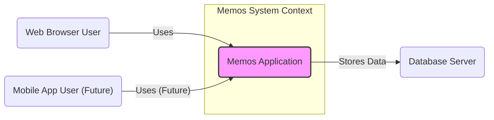
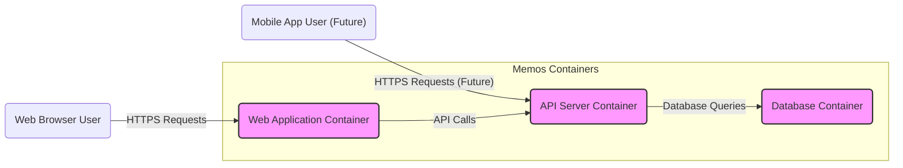
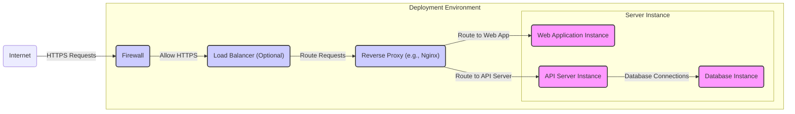
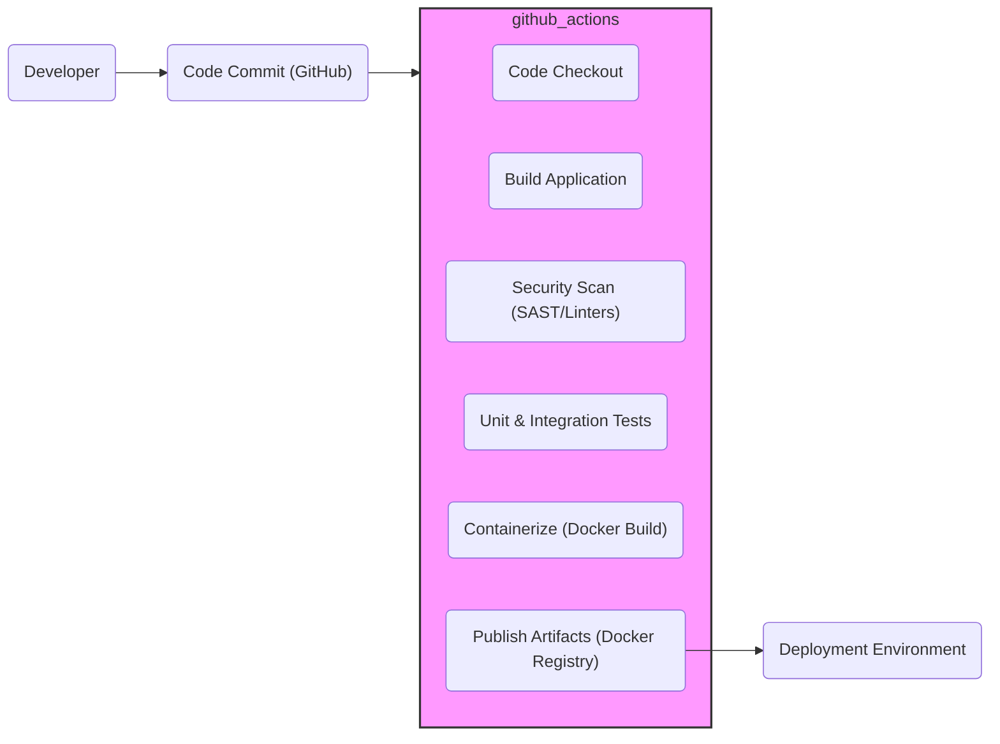

# BUSINESS POSTURE

Memos is a privacy-first, open-source note-taking application. It is designed to be lightweight and fast, allowing users to quickly capture and organize their thoughts and ideas. The project emphasizes simplicity and ease of use, aiming to provide a seamless note-taking experience across different devices.

Business Priorities and Goals:

- Provide a user-friendly and efficient note-taking solution.
- Ensure user data privacy and control.
- Foster an open-source community around the project.
- Offer a stable and reliable application for daily use.
- Enable users to self-host and control their data.

Most Important Business Risks:

- Data loss due to software bugs or infrastructure failures.
- Privacy breaches exposing user notes.
- Security vulnerabilities leading to unauthorized access or data manipulation.
- Lack of user adoption if the application is not perceived as secure or reliable.
- Reputational damage if security incidents occur.

# SECURITY POSTURE

Existing Security Controls:

- security control: HTTPS enforced for web access (assumption based on common web application practices).
- security control: Standard authentication mechanisms (username/password, potentially OAuth - needs clarification).
- security control: Authorization model to control access to notes (likely role-based or ownership-based - needs clarification).
- security control: Input validation on user inputs to prevent common web vulnerabilities (assumption, needs verification).
- security control: Regular dependency updates to address known vulnerabilities in third-party libraries (standard open-source practice).
- accepted risk: Reliance on community contributions for security patches and code reviews (inherent in open-source projects).
- accepted risk: Potential vulnerabilities in third-party dependencies.
- accepted risk: Security of self-hosted deployments is the responsibility of the user.

Recommended Security Controls:

- security control: Implement automated security scanning (SAST/DAST) in the CI/CD pipeline.
- security control: Conduct regular penetration testing or security audits.
- security control: Implement rate limiting to prevent brute-force attacks and denial-of-service.
- security control: Enhance input validation and output encoding to prevent injection attacks.
- security control: Implement robust logging and monitoring for security events.
- security control: Provide clear security guidelines and best practices for self-hosting users.

Security Requirements:

- Authentication:
    - requirement: Secure authentication mechanism to verify user identity.
    - requirement: Protection against brute-force attacks on login.
    - requirement: Secure password storage (hashing and salting).
    - requirement: Consider multi-factor authentication (MFA) for enhanced security.

- Authorization:
    - requirement: Role-based or ownership-based access control to notes.
    - requirement: Principle of least privilege applied to user access.
    - requirement: Secure API authorization for programmatic access (if applicable).

- Input Validation:
    - requirement: Validate all user inputs on both client and server-side.
    - requirement: Sanitize inputs to prevent injection attacks (SQL injection, XSS, etc.).
    - requirement: Use appropriate data types and formats to limit potential vulnerabilities.

- Cryptography:
    - requirement: Use HTTPS for all communication to protect data in transit.
    - requirement: Securely store sensitive data at rest (e.g., user passwords).
    - requirement: Consider encryption for user notes at rest for enhanced privacy (optional, depending on business priorities).

# DESIGN

## C4 CONTEXT

Context Diagram Elements:

-   - Name: Web Browser User
    -   Type: Person
    -   Description: Users accessing the Memos application through a web browser.
    -   Responsibilities: Create, read, update, and delete memos. Manage user account.
    -   Security controls: Browser-based security controls (e.g., Content Security Policy), user authentication.

-   - Name: Mobile App User (Future)
    -   Type: Person
    -   Description: Users accessing the Memos application through a dedicated mobile application (planned for future).
    -   Responsibilities: Create, read, update, and delete memos. Manage user account. Access memos offline (potentially).
    -   Security controls: Mobile application security controls, user authentication, secure storage on mobile device.

-   - Name: Memos Application
    -   Type: Software System
    -   Description: The Memos note-taking application itself, providing the core functionality for users to manage their memos.
    -   Responsibilities: Handle user requests, manage memos data, authenticate users, authorize access, interact with the database.
    -   Security controls: Authentication, authorization, input validation, secure session management, data encryption in transit (HTTPS).

-   - Name: Database Server
    -   Type: Software System
    -   Description: The database system used by Memos to persistently store user data, including memos, user accounts, and application settings.
    -   Responsibilities: Store and retrieve data for the Memos application, ensure data persistence and integrity.
    -   Security controls: Database access controls, data encryption at rest (optional), regular backups, database hardening.

## C4 CONTAINER

Container Diagram Elements:

-   - Name: Web Application Container
    -   Type: Container
    -   Description: Serves the static frontend assets (HTML, CSS, JavaScript) and handles user interactions through the web browser. Potentially includes a backend component for server-side rendering or handling specific web-related tasks.
    -   Responsibilities: Serve frontend application, handle user authentication for web users, manage user sessions, communicate with the API Server.
    -   Security controls: HTTPS enforcement, Content Security Policy, secure session management, input validation (client-side), protection against XSS.

-   - Name: API Server Container
    -   Type: Container
    -   Description: Provides the backend API for the Memos application. Handles business logic, data access, and API requests from the Web Application and potentially Mobile App.
    -   Responsibilities: Implement API endpoints for memo management, user management, and other functionalities. Authorize API requests, interact with the Database Container, enforce business rules.
    -   Security controls: API authentication and authorization (e.g., JWT), input validation, output encoding, protection against injection attacks, rate limiting, secure logging.

-   - Name: Database Container
    -   Type: Container
    -   Description:  Hosts the database system (e.g., SQLite, PostgreSQL, MySQL) used to store persistent data for the Memos application.
    -   Responsibilities: Persistently store and retrieve data, manage database connections, ensure data integrity and availability.
    -   Security controls: Database access controls, database hardening, regular backups, data encryption at rest (optional), network isolation.

## DEPLOYMENT

Deployment Architecture: Docker Container Deployment

Deployment Diagram Elements:

-   - Name: Internet
    -   Type: Environment
    -   Description: The public internet, representing external users accessing the Memos application.
    -   Responsibilities: Source of user traffic.
    -   Security controls: None directly, relies on the deployed infrastructure security.

-   - Name: Firewall
    -   Type: Infrastructure
    -   Description: Network firewall protecting the server instance from unauthorized external access.
    -   Responsibilities: Control network traffic, block malicious requests, allow only necessary ports (e.g., HTTPS).
    -   Security controls: Firewall rules, intrusion detection/prevention system (potentially).

-   - Name: Load Balancer (Optional)
    -   Type: Infrastructure
    -   Description: Distributes incoming traffic across multiple server instances for scalability and high availability (optional for single-instance deployments).
    -   Responsibilities: Load balancing, traffic distribution, health checks.
    -   Security controls: SSL termination, DDoS protection (potentially), access control.

-   - Name: Reverse Proxy (e.g., Nginx)
    -   Type: Infrastructure
    -   Description:  Handles incoming HTTPS requests, terminates SSL, and routes traffic to the appropriate application instances (Web App or API Server).
    -   Responsibilities: SSL termination, reverse proxying, request routing, static content serving, security headers.
    -   Security controls: HTTPS enforcement, security headers (e.g., HSTS, X-Frame-Options), request filtering, rate limiting (potentially).

-   - Name: Web Application Instance
    -   Type: Container Instance
    -   Description: A running instance of the Web Application Container, serving the frontend application.
    -   Responsibilities: Serve frontend application, handle web user requests.
    -   Security controls: Same as Web Application Container.

-   - Name: API Server Instance
    -   Type: Container Instance
    -   Description: A running instance of the API Server Container, handling backend API requests.
    -   Responsibilities: Process API requests, manage data, interact with the database.
    -   Security controls: Same as API Server Container.

-   - Name: Database Instance
    -   Type: Container Instance
    -   Description: A running instance of the Database Container, storing the application data.
    -   Responsibilities: Data persistence, database management.
    -   Security controls: Same as Database Container.

## BUILD

Build Process Diagram: GitHub Actions CI/CD

Build Process Description:

The build process for Memos is assumed to be based on a typical CI/CD pipeline using GitHub Actions, common for open-source projects hosted on GitHub.

Build Process Elements:

-   - Name: Developer
    -   Type: Person
    -   Description: Software developers contributing code to the Memos project.
    -   Responsibilities: Write code, commit changes, create pull requests.
    -   Security controls: Secure development practices, code reviews.

-   - Name: Code Commit (GitHub)
    -   Type: Platform
    -   Description: GitHub repository hosting the Memos source code and managing code changes.
    -   Responsibilities: Version control, code storage, collaboration.
    -   Security controls: GitHub access controls, branch protection rules.

-   - Name: GitHub Actions Workflow
    -   Type: CI/CD System
    -   Description: Automated workflow defined in GitHub Actions to build, test, and publish the Memos application.
    -   Responsibilities: Automate build process, run tests, perform security scans, create build artifacts.
    -   Security controls: Secure workflow configuration, secret management, access control to workflow execution.

-   - Name: Code Checkout
    -   Type: Build Step
    -   Description: Step in the GitHub Actions workflow to retrieve the latest code from the repository.
    -   Responsibilities: Obtain source code for building.
    -   Security controls: Access control to the repository.

-   - Name: Build Application
    -   Type: Build Step
    -   Description: Step to compile the application code and prepare it for deployment.
    -   Responsibilities: Compile code, package application.
    -   Security controls: Use of secure build tools and configurations.

-   - Name: Security Scan (SAST/Linters)
    -   Type: Build Step
    -   Description: Step to perform static application security testing (SAST) and code linting to identify potential vulnerabilities and code quality issues.
    -   Responsibilities: Identify security flaws and code quality issues early in the development cycle.
    -   Security controls: SAST tools configuration, linters configuration, vulnerability reporting.

-   - Name: Unit & Integration Tests
    -   Type: Build Step
    -   Description: Step to execute automated unit and integration tests to ensure code functionality and stability.
    -   Responsibilities: Verify code correctness, prevent regressions.
    -   Security controls: Secure test environment, test data management.

-   - Name: Containerize (Docker Build)
    -   Type: Build Step
    -   Description: Step to build a Docker image of the application, packaging it with necessary dependencies.
    -   Responsibilities: Create deployable container image.
    -   Security controls: Base image selection, Dockerfile security best practices, image scanning for vulnerabilities.

-   - Name: Publish Artifacts (Docker Registry)
    -   Type: Build Step
    -   Description: Step to publish the built Docker image to a container registry (e.g., Docker Hub, GitHub Container Registry).
    -   Responsibilities: Store and distribute container image.
    -   Security controls: Access control to the registry, image signing (optional), vulnerability scanning of published images.

-   - Name: Deployment Environment
    -   Type: Environment
    -   Description: Target environment where the application is deployed and run (e.g., cloud platform, self-hosted server).
    -   Responsibilities: Run the application, provide infrastructure.
    -   Security controls: Infrastructure security controls, deployment automation security.

# RISK ASSESSMENT

Critical Business Processes:

- Storing and retrieving user memos securely and reliably.
- User authentication and authorization to access their memos.
- Maintaining the availability and integrity of the Memos application.

Data to Protect and Sensitivity:

- User memos: Potentially contain sensitive personal information, private thoughts, and ideas. Sensitivity level: High. Requires confidentiality, integrity, and availability.
- User credentials (passwords): Highly sensitive. Sensitivity level: Critical. Requires strong confidentiality and integrity.
- Application configuration and settings: Less sensitive but important for application functionality. Sensitivity level: Medium. Requires integrity and availability.

# QUESTIONS & ASSUMPTIONS

Questions:

- What database system is used by Memos (SQLite, PostgreSQL, MySQL)?
- Is there a dedicated API server component, or is the API integrated within the web application?
- What authentication mechanisms are currently implemented (username/password, OAuth)?
- What is the authorization model for memos (ownership-based, role-based)?
- Are there any existing security scanning or penetration testing practices in place?
- What is the planned deployment environment (cloud, self-hosted, etc.)?
- Is data at rest encryption considered or implemented?

Assumptions:

- Memos is intended to be a privacy-focused application.
- Security is a significant concern for the project.
- The project follows standard open-source development practices.
- The deployment will likely involve containerization (Docker).
- HTTPS is enforced for all web traffic.
- Basic authentication and authorization are implemented.