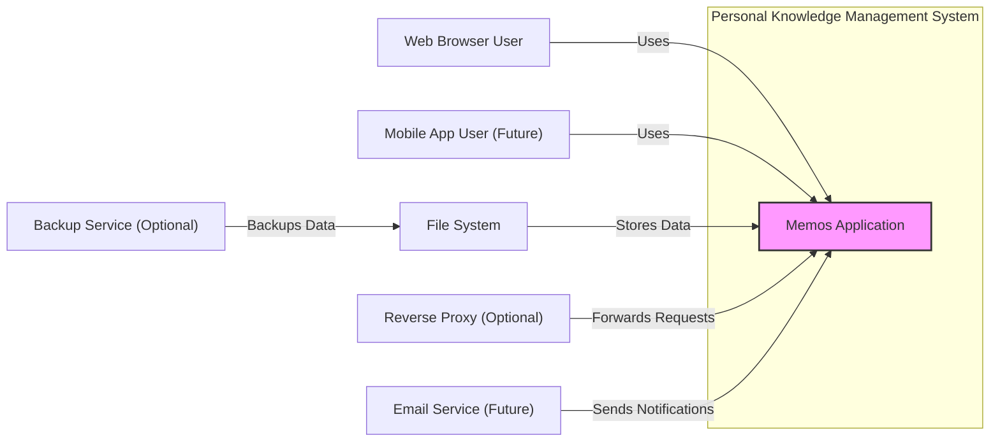
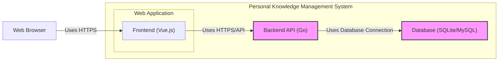
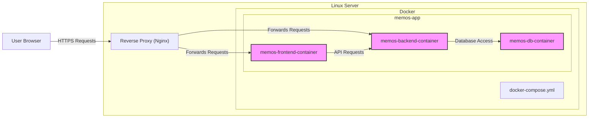
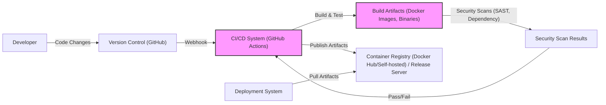

# BUSINESS POSTURE

This project, Memos, aims to provide a lightweight, self-hosted knowledge base or note-taking application. It focuses on simplicity, ease of use, and personal data ownership.

- Business Priorities and Goals:
  - Provide a simple and intuitive note-taking experience.
  - Enable users to easily capture and organize personal knowledge.
  - Offer a self-hosted solution to ensure user data privacy and control.
  - Be lightweight and resource-efficient for easy deployment on personal servers or low-powered devices.
  - Foster an open-source community and encourage contributions.

- Business Risks:
  - Data loss due to software bugs, hardware failures, or user error.
  - Unauthorized access to user data due to security vulnerabilities.
  - Service unavailability due to software issues or infrastructure problems.
  - Lack of user adoption if the application is not user-friendly or feature-rich enough.
  - Reputational damage if security breaches or data leaks occur.

# SECURITY POSTURE

- Existing Security Controls:
  - security control: HTTPS encryption for communication (assumed, standard practice for web applications). Implemented at reverse proxy/web server level.
  - security control: User authentication (username/password, potentially OAuth). Implemented in the backend application.
  - security control: Authorization based on user roles (admin, user). Implemented in the backend application.
  - security control: Input validation on the server-side. Implemented in the backend application.
  - security control: Regular software updates to address vulnerabilities (responsibility of the user/administrator). Described in project documentation.
  - accepted risk: Reliance on user/administrator for secure deployment and configuration.
  - accepted risk: Potential vulnerabilities in third-party libraries and dependencies.

- Recommended Security Controls:
  - security control: Implement rate limiting to prevent brute-force attacks on authentication endpoints.
  - security control: Regularly perform security audits and penetration testing.
  - security control: Implement Content Security Policy (CSP) to mitigate Cross-Site Scripting (XSS) attacks.
  - security control: Use a robust password hashing algorithm (e.g., Argon2).
  - security control: Implement database backups and recovery procedures.
  - security control: Consider adding two-factor authentication (2FA) for enhanced security.
  - security control: Implement automated security scanning in the CI/CD pipeline (SAST, DAST, dependency scanning).

- Security Requirements:
  - Authentication:
    - Requirement: Securely authenticate users accessing the application.
    - Requirement: Support username/password based authentication.
    - Requirement: Consider supporting OAuth for external authentication providers.
    - Requirement: Implement session management to maintain user sessions securely.
  - Authorization:
    - Requirement: Implement role-based access control to manage user permissions.
    - Requirement: Ensure users can only access and modify data they are authorized to.
    - Requirement: Differentiate between admin and regular user roles with appropriate privileges.
  - Input Validation:
    - Requirement: Validate all user inputs on the server-side to prevent injection attacks (e.g., SQL injection, XSS).
    - Requirement: Sanitize user inputs before storing them in the database or displaying them in the UI.
    - Requirement: Implement proper error handling to avoid leaking sensitive information.
  - Cryptography:
    - Requirement: Use HTTPS to encrypt all communication between the client and the server.
    - Requirement: Securely store user passwords using a strong hashing algorithm.
    - Requirement: Consider encrypting sensitive data at rest in the database if necessary.
    - Requirement: Ensure proper handling of cryptographic keys and secrets.

# DESIGN

## C4 CONTEXT

- Context Diagram Elements:
  - - Name: Memos Application
    - Type: Software System
    - Description: The Memos application itself, providing note-taking and knowledge management functionality.
    - Responsibilities:
      - Managing user accounts and authentication.
      - Storing and retrieving memos and related data.
      - Providing a user interface for interacting with memos.
      - Handling user requests and application logic.
    - Security controls:
      - Authentication and authorization mechanisms.
      - Input validation and sanitization.
      - Data encryption in transit (HTTPS).
      - Session management.

  - - Name: Web Browser User
    - Type: Person
    - Description: Users accessing the Memos application through a web browser.
    - Responsibilities:
      - Interacting with the Memos application to create, read, update, and delete memos.
      - Managing their user profile and settings.
    - Security controls:
      - Strong password management.
      - Browser security best practices.

  - - Name: Mobile App User (Future)
    - Type: Person
    - Description: Users accessing the Memos application through a dedicated mobile application (planned for future).
    - Responsibilities:
      - Similar responsibilities as Web Browser User, but through a mobile interface.
    - Security controls:
      - Mobile device security best practices.
      - Application-level security controls in the mobile app.

  - - Name: File System
    - Type: Data Store
    - Description: The local file system or a mounted volume where Memos stores its data, typically SQLite or MySQL database files.
    - Responsibilities:
      - Persistently storing application data, including memos, user information, and settings.
      - Providing data access to the Memos application.
    - Security controls:
      - File system permissions to restrict access to data files.
      - Data encryption at rest (optional, depending on deployment needs).
      - Regular backups to prevent data loss.

  - - Name: Reverse Proxy (Optional)
    - Type: Software System
    - Description: An optional reverse proxy (e.g., Nginx, Apache) placed in front of the Memos application.
    - Responsibilities:
      - Handling HTTPS termination and certificate management.
      - Load balancing (if multiple Memos instances are deployed).
      - Web Application Firewall (WAF) functionality (if configured).
      - Forwarding requests to the Memos application.
    - Security controls:
      - HTTPS configuration and certificate management.
      - Web Application Firewall rules (if WAF is used).
      - Access control to the reverse proxy itself.

  - - Name: Email Service (Future)
    - Type: External System
    - Description: An external email service that Memos might integrate with in the future for sending notifications (e.g., password reset emails, alerts).
    - Responsibilities:
      - Sending emails on behalf of the Memos application.
    - Security controls:
      - Secure API communication with the email service.
      - Proper handling of email credentials.

  - - Name: Backup Service (Optional)
    - Type: External System
    - Description: An optional external backup service used to backup Memos data stored in the File System.
    - Responsibilities:
      - Regularly backing up Memos data.
      - Providing data restoration capabilities.
    - Security controls:
      - Secure API communication with the backup service.
      - Encryption of backups in transit and at rest.
      - Access control to backups.

## C4 CONTAINER

- Container Diagram Elements:
  - - Name: Frontend (Vue.js)
    - Type: Web Application
    - Description: The client-side web application built with Vue.js, responsible for rendering the user interface and handling user interactions in the browser.
    - Responsibilities:
      - Rendering the user interface.
      - Handling user input and interactions.
      - Communicating with the Backend API via HTTPS.
      - Client-side input validation and data presentation.
    - Security controls:
      - Client-side input validation.
      - Implementation of Content Security Policy (CSP).
      - Secure coding practices to prevent XSS vulnerabilities.

  - - Name: Backend API (Go)
    - Type: Web Application
    - Description: The server-side application built with Go, responsible for handling business logic, data access, and API endpoints.
    - Responsibilities:
      - User authentication and authorization.
      - API endpoint management.
      - Business logic implementation.
      - Data access and manipulation.
      - Server-side input validation and sanitization.
    - Security controls:
      - Authentication and authorization mechanisms.
      - Input validation and sanitization.
      - Secure API design and implementation.
      - Protection against common web application vulnerabilities (e.g., SQL injection, CSRF).
      - Rate limiting.
      - Session management.

  - - Name: Database (SQLite/MySQL)
    - Type: Database
    - Description: The database system used to persistently store application data. Can be SQLite for single-user setups or MySQL for multi-user or more robust deployments.
    - Responsibilities:
      - Data persistence and storage.
      - Data retrieval and querying.
      - Data integrity and consistency.
    - Security controls:
      - Database access control and authentication.
      - Database hardening and security configuration.
      - Data encryption at rest (optional, depending on database choice and configuration).
      - Regular database backups.

## DEPLOYMENT

Deployment Solution: Self-hosted on a Linux server using Docker Compose.

- Deployment Diagram Elements:
  - - Name: Linux Server
    - Type: Infrastructure
    - Description: A Linux-based server (physical or virtual) hosting the Memos application.
    - Responsibilities:
      - Providing the underlying operating system and resources for running Docker and other components.
      - Network connectivity and firewall management.
      - System security and maintenance.
    - Security controls:
      - Operating system hardening and security updates.
      - Firewall configuration to restrict network access.
      - Intrusion detection and prevention systems (optional).
      - Regular security audits and monitoring.

  - - Name: Docker
    - Type: Containerization Platform
    - Description: Docker runtime environment used to containerize and manage the Memos application components.
    - Responsibilities:
      - Container orchestration and management.
      - Resource isolation and management for containers.
      - Simplified deployment and scaling.
    - Security controls:
      - Docker security best practices and hardening.
      - Container image security scanning.
      - Resource limits and security profiles for containers.

  - - Name: memos-frontend-container
    - Type: Container
    - Description: Docker container running the Frontend (Vue.js) application.
    - Responsibilities:
      - Serving the static frontend files.
      - Handling frontend logic within the container.
    - Security controls:
      - Minimal container image with only necessary components.
      - Regular container image updates.

  - - Name: memos-backend-container
    - Type: Container
    - Description: Docker container running the Backend API (Go) application.
    - Responsibilities:
      - Running the backend API service.
      - Handling API requests from the frontend.
    - Security controls:
      - Minimal container image with only necessary components.
      - Regular container image updates.
      - Application-level security controls within the container.

  - - Name: memos-db-container
    - Type: Container
    - Description: Docker container running the Database (SQLite/MySQL) service.
    - Responsibilities:
      - Running the database service.
      - Persisting application data within the container volume.
    - Security controls:
      - Database hardening and security configuration within the container.
      - Secure storage of database credentials.
      - Regular database backups.
      - Volume security and access control.

  - - Name: docker-compose.yml
    - Type: Configuration File
    - Description: Docker Compose file defining the application stack and container configurations.
    - Responsibilities:
      - Defining the services, networks, and volumes for the Memos application.
      - Configuration management for Docker containers.
    - Security controls:
      - Secure storage and management of docker-compose.yml file.
      - Review of docker-compose.yml for security misconfigurations.

  - - Name: Reverse Proxy (Nginx)
    - Type: Software System
    - Description: Nginx reverse proxy running on the Linux server, handling incoming HTTPS requests.
    - Responsibilities:
      - HTTPS termination and certificate management.
      - Forwarding requests to the frontend and backend containers.
      - Potential WAF functionality (if configured).
    - Security controls:
      - HTTPS configuration and certificate management.
      - Nginx security hardening and configuration.
      - Web Application Firewall rules (if WAF is used).
      - Access control to the reverse proxy configuration.

## BUILD

- Build Process Description:
  - Developer commits code changes to the GitHub repository.
  - GitHub triggers a webhook to the CI/CD system (e.g., GitHub Actions).
  - The CI/CD system automatically builds the application:
    - Compiles backend code (Go).
    - Builds frontend assets (Vue.js).
    - Creates Docker images for frontend, backend, and database (if containerized).
    - Runs automated tests (unit tests, integration tests).
  - Security scans are performed on the build artifacts:
    - Static Application Security Testing (SAST) to identify code vulnerabilities.
    - Dependency scanning to check for vulnerable dependencies.
  - If security scans and tests pass, the CI/CD system publishes the build artifacts:
    - Pushes Docker images to a container registry (e.g., Docker Hub, self-hosted registry).
    - Uploads binaries or release packages to a release server (e.g., GitHub Releases).
  - The deployment system pulls the artifacts from the registry or release server to deploy the application.

- Build Process Security Controls:
  - security control: Version control system (GitHub) to track code changes and ensure code integrity.
  - security control: Automated CI/CD pipeline (GitHub Actions) to automate the build, test, and release process, reducing manual errors.
  - security control: Static Application Security Testing (SAST) integrated into the CI/CD pipeline to detect code vulnerabilities early in the development cycle.
  - security control: Dependency scanning integrated into the CI/CD pipeline to identify and manage vulnerable dependencies.
  - security control: Container image scanning to identify vulnerabilities in base images and layers.
  - security control: Code signing for release binaries to ensure authenticity and integrity.
  - security control: Access control to the CI/CD system and build artifacts to prevent unauthorized modifications.
  - security control: Secure storage of build secrets and credentials used in the CI/CD pipeline.
  - security control: Regular updates of build tools and dependencies to patch vulnerabilities.

# RISK ASSESSMENT

- Critical Business Processes:
  - Storing and retrieving personal knowledge and notes.
  - User authentication and access control to personal data.
  - Application availability and reliability for personal use.

- Data Sensitivity:
  - User-generated memos: Sensitivity depends on the user and the content of their notes. Could include personal thoughts, ideas, passwords, private information, etc.  Potentially high sensitivity.
  - User credentials (passwords): Highly sensitive.
  - Application settings and configurations: Medium sensitivity.

# QUESTIONS & ASSUMPTIONS

- Questions:
  - Is there a plan to implement mobile applications in the future?
  - What is the intended user base (individual users, small teams, larger organizations)?
  - Are there any specific compliance requirements (e.g., GDPR, HIPAA) that the application needs to adhere to?
  - What are the performance and scalability requirements for the application?
  - Are there any specific data backup and recovery requirements?

- Assumptions:
  - The primary use case is for individual users managing personal knowledge.
  - Self-hosting is a key requirement for many users.
  - Data privacy and control are important considerations.
  - The application is intended to be lightweight and easy to deploy.
  - HTTPS is used for all communication.
  - Basic authentication and authorization are implemented.