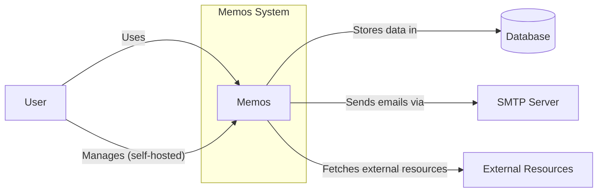
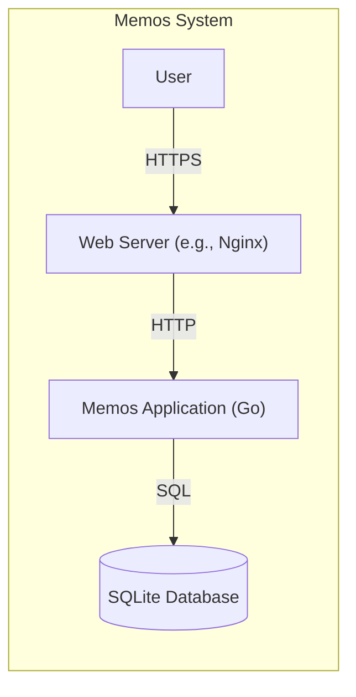

# BUSINESS POSTURE

Memos is an open-source, self-hosted memo hub with knowledge management and social networking features. Based on the GitHub repository, the business priorities and goals appear to be:

*   Provide a lightweight, easy-to-use, and self-hostable note-taking/memo service.
*   Enable users to easily capture and share thoughts, ideas, and information.
*   Offer a privacy-focused alternative to centralized note-taking services.
*   Foster a community around the project through open-source development.
*   Support basic knowledge management features like tagging and linking.
*   Allow for some level of social interaction (sharing memos, potentially comments in the future).

The most important business risks that need to be addressed are:

*   Data breaches: Unauthorized access to user memos and personal information.
*   Data loss: Accidental or malicious deletion of user data.
*   Service unavailability: Downtime or performance issues preventing users from accessing their memos.
*   Abuse of the platform: Users posting malicious content or spamming other users.
*   Compromise of the host system: Attackers exploiting vulnerabilities in Memos to gain access to the underlying server.
*   Lack of user adoption: Insufficient interest in the project, leading to stagnation.

# SECURITY POSTURE

Existing security controls (based on the repository and common practices):

*   security control: Authentication: User accounts with password-based login (implementation in server-side Go code).
*   security control: Authorization: Basic access control to ensure users can only access their own memos and public memos (implementation in server-side Go code).
*   security control: Data storage: SQLite database for storing memos and user data (default configuration).
*   security control: Docker deployment: Option to deploy Memos using Docker, providing some level of isolation.
*   security control: Reverse proxy configuration: Examples provided for using Nginx as a reverse proxy, enabling HTTPS and other security features.
*   security control: Basic input sanitization: Likely implemented in the frontend (React) and backend (Go) to prevent basic injection attacks.
*   security control: Open-source code: Allows for community review and identification of vulnerabilities.

Accepted risks:

*   accepted risk: Limited protection against sophisticated attacks: The project's simplicity and focus on self-hosting may mean it's not designed to withstand targeted attacks by highly skilled adversaries.
*   accepted risk: Reliance on third-party libraries: Vulnerabilities in dependencies could impact the security of Memos.
*   accepted risk: User responsibility for server security: Self-hosting means users are responsible for securing their own servers and infrastructure.
*   accepted risk: No built-in encryption at rest: Data stored in the SQLite database is not encrypted by default.
*   accepted risk: No built-in two-factor authentication (2FA).

Recommended security controls (high priority):

*   security control: Implement robust input validation and sanitization on both the frontend and backend to prevent XSS, SQL injection, and other injection attacks.
*   security control: Offer optional two-factor authentication (2FA) for enhanced account security.
*   security control: Provide guidance and tooling for secure backups and disaster recovery.
*   security control: Implement rate limiting to prevent brute-force attacks and denial-of-service.
*   security control: Regularly update dependencies to patch known vulnerabilities.
*   security control: Consider adding Content Security Policy (CSP) headers to mitigate XSS risks.
*   security control: Provide clear security documentation and best practices for self-hosting users.
*   security control: Implement audit logging to track user actions and potential security events.

Security Requirements:

*   Authentication:
    *   Users must be able to create accounts and securely log in.
    *   Passwords must be securely hashed and salted.
    *   Support for password reset functionality.
    *   Consider offering optional 2FA.
*   Authorization:
    *   Users should only be able to access their own memos and public memos.
    *   Administrators should have elevated privileges.
    *   Consider role-based access control (RBAC) if more granular permissions are needed.
*   Input Validation:
    *   All user input must be validated and sanitized to prevent injection attacks (XSS, SQLi, etc.).
    *   Implement both client-side and server-side validation.
    *   Use a whitelist approach where possible, only allowing known-good characters and patterns.
*   Cryptography:
    *   Use strong, industry-standard cryptographic algorithms for password hashing (e.g., bcrypt, Argon2).
    *   Use HTTPS for all communication between the client and server.
    *   Consider offering optional encryption at rest for the database.

# DESIGN

## C4 CONTEXT



Element Descriptions:

*   Element:
    *   Name: User
    *   Type: Person
    *   Description: A person who uses Memos to create, manage, and share memos.
    *   Responsibilities: Creating, editing, deleting, and sharing memos; managing their account; potentially self-hosting the Memos instance.
    *   Security controls: Authentication (username/password, optional 2FA); authorization (access control to own memos and public memos).

*   Element:
    *   Name: Memos
    *   Type: Software System
    *   Description: The Memos application itself, providing the core functionality.
    *   Responsibilities: Handling user requests, managing data, rendering the user interface, enforcing security policies.
    *   Security controls: Input validation, authentication, authorization, session management, potentially rate limiting.

*   Element:
    *   Name: Database
    *   Type: Database
    *   Description: Stores user data, memos, and other application data.
    *   Responsibilities: Persistently storing data, providing data retrieval and update capabilities.
    *   Security controls: Access control (database user credentials), potentially encryption at rest (if configured by the user).

*   Element:
    *   Name: SMTP Server
    *   Type: External System
    *   Description: An external SMTP server used for sending emails (e.g., password reset emails).
    *   Responsibilities: Relaying emails from the Memos application.
    *   Security controls: Authentication (SMTP credentials), TLS encryption for communication.

*   Element:
    *   Name: External Resources
    *   Type: External System
    *   Description: External websites or APIs that Memos might interact with (e.g., fetching website metadata for link previews).
    *   Responsibilities: Providing data or services to Memos.
    *   Security controls: HTTPS for communication, potentially API keys or other authentication mechanisms.

## C4 CONTAINER



Element Descriptions:

*   Element:
    *   Name: User
    *   Type: Person
    *   Description: A person who uses Memos.
    *   Responsibilities: Interacting with the web application.
    *   Security controls: Authentication, authorization.

*   Element:
    *   Name: Web Server (e.g., Nginx)
    *   Type: Container: Web Server
    *   Description: A reverse proxy server that handles incoming requests and forwards them to the Memos application.
    *   Responsibilities: Handling HTTPS termination, serving static assets, potentially load balancing, and providing an additional layer of security.
    *   Security controls: HTTPS configuration, TLS certificates, potentially Web Application Firewall (WAF) rules, access control lists.

*   Element:
    *   Name: Memos Application (Go)
    *   Type: Container: Application
    *   Description: The core Memos application logic, written in Go.
    *   Responsibilities: Handling user requests, interacting with the database, rendering the user interface, enforcing business rules and security policies.
    *   Security controls: Authentication, authorization, input validation, session management, data access control.

*   Element:
    *   Name: SQLite Database
    *   Type: Container: Database
    *   Description: The SQLite database that stores user data and memos.
    *   Responsibilities: Persistently storing data.
    *   Security controls: File system permissions, potentially encryption at rest (if configured by the user).

## DEPLOYMENT

Possible deployment solutions:

1.  Docker Compose: Using the provided `docker-compose.yml` file.
2.  Manual installation: Building the Go backend and React frontend, and configuring a web server (e.g., Nginx) manually.
3.  Cloud provider-specific deployments (e.g., AWS, Google Cloud, Azure): Using virtual machines, container services (e.g., ECS, GKE, AKS), or serverless functions.

Chosen solution (for detailed description): Docker Compose

```mermaid
graph LR
    subgraph Deployment Environment (e.g., User's Server)
        subgraph Docker Host
            subgraph Memos Service
                web["Nginx (Web Server)"]
                app["Memos (Go Application)"]
                db[(SQLite Database)]
            end
        end
        user["User"] -- "HTTPS" --> web
    end
```

Element Descriptions:

*   Element:
    *   Name: User
    *   Type: Person
    *   Description: A person accessing the Memos instance.
    *   Responsibilities: Interacting with the web application.
    *   Security controls: Authentication, authorization.

*   Element:
    *   Name: Deployment Environment (e.g., User's Server)
    *   Type: Node
    *   Description: The server or environment where Memos is deployed.
    *   Responsibilities: Providing the infrastructure for running the Docker containers.
    *   Security controls: Firewall rules, operating system security, SSH access control.

*   Element:
    *   Name: Docker Host
    *   Type: Node
    *   Description: The host machine running the Docker engine.
    *   Responsibilities: Managing the Docker containers.
    *   Security controls: Docker daemon security configuration, resource limits.

*   Element:
    *   Name: Memos Service
    *   Type: Node
    *   Description: Docker Compose service definition.
    *   Responsibilities: Orchestrates containers.
    *   Security controls: Docker Compose configuration.

*   Element:
    *   Name: Nginx (Web Server)
    *   Type: Container
    *   Description: The Nginx web server container.
    *   Responsibilities: Handling HTTPS termination, serving static assets, forwarding requests to the Memos application.
    *   Security controls: Nginx configuration, TLS certificates.

*   Element:
    *   Name: Memos (Go Application)
    *   Type: Container
    *   Description: The Memos application container.
    *   Responsibilities: Handling application logic, interacting with the database.
    *   Security controls: Application-level security controls (authentication, authorization, input validation).

*   Element:
    *   Name: SQLite Database
    *   Type: Container: Database
    *   Description: The SQLite database (within the Memos application container or a separate volume).
    *   Responsibilities: Storing data.
    *   Security controls: File system permissions.

## BUILD

The Memos build process involves building both the Go backend and the React frontend. The repository provides a Makefile for automating the build process.

```mermaid
graph LR
    developer["Developer"] -- "Writes code" --> code[Source Code (GitHub)]
    code -- "Pushes to" --> github[GitHub Repository]
    github -- "Triggers" --> build_server[Build Server (e.g., GitHub Actions, Local Machine)]
    subgraph Build Server
        build_server -- "Fetches code" --> code2[Source Code]
        code2 -- "Builds frontend" --> frontend[Frontend Build (React)]
        code2 -- "Builds backend" --> backend[Backend Build (Go)]
        frontend -- "Packages into" --> docker_image[Docker Image]
        backend -- "Packages into" --> docker_image
    end
    docker_image -- "Pushes to" --> registry[Container Registry (e.g., Docker Hub)]

```

Security Controls in Build Process:

*   security control: Dependency management: Go modules and npm/yarn are used for managing dependencies. Regularly updating dependencies is crucial.
*   security control: Static analysis: While not explicitly mentioned in the repository, integrating static analysis tools (e.g., linters, SAST scanners) into the build process is highly recommended. Examples include `golangci-lint` for Go and ESLint/SonarQube for JavaScript.
*   security control: Build automation: The Makefile and Dockerfile provide a degree of build automation, ensuring consistent builds.
*   security control: Containerization: Building a Docker image helps ensure a consistent and isolated runtime environment.
*   security control: (Recommended) Software Composition Analysis (SCA): Use SCA tools to identify known vulnerabilities in third-party dependencies.
*   security control: (Recommended) Container image scanning: Scan the resulting Docker image for vulnerabilities before deploying it.

# RISK ASSESSMENT

*   Critical business processes we are trying to protect:
    *   User memo creation, storage, and retrieval.
    *   User account management.
    *   (Potentially) Social interaction features (sharing, comments).

*   Data we are trying to protect and their sensitivity:
    *   User memos: Highly sensitive, as they may contain personal thoughts, ideas, or confidential information.
    *   User account information (username, email, hashed password): Sensitive, as it can be used to access the user's account and potentially other accounts if the user reuses passwords.
    *   (Potentially) User interaction data (shares, comments): Moderately sensitive, depending on the content.

# QUESTIONS & ASSUMPTIONS

*   Questions:
    *   Are there any plans for features like full-text search, advanced knowledge management capabilities, or more complex social interactions?
    *   What is the expected scale of the user base (for self-hosted instances)?
    *   Are there any specific compliance requirements (e.g., GDPR, HIPAA) that need to be considered?
    *   What is the project's stance on supporting external authentication providers (e.g., OAuth 2.0, OpenID Connect)?
    *   What level of support is provided for users who self-host Memos?

*   Assumptions:
    *   BUSINESS POSTURE: The primary focus is on providing a simple, self-hostable memo service for individual users or small teams.
    *   BUSINESS POSTURE: The project prioritizes privacy and user control over data.
    *   SECURITY POSTURE: Users are responsible for securing their own servers and infrastructure when self-hosting.
    *   SECURITY POSTURE: The project relies on community contributions for security reviews and vulnerability reporting.
    *   DESIGN: The architecture is relatively simple, with a focus on ease of deployment and maintenance.
    *   DESIGN: The SQLite database is sufficient for the expected scale of most deployments.
    *   DESIGN: The provided Docker Compose configuration is the recommended deployment method.
    *   DESIGN: The build process is straightforward and can be easily automated.