# Project Design Document: V2Ray Core

**Version:** 1.1
**Date:** October 26, 2023
**Author:** AI Software Architect

## 1. Introduction

This document details the design of the V2Ray Core project, an open-source platform for building sophisticated private networks. It serves as a comprehensive guide to the system's architecture, components, and operational flow, specifically intended to facilitate thorough threat modeling. Understanding the intricacies of V2Ray's design is crucial for identifying potential vulnerabilities and implementing appropriate security measures.

## 2. System Overview

V2Ray is a highly configurable network utility that functions as a sophisticated proxy. It empowers users to route network traffic through a variety of protocols and employ advanced obfuscation techniques, primarily to circumvent network censorship and enhance online privacy. Its modular design allows for flexible deployment and adaptation to diverse networking needs.

Key capabilities of V2Ray include:

*   **Multi-Protocol Support:**  Handles various inbound and outbound protocols such as VMess, Shadowsocks, SOCKS, and HTTP.
*   **Dynamic Routing:** Enables complex, rule-based traffic routing based on factors like domain, IP address, and user identity.
*   **Connection Multiplexing (Mux):** Improves network performance by efficiently reusing underlying connections.
*   **Traffic Obfuscation:**  Makes network traffic analysis and identification more challenging.
*   **End-to-End Encryption:**  Supports TLS and other encryption methods to secure communication channels.
*   **Decentralized Design:** Allows for distributed deployments and chained proxy configurations.

## 3. System Architecture

The V2Ray Core adopts a modular architecture, where distinct components collaborate to process network traffic. The core operation involves managing inbound and outbound connections, applying routing logic, and handling protocol-specific implementations.

```mermaid
graph LR
    subgraph "V2Ray Client Instance"
        A["Client Application"] --> B("Client Inbound Handler");
        B --> C("Client Router");
        C --> D("Client Outbound Handler");
    end

    subgraph "Network"
        E["Internet/Network"];
    end

    subgraph "V2Ray Server Instance"
        F("Server Inbound Handler") --> G("Server Router");
        G --> H("Server Outbound Handler");
        H --> I["Destination Server"];
    end

    D -- "Encrypted & Possibly Obfuscated Traffic" --> E;
    E -- "Encrypted & Possibly Obfuscated Traffic" --> F;
```

### 3.1. Key Components

*   **Inbound Handler:**  The entry point for incoming network connections. It listens on specified ports and accepts connections based on configured protocols. Each inbound handler is responsible for protocol negotiation, authentication, and initial processing of incoming data. Examples include:
    *   VMess Inbound Handler
    *   Shadowsocks Inbound Handler
    *   SOCKS Inbound Handler
    *   HTTP Inbound Handler
*   **Outbound Handler:**  Responsible for establishing outgoing network connections. Based on the routing decision, the outbound handler connects to the target server or another V2Ray instance using the specified protocol and transport. Examples include:
    *   VMess Outbound Handler
    *   Shadowsocks Outbound Handler
    *   Freedom Outbound Handler (direct connection)
    *   Blackhole Outbound Handler (drops traffic)
*   **Router:** The central decision-making component. It receives connection information from inbound handlers and applies a set of configurable routing rules to determine the appropriate outbound handler or internal service for the connection. Routing decisions can be based on:
    *   Domain names
    *   IP addresses (source and destination)
    *   Port numbers
    *   User IDs
    *   Protocol types
*   **Transport:**  Manages the underlying network communication mechanisms. Transports define how data is transmitted over the network. Different transports offer varying levels of performance and resilience. Examples include:
    *   TCP
    *   mKCP (Multiplexed KCP)
    *   WebSocket
    *   HTTP/2
    *   QUIC (experimental)
*   **Proxy Protocols:** Implementations of specific proxy protocols that define the data format and communication flow between V2Ray clients and servers. These protocols often include encryption and authentication mechanisms. Examples include:
    *   VMess: V2Ray's proprietary protocol, offering strong encryption and obfuscation.
    *   Shadowsocks: A lightweight, open-source encrypted proxy protocol.
    *   SOCKS: A general-purpose proxy protocol.
    *   HTTP:  Standard Hypertext Transfer Protocol.
*   **DNS Resolver:**  Responsible for resolving domain names to IP addresses. V2Ray includes an internal DNS resolver that can be configured to use specific upstream DNS servers, potentially bypassing local DNS censorship.
*   **Policy Engine:** Enforces access control and other policies based on connection attributes. This allows for fine-grained control over which users or connections are allowed or denied.
*   **Log System:** Records events, errors, and connection details within the V2Ray Core. Configurable logging levels allow for different levels of detail.
*   **Configuration System:**  Handles the loading, parsing, and validation of V2Ray's JSON-based configuration files.

## 4. Data Flow

The typical flow of data through a V2Ray instance involves the following steps:

1. **Client Initiates Connection:** A client application attempts to connect to a target server, and this connection is intercepted by the V2Ray client's inbound handler.
2. **Inbound Handling:** The inbound handler accepts the connection, negotiates the agreed-upon protocol (e.g., SOCKS, HTTP), and may perform authentication if required by the protocol configuration.
3. **Routing Decision:** The inbound handler passes the connection details to the router. The router evaluates the configured routing rules, matching the connection attributes against the defined rules to determine the appropriate outbound handler.
4. **Outbound Handling:** The router directs the connection to the selected outbound handler. The outbound handler establishes a new connection to the destination server (or another V2Ray instance) using the protocol and transport specified in its configuration. This often involves encryption and/or obfuscation of the data.
5. **Data Transmission:** Data from the client application is transmitted through the established connections, potentially encrypted and obfuscated by the chosen protocols and transports.
6. **Server-Side Processing (if applicable):** If the traffic is destined for a V2Ray server, the server's inbound handler receives the encrypted/obfuscated traffic, decrypts and de-obfuscates it, and passes it to its router.
7. **Destination Connection:** The V2Ray server's router determines the final destination and sends the traffic through its outbound handler to the target server.
8. **Response Path:** The response from the destination server follows a similar path in reverse, being processed by the V2Ray server's outbound and inbound handlers, then transmitted back to the V2Ray client's inbound and outbound handlers, and finally to the client application.

```mermaid
graph LR
    subgraph "Client System"
        A["Client Application"] -- "Initiate Connection" --> B("V2Ray Client Inbound Handler");
        B -- "Processed Connection" --> C("V2Ray Client Router");
        C -- "Route Decision" --> D("V2Ray Client Outbound Handler");
    end

    subgraph "Network Path"
        E["Network"]
    end

    subgraph "Server System"
        F("V2Ray Server Inbound Handler") -- "Decrypted/Deobfuscated Traffic" --> G("V2Ray Server Router");
        G -- "Route Decision" --> H("V2Ray Server Outbound Handler");
        H -- "Forwarded Request" --> I["Destination Server"];
    end

    D -- "Encrypted/Obfuscated Traffic" --> E;
    E -- "Encrypted/Obfuscated Traffic" --> F;
    I -- "Response" --> H;
    H -- "Encrypted/Obfuscated Response" --> E;
    E -- "Encrypted/Obfuscated Response" --> D;
    D -- "Processed Response" --> C;
    C -- "Route Decision" --> B;
    B -- "Response to Application" --> A;
```

## 5. Deployment Scenarios

V2Ray's flexibility allows for diverse deployment scenarios:

*   **Personal Proxy:** A user runs a V2Ray client on their device to connect to a remote V2Ray server, bypassing geographical restrictions and enhancing privacy.
*   **Chained Proxy Setup:** Multiple V2Ray instances are linked together, routing traffic through different locations or protocols for enhanced anonymity or to bypass complex network filtering.
*   **Site-to-Site VPN:** V2Ray can be used to establish secure connections between two private networks over the public internet, acting as a virtual private network.
*   **Internal Service Proxy:**  V2Ray can act as a proxy for internal services, providing access control and potentially obfuscating internal network traffic.
*   **Load Balancing and Traffic Distribution:** V2Ray's routing capabilities can be used to distribute incoming traffic across multiple backend servers, improving performance and resilience.

## 6. Configuration

V2Ray's behavior is defined through JSON-based configuration files. These files specify the parameters for various components:

*   **`inbounds`:** Defines the settings for inbound handlers, including protocol, port, and protocol-specific options (e.g., user credentials for VMess).
*   **`outbounds`:** Configures outbound handlers, specifying the protocol, target address, and protocol-specific settings.
*   **`routing`:**  Defines the rules used by the router to direct traffic. Rules can be based on conditions like domain, IP, port, user, and more.
*   **`transport`:**  Specifies the transport settings for inbound and outbound connections, such as TCP, WebSocket, or mKCP configurations.
*   **`dns`:** Configures the internal DNS resolver, including upstream DNS servers and other DNS settings.
*   **`policy`:** Defines access control policies and other restrictions based on connection attributes.
*   **`log`:**  Configures the logging system, specifying the log level and output destination.
*   **`api`:**  Settings for the optional API interface for controlling V2Ray.

## 7. Security Considerations (Pre-Threat Modeling)

Identifying potential security concerns is crucial before formal threat modeling:

*   **Protocol-Specific Vulnerabilities:**
    *   Weaknesses in the design or implementation of protocols like VMess or Shadowsocks could be exploited.
    *   Outdated or insecure cipher suites used within these protocols.
*   **Encryption and Authentication Flaws:**
    *   Vulnerabilities in the encryption algorithms or their implementation could compromise data confidentiality.
    *   Weak or default credentials could lead to unauthorized access.
    *   Bypass vulnerabilities in authentication mechanisms.
*   **Configuration-Related Risks:**
    *   Misconfigured routing rules could inadvertently expose internal services or bypass intended security measures.
    *   Leaving default ports open or using weak passwords.
    *   Incorrectly configured TLS settings, leading to man-in-the-middle opportunities.
*   **Denial of Service (DoS) Attacks:**
    *   V2Ray instances could be targeted by DoS attacks, overwhelming their resources and preventing legitimate use.
    *   Amplification attacks leveraging V2Ray's features.
*   **Man-in-the-Middle (MitM) Attacks:**
    *   If TLS is not properly configured or enforced, attackers could intercept and manipulate traffic between the client and server.
*   **Software Vulnerabilities:**
    *   Bugs in the V2Ray Core codebase itself could be exploited by attackers.
    *   Memory corruption vulnerabilities leading to crashes or arbitrary code execution.
*   **Dependency Vulnerabilities:**
    *   Vulnerabilities in third-party libraries and dependencies used by V2Ray could be exploited.
*   **Logging and Monitoring Deficiencies:**
    *   Insufficient logging could hinder incident response and security analysis, making it difficult to detect and investigate attacks.
    *   Sensitive information being logged unintentionally.

## 8. Assumptions and Constraints

*   The underlying operating system and network infrastructure where V2Ray is deployed are assumed to be reasonably secure and up-to-date.
*   This document focuses on the design of the V2Ray Core software and does not cover the security of the surrounding infrastructure or client applications.
*   Users are assumed to have a basic understanding of networking concepts and security best practices when configuring V2Ray.
*   The configuration files are assumed to be stored securely and protected from unauthorized access.

## 9. Glossary

*   **VMess:** A proprietary, connection-oriented protocol used by V2Ray, offering features like dynamic port allocation and strong encryption.
*   **Shadowsocks:** An open-source, lightweight, and widely used encrypted proxy protocol.
*   **SOCKS:** A general-purpose network protocol that allows clients to connect to servers through a proxy server.
*   **TLS (Transport Layer Security):** A cryptographic protocol that provides communication security over a network, often used for encryption and authentication.
*   **mKCP (Multiplexed KCP):** A reliable UDP-based transport protocol that aims to reduce latency and packet loss.
*   **WebSocket:** A communication protocol that provides full-duplex communication channels over a single TCP connection.
*   **HTTP/2:** A revision of the Hypertext Transfer Protocol that aims to improve performance and efficiency.
*   **QUIC:** A network transport layer protocol initially designed by Google, aiming to provide secure and reliable connections over UDP.
*   **Mux (Connection Multiplexing):** A technique to send multiple data streams over a single network connection, improving efficiency.

This detailed design document provides a solid foundation for understanding the architecture and functionality of V2Ray Core. This understanding is essential for conducting effective threat modeling and implementing appropriate security controls to mitigate potential risks.
