## Project Design Document: V2Ray Core (Improved)

**1. Introduction**

This document provides an enhanced design overview of the V2Ray Core project, an open-source network utility designed for building secure and private networks. This iteration builds upon the previous version, offering more granular detail and emphasizing aspects crucial for effective threat modeling. The primary goal is to provide a comprehensive understanding of the system's architecture, component functionalities, and data flow, serving as a robust foundation for identifying potential security vulnerabilities. The information presented is derived from the publicly accessible source code and documentation of the V2Ray project.

**2. Project Overview**

V2Ray is a versatile platform for constructing proxies and secure network tunnels, prioritizing flexibility and traffic obfuscation. Its core strengths lie in its ability to handle diverse network conditions and security requirements through:

*   **Extensive Protocol Support:**  Facilitates communication using various protocols for inbound and outbound connections, including VMess, Shadowsocks, Socks, HTTP, Trojan, and more. This allows for adapting to different network environments and security needs.
*   **Flexible Transport Mechanisms:** Supports a wide array of transport layers such as TCP, mKCP, WebSocket, HTTP/2, and QUIC. This enables optimization for performance and resilience across different network infrastructures.
*   **Advanced Traffic Obfuscation:** Offers sophisticated techniques to disguise traffic patterns, making it significantly more challenging to detect and block, enhancing privacy and security.
*   **Sophisticated Dynamic Routing:**  Enables the creation of complex routing rules based on a multitude of criteria, allowing for granular control over traffic flow and destination selection.
*   **Cross-Platform Compatibility:** Designed to operate seamlessly across various operating systems and hardware architectures, ensuring broad applicability.
*   **Modular Design:**  The architecture is built around independent, interacting modules, promoting maintainability and extensibility, but also requiring careful consideration of inter-component security.

**3. System Architecture**

V2Ray Core employs a modular architecture where distinct components collaborate to manage network communication. Understanding these components and their interactions is fundamental for threat analysis. The key components are:

*   **Client Application:** The software or system initiating a network connection that will be proxied through V2Ray.
*   **Destination Server:** The ultimate target server or service that the client application intends to reach.
*   **V2Ray Instance (Client Mode):** A running instance of the V2Ray Core application configured to act as a client, forwarding traffic on behalf of the client application.
*   **V2Ray Instance (Server Mode):** A running instance of the V2Ray Core application configured to act as a server, accepting incoming proxied connections.
*   **Inbound Handler:** The component within a V2Ray instance responsible for accepting and processing incoming connections from clients or other V2Ray instances.
*   **Outbound Handler:** The component within a V2Ray instance responsible for establishing and managing outgoing connections to destination servers or other V2Ray instances.
*   **Transport Layer:** The underlying protocol used for the physical transmission of data packets (e.g., TCP, UDP via mKCP, WebSocket).
*   **Application Layer Protocol:** The protocol used for structuring and interpreting the data being transmitted (e.g., VMess, Shadowsocks, HTTP).
*   **Routing Engine:** The component that evaluates configured rules to determine the appropriate outbound handler for a given incoming connection.
*   **Configuration Manager:** Responsible for loading, parsing, and validating the V2Ray instance's configuration. This is a critical component from a security perspective.

**4. Detailed Component Design**

This section provides a more in-depth look at the functionalities and interactions of the core components within a V2Ray instance, highlighting security-relevant aspects.

*   **Inbound Handler:**
    *   Listens for incoming network connections on specified network interfaces and ports.
    *   Performs initial connection acceptance and handshake.
    *   Negotiates the inbound application layer protocol based on the configuration and client request.
    *   Handles authentication of the incoming connection, if required by the configured protocol (e.g., user ID and password for VMess).
    *   Decrypts incoming traffic if the negotiated protocol involves encryption.
    *   Performs initial data processing and forwards the processed data to the Routing Engine.
    *   Security considerations: Vulnerabilities in inbound protocol implementations, weak authentication mechanisms, and improper decryption can be exploited here.
    *   Examples of inbound protocols: VMess, Shadowsocks, Socks, HTTP, Trojan.

*   **Outbound Handler:**
    *   Receives processed traffic from the Routing Engine, along with routing instructions.
    *   Selects the appropriate outbound application layer protocol and transport layer based on the routing decision and configuration.
    *   Encrypts outgoing traffic if the selected protocol requires it.
    *   Establishes a connection to the target server or the next hop V2Ray instance.
    *   Manages the established connection and forwards the encrypted/obfuscated traffic.
    *   Security considerations: Improper handling of outbound protocols, vulnerabilities in transport layer implementations, and insecure encryption configurations can introduce risks.
    *   Examples of outbound protocols: VMess, Shadowsocks, Freedom (direct connection), Direct (bypass proxy).

*   **Transport Layer:**
    *   Provides the fundamental mechanism for transmitting data packets across the network.
    *   Manages connection establishment, maintenance, and termination.
    *   Handles data segmentation, reassembly, and error detection (depending on the transport).
    *   Security considerations: Vulnerabilities in transport protocol implementations (e.g., TCP SYN flood), lack of encryption at the transport layer (if applicable), and susceptibility to network attacks.
    *   Examples of transports: TCP, mKCP (UDP-based with reliability features), WebSocket (over HTTP/1.1 or HTTP/2), HTTP/2, QUIC.

*   **Application Layer Protocol:**
    *   Defines the structure, semantics, and encoding of the data being exchanged between the client and the V2Ray instance, or between V2Ray instances.
    *   Often includes mechanisms for authentication, encryption, and data integrity.
    *   Security considerations: Protocol weaknesses (e.g., replay attacks, man-in-the-middle vulnerabilities), implementation flaws, and inadequate encryption algorithms can be exploited.
    *   Examples of protocols: VMess (V2Ray's proprietary, authenticated, and encrypted protocol), Shadowsocks (encrypted SOCKS5 proxy), Socks (generic proxy protocol), HTTP (for proxying HTTP requests), Trojan (designed to mimic HTTPS traffic).

*   **Routing Engine:**
    *   Evaluates configured routing rules against incoming connection metadata (e.g., destination IP, domain, port, source IP, user).
    *   Determines the appropriate outbound handler to process the connection.
    *   Supports various routing strategies, including domain-based routing, geo-based routing, rule-based routing, and load balancing.
    *   Security considerations: Misconfigured routing rules can lead to unintended traffic exposure or bypass security controls. Vulnerabilities in the routing engine logic could be exploited to redirect traffic maliciously.

*   **Configuration Manager:**
    *   Responsible for loading the V2Ray instance's configuration from files (typically JSON).
    *   Parses the configuration data and validates its structure and values.
    *   Provides the configuration parameters to other components.
    *   Security considerations: This is a critical attack surface. Vulnerabilities in the configuration parsing logic could allow for remote code execution or denial of service. Insecure storage or transmission of configuration files can expose sensitive information. Lack of proper validation can lead to unexpected behavior or security flaws.

**5. Data Flow (Enhanced)**

The following diagram provides a more detailed illustration of the data flow through a V2Ray instance acting as a proxy, highlighting the protocols and transports involved.

```mermaid
graph LR
    subgraph "Client System"
        A["Client Application"]
    end
    subgraph "V2Ray Instance"
        B["Inbound Handler\n(e.g., VMess, Socks)"]
        C["Routing Engine"]
        D["Outbound Handler\n(e.g., VMess, Freedom)"]
    end
    subgraph "Server System"
        E["Target Server"]
    end

    F["Transport (Client to V2Ray)\n(e.g., TCP, WebSocket)"]
    G["Transport (V2Ray to Server)\n(e.g., TCP, HTTP/2)"]

    A -- "Request (Application Protocol)" --> F
    F -- "Encrypted/Obfuscated Traffic (Transport Protocol)" --> B
    B -- "Decrypted Traffic (Application Protocol)" --> C
    C -- "Routing Decision" --> D
    D -- "Encrypted/Obfuscated Traffic (Application Protocol)" --> G
    G -- "Request (Transport Protocol)" --> E
    E -- "Response (Transport Protocol)" --> G
    G -- "Encrypted/Obfuscated Traffic (Application Protocol)" --> D
    D -- "Routing Information" --> C
    C -- "Traffic (Application Protocol)" --> B
    B -- "Encrypted/Obfuscated Traffic (Transport Protocol)" --> F
    F -- "Response (Application Protocol)" --> A
```

**Detailed Data Flow Steps:**

1. The **"Client Application"** initiates a network request using its native application protocol.
2. The request is sent to the **"Inbound Handler"** of the V2Ray instance via a chosen **"Transport (Client to V2Ray)"** (e.g., TCP, WebSocket).
3. The **"Inbound Handler"** receives the traffic (potentially encrypted/obfuscated at the transport layer), decrypts it according to the configured inbound application protocol (e.g., VMess, Socks), and processes it.
4. The processed traffic (now in a standardized internal representation) is forwarded to the **"Routing Engine"**.
5. The **"Routing Engine"** evaluates the traffic against configured routing rules and makes a **"Routing Decision"**, selecting the appropriate **"Outbound Handler"**.
6. The traffic is passed to the selected **"Outbound Handler"**.
7. The **"Outbound Handler"** encrypts/obfuscates the traffic according to the chosen outbound application protocol (e.g., VMess) and establishes a connection to the **"Target Server"** using the configured **"Transport (V2Ray to Server)"** (e.g., TCP, HTTP/2).
8. The encrypted/obfuscated traffic is sent to the **"Target Server"**.
9. The **"Target Server"** processes the request and sends a response using the transport protocol.
10. The response is received by the **"Outbound Handler"**.
11. The **"Outbound Handler"** decrypts the response (if necessary) and forwards it back to the **"Routing Engine"** along with routing information.
12. The **"Routing Engine"** uses this information to direct the response back to the originating **"Inbound Handler"**.
13. The **"Inbound Handler"** encrypts/obfuscates the response according to the inbound application protocol and sends it back to the **"Client Application"** via the **"Transport (Client to V2Ray)"**.

**6. Security Considerations (Detailed)**

Expanding on the high-level considerations, here are more specific security aspects relevant to V2Ray:

*   **Inbound/Outbound Protocol Vulnerabilities:**  Each supported protocol has its own set of potential vulnerabilities (e.g., VMess AEAD nonce reuse, Shadowsocks authentication weaknesses).
*   **Transport Layer Security:** The security of the underlying transport (e.g., TLS for WebSocket, QUIC's built-in encryption) is critical. Misconfigurations or vulnerabilities in these layers can compromise security.
*   **Authentication and Authorization Flaws:** Weak or missing authentication mechanisms in inbound handlers can allow unauthorized access. Improper authorization can lead to privilege escalation or access to restricted resources.
*   **Configuration Security Risks:**  Storing configuration files in plaintext, using weak passwords in configurations, or failing to properly validate configuration inputs can create significant vulnerabilities.
*   **Routing Logic Exploits:**  Carefully crafted routing rules or vulnerabilities in the routing engine could be exploited to redirect traffic to malicious destinations or bypass security controls.
*   **Logging and Monitoring Deficiencies:** Insufficient logging can hinder incident response and forensic analysis. Lack of real-time monitoring can delay the detection of attacks.
*   **Dependency Vulnerabilities:** V2Ray relies on various libraries and dependencies. Vulnerabilities in these dependencies can indirectly impact V2Ray's security.
*   **Denial of Service (DoS) Attacks:** V2Ray instances can be targeted by DoS attacks at various layers (e.g., SYN floods on TCP, amplification attacks on UDP).
*   **Code Injection Vulnerabilities:**  While less likely due to the nature of Go, vulnerabilities in parsing logic or handling external input could potentially lead to code injection.

**7. Deployment Scenarios (Illustrative)**

Understanding common deployment scenarios helps contextualize potential threats:

*   **Personal Proxy:** A user runs a V2Ray client to connect to a remote V2Ray server to bypass censorship or enhance privacy. Threats include server compromise, eavesdropping on the connection to the server (if not properly secured), and malware on the client device.
*   **Site-to-Site VPN:** Two organizations use V2Ray servers to create a secure tunnel between their networks. Threats include server compromise, weak authentication between servers, and vulnerabilities in the chosen protocols and transports.
*   **Reverse Proxy/Load Balancer:** A V2Ray server acts as a reverse proxy or load balancer for backend servers. Threats include vulnerabilities in the inbound protocol handling, misconfigured routing rules leading to exposure of backend servers, and DoS attacks targeting the V2Ray server.

**8. Assumptions and Limitations**

*   This document provides a general architectural overview. Specific implementation details of individual protocols and transports are not exhaustively covered.
*   The security considerations are not exhaustive and should be supplemented with specific threat modeling exercises tailored to particular deployments.
*   The information is based on publicly available information and a general understanding of V2Ray. Internal implementation details not publicly documented are not covered.
*   The security posture of a V2Ray deployment is heavily dependent on the specific configuration and the security practices of the administrator.

**9. Glossary**

*   **VMess:** V2Ray's proprietary, authenticated, and encrypted transport protocol.
*   **Shadowsocks:** An open-source, lightweight, encrypted SOCKS5 proxy.
*   **Socks:** A generic internet protocol for routing network packets between a client and server through a proxy server.
*   **Trojan:** A protocol designed to mimic legitimate HTTPS traffic to bypass censorship.
*   **mKCP:** A reliable data transfer protocol based on UDP.
*   **WebSocket:** A communication protocol providing full-duplex communication channels over a single TCP connection.
*   **HTTP/2:** A major revision of the Hypertext Transfer Protocol.
*   **QUIC:** A multiplexed and secure transport protocol built on top of UDP.
*   **AEAD:** Authenticated Encryption with Associated Data.

This improved design document provides a more detailed and security-focused understanding of the V2Ray Core project. The enhanced descriptions of components, the more granular data flow diagram, and the expanded security considerations will be valuable for conducting comprehensive threat modeling activities.