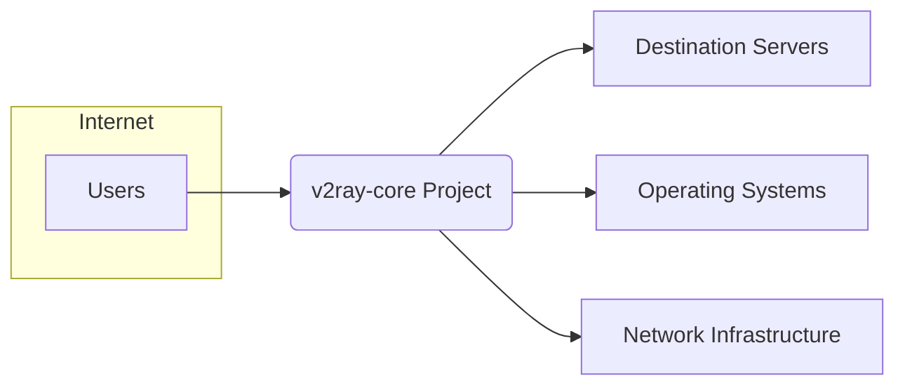
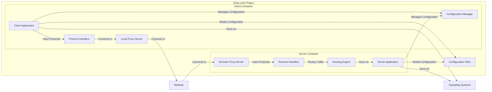
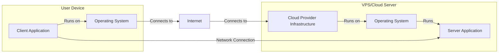

# BUSINESS POSTURE

- Business priorities and goals:
  - Provide a reliable and performant network proxy tool that can bypass network restrictions and ensure secure communication.
  - Offer a highly configurable and flexible solution adaptable to various network environments and user needs.
  - Maintain an open-source project that is community-driven and continuously improved.
- Most important business risks:
  - Misuse of the tool for illegal activities, potentially leading to negative legal or reputational consequences for the project and its developers.
  - Detection and blocking of the tool by sophisticated network censorship systems, reducing its effectiveness and user base.
  - Security vulnerabilities in the software that could be exploited to compromise user privacy or security.
  - Dependency on volunteer contributors and maintainers, which could impact project sustainability and development pace.

# SECURITY POSTURE

- Existing security controls:
  - security control: Open source code - publicly available for review and auditing. Implemented in: GitHub repository.
  - security control: Community contributions and peer review -  enhances code quality and security. Implemented in: GitHub contribution process.
  - security control: Use of Go language - known for memory safety and built-in security features. Implemented in: Project codebase.
  - security control: Cryptographic protocols - TLS, mKCP, etc. are used for secure communication. Implemented in: Core networking libraries.
- Accepted risks:
  - accepted risk: Potential for vulnerabilities in dependencies - project relies on external libraries which might contain vulnerabilities.
  - accepted risk: Risk of malicious contributions - open source nature means potential for malicious code injection by contributors.
  - accepted risk: Configuration complexity - complex configurations can lead to misconfigurations and security weaknesses.
- Recommended security controls:
  - security control: Automated security scanning - implement SAST and DAST tools in the CI/CD pipeline.
  - security control: Dependency vulnerability scanning - regularly scan dependencies for known vulnerabilities and update them.
  - security control: Security focused code reviews - dedicate specific code reviews to security aspects, especially for critical components.
  - security control: Penetration testing - conduct periodic penetration testing to identify potential vulnerabilities in deployed configurations.
- Security requirements:
  - Authentication:
    - Requirement: Support for various authentication methods to secure access to proxy servers.
    - Requirement: Strong password policies and recommendations for user-configured authentication.
  - Authorization:
    - Requirement: Fine-grained access control mechanisms to manage user permissions and access to resources.
    - Requirement: Principle of least privilege should be applied in the design of authorization mechanisms.
  - Input validation:
    - Requirement: Robust input validation for all user-provided data, especially configuration files and network inputs.
    - Requirement: Protection against common injection attacks (e.g., command injection, configuration injection).
  - Cryptography:
    - Requirement: Use of strong and up-to-date cryptographic algorithms and libraries for all security-sensitive operations.
    - Requirement: Proper key management practices for encryption keys and certificates.
    - Requirement: Secure implementation of TLS and other cryptographic protocols to ensure confidentiality and integrity of communication.

# DESIGN

## C4 CONTEXT



- Elements of context diagram:
  - - Name: Users
    - Type: Person
    - Description: Individuals who use v2ray-core to access the internet, bypass censorship, and enhance privacy.
    - Responsibilities: Configure and use v2ray-core client applications.
    - Security controls: Strong passwords for authentication, secure configuration practices, keeping software updated.
  - - Name: v2ray-core Project
    - Type: Software System
    - Description: The core software system providing network proxy functionalities, including routing, protocol handling, and encryption.
    - Responsibilities: Proxying network traffic, applying configured rules, ensuring secure communication.
    - Security controls: Input validation, secure cryptographic implementations, access control mechanisms, regular security updates.
  - - Name: Destination Servers
    - Type: External System
    - Description: Web servers, application servers, and other internet resources that users intend to access through v2ray-core.
    - Responsibilities: Hosting content and services accessed by users.
    - Security controls: Standard internet security practices, server hardening, firewalls, intrusion detection systems.
  - - Name: Operating Systems
    - Type: Infrastructure
    - Description: Operating systems (Windows, macOS, Linux, Android, iOS) on which v2ray-core client and server applications are installed and run.
    - Responsibilities: Providing runtime environment for v2ray-core, managing system resources.
    - Security controls: OS-level security configurations, regular patching, endpoint security software.
  - - Name: Network Infrastructure
    - Type: Infrastructure
    - Description: Network devices (routers, switches, firewalls) and network connections that facilitate communication between users, v2ray-core, and destination servers.
    - Responsibilities: Routing network traffic, enforcing network policies.
    - Security controls: Firewall rules, network segmentation, intrusion prevention systems, network monitoring.

## C4 CONTAINER



- Elements of container diagram:
  - - Name: Client Application
    - Type: Application
    - Description: User-facing application that provides interface for configuring and using v2ray-core client functionalities.
    - Responsibilities: User interaction, configuration management, initiating proxy connections.
    - Security controls: Secure storage of user credentials and configuration, input validation on user inputs, secure communication with local proxy server.
  - - Name: Configuration Manager
    - Type: Application Component
    - Description: Component responsible for loading, parsing, validating, and managing configuration files for both client and server.
    - Responsibilities: Configuration file handling, schema validation, providing configuration data to other components.
    - Security controls: Secure file access permissions, input validation on configuration data, protection against configuration injection attacks.
  - - Name: Protocol Handlers (Client & Server)
    - Type: Application Component
    - Description: Modules that implement various supported protocols (e.g., VMess, Shadowsocks, Trojan) for both client and server sides.
    - Responsibilities: Protocol encoding/decoding, encryption/decryption, handling protocol-specific logic.
    - Security controls: Secure implementation of cryptographic algorithms, adherence to protocol specifications, vulnerability management for protocol implementations.
  - - Name: Local Proxy Server
    - Type: Application
    - Description: Proxy server running locally on the user's device, accepting connections from applications and forwarding them through v2ray-core client.
    - Responsibilities: Listening for local connections, forwarding traffic to remote proxy server, applying client-side configurations.
    - Security controls: Access control to local proxy server (e.g., listening address and port), secure communication with client application.
  - - Name: Server Application
    - Type: Application
    - Description: Server-side application that receives proxied traffic, applies routing rules, and forwards traffic to destination servers.
    - Responsibilities: Receiving proxied connections, routing traffic based on configuration, managing server-side protocols.
    - Security controls: Access control to server application, secure handling of incoming connections, robust routing logic to prevent bypasses.
  - - Name: Routing Engine
    - Type: Application Component
    - Description: Component responsible for making routing decisions based on configured rules, including domain-based routing, geo-based routing, and other criteria.
    - Responsibilities: Traffic routing, rule evaluation, policy enforcement.
    - Security controls: Secure rule processing, prevention of routing bypasses, protection against rule injection attacks.
  - - Name: Remote Proxy Server
    - Type: Application
    - Description: Proxy server running remotely, acting as the entry point for proxied traffic and forwarding it to destination servers.
    - Responsibilities: Accepting remote connections, forwarding traffic to destination servers, applying server-side configurations.
    - Security controls: Strong authentication for remote access, secure communication channels, access control to remote proxy server.
  - - Name: Configuration Files
    - Type: Data Store
    - Description: Files storing configuration settings for v2ray-core client and server applications.
    - Responsibilities: Persisting configuration data.
    - Security controls: Secure file storage permissions, encryption of sensitive configuration data (e.g., private keys, passwords).

## DEPLOYMENT

- Deployment solutions:
  - Solution 1: Personal Use - Client application deployed on user's personal devices (desktop, laptop, mobile), server application deployed on a VPS (Virtual Private Server) or cloud instance.
  - Solution 2: Enterprise Use - Client application deployed on company workstations, server application deployed on company-managed servers or cloud infrastructure.
  - Solution 3: Cloud Service - Both client and server functionalities are offered as a cloud service, managed by a provider.

- Detailed deployment solution: Personal Use (Client on Desktop/Mobile, Server on VPS)



- Elements of deployment diagram:
  - - Name: Client Application (Deployment)
    - Type: Software Instance
    - Description: Instance of v2ray-core client application running on user's device.
    - Responsibilities: Proxying user's application traffic.
    - Security controls: OS-level security of user device, client application updates, secure configuration.
  - - Name: Operating System (User Device)
    - Type: Infrastructure Component
    - Description: Operating system (e.g., Windows, macOS, Android) on user's device.
    - Responsibilities: Providing runtime environment for client application.
    - Security controls: OS security hardening, regular patching, endpoint security software.
  - - Name: VPS/Cloud Server
    - Type: Infrastructure Instance
    - Description: Virtual Private Server or Cloud Server instance hosting v2ray-core server application.
    - Responsibilities: Hosting server application, providing network connectivity.
    - Security controls: Server hardening, firewall configuration, access control to server instance, regular security updates.
  - - Name: Server Application (Deployment)
    - Type: Software Instance
    - Description: Instance of v2ray-core server application running on VPS/Cloud Server.
    - Responsibilities: Proxying traffic from clients to destination servers.
    - Security controls: Server application updates, secure configuration, access control to server application.
  - - Name: Cloud Provider Infrastructure
    - Type: Infrastructure
    - Description: Underlying infrastructure provided by cloud provider (e.g., AWS, Azure, GCP) for VPS/Cloud Server.
    - Responsibilities: Providing physical hardware, network infrastructure, and basic security services.
    - Security controls: Cloud provider's security measures, physical security, network security, infrastructure monitoring.
  - - Name: Internet
    - Type: Network
    - Description: Public internet network connecting user device and VPS/Cloud Server.
    - Responsibilities: Providing network connectivity.
    - Security controls: Encryption of traffic over the internet (TLS), reliance on internet security protocols.

## BUILD

```mermaid
flowchart LR
    A[Developer] -- "Code Changes" --> B[Code Repository (GitHub)]
    B -- "Webhook Trigger" --> C[CI/CD System (GitHub Actions)]
    C -- "Build Process" --> D[Build Artifacts]
    D -- "Publish" --> E[Distribution Platforms (GitHub Releases)]
    D -- "Security Checks (SAST, Linters)" --> C
```

- Elements of build diagram:
  - - Name: Developer
    - Type: Person
    - Description: Software developers contributing code to the v2ray-core project.
    - Responsibilities: Writing code, committing changes, participating in code reviews.
    - Security controls: Secure development practices, code review process, access control to code repository.
  - - Name: Code Repository (GitHub)
    - Type: Software System
    - Description: GitHub repository hosting the v2ray-core source code.
    - Responsibilities: Version control, code storage, collaboration platform.
    - Security controls: Access control, branch protection, audit logs, vulnerability scanning by GitHub.
  - - Name: CI/CD System (GitHub Actions)
    - Type: Software System
    - Description: GitHub Actions used for automated build, test, and deployment processes.
    - Responsibilities: Build automation, running tests, performing security checks, publishing artifacts.
    - Security controls: Secure CI/CD configuration, access control to CI/CD workflows, secrets management, build environment security.
  - - Name: Build Artifacts
    - Type: Data
    - Description: Compiled binaries and other distributable files produced by the build process.
    - Responsibilities: Packaging software for distribution.
    - Security controls: Integrity checks (checksums, signatures), secure storage of artifacts.
  - - Name: Distribution Platforms (GitHub Releases)
    - Type: Software System
    - Description: Platforms used to distribute v2ray-core binaries to users, such as GitHub Releases.
    - Responsibilities: Software distribution, providing download access to users.
    - Security controls: Secure distribution channels (HTTPS), integrity verification for downloads, access control to release management.
  - - Name: Security Checks (SAST, Linters)
    - Type: Software System
    - Description: Static Application Security Testing (SAST) tools and linters integrated into the CI/CD pipeline to automatically check code for security vulnerabilities and code quality issues.
    - Responsibilities: Automated security analysis, code quality checks.
    - Security controls: Regularly updated security rules and vulnerability databases, configuration of SAST tools and linters, reporting and remediation of findings.

# RISK ASSESSMENT

- Critical business process we are trying to protect:
  - Providing users with reliable and secure access to the internet, bypassing censorship and ensuring privacy. The critical process is the secure and uninterrupted operation of the v2ray-core proxy functionality.
- Data we are trying to protect and their sensitivity:
  - Configuration data: Contains sensitive information such as server addresses, ports, user credentials, and encryption keys. Sensitivity: High. Confidentiality and integrity are crucial.
  - User traffic metadata: While v2ray-core aims to protect content, metadata such as connection timestamps, source and destination IPs (of proxy connections, not necessarily user's original IP), and protocol information might be logged or monitored. Sensitivity: Medium to High, depending on logging practices and legal context. Confidentiality is important.
  - Source code: Intellectual property and the foundation of the project. Sensitivity: Medium. Integrity and availability are important.

# QUESTIONS & ASSUMPTIONS

- Questions:
  - What are the specific legal and regulatory requirements for users of v2ray-core in different regions?
  - What are the typical threat actors targeting v2ray-core users and infrastructure?
  - What is the project's current process for handling security vulnerabilities and releasing security updates?
  - Are there any specific performance requirements or constraints that impact security design decisions?
- Assumptions:
  - BUSINESS POSTURE: The primary goal is to provide a secure and reliable tool for internet access and censorship circumvention, even if it might be used for purposes that are not universally accepted.
  - SECURITY POSTURE: Security is a high priority for the project, and there is a willingness to implement recommended security controls to mitigate identified risks. The project follows common open-source security practices.
  - DESIGN: The provided design diagrams represent a typical and simplified deployment scenario. Actual deployments can be more complex and varied. The focus is on the core components and their interactions from a security perspective.