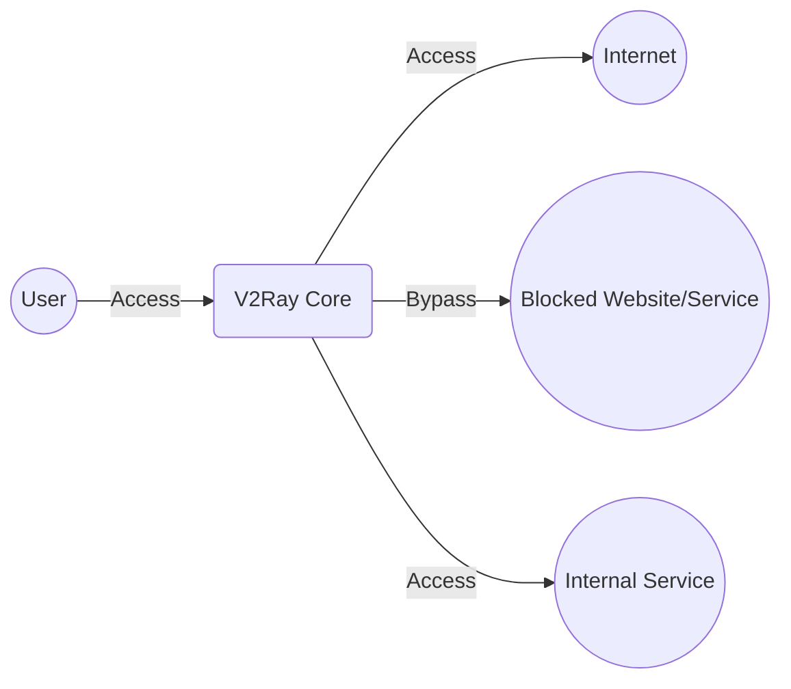
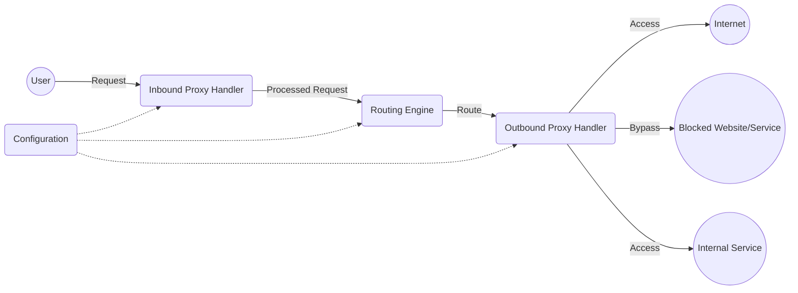
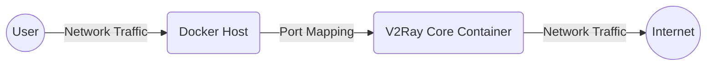
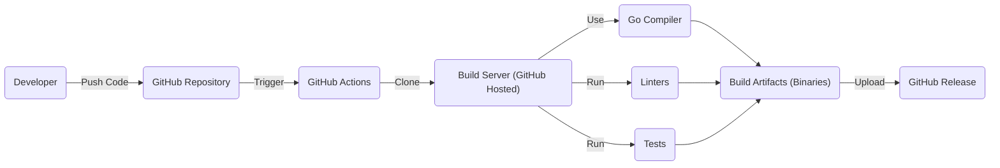

# BUSINESS POSTURE

Business Priorities and Goals:

*   Provide a platform for secure and private network communication, bypassing censorship and network restrictions.
*   Offer a flexible and customizable proxy solution adaptable to various network environments and user needs.
*   Maintain a high level of performance and reliability for users relying on the software for critical communication.
*   Foster an open-source community for continuous development, improvement, and transparency.
*   Ensure the software remains accessible and usable, even in the face of sophisticated blocking techniques.

Most Important Business Risks:

*   Compromise of the software's core functionality, leading to exposure of user data and traffic.
*   Legal and regulatory challenges due to the software's use in circumventing censorship.
*   Reputational damage resulting from security vulnerabilities or misuse of the platform.
*   Sustainability challenges related to funding, development, and community maintenance.
*   Inability to keep pace with evolving censorship and network monitoring techniques.

# SECURITY POSTURE

Existing Security Controls:

*   security control: Encryption of network traffic using various protocols (VMess, Shadowsocks, Socks, HTTP/2, etc.). Implemented within the core proxy logic.
*   security control: Obfuscation techniques to disguise traffic and evade detection. Implemented within specific protocol implementations.
*   security control: Routing and traffic management capabilities to control data flow and bypass restrictions. Implemented in the core routing engine.
*   security control: Support for multiple inbound and outbound proxy protocols. Implemented in the core proxy framework.
*   security control: Regular updates and community contributions to address vulnerabilities and improve security. Managed through the GitHub repository and open-source development process.
*   security control: Configuration file validation to prevent common misconfigurations. Implemented in the configuration loading logic.

Accepted Risks:

*   accepted risk: Potential for misuse of the software for illegal activities.
*   accepted risk: Reliance on third-party libraries and dependencies, which may introduce vulnerabilities.
*   accepted risk: Possibility of sophisticated attacks that bypass existing security measures.
*   accepted risk: Challenges in providing user support and addressing security concerns in a timely manner due to the open-source nature of the project.
*   accepted risk: The inherent risks associated with operating in adversarial network environments.

Recommended Security Controls:

*   security control: Implement a comprehensive security audit process, including regular penetration testing and code reviews.
*   security control: Develop a formal vulnerability disclosure program to encourage responsible reporting of security issues.
*   security control: Integrate Software Bill of Materials (SBOM) generation to improve supply chain security.
*   security control: Enhance configuration file validation with more robust checks and security defaults.
*   security control: Provide more detailed documentation and guidance on secure configuration and deployment practices.

Security Requirements:

*   Authentication:
    *   The system must support strong authentication mechanisms for clients connecting to the proxy server.
    *   Authentication credentials must be protected both in transit and at rest.
    *   Consider supporting multi-factor authentication for enhanced security.
*   Authorization:
    *   The system should allow for granular control over access to specific resources and destinations.
    *   Access control policies should be configurable based on user identity, group membership, or other attributes.
*   Input Validation:
    *   All input from clients and external sources must be strictly validated to prevent injection attacks and other vulnerabilities.
    *   Configuration files should be thoroughly validated to prevent misconfigurations that could compromise security.
*   Cryptography:
    *   Strong, industry-standard cryptographic algorithms must be used for encryption and data integrity.
    *   Key management practices should follow best practices to ensure the confidentiality and integrity of cryptographic keys.
    *   Regularly review and update cryptographic implementations to address emerging threats and vulnerabilities.

# DESIGN

## C4 CONTEXT

Element Descriptions:

*   Element:
    *   Name: User
    *   Type: Person
    *   Description: Represents an individual or system using V2Ray Core to access the internet or internal services.
    *   Responsibilities: Initiates connections to V2Ray Core, provides authentication credentials (if required), and consumes services accessed through V2Ray.
    *   Security controls: Uses strong passwords, keeps client software updated.
*   Element:
    *   Name: V2Ray Core
    *   Type: Software System
    *   Description: The core software component providing proxy and routing functionality.
    *   Responsibilities: Handles inbound and outbound connections, encrypts and decrypts traffic, enforces routing rules, and provides obfuscation.
    *   Security controls: Encryption, obfuscation, routing, multiple protocol support, configuration validation.
*   Element:
    *   Name: Internet
    *   Type: External System
    *   Description: The global network of interconnected computer networks.
    *   Responsibilities: Provides access to external websites and services.
    *   Security controls: Relies on standard internet security protocols (HTTPS, etc.).
*   Element:
    *   Name: Blocked Website/Service
    *   Type: External System
    *   Description: A website or service that is restricted or censored in the user's network environment.
    *   Responsibilities: Provides content or services that are blocked by network restrictions.
    *   Security controls: N/A (external system).
*   Element:
    *   Name: Internal Service
    *   Type: External System
    *   Description: Represents a service within a private network that the user wants to access through V2Ray.
    *   Responsibilities: Provides a specific service within a private network.
    *   Security controls: Relies on internal network security measures.

## C4 CONTAINER

Element Descriptions:

*   Element:
    *   Name: User
    *   Type: Person
    *   Description: Represents an individual or system using V2Ray Core.
    *   Responsibilities: Initiates connections, provides credentials, consumes services.
    *   Security controls: Uses strong passwords, keeps client software updated.
*   Element:
    *   Name: Inbound Proxy Handler
    *   Type: Container
    *   Description: Handles incoming connections from clients, supporting various proxy protocols (VMess, Shadowsocks, Socks, etc.).
    *   Responsibilities: Accepts connections, authenticates clients, decrypts incoming traffic, forwards traffic to the routing engine.
    *   Security controls: Protocol-specific authentication, decryption, input validation.
*   Element:
    *   Name: Outbound Proxy Handler
    *   Type: Container
    *   Description: Handles outgoing connections to the internet or internal services, supporting various proxy protocols.
    *   Responsibilities: Establishes connections to target servers, encrypts outgoing traffic, applies obfuscation (if configured).
    *   Security controls: Encryption, obfuscation, protocol-specific security measures.
*   Element:
    *   Name: Routing Engine
    *   Type: Container
    *   Description: Determines the appropriate outbound proxy handler based on routing rules defined in the configuration.
    *   Responsibilities: Evaluates routing rules, selects the appropriate outbound proxy, manages traffic flow.
    *   Security controls: Rule-based access control, traffic filtering.
*   Element:
    *   Name: Configuration
    *   Type: Container
    *   Description: Stores the configuration settings for V2Ray Core, including inbound/outbound protocols, routing rules, and security settings.
    *   Responsibilities: Provides configuration data to other components.
    *   Security controls: Configuration file validation, secure storage of sensitive data (if applicable).
*   Element:
    *   Name: Internet
    *   Type: External System
    *   Description: The global network of interconnected computer networks.
    *   Responsibilities: Provides access to external websites and services.
    *   Security controls: Relies on standard internet security protocols (HTTPS, etc.).
*   Element:
    *   Name: Blocked Website/Service
    *   Type: External System
    *   Description: A website or service that is restricted or censored.
    *   Responsibilities: Provides content or services that are blocked.
    *   Security controls: N/A (external system).
*   Element:
    *   Name: Internal Service
    *   Type: External System
    *   Description: A service within a private network.
    *   Responsibilities: Provides a specific service within a private network.
    *   Security controls: Relies on internal network security measures.

## DEPLOYMENT

Possible Deployment Solutions:

1.  Standalone Server (VPS, Dedicated Server): V2Ray Core runs directly on a virtual private server or dedicated server.
2.  Docker Container: V2Ray Core runs within a Docker container, providing isolation and portability.
3.  Cloud Provider (AWS, GCP, Azure, etc.): V2Ray Core can be deployed on virtual machines or container services within a cloud environment.
4.  Home Network (Raspberry Pi, Router): V2Ray Core can run on a device within a home network, providing proxy services for local devices.

Chosen Deployment Solution (Docker Container):

Element Descriptions:

*   Element:
    *   Name: User
    *   Type: Person
    *   Description: An individual or system using V2Ray Core.
    *   Responsibilities: Initiates connections to the V2Ray Core instance.
    *   Security controls: Uses strong passwords, keeps client software updated.
*   Element:
    *   Name: Docker Host
    *   Type: Infrastructure Node
    *   Description: The physical or virtual machine hosting the Docker engine and running the V2Ray Core container.
    *   Responsibilities: Provides the runtime environment for the Docker container.
    *   Security controls: Operating system hardening, firewall rules, regular security updates.
*   Element:
    *   Name: V2Ray Core Container
    *   Type: Container Instance
    *   Description: The isolated environment running the V2Ray Core software.
    *   Responsibilities: Handles inbound and outbound proxy connections, enforces routing rules, provides encryption and obfuscation.
    *   Security controls: All security controls implemented within V2Ray Core (encryption, obfuscation, etc.), container isolation.
*   Element:
    *   Name: Internet
    *   Type: External System
    *   Description: The global network of interconnected computer networks.
    *   Responsibilities: Provides access to external websites and services.
    *   Security controls: Relies on standard internet security protocols.

## BUILD

The V2Ray Core build process is primarily managed through GitHub Actions, providing automation and security checks.

Build Process Description:

1.  Developer pushes code changes to the GitHub repository.
2.  GitHub Actions workflow is triggered by the push event.
3.  The workflow clones the repository onto a GitHub-hosted build server.
4.  The Go compiler is used to build the V2Ray Core binaries.
5.  Linters (e.g., gofmt, govet) are run to check code style and potential errors.
6.  Unit tests and integration tests are executed to verify the functionality of the code.
7.  If all checks and tests pass, the build artifacts (binaries) are created.
8.  The build artifacts are uploaded to a GitHub Release, making them available for download.

Security Controls in Build Process:

*   security control: Automated build process using GitHub Actions, ensuring consistency and reproducibility.
*   security control: Use of linters to enforce code style and identify potential errors.
*   security control: Execution of tests to verify code functionality and prevent regressions.
*   security control: Build artifacts are generated on trusted GitHub-hosted runners.
*   security control: GitHub's built-in security features, such as code scanning and dependency analysis (can be enabled).

# RISK ASSESSMENT

Critical Business Processes to Protect:

*   Secure and private communication: Ensuring users can communicate without fear of surveillance or censorship.
*   Bypassing network restrictions: Enabling access to blocked websites and services.
*   Maintaining user trust: Protecting user data and privacy.
*   Continuous operation: Ensuring the service remains available and reliable.

Data to Protect and Sensitivity:

*   User IP addresses: Highly sensitive, as they can reveal user location and identity.
*   Traffic metadata: Moderately sensitive, as it can reveal communication patterns and potentially identify accessed websites.
*   Configuration data: Potentially sensitive, as it may contain authentication credentials or other sensitive information.  If credentials are included, this becomes highly sensitive.
*   User content (if not end-to-end encrypted): Highly sensitive, as it represents the actual data being transmitted. V2Ray itself does not generally provide end-to-end encryption; it relies on the applications using it to do so.

# QUESTIONS & ASSUMPTIONS

Questions:

*   What specific threat actors are of greatest concern (e.g., nation-state actors, cybercriminals)?
*   What are the specific legal and regulatory requirements in the jurisdictions where V2Ray Core is most used?
*   Are there any existing security audits or penetration test reports available?
*   What is the process for handling security vulnerabilities reported by external researchers?
*   What level of user support is provided, and how are security concerns addressed?
*   Are there plans to implement end-to-end encryption within V2Ray Core itself?
*   How are cryptographic keys managed and protected?
*   What are the specific obfuscation techniques used, and how effective are they against advanced detection methods?
*   How is the project funded, and what are the plans for long-term sustainability?
*   What is the process for reviewing and merging contributions from external developers?

Assumptions:

*   BUSINESS POSTURE: The primary goal is to provide a secure and reliable proxy service, even at the expense of some usability or performance.
*   SECURITY POSTURE: Users are responsible for securing their own devices and choosing strong passwords.  The project prioritizes transparency and open-source development to foster community trust and security.
*   DESIGN: The configuration file is the primary mechanism for controlling V2Ray Core's behavior.  The software is designed to be flexible and adaptable to various network environments. The deployment environment is secured by the user or provider.