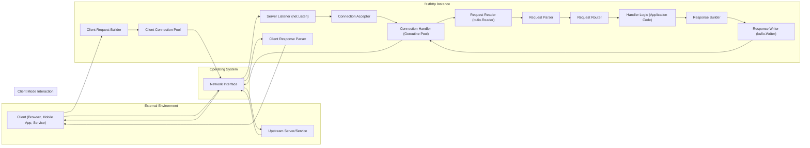

## Project Design Document: fasthttp (Improved)

**1. Introduction**

This document provides a detailed architectural design of the `fasthttp` library, a high-performance HTTP implementation for the Go programming language. This document is intended for developers, security engineers, and architects who need to understand the internal workings of `fasthttp`, particularly for the purpose of threat modeling and security analysis. `fasthttp` is designed for speed and efficiency, making it suitable for applications requiring high throughput and low resource consumption. This document outlines the library's structure, key components, and data flow to facilitate the identification of potential security vulnerabilities.

**2. Goals and Objectives**

*   **Maximize Request Processing Speed:** Achieve significantly higher request per second (RPS) compared to the standard `net/http` library under similar load conditions.
*   **Minimize Memory Allocations:** Reduce garbage collection overhead by aggressively minimizing memory allocations per request.
*   **Efficient Resource Utilization:** Lower CPU and memory footprint for a given workload compared to standard alternatives.
*   **Provide a User-Friendly API:** Offer a relatively straightforward API for implementing HTTP servers and clients, while exposing necessary low-level controls.
*   **Maintain Core HTTP Functionality:** Support essential HTTP features, including various methods, headers, status codes, and body handling.
*   **Enable Secure Communication:** Facilitate the implementation of secure connections using TLS/SSL.
*   **Serve as a Foundation for Secure Applications:** Provide a building block for secure and performant HTTP-based applications by enabling thorough security analysis.

**3. High-Level Architecture**

`fasthttp` functions as both an HTTP server and an HTTP client. Its architecture is centered around efficient management of network connections and the processing of HTTP requests and responses. The library interacts directly with the operating system's networking capabilities.

**4. Component Breakdown**

This section provides a more detailed breakdown of the key components within `fasthttp`.

*   **Server Listener (`net.Listen`)**:
    *   Utilizes the Go standard library's `net` package to listen for incoming TCP connections on a specified network address and port.
    *   Creates a socket that passively waits for connection attempts from clients.

*   **Connection Acceptor**:
    *   Continuously accepts new incoming connections from the listening socket.
    *   Typically runs in a dedicated goroutine.
    *   Hands off accepted connections to the Connection Handler.

*   **Connection Handler (Goroutine Pool)**:
    *   Manages individual client connections concurrently using a pool of goroutines.
    *   Each goroutine handles the lifecycle of a single connection, including reading requests and writing responses.
    *   Implements connection keep-alive logic to reuse connections for multiple requests.

*   **Request Reader (`bufio.Reader`)**:
    *   Uses `bufio.Reader` for efficient buffered reading of data from the network connection.
    *   Reduces the number of system calls required to read data.

*   **Request Parser**:
    *   Parses the raw byte stream read from the connection into a structured `Request` object.
    *   This is a critical performance area, implemented with minimal allocations.
    *   Extracts HTTP method, URI, headers (using custom parsing logic), and body.
    *   Includes logic for handling different HTTP versions and encodings.

*   **Request Router**:
    *   Matches the parsed `Request` to the appropriate handler function based on the configured routes.
    *   Typically involves comparing the request URI and method against registered routes.
    *   May support pattern matching or regular expressions for more complex routing.

*   **Handler Logic (Application Code)**:
    *   The application-specific code that processes the incoming request and generates a response.
    *   Receives the `Request` object and a `Response` writer as arguments.

*   **Response Builder**:
    *   Provides methods for constructing the HTTP response, including setting the status code, headers, and body.
    *   Optimized for efficient byte buffer manipulation.

*   **Response Writer (`bufio.Writer`)**:
    *   Uses `bufio.Writer` for efficient buffered writing of the response data back to the network connection.
    *   Reduces the number of system calls for writing.

*   **Client Connection Pool**: (Client Mode)
    *   Maintains a pool of active connections to remote servers for efficient reuse.
    *   Reduces the overhead of establishing new connections for repeated requests to the same host.
    *   Manages connection timeouts and closure.

*   **Client Request Builder**: (Client Mode)
    *   Provides a convenient way to construct HTTP requests programmatically, setting headers, body, and other parameters.

*   **Client Response Parser**: (Client Mode)
    *   Parses the raw byte stream received from the remote server into a structured `Response` object.
    *   Extracts the status code, headers, and body.

**5. Data Flow (Detailed)**

This section provides a more granular view of how data flows through `fasthttp`.

**5.1. Server Mode Data Flow:**

1. A client initiates a TCP connection to the server's listening socket managed by the **Server Listener**.
2. The **Connection Acceptor** accepts the new connection.
3. The accepted connection is passed to a **Connection Handler** goroutine from the pool.
4. The **Request Reader** reads raw bytes from the connection's socket into a buffer.
5. The **Request Parser** processes the buffered bytes to extract the HTTP method, URI, headers (populating a custom header structure), and body. This involves careful parsing of the HTTP request line and header fields.
6. The **Request Router** examines the parsed URI and method to find a matching handler function.
7. The matched **Handler Logic** (application code) is executed, receiving the parsed `Request` and a `Response` writer.
8. The handler uses the **Response Builder** to set the response status code, headers, and body. The body is typically written to a byte buffer.
9. The **Response Writer** takes the prepared response data from the buffer and writes it to the client's socket.
10. The **Connection Handler** may keep the connection alive for subsequent requests based on HTTP keep-alive headers or close the connection.

**5.2. Client Mode Data Flow:**

1. The application initiates an HTTP request using the `fasthttp` client API, specifying the method, URL, headers, and body.
2. The **Client Request Builder** constructs a `Request` object.
3. The **Client Connection Pool** checks for an existing idle connection to the target host.
    *   If an idle connection exists, it is retrieved.
    *   If no idle connection exists, a new connection is established via the operating system's networking interface.
4. The request is serialized into a raw byte stream and sent over the connection.
5. The remote server processes the request and sends back a response.
6. The **Client Response Parser** reads and parses the raw bytes of the response from the connection, extracting the status code, headers, and body.
7. The parsed `Response` object is returned to the calling application.
8. The connection may be returned to the **Client Connection Pool** for reuse.

**6. Security Considerations (For Threat Modeling)**

This section details potential security considerations, categorized for clarity, which should be the focus of subsequent threat modeling activities.

*   **Input Validation & Injection Attacks:**
    *   **HTTP Request Smuggling:** Vulnerabilities in parsing request headers (e.g., `Content-Length`, `Transfer-Encoding`) could lead to request smuggling.
    *   **Header Injection:** Improper handling of request headers might allow attackers to inject malicious headers.
    *   **URI Parsing Vulnerabilities:** Flaws in URI parsing could lead to unexpected routing or access control bypasses.
    *   **Body Parsing Issues:** Incorrectly parsing request bodies (e.g., JSON, XML) could lead to vulnerabilities.

*   **Denial of Service (DoS):**
    *   **Slowloris Attacks:** Susceptibility to attacks that slowly send partial requests to exhaust server resources.
    *   **Resource Exhaustion:** Lack of proper limits on connections, request size, or header size could lead to resource exhaustion.
    *   **CPU Exhaustion:** Processing overly complex requests or large numbers of requests could lead to CPU exhaustion.

*   **TLS/SSL Security:**
    *   **Insecure TLS Configuration:** Using weak ciphers, outdated protocols, or improper certificate validation.
    *   **Man-in-the-Middle (MITM) Attacks:** Vulnerability to MITM attacks if TLS is not properly implemented or configured.

*   **Memory Safety & Resource Management:**
    *   **Memory Leaks:** Potential for memory leaks if resources are not properly released.
    *   **Buffer Overflows:** Although Go has memory safety, unsafe operations or incorrect buffer handling could introduce vulnerabilities.

*   **Logic Flaws & Application-Level Security:**
    *   **Authentication and Authorization Bypass:** Vulnerabilities in the application's handler logic.
    *   **Session Management Issues:** Insecure handling of session tokens or cookies.

*   **Dependency Vulnerabilities:**
    *   Vulnerabilities in the underlying Go standard library or other dependencies.

**7. Dependencies**

`fasthttp` relies primarily on the Go standard library for core functionalities:

*   `net`: Provides fundamental networking primitives for TCP listening and connection management (`net.Listen`, `net.Conn`).
*   `bufio`: Enables buffered input and output operations for efficient reading and writing to network connections (`bufio.Reader`, `bufio.Writer`).
*   `sync`: Offers synchronization primitives like mutexes and wait groups for managing concurrent access to shared resources.
*   `time`: Used for time-related operations, including setting timeouts and managing connection lifecycles.
*   `io`: Provides basic interfaces for I/O operations.
*   `crypto/tls`: Enables the implementation of secure connections using TLS/SSL.
*   `strconv`: Used for converting strings to numbers and vice versa, often for parsing headers.

**8. Deployment Model**

`fasthttp` applications can be deployed in various configurations, each with its own security implications:

*   **Standalone Server (Directly Exposed):**
    *   The `fasthttp` application directly listens on a public IP address and port.
    *   Requires careful configuration of firewalls and security settings.
    *   TLS termination is typically handled by the `fasthttp` application itself.

*   **Behind a Reverse Proxy (e.g., Nginx, HAProxy):**
    *   The `fasthttp` application runs behind a reverse proxy.
    *   The reverse proxy handles tasks like TLS termination, load balancing, request routing, and potentially some security features (e.g., rate limiting, WAF).
    *   Requires secure communication between the reverse proxy and the `fasthttp` application (e.g., using private networks or mutual TLS).

*   **As a Client Library within Another Application:**
    *   The `fasthttp` client is integrated into another application to make outbound HTTP requests.
    *   Security considerations focus on the application's handling of sensitive data and the security of the target servers.

*   **Containerized Environments (e.g., Docker, Kubernetes):**
    *   `fasthttp` applications can be deployed within containers.
    *   Security considerations include container image security, network policies, and orchestration platform security.

**9. Future Considerations**

*   **Enhanced HTTP/2 and HTTP/3 Support:** Further development and refinement of support for newer HTTP protocols.
*   **Improved Observability and Monitoring:** Integration with tracing and monitoring tools for better performance analysis and security auditing.
*   **More Granular Security Controls:** Providing more options for configuring security-related parameters, such as timeouts, header limits, and request size limits.
*   **Standardized Middleware Interfaces:**  Potentially adopting or creating more standardized middleware interfaces for easier integration with other libraries.
*   **Formal Security Audits:** Conducting regular security audits by external experts to identify and address potential vulnerabilities.

This improved design document provides a more detailed and structured overview of the `fasthttp` library, specifically tailored for threat modeling. The outlined components, data flow, and security considerations offer a solid foundation for identifying and mitigating potential risks.
