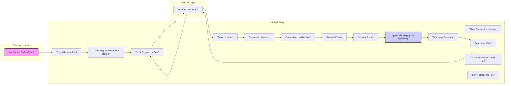

# Project Design Document: fasthttp (Improved)

**1. Introduction**

This document provides an enhanced architectural design of the `fasthttp` project, a high-performance HTTP implementation for Go. This detailed overview aims to foster a deeper understanding of the system's components, their interactions, and the underlying architecture. This document serves as a crucial foundation for subsequent threat modeling and security analysis activities.

**2. Project Overview**

* **Project Name:** fasthttp
* **Project Repository:** [https://github.com/valyala/fasthttp](https://github.com/valyala/fasthttp)
* **Project Description:** `fasthttp` is a highly optimized HTTP server and client library written in Go. Its primary design goal is to achieve maximum performance and efficiency by minimizing memory allocations, reducing system call overhead, and leveraging Go's concurrency features. This makes it particularly well-suited for applications requiring high throughput and low latency.
* **Purpose of this Document:** To provide a clear, detailed, and improved architectural overview of `fasthttp`, specifically tailored for threat modeling and security analysis. This revision aims to provide more granular detail and clarity compared to the previous version.

**3. Architectural Design**

The `fasthttp` library employs a non-blocking, event-driven architecture, heavily utilizing Go's concurrency primitives (goroutines and channels) to manage numerous concurrent connections efficiently. It emphasizes direct manipulation of byte slices and avoids unnecessary data copying to enhance performance.

* **3.1. High-Level Architecture Diagram**

* **3.2. Component Description**

    * **Application Code (Client) ("'Application Code (Client)'"):** This represents the user's Go application code that utilizes the `fasthttp` client API to initiate HTTP requests to external servers.
    * **Client Request Pool ("'Client Request Pool'"):** A pool of pre-allocated `Request` objects. This mechanism minimizes the overhead of creating new request objects for each outgoing client request, improving performance by reusing memory.
    * **Client Connection Pool ("'Client Connection Pool'"):** Manages a pool of persistent TCP connections to remote servers. This allows for efficient reuse of connections for multiple requests to the same server, reducing the latency associated with establishing new connections.
    * **Client Request/Response Handler ("'Client Request/Response Handler'"):**  Responsible for orchestrating the process of sending HTTP requests and receiving responses on the client side. This includes retrieving connections from the pool, serializing the request, sending it over the network, receiving the response, and parsing it.
    * **Client Connection Manager ("'Client Connection Manager'"):**  Handles the lifecycle of client-side TCP connections, including establishing new connections, maintaining keep-alive connections, and closing idle or faulty connections.
    * **Server Listener ("'Server Listener'"):**  Binds to a specified network address and port and listens for incoming TCP connection requests from clients.
    * **Connection Acceptor ("'Connection Acceptor'"):** Accepts new incoming TCP connections established by clients. For each accepted connection, it typically hands it off to a connection handler.
    * **Connection Handler Pool ("'Connection Handler Pool'"):** A pool of goroutines that concurrently handle individual client connections. Each goroutine in the pool is responsible for processing the requests on a single connection.
    * **Request Parser ("'Request Parser'"):**  Parses the raw byte stream of an incoming HTTP request from the network connection. This involves extracting the request method, URL, headers, and body. `fasthttp` implements its own efficient parsing logic to minimize overhead.
    * **Request Router ("'Request Router'"):**  Examines the parsed request (typically the URL path) and determines which user-defined handler function should be invoked to process the request.
    * **Application Logic (User Handlers) ("'Application Logic (User Handlers)'"):** These are the Go functions provided by the application developer that contain the specific business logic for handling different HTTP requests. They receive a `RequestCtx` object and are responsible for generating the HTTP response.
    * **Response Generator ("'Response Generator'"):**  Constructs the HTTP response object based on the output of the application logic. This involves setting the response status code, headers, and body.
    * **Response Writer ("'Response Writer'"):**  Writes the generated HTTP response data back to the network connection. `fasthttp` optimizes this process by directly writing to the underlying socket.
    * **Server Request Context Pool ("'Server Request Context Pool'"):** A pool of reusable `RequestCtx` objects. `RequestCtx` holds the request and response objects for a single HTTP transaction on the server side. Pooling these objects reduces memory allocation.
    * **Server Response Pool ("'Server Response Pool'"):** A pool of reusable `Response` objects for efficient creation of HTTP responses on the server side.
    * **Network Connection ("'Network Connection'"):** Represents the underlying TCP socket connection between the client and the server.

* **3.3. Data Flow**

    * **Client-Side Request Initiation:**
        * The "Application Code (Client)" initiates an HTTP request using the `fasthttp` client API.
        * A `Request` object is potentially retrieved from the "'Client Request Pool'".
        * The request details (URL, headers, body) are populated in the `Request` object.
        * The request is passed to the "'Client Request/Response Handler'".
        * The handler attempts to retrieve an existing connection from the "'Client Connection Pool'" for the target host. If no connection exists or all connections are busy, a new connection is established by the "'Client Connection Manager'".
        * The request is serialized into a byte stream and sent over the "'Network Connection'".

    * **Client-Side Response Handling:**
        * The "'Client Request/Response Handler'" waits for the response from the server over the "'Network Connection'".
        * The response data is read from the network.
        * The response is parsed by the "'Client Request/Response Handler'".
        * The parsed response is returned to the "Application Code (Client)".
        * The connection is potentially returned to the "'Client Connection Pool'" for reuse.
        * The `Request` object is potentially returned to the "'Client Request Pool'".

    * **Server-Side Request Handling:**
        * The "'Server Listener'" listens for incoming connection requests.
        * The "'Connection Acceptor'" accepts a new connection.
        * A goroutine from the "'Connection Handler Pool'" is assigned to handle the new connection.
        * A `RequestCtx` object is potentially retrieved from the "'Server Request Context Pool'".
        * Raw request data is read from the "'Network Connection'".
        * The "'Request Parser'" parses the raw bytes into a structured HTTP request.
        * The "'Request Router'" matches the request to the appropriate handler in the "'Application Logic (User Handlers)'".
        * The selected handler processes the request using the provided `RequestCtx`.
        * The handler generates a response, setting headers, status code, and body within the `RequestCtx`.
        * The "'Response Generator'" (implicitly within the handler or framework) prepares the response.
        * The "'Response Writer'" writes the response data back to the "'Network Connection'".
        * The connection may be kept alive for subsequent requests or closed.
        * The `RequestCtx` and potentially the `Response` object are returned to their respective pools.

**4. Key Technologies**

* **Core Language:** Go
* **Networking Foundation:**  Standard Go `net` package for low-level TCP socket operations.
* **Concurrency Management:** Go's built-in goroutines and channels for efficient concurrent processing of connections and requests.
* **Memory Optimization:**  Emphasis on minimizing memory allocations through techniques like object pooling and direct byte slice manipulation.
* **HTTP Parsing:** Custom, high-performance HTTP parsing implementation within `fasthttp` to avoid the overhead of standard library parsing.

**5. Security Considerations**

This section outlines key security considerations based on the architectural design of `fasthttp`. This serves as an initial assessment for more in-depth threat modeling.

* **Input Validation (Request Parsing):**
    * **Threat:** Vulnerabilities in the "'Request Parser'" could allow attackers to send maliciously crafted requests leading to issues like HTTP Request Smuggling, Header Injection, or buffer overflows.
    * **Examples:**  Exploiting lenient parsing of headers, excessively long URLs, or malformed request bodies.
    * **Mitigation:**  Strict adherence to HTTP standards, robust input validation, and handling of edge cases in the parser.

* **Connection Handling and Resource Management:**
    * **Threat:** Improper management of connections in the "'Connection Handler Pool'" or "'Client Connection Manager'" can lead to resource exhaustion and Denial of Service (DoS) attacks.
    * **Examples:**  Slowloris attacks exploiting persistent connections, SYN flood attacks targeting the "'Server Listener'".
    * **Mitigation:**  Setting appropriate connection limits, timeouts for idle connections, and implementing mechanisms to mitigate SYN flood attacks (e.g., SYN cookies).

* **Application Logic Security:**
    * **Threat:** Security vulnerabilities within the "'Application Logic (User Handlers)'" are outside the direct control of `fasthttp` but are critical for overall system security. `fasthttp` provides the transport layer, but the application logic is responsible for secure handling of data.
    * **Examples:**  SQL injection, cross-site scripting (XSS), insecure direct object references (IDOR).
    * **Mitigation:** Secure coding practices, input sanitization, output encoding within the application logic.

* **Denial of Service (DoS) Resilience:**
    * **Threat:** The library needs to be resilient against various DoS attacks targeting different layers.
    * **Examples:**  High volumes of requests, slow clients, resource exhaustion attacks.
    * **Mitigation:**  Rate limiting, request size limits, connection concurrency limits, and proper handling of timeouts.

* **Memory Safety:**
    * **Threat:** While Go provides memory safety, the performance optimizations in `fasthttp`, involving direct byte manipulation and object pooling, require careful implementation to avoid memory leaks, use-after-free vulnerabilities, or data corruption.
    * **Mitigation:**  Thorough testing, code reviews, and careful management of pooled objects.

* **TLS/SSL Implementation:**
    * **Threat:** If TLS is used (typically via Go's `crypto/tls` package), misconfigurations or vulnerabilities in the TLS setup can compromise confidentiality and integrity of communication.
    * **Examples:**  Using weak cipher suites, improper certificate validation.
    * **Mitigation:**  Following security best practices for TLS configuration, ensuring proper certificate management, and staying updated with security patches for the underlying TLS library.

* **Request Routing Security:**
    * **Threat:** Vulnerabilities in the "'Request Router'" could allow attackers to bypass intended access controls or reach unintended handlers.
    * **Examples:**  Path traversal vulnerabilities in route matching.
    * **Mitigation:**  Careful design and implementation of the routing logic, avoiding ambiguous or overly permissive route patterns.

**6. Deployment Considerations**

* **Library Integration:** `fasthttp` is primarily used as a library embedded within Go applications to provide HTTP server or client functionality.
* **Standalone Server Applications:** It can be used to build standalone, high-performance HTTP servers.
* **Reverse Proxies and Load Balancers:** `fasthttp` servers are often deployed behind reverse proxies (like Nginx or HAProxy) or load balancers for enhanced security, scalability, and load distribution. The reverse proxy can handle tasks like TLS termination, request filtering, and caching.
* **Containerization (Docker, Kubernetes):**  Commonly deployed within Docker containers for consistent environment and easier management, often orchestrated by Kubernetes.
* **Cloud Environments (AWS, GCP, Azure):**  Well-suited for deployment in cloud environments, leveraging cloud-specific load balancing and auto-scaling features.

**7. Assumptions and Constraints**

* **Go Programming Language Dependency:** The project is built entirely in Go and requires a Go runtime environment.
* **TCP Protocol Focus:** `fasthttp` primarily operates over the TCP protocol for HTTP communication.
* **HTTP/1.1 and HTTP/2 Support:** While primarily focused on HTTP/1.1 for performance reasons, `fasthttp` also offers HTTP/2 support. Security considerations and implementation details might differ between the protocols.
* **Security Responsibility for User Handlers:** The security of the application logic within the user-provided handlers is the responsibility of the application developer. `fasthttp` provides the underlying HTTP framework but does not inherently secure the application logic.

**8. Glossary**

* **Goroutine:** A lightweight, concurrently executing function in Go.
* **RequestCtx:** A central context object in `fasthttp` that encapsulates both the HTTP request and response objects for a single transaction on the server side.
* **Object Pooling:** A performance optimization technique where objects are pre-allocated and reused to reduce the overhead of frequent memory allocation and garbage collection.
* **SYN Flood:** A type of denial-of-service attack where an attacker rapidly initiates a connection to a server without finalizing the connection.

**9. References**

* **fasthttp GitHub Repository:** [https://github.com/valyala/fasthttp](https://github.com/valyala/fasthttp)