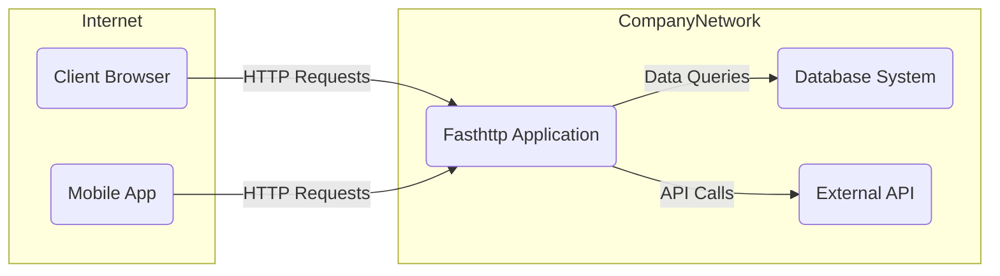
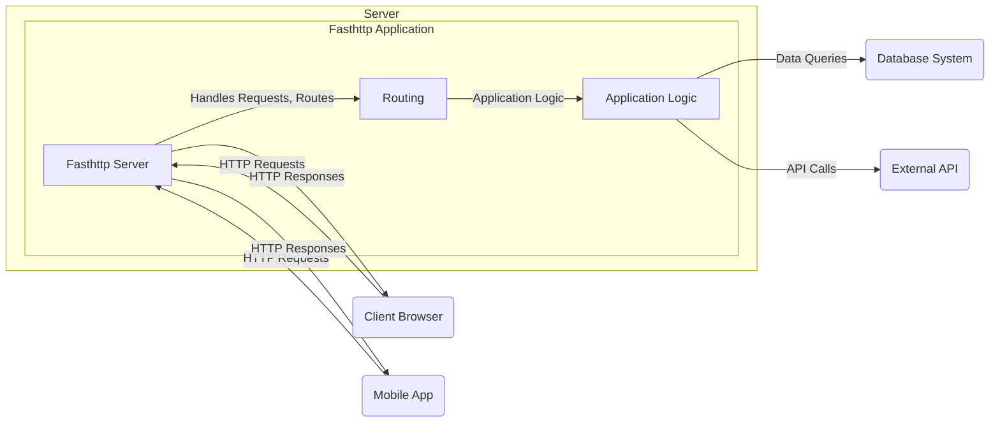
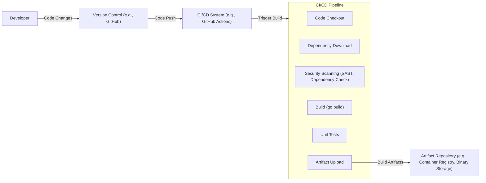

# BUSINESS POSTURE

This project provides a high-performance HTTP server library for Go, aiming to offer significant speed and efficiency advantages over the standard `net/http` library.

- Business Priorities:
  - High Performance: The primary goal is to serve HTTP requests with minimal latency and resource consumption.
  - Efficiency: Optimize resource utilization (CPU, memory, network) for handling a large number of concurrent connections.
  - Scalability: Enable applications to handle increased traffic loads without significant performance degradation.

- Business Goals:
  - Reduce infrastructure costs by requiring fewer resources to handle the same workload compared to standard HTTP servers.
  - Improve application responsiveness and user experience through faster request processing.
  - Enable development of high-throughput applications like APIs, proxies, and web servers.

- Business Risks:
  - Security vulnerabilities introduced due to performance optimizations potentially bypassing standard security practices.
  - Risk of denial-of-service attacks if the server is not properly configured to handle malicious or excessive traffic.
  - Data breaches if the library is used to handle sensitive data without implementing appropriate security measures in the application using the library.
  - Compatibility issues with existing HTTP infrastructure or clients due to deviations from strict HTTP standards in pursuit of performance.
  - Dependency on a community-driven open-source project with potential risks related to long-term maintenance and support.

# SECURITY POSTURE

This project is a library focused on performance, and as such, it provides building blocks for creating HTTP servers. Security is primarily the responsibility of the application developer using this library and the deployment environment.

- Existing Security Controls:
  - security control: Go Standard Library Security Features: Relies on underlying Go standard library for network operations and some basic HTTP handling, which benefits from Go's general security practices. Implemented within the Go standard library.
  - security control: Operating System Security Features: Leverages operating system level security features such as network firewalls, resource limits, and user permissions. Implemented by the operating system.
  - accepted risk: Limited Built-in Security Features: As a performance-focused library, `fasthttp` does not implement extensive security features directly. Security is expected to be handled by the application and the deployment environment.

- Recommended Security Controls:
  - recommended security control: Input Validation: Implement robust input validation for all incoming HTTP requests (headers, body, parameters) within the application using `fasthttp`.
  - recommended security control: Rate Limiting and Request Throttling: Implement rate limiting and request throttling to protect against denial-of-service attacks. This should be implemented in the application or a reverse proxy in front of the application.
  - recommended security control: Security Audits and Penetration Testing: Conduct regular security audits and penetration testing of applications built with `fasthttp` to identify and address potential vulnerabilities.
  - recommended security control: Dependency Scanning: Regularly scan dependencies for known vulnerabilities and update them promptly. This should be part of the application's development and deployment pipeline.
  - recommended security control: Secure Configuration: Ensure secure configuration of the `fasthttp` server and the underlying operating system, including disabling unnecessary features and setting appropriate resource limits.
  - recommended security control: TLS/SSL Encryption: Enforce TLS/SSL encryption for all sensitive communications to protect data in transit. This is typically configured at the application level or using a reverse proxy.

- Security Requirements:
  - Authentication:
    - Requirement: Implement authentication mechanisms within the application if access control is required. `fasthttp` provides the tools to handle authentication headers and logic, but the specific mechanism (e.g., OAuth 2.0, JWT, Basic Auth) needs to be implemented by the application.
  - Authorization:
    - Requirement: Implement authorization logic within the application to control access to resources based on user roles or permissions. `fasthttp` provides the request context to access user information and make authorization decisions.
  - Input Validation:
    - Requirement: All input from HTTP requests (headers, URL parameters, request body) must be thoroughly validated to prevent injection attacks (e.g., SQL injection, command injection, cross-site scripting). Validation should be performed within the application logic using `fasthttp`'s request handling capabilities.
  - Cryptography:
    - Requirement: Use TLS/SSL to encrypt all sensitive communication between clients and the `fasthttp` server. `fasthttp` supports TLS configuration.
    - Requirement: If sensitive data is stored or processed, use appropriate encryption methods for data at rest and data in transit within the application logic. `fasthttp` itself does not handle data encryption beyond TLS.

# DESIGN

This section describes the design of a system using the `fasthttp` library. Since `fasthttp` is a library, the design focuses on how it is used within an application context.

## C4 CONTEXT



- Context Diagram Elements:
  - - Name: Client Browser
    - Type: User
    - Description: Web browsers used by end-users to access the application.
    - Responsibilities: Sending HTTP requests to the Fasthttp Application and rendering responses.
    - Security controls: Browser-based security controls (e.g., Content Security Policy, Same-Origin Policy).
  - - Name: Mobile App
    - Type: User Application
    - Description: Mobile applications used by end-users to access the application.
    - Responsibilities: Sending HTTP requests to the Fasthttp Application and displaying data.
    - Security controls: Application-level security controls, OS-level security controls on mobile devices.
  - - Name: Fasthttp Application
    - Type: Software System
    - Description: The application built using the `fasthttp` library to handle HTTP requests. This is the system being designed.
    - Responsibilities: Receiving and processing HTTP requests, interacting with backend systems, and sending HTTP responses.
    - Security controls: Input validation, authentication, authorization, rate limiting, TLS/SSL encryption, application-level firewalls.
  - - Name: Database System
    - Type: External System
    - Description: A database system used by the Fasthttp Application to store and retrieve data.
    - Responsibilities: Storing application data, providing data access to the Fasthttp Application.
    - Security controls: Database access controls, encryption at rest, network firewalls, audit logging.
  - - Name: External API
    - Type: External System
    - Description: External API services that the Fasthttp Application interacts with to retrieve or send data.
    - Responsibilities: Providing external data or services to the Fasthttp Application.
    - Security controls: API authentication and authorization, secure communication protocols (HTTPS), rate limiting.

## C4 CONTAINER



- Container Diagram Elements:
  - - Name: Fasthttp Application Container
    - Type: Container
    - Description: Represents the running application instance that utilizes the `fasthttp` library. Deployed on a server.
    - Responsibilities: Hosting and executing the Fasthttp Server, Application Logic, and Routing components.
    - Security controls: Container security hardening, resource limits, network policies, OS-level security controls of the server.
  - - Name: Fasthttp Server
    - Type: Component
    - Description: The core component using the `fasthttp` library to handle HTTP connections and requests.
    - Responsibilities: Accepting incoming HTTP connections, parsing requests, sending responses, managing connection lifecycle, TLS termination.
    - Security controls: TLS/SSL configuration, request parsing and handling (needs to be secure by application logic), connection limits, timeout configurations.
  - - Name: Application Logic
    - Type: Component
    - Description: The application-specific code that processes requests, interacts with backend systems, and generates responses.
    - Responsibilities: Business logic execution, data processing, input validation, authorization, interaction with databases and external APIs.
    - Security controls: Input validation, authorization logic, secure data handling, output encoding, logging and monitoring.
  - - Name: Routing
    - Type: Component
    - Description: Component responsible for mapping incoming HTTP requests to the appropriate application logic handlers.
    - Responsibilities: URL path matching, method handling, request dispatching.
    - Security controls: Protection against routing vulnerabilities (e.g., path traversal if routing logic is flawed), access control based on routes.

## DEPLOYMENT

Deployment can vary significantly. A common deployment scenario is using cloud infrastructure.

```mermaid
flowchart LR
    subgraph CloudProvider [Cloud Provider (e.g., AWS, GCP, Azure)]
        subgraph Region [Region]
            subgraph AvailabilityZone1 [Availability Zone 1]
                LoadBalancer1("Load Balancer")
                WebServer1A("Web Server Instance")
                WebServer1B("Web Server Instance")
            end
            subgraph AvailabilityZone2 [Availability Zone 2]
                LoadBalancer2("Load Balancer")
                WebServer2A("Web Server Instance")
                WebServer2B("Web Server Instance")
            end
            DatabaseService("Managed Database Service")
        end
    end
    Internet -- "HTTP/HTTPS" --> LoadBalancer1
    Internet -- "HTTP/HTTPS" --> LoadBalancer2
    LoadBalancer1 -- "HTTP" --> WebServer1A
    LoadBalancer1 -- "HTTP" --> WebServer1B
    LoadBalancer2 -- "HTTP" --> WebServer2A
    LoadBalancer2 -- "HTTP" --> WebServer2B
    WebServer1A -- "Database Queries" --> DatabaseService
    WebServer1B -- "Database Queries" --> DatabaseService
    WebServer2A -- "Database Queries" --> DatabaseService
    WebServer2B -- "Database Queries" --> DatabaseService
```

- Deployment Diagram Elements:
  - - Name: Cloud Provider (e.g., AWS, GCP, Azure)
    - Type: Infrastructure
    - Description: The cloud service provider hosting the application infrastructure.
    - Responsibilities: Providing and managing the underlying infrastructure (compute, network, storage, managed services).
    - Security controls: Cloud provider security controls (physical security, network security, access management, compliance certifications).
  - - Name: Region
    - Type: Infrastructure Zone
    - Description: A geographical region within the cloud provider's infrastructure.
    - Responsibilities: Providing isolation and redundancy across geographical locations.
    - Security controls: Regional isolation, disaster recovery capabilities.
  - - Name: Availability Zone
    - Type: Infrastructure Zone
    - Description: Isolated locations within a region, providing fault tolerance.
    - Responsibilities: Providing high availability and fault tolerance within a region.
    - Security controls: Availability zone isolation, redundant power and networking.
  - - Name: Load Balancer
    - Type: Infrastructure Component
    - Description: Distributes incoming traffic across multiple web server instances.
    - Responsibilities: Traffic distribution, health checks, SSL termination (optional), DDoS protection (basic).
    - Security controls: SSL/TLS termination, DDoS protection, access control lists, security groups.
  - - Name: Web Server Instance
    - Type: Compute Instance (VM, Container)
    - Description: Virtual machines or containers running the Fasthttp Application.
    - Responsibilities: Running the application code, handling HTTP requests, application-level security controls.
    - Security controls: OS hardening, security groups, firewalls, intrusion detection systems, application-level security controls.
  - - Name: Managed Database Service
    - Type: Managed Service
    - Description: A managed database service provided by the cloud provider.
    - Responsibilities: Data storage, database management, backups, high availability.
    - Security controls: Database access controls, encryption at rest and in transit, audit logging, vulnerability management by the cloud provider.

## BUILD

The build process for a Go application using `fasthttp` typically involves standard Go tooling and can be integrated into CI/CD pipelines.



- Build Process Elements:
  - - Name: Developer
    - Type: Human Role
    - Description: Software developers writing and modifying the application code.
    - Responsibilities: Writing secure code, committing code changes to version control.
    - Security controls: Secure development practices, code reviews, access control to development environment.
  - - Name: Version Control (e.g., GitHub)
    - Type: Software System
    - Description: System for managing and tracking changes to the source code.
    - Responsibilities: Source code storage, version history, collaboration, access control.
    - Security controls: Access control, audit logging, branch protection, vulnerability scanning of repository.
  - - Name: CI/CD System (e.g., GitHub Actions)
    - Type: Automation System
    - Description: System for automating the build, test, and deployment processes.
    - Responsibilities: Automated build, testing, security scanning, artifact creation, deployment.
    - Security controls: Secure pipeline configuration, access control to pipeline definitions and secrets, audit logging.
  - - Name: Code Checkout
    - Type: CI/CD Step
    - Description: Step in the CI/CD pipeline to retrieve the latest code from version control.
    - Responsibilities: Obtaining the source code for building.
    - Security controls: Access control to version control, secure communication with version control system.
  - - Name: Dependency Download
    - Type: CI/CD Step
    - Description: Step to download project dependencies (Go modules).
    - Responsibilities: Resolving and downloading required libraries.
    - Security controls: Dependency checksum verification, using trusted dependency sources (e.g., Go module mirror).
  - - Name: Security Scanning (SAST, Dependency Check)
    - Type: CI/CD Step
    - Description: Step to perform static application security testing (SAST) and dependency vulnerability checks.
    - Responsibilities: Identifying potential security vulnerabilities in the code and dependencies.
    - Security controls: SAST tools, dependency vulnerability scanners, configuration of scanning tools.
  - - Name: Build (go build)
    - Type: CI/CD Step
    - Description: Step to compile the Go application using `go build`.
    - Responsibilities: Compiling source code into executable binaries.
    - Security controls: Using secure build environment, compiler security features (if any).
  - - Name: Unit Tests
    - Type: CI/CD Step
    - Description: Step to execute automated unit tests.
    - Responsibilities: Verifying code functionality and catching regressions.
    - Security controls: Secure test environment, test data management.
  - - Name: Artifact Upload
    - Type: CI/CD Step
    - Description: Step to upload build artifacts (e.g., binaries, container images) to an artifact repository.
    - Responsibilities: Storing build artifacts for deployment.
    - Security controls: Secure communication with artifact repository, access control to artifact repository.
  - - Name: Artifact Repository (e.g., Container Registry, Binary Storage)
    - Type: Storage System
    - Description: System for storing and managing build artifacts.
    - Responsibilities: Secure storage of build artifacts, versioning, access control.
    - Security controls: Access control, encryption at rest, audit logging, vulnerability scanning of stored artifacts.

# RISK ASSESSMENT

- Critical Business Processes:
  - Serving HTTP requests to end-users or other systems. The criticality depends on the application using `fasthttp`. For public-facing web applications or APIs, availability and performance are critical business processes. For internal microservices, the criticality depends on the service's role in the overall business workflow.

- Data Sensitivity:
  - Data sensitivity depends entirely on the application built using `fasthttp`. It could range from public, non-sensitive data (e.g., static website content) to highly sensitive personal or financial data (e.g., e-commerce platform, banking application). The sensitivity level dictates the required security controls for data in transit, data at rest, and data in processing.

# QUESTIONS & ASSUMPTIONS

- BUSINESS POSTURE:
  - Question: What is the primary use case for applications built with `fasthttp`? (e.g., public-facing website, internal API, microservice).
  - Assumption: The primary driver for using `fasthttp` is performance and efficiency.
  - Question: What are the expected traffic volumes and performance requirements for the application?
  - Assumption: The application is expected to handle a significant volume of traffic and requires low latency.
  - Question: What is the organization's risk appetite regarding security vs. performance?
  - Assumption: While performance is prioritized, security is still a significant concern and needs to be addressed appropriately.

- SECURITY POSTURE:
  - Question: What existing security controls are already in place in the target deployment environment? (e.g., network firewalls, WAF, IDS/IPS).
  - Assumption: Basic network security controls are assumed to be in place, but application-level security needs to be implemented.
  - Question: Are there any specific compliance requirements (e.g., PCI DSS, HIPAA, GDPR) that the application needs to meet?
  - Assumption: Compliance requirements are application-specific and need to be considered during application development and deployment.
  - Question: What is the process for security incident response and vulnerability management?
  - Assumption: A security incident response and vulnerability management process is in place or will be established for applications using `fasthttp`.

- DESIGN:
  - Question: What is the intended deployment environment (cloud, on-premises, hybrid)?
  - Assumption: Cloud-based deployment is a likely scenario, but on-premises or hybrid deployments are also possible.
  - Question: What are the scaling requirements for the application? (horizontal scaling, vertical scaling).
  - Assumption: Horizontal scaling is expected to be the primary scaling strategy for applications using `fasthttp`.
  - Question: What are the data storage requirements and database systems being used?
  - Assumption: A relational database or NoSQL database is used for persistent data storage, depending on the application requirements.