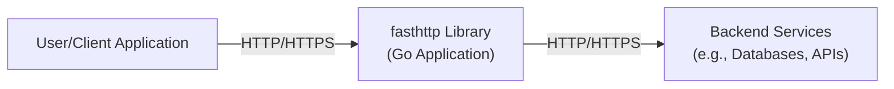
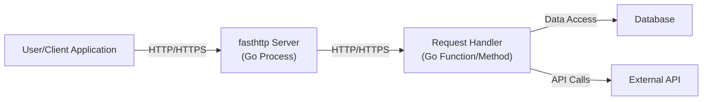
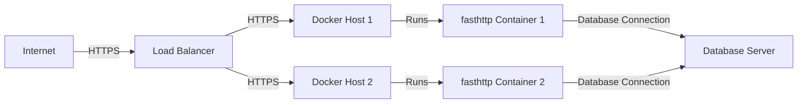
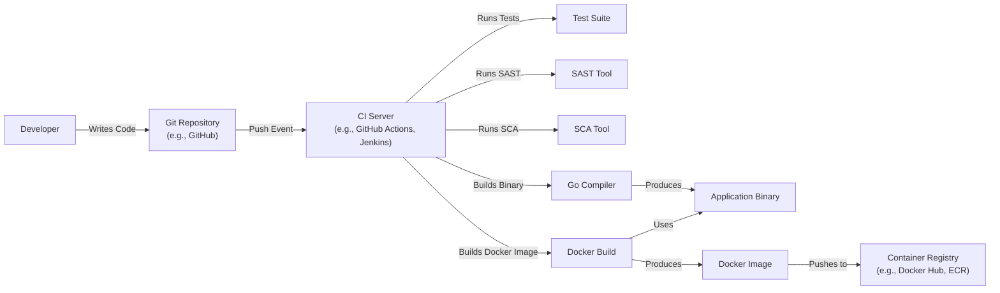

# BUSINESS POSTURE

Business Priorities and Goals:

*   Provide a fast and efficient HTTP library for Go, optimized for high-performance scenarios.
*   Minimize memory allocations and CPU usage to handle a large number of requests per second.
*   Offer a viable alternative to Go's standard `net/http` library, particularly in situations where performance is critical.
*   Maintain a stable and reliable API for developers to build upon.
*   Provide good documentation and examples to facilitate adoption.

Business Risks:

*   Security vulnerabilities in the library could lead to exploits in applications using it, potentially causing data breaches, denial of service, or other severe consequences.
*   Performance regressions or bugs could undermine the core value proposition of the library, driving users back to `net/http` or other alternatives.
*   Lack of maintenance or updates could lead to compatibility issues with newer Go versions or evolving HTTP standards.
*   Inadequate documentation or community support could hinder adoption and growth.
*   Competition from other high-performance HTTP libraries could reduce market share.

# SECURITY POSTURE

Existing Security Controls:

*   security control: The project uses fuzzing (mentioned in `misc/` directory and by the use of `go-fuzz` tool). This helps identify potential crashes and vulnerabilities due to unexpected inputs.
*   security control: Code reviews are likely performed as part of the pull request process on GitHub, although this is not explicitly stated.
*   security control: The library is written in Go, which offers some memory safety features compared to languages like C/C++.
*   security control: The project has tests (as indicated by the presence of `_test.go` files).

Accepted Risks:

*   accepted risk: The library prioritizes performance, which may lead to design choices that could potentially introduce security risks if not carefully managed. The documentation explicitly mentions potential vulnerabilities if used incorrectly.
*   accepted risk: The library's API is different from `net/http`, which means developers need to be aware of the specific security implications of `fasthttp`.
*   accepted risk: The project relies on community contributions, which means the security expertise of contributors may vary.

Recommended Security Controls:

*   security control: Integrate Static Application Security Testing (SAST) tools into the build process to automatically identify potential vulnerabilities.
*   security control: Perform regular security audits and penetration testing, especially for new features or significant code changes.
*   security control: Implement a clear security policy and vulnerability disclosure process.
*   security control: Use a dependency management tool and regularly update dependencies to address known vulnerabilities.
*   security control: Provide security-focused documentation and examples to guide developers on best practices when using the library.
*   security control: Consider using a Software Composition Analysis (SCA) tool to identify and manage vulnerabilities in third-party dependencies.

Security Requirements:

*   Authentication: Not directly applicable to the `fasthttp` library itself, as it's a low-level HTTP implementation. Authentication should be handled by applications built *using* `fasthttp`.
*   Authorization: Similar to authentication, authorization is the responsibility of applications built using `fasthttp`.
*   Input Validation:
    *   The library should carefully validate all input parameters, including headers, request bodies, and URI components.
    *   It should handle potentially malicious or oversized inputs gracefully, preventing crashes or resource exhaustion.
    *   Specific attention should be paid to preventing common web vulnerabilities like Cross-Site Scripting (XSS), SQL injection, and command injection, although these are primarily the responsibility of applications using the library.
*   Cryptography:
    *   The library should support TLS/SSL for secure communication (HTTPS).
    *   Cryptographic operations should use well-established and secure libraries.
    *   Key management and certificate handling should follow best practices.

# DESIGN

## C4 CONTEXT

Element Descriptions:

*   Element:
    *   Name: User/Client Application
    *   Type: External Entity (User or another system)
    *   Description: Represents any client application or user interacting with a service built using `fasthttp`.
    *   Responsibilities: Initiates HTTP requests, processes HTTP responses.
    *   Security controls: Implements appropriate security measures for client-side applications, such as input validation, secure storage of credentials, and protection against common web vulnerabilities.

*   Element:
    *   Name: fasthttp Library (Go Application)
    *   Type: Software System
    *   Description: The `fasthttp` library itself, running within a Go application.
    *   Responsibilities: Handles HTTP requests and responses, manages connections, provides an API for application logic.
    *   Security controls: Input validation, connection management, TLS/SSL support (if used), error handling.

*   Element:
    *   Name: Backend Services (e.g., Databases, APIs)
    *   Type: External System
    *   Description: Represents any backend services that the `fasthttp` application interacts with.
    *   Responsibilities: Provides data or services to the `fasthttp` application.
    *   Security controls: Implements appropriate security measures for backend systems, such as authentication, authorization, data encryption, and access controls.

## C4 CONTAINER

Element Descriptions:

*   Element:
    *   Name: User/Client Application
    *   Type: External Entity
    *   Description: Same as in the Context diagram.
    *   Responsibilities: Same as in the Context diagram.
    *   Security controls: Same as in the Context diagram.

*   Element:
    *   Name: fasthttp Server (Go Process)
    *   Type: Container (Process)
    *   Description: The main server process that utilizes the `fasthttp` library.
    *   Responsibilities: Listens for incoming connections, manages worker pools (if applicable), routes requests to handlers.
    *   Security controls: Connection limits, timeouts, TLS/SSL configuration (if applicable).

*   Element:
    *   Name: Request Handler (Go Function/Method)
    *   Type: Container (Code Component)
    *   Description: The application-specific code that handles individual requests.
    *   Responsibilities: Processes requests, interacts with backend services, generates responses.
    *   Security controls: Input validation, output encoding, authentication, authorization, error handling.

*   Element:
    *   Name: Database
    *   Type: Container (Database)
    *   Description: A database used by the application.
    *   Responsibilities: Stores and retrieves data.
    *   Security controls: Access controls, data encryption, auditing.

*   Element:
    *   Name: External API
    *   Type: Container (External System)
    *   Description: An external API used by the application.
    *   Responsibilities: Provides external services.
    *   Security controls: API keys, authentication, rate limiting.

## DEPLOYMENT

Possible Deployment Solutions:

1.  Standalone Binary: Compile the Go application using `fasthttp` into a single executable binary and deploy it directly to a server.
2.  Docker Container: Package the application and its dependencies into a Docker container for easy deployment and portability.
3.  Kubernetes: Deploy the application as a set of pods within a Kubernetes cluster for scalability and resilience.
4.  Cloud Provider Services (e.g., AWS EC2, Google Cloud Run, Azure Container Instances): Utilize cloud-specific services for deploying and managing the application.

Chosen Solution (Docker Container):

Element Descriptions:

*   Element:
    *   Name: Internet
    *   Type: External Entity
    *   Description: The public internet.
    *   Responsibilities: Routes traffic to the load balancer.
    *   Security controls: Standard internet security protocols.

*   Element:
    *   Name: Load Balancer
    *   Type: Infrastructure Node
    *   Description: Distributes incoming traffic across multiple instances of the application.
    *   Responsibilities: Health checks, traffic routing, SSL termination (if applicable).
    *   Security controls: DDoS protection, firewall rules, SSL certificate management.

*   Element:
    *   Name: Docker Host 1, Docker Host 2
    *   Type: Infrastructure Node (Server)
    *   Description: Physical or virtual servers running the Docker engine.
    *   Responsibilities: Hosts and runs Docker containers.
    *   Security controls: Operating system security, Docker daemon security, network security.

*   Element:
    *   Name: fasthttp Container 1, fasthttp Container 2
    *   Type: Container Instance
    *   Description: Instances of the `fasthttp` application running within Docker containers.
    *   Responsibilities: Handles HTTP requests and responses.
    *   Security controls: Container isolation, resource limits, minimal base image.

*   Element:
    *   Name: Database Server
    *   Type: Infrastructure Node (Server)
    *   Description: The server hosting the database.
    *   Responsibilities: Stores and manages data.
    *   Security controls: Database security configuration, access controls, encryption.

## BUILD

Build Process Description:

1.  Developer writes code and pushes changes to a Git repository (e.g., GitHub).
2.  A push event triggers the CI server (e.g., GitHub Actions, Jenkins).
3.  The CI server runs the test suite, including unit tests and integration tests.
4.  The CI server runs a Static Application Security Testing (SAST) tool to analyze the code for potential vulnerabilities.
5.  The CI server runs a Software Composition Analysis (SCA) tool to identify vulnerabilities in third-party dependencies.
6.  If all tests and security checks pass, the CI server uses the Go compiler to build the application binary.
7.  The CI server then uses the `docker build` command to create a Docker image, incorporating the application binary.
8.  Finally, the Docker image is pushed to a container registry (e.g., Docker Hub, Amazon ECR).

Security Controls:

*   security control: CI/CD pipeline enforces automated testing and security checks before deployment.
*   security control: SAST tool helps identify vulnerabilities in the application code.
*   security control: SCA tool helps identify vulnerabilities in third-party dependencies.
*   security control: Use of a container registry allows for versioning and controlled deployment of application images.
*   security control: Minimal base image for Docker container reduces attack surface.

# RISK ASSESSMENT

Critical Business Processes:

*   Handling HTTP requests and responses efficiently and reliably.
*   Serving web content or API endpoints.
*   Interacting with backend services (databases, APIs).

Data Sensitivity:

*   The `fasthttp` library itself doesn't directly handle sensitive data. However, applications built *using* `fasthttp` may handle various types of data, including:
    *   Personally Identifiable Information (PII)
    *   Financial data
    *   Authentication credentials
    *   Session tokens
    *   Proprietary business data
*   The sensitivity of this data depends entirely on the specific application using `fasthttp`.

# QUESTIONS & ASSUMPTIONS

Questions:

*   What specific types of applications are expected to be built using `fasthttp`? (This will help determine the types of data likely to be handled and the associated security risks.)
*   What are the performance requirements for these applications? (This will influence the trade-offs between performance and security.)
*   What is the expected deployment environment? (This will affect the deployment diagram and security considerations.)
*   Are there any existing security policies or guidelines that need to be followed?
*   What level of logging and monitoring is required?
*   Are there any specific compliance requirements (e.g., GDPR, HIPAA, PCI DSS)?

Assumptions:

*   BUSINESS POSTURE: The primary goal is to provide a high-performance HTTP library. Security is a critical concern, but performance is a key differentiator.
*   SECURITY POSTURE: The development team is familiar with basic security principles, but may not have dedicated security experts.
*   DESIGN: The application will likely be deployed as a standalone service or as part of a larger microservices architecture. The use of Docker containers is a reasonable assumption for modern deployments. The database and external API interactions are placeholders and may vary depending on the specific application. The build process assumes a standard CI/CD pipeline with automated testing and security checks.