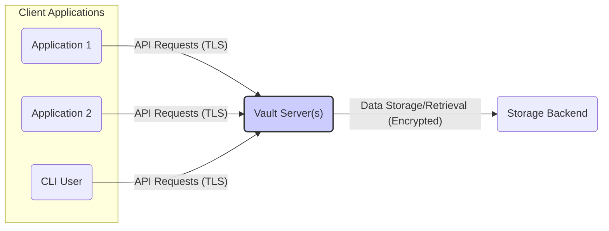
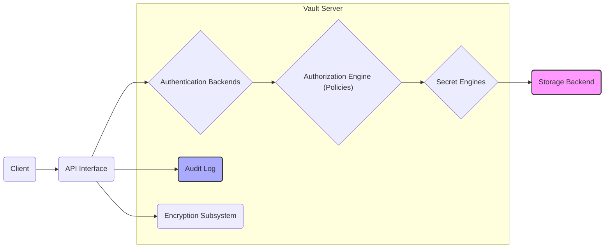
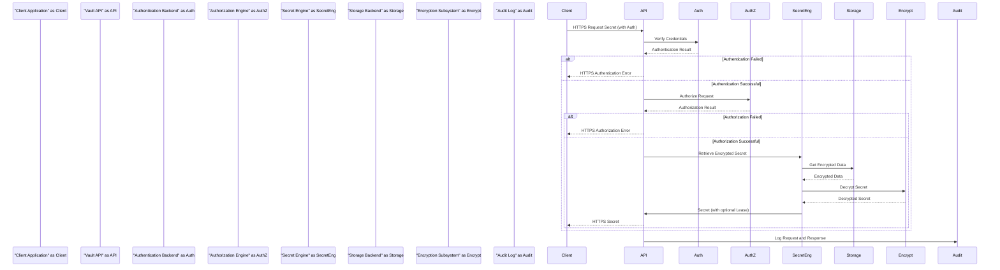

# Project Design Document: HashiCorp Vault

**Version:** 1.1
**Date:** October 26, 2023
**Author:** AI Software Architect

## 1. Introduction

This document provides a detailed architectural overview of HashiCorp Vault, a secrets management tool, with a specific focus on aspects relevant to threat modeling. It outlines the key components, data flows, and security considerations of the system. This document is intended to serve as a foundation for subsequent threat modeling activities, enabling the identification of potential vulnerabilities and the design of appropriate mitigations.

## 2. Goals and Objectives

The primary goals of HashiCorp Vault are:

* **Secure Secret Storage:** To provide a centralized and secure repository for storing sensitive data, including API keys, passwords, certificates, and other credentials.
* **Strict Access Control:** To enforce fine-grained access control policies, ensuring that only authorized users, applications, and services can access specific secrets.
* **Dynamic Secret Generation:** To generate secrets on-demand for applications, minimizing the risk associated with long-lived, static credentials and enabling automated credential rotation.
* **Comprehensive Data Encryption:** To encrypt secrets both in transit (via TLS) and at rest within the storage backend.
* **Immutable Audit Logging:** To maintain a detailed, tamper-proof audit log of all operations performed within Vault, providing a record of access and modifications.
* **Secret Leasing and Renewal:** To implement a leasing mechanism for secrets, requiring periodic renewal and enabling automatic revocation upon lease expiration.
* **Rapid Secret Revocation:** To provide mechanisms for the immediate revocation of access to secrets in case of compromise or policy changes.

## 3. System Architecture

### 3.1. High-Level Architecture

* **Client Applications:** Represent various applications, services, or human users that require access to secrets managed by Vault. They interact with Vault exclusively through its secure API.
* **Vault Server(s):** The central component of Vault, responsible for handling authentication, authorization, secret storage, encryption, decryption, and auditing. Vault is typically deployed in a high-availability (HA) cluster for production environments.
* **Storage Backend:** The persistent storage layer where Vault stores its encrypted data. The choice of storage backend impacts performance, consistency, and security. Supported backends include Consul, etcd, file system, and cloud-based options.

### 3.2. Component-Level Architecture

The Vault server is composed of several interconnected components:

* **API Interface:** Provides a secure RESTful HTTP API (enforcing TLS) for clients to interact with Vault. This is the primary entry point for all client requests.
* **Authentication Backends:** Responsible for verifying the identity of clients attempting to access Vault. Different backends support various authentication methods:
    * `"User/Password"`: Traditional username and password authentication.
    * `"Tokens"`: Vault-generated tokens with configurable policies and lifespans.
    * `"Cloud provider IAM"`: Integration with AWS IAM, Azure AD, and Google Cloud IAM for authentication based on cloud identities.
    * `"Kubernetes Service Accounts"`: Authentication based on Kubernetes service account tokens.
    * `"LDAP"`: Integration with Lightweight Directory Access Protocol servers.
    * `"OIDC"`: Support for OpenID Connect identity providers.
* **Authorization Engine (Policies):** Enforces access control policies defined using HashiCorp Configuration Language (HCL). Policies determine which authenticated clients can perform specific actions (read, create, update, delete) on specific secrets or paths within Vault's logical storage.
* **Secret Engines:** Manage the storage, generation, and lifecycle of different types of secrets. Each engine provides specific functionalities:
    * `"Key/Value (KV) Secret Engine (versions 1 and 2)"`: For storing arbitrary key-value pairs as secrets. Version 2 adds versioning capabilities.
    * `"Database Secret Engine"`: Generates database credentials on-demand for various database systems (e.g., MySQL, PostgreSQL).
    * `"AWS Secret Engine"`: Dynamically generates AWS credentials with limited scopes and lifespans.
    * `"PKI Secret Engine"`: For managing private keys and issuing X.509 certificates.
    * `"Transit Secret Engine"`: Provides general-purpose encryption as a service, allowing applications to encrypt and decrypt data without directly handling cryptographic keys.
* **Audit Log:** Records all requests and responses made to the Vault server, including authentication attempts, policy changes, secret access, and modifications. Audit logs are crucial for security monitoring and compliance. They can be stored in various backends, and their integrity is paramount.
* **Encryption Subsystem:** Handles the encryption and decryption of secrets at rest. Vault uses a process called "auto-unsealing" which relies on a master key that is split using Shamir's Secret Sharing algorithm into "unseal keys." A quorum of these keys is required to unseal Vault after a restart or seal operation.
* **Replication (Optional):** Allows for replicating Vault data across multiple clusters for disaster recovery and increased availability. Replication can be configured for performance or disaster recovery scenarios, each with different consistency models and security considerations.
* **Plugins (Optional):** Enables extending Vault's functionality by adding support for new authentication methods, secret engines, audit backends, or other features. Plugins should be carefully vetted for security vulnerabilities.

## 4. Data Flow

The following describes a typical data flow for retrieving a secret from Vault, highlighting security-relevant steps:

1. **Client Request (Encrypted):** A client application sends an HTTPS API request to the Vault server, including authentication credentials (e.g., a token). The communication is secured with TLS.
2. **Authentication:** The API interface forwards the provided credentials to the appropriate authentication backend for verification.
3. **Authentication Verification:** The authentication backend validates the client's identity against its configured mechanisms.
4. **Authorization:** If authentication is successful, the authorization engine evaluates the client's identity and the requested secret path and operation against the configured policies. This determines if the client is permitted to access the secret.
5. **Secret Retrieval (Encrypted):** If authorized, the secret engine retrieves the *encrypted* secret data from the storage backend.
6. **Decryption:** The encryption subsystem decrypts the retrieved secret using the active encryption key, which is only available when Vault is in an unsealed state.
7. **Lease Generation (Optional):** If the accessed secret is managed by a secret engine that supports leasing (e.g., database credentials), a lease with a specific time-to-live (TTL) is generated.
8. **Response (Encrypted):** The Vault server sends the decrypted secret (or dynamic credentials) back to the client in the HTTPS API response, ensuring confidentiality in transit.
9. **Audit Logging:** The entire request and response, including the client identity, accessed path, and outcome, are logged to the configured audit backend for accountability and security monitoring.

## 5. Security Considerations

This section details key security considerations for HashiCorp Vault, crucial for threat modeling:

* **Authentication Vulnerabilities:**
    * **Threat:** Brute-force attacks against password-based authentication.
    * **Mitigation:** Enforce strong password policies, implement account lockout mechanisms, consider multi-factor authentication (MFA).
    * **Threat:** Compromise of authentication tokens.
    * **Mitigation:** Short-lived tokens, secure storage of tokens on the client-side, token revocation mechanisms.
* **Authorization Bypass:**
    * **Threat:** Exploiting vulnerabilities in policy enforcement logic to gain unauthorized access.
    * **Mitigation:** Thoroughly test and review policy configurations, adhere to the principle of least privilege, regularly audit policy effectiveness.
    * **Threat:** Privilege escalation by exploiting misconfigured policies.
    * **Mitigation:** Implement granular policies, restrict the ability to modify policies, enforce separation of duties.
* **Encryption Weaknesses:**
    * **Threat:** Compromise of the master key or unseal keys.
    * **Mitigation:** Secure generation, distribution, and storage of unseal keys (e.g., using Shamir's Secret Sharing), consider integration with Hardware Security Modules (HSMs).
    * **Threat:** Man-in-the-middle attacks if TLS is not properly configured or enforced.
    * **Mitigation:** Enforce TLS 1.2 or higher, use strong cipher suites, properly configure TLS certificates.
* **Audit Log Tampering:**
    * **Threat:** Attackers modifying or deleting audit logs to cover their tracks.
    * **Mitigation:** Store audit logs in a secure, immutable backend, implement log integrity checks, restrict access to audit logs.
* **Sealing/Unsealing Process Vulnerabilities:**
    * **Threat:** Attackers obtaining a quorum of unseal keys through social engineering or other means.
    * **Mitigation:** Implement strict access controls for unseal keys, educate key holders on security best practices, consider using automated unsealing mechanisms with trusted providers.
* **Secret Engine Specific Vulnerabilities:**
    * **Threat:** Misconfiguration of database secret engines leading to overly permissive database credentials.
    * **Mitigation:** Follow security best practices for each secret engine, regularly review configurations, use the principle of least privilege when generating dynamic credentials.
    * **Threat:** Vulnerabilities in custom plugins.
    * **Mitigation:** Thoroughly vet and audit any custom plugins before deployment.
* **Replication Security Risks:**
    * **Threat:** Unauthorized access to replicated data in secondary clusters.
    * **Mitigation:** Secure communication channels between clusters, implement appropriate access controls for managing replication, consider encryption for replication traffic.
* **Input Validation Failures:**
    * **Threat:** Injection attacks (e.g., command injection, SQL injection) if input validation is insufficient.
    * **Mitigation:** Implement robust input validation and sanitization on all API endpoints.
* **Dependency Vulnerabilities:**
    * **Threat:** Exploiting known vulnerabilities in Vault's dependencies.
    * **Mitigation:** Regularly update Vault and its dependencies to the latest versions with security patches.
* **Deployment Environment Security:**
    * **Threat:** Compromise of the underlying infrastructure where Vault is deployed.
    * **Mitigation:** Harden the operating system, implement network segmentation, restrict access to the Vault server and storage backend, follow security best practices for containerization and orchestration if applicable.
* **Denial of Service (DoS) Attacks:**
    * **Threat:** Overwhelming the Vault server with requests, making it unavailable.
    * **Mitigation:** Implement rate limiting on API endpoints, use load balancing, ensure sufficient resources are allocated to the Vault server.

## 6. Deployment Considerations

* **High Availability (HA) Deployment:** Deploy Vault in an HA cluster with at least three nodes to ensure resilience against node failures. Utilize a consensus-based distributed storage backend for consistency.
* **Secure Storage Backend Configuration:** Choose a storage backend that provides encryption at rest and secure access controls. Properly configure authentication and authorization for Vault's access to the storage backend.
* **Network Segmentation:** Isolate the Vault cluster within a secure network segment, restricting access to only authorized clients and administrators.
* **TLS Configuration:** Enforce TLS for all communication with the Vault API. Use strong cipher suites and ensure proper certificate management.
* **Access Control to Vault Infrastructure:** Implement strict access controls for managing the Vault servers and the underlying infrastructure.
* **Secure Bootstrapping and Unsealing:** Implement secure procedures for bootstrapping the Vault cluster and managing the unseal keys. Consider using automated unsealing with trusted providers.
* **Monitoring and Alerting:** Implement comprehensive monitoring of Vault's health, performance, and security events. Set up alerts for suspicious activity and critical errors.
* **Backup and Recovery Procedures:** Establish and regularly test backup and recovery procedures for Vault's data and configuration. Securely store backups.

## 7. Future Considerations

* **Integration with Hardware Security Modules (HSMs):** Explore integrating with HSMs to further enhance the security of the master key and cryptographic operations.
* **Advanced Policy Features and Policy as Code:** Implement more sophisticated policy features and manage policies as code for better version control and automation.
* **Automated Secret Rotation Strategies:** Implement and refine automated secret rotation strategies for static secrets to reduce the window of opportunity for attackers.
* **Integration with Security Information and Event Management (SIEM) Systems:** Integrate Vault's audit logs with SIEM systems for centralized security monitoring and incident response.
* **Formal Security Audits and Penetration Testing:** Conduct regular security audits and penetration testing to identify potential vulnerabilities and weaknesses in the Vault deployment.

This document provides a detailed architectural overview of HashiCorp Vault with a strong emphasis on security considerations relevant for threat modeling. The information presented here should enable security professionals to effectively analyze potential threats and design appropriate security controls for a Vault deployment.