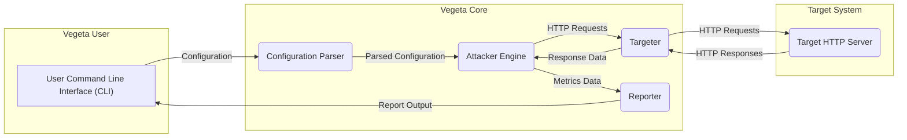
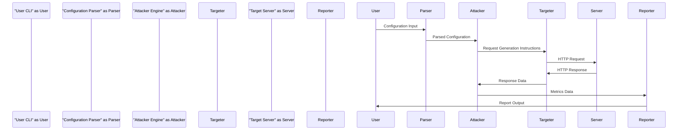

# Project Design Document: Vegeta - HTTP Load Testing Tool

**Version:** 1.1
**Date:** October 26, 2023
**Author:** Gemini (AI Language Model)

## 1. Introduction

This document provides a detailed design overview of the Vegeta project, an HTTP load testing tool. The primary purpose of this document is to clearly articulate the system's architecture, components, and data flow to facilitate effective threat modeling. This document will serve as a crucial reference point for security analysis, enabling the identification and mitigation of potential vulnerabilities. This version includes enhanced details for improved threat modeling.

## 2. Goals of Vegeta

*   To generate a configurable and sustained stream of HTTP requests against a specified target.
*   To allow users to precisely define the characteristics of the HTTP requests, including target endpoints, HTTP methods, headers, and request bodies.
*   To provide comprehensive metrics on the performance of the target system under load, focusing on key indicators such as latency, throughput, and error rates.
*   To offer flexibility in attack patterns through different modes, such as constant rate and open model attacks.
*   To support a variety of output formats for reporting and subsequent analysis of the load test results.

## 3. System Overview

Vegeta is a command-line tool designed to simulate user traffic by sending HTTP requests to a designated target system. The tool accepts configuration parameters as input, executes the load test (referred to as an "attack"), and generates metrics summarizing the attack's performance and the target's responses.

## 4. Component Details

This section provides a detailed breakdown of the key components within the Vegeta system, outlining their specific functionalities, inputs, outputs, and underlying technologies. This level of detail is crucial for identifying potential threat vectors associated with each component.

### 4.1. User Command Line Interface (CLI)

*   **Functionality:** Serves as the primary point of interaction for users to configure and initiate load tests. It parses command-line arguments and options provided by the user.
*   **Inputs:**
    *   Target URLs: Specified using the `-target` or `-targets` flags, defining the endpoint(s) to be attacked.
    *   Attack rate: Controlled by the `-rate` flag, determining the number of requests per unit of time.
    *   Attack duration: Set by the `-duration` flag, specifying the length of the load test.
    *   Request method: Defined by the `-method` flag (e.g., GET, POST, PUT).
    *   Request headers: Provided via the `-header` flag, allowing customization of HTTP headers.
    *   Request body: Specified using the `-body` flag or through input files, defining the content of the request.
    *   Output format: Determined by the `-reporter` flag, selecting the desired report format.
    *   Advanced options: Including timeouts (`-timeout`), keep-alive settings (`-keep-alive`), and TLS configuration (`-insecure`).
*   **Outputs:**
    *   Reports: Generated in the specified format (e.g., text, JSON, CSV, HDR Histogram) containing performance metrics.
    *   Error messages: Displayed if the attack encounters issues or if the configuration is invalid.
*   **Key Technologies:** Utilizes the Go standard library's `flag` package for command-line argument parsing and input handling.

### 4.2. Configuration Parser

*   **Functionality:** Responsible for interpreting the raw input from the CLI and any provided files (e.g., lists of target URLs) to create a structured and validated configuration object.
*   **Inputs:**
    *   Raw command-line arguments and flags passed by the user.
    *   Content of target files if specified via flags like `-targets`.
*   **Outputs:**
    *   A validated and structured configuration object: This object contains all the necessary parameters for the Attacker Engine to execute the load test.
    *   Error messages: Generated if the configuration is invalid, incomplete, or contains conflicting parameters.
*   **Key Technologies:** Leverages Go's standard library for string manipulation, regular expressions (for validation), and data parsing.

### 4.3. Attacker Engine

*   **Functionality:** The core of Vegeta, responsible for generating and dispatching HTTP requests to the target system at the configured rate. It manages concurrency, timing, and error handling during the attack execution.
*   **Inputs:**
    *   Parsed configuration object: Contains all the parameters defining the attack.
*   **Outputs:**
    *   HTTP requests: Sent to the Targeter for delivery to the target system.
    *   Raw HTTP responses: Received from the Targeter after the target system responds.
    *   Metrics data: Includes details about the attack execution, such as the number of requests sent, errors encountered, and timestamps.
*   **Key Technologies:** Employs Go's `net/http` package for making HTTP requests, Go routines for managing concurrent request generation, and timers for enforcing the specified attack rate.

### 4.4. Targeter

*   **Functionality:** Takes the configured target information and request details from the Attacker Engine and constructs the actual `http.Request` objects. It handles tasks such as resolving target URLs, setting HTTP headers, and attaching the request body.
*   **Inputs:**
    *   Target URLs extracted from the configuration.
    *   Request method, headers, and body content from the configuration.
*   **Outputs:**
    *   Fully formed `http.Request` objects: Ready to be sent over the network by the Attacker Engine.
*   **Key Technologies:** Utilizes Go's `net/url` package for URL parsing and manipulation, and `net/http` for creating and configuring HTTP request objects.

### 4.5. Reporter

*   **Functionality:** Processes the raw response data and metrics collected by the Attacker Engine to generate human-readable reports in various formats. It calculates key performance indicators (KPIs) such as latency distributions, throughput, and error rates.
*   **Inputs:**
    *   Raw HTTP response data: Including status codes, response times (latencies), and any encountered errors.
    *   Metrics data from the Attacker Engine: Providing context about the attack execution.
    *   Output format specification: Indicating the desired report format (e.g., text, JSON, CSV, HDR Histogram).
*   **Outputs:**
    *   Formatted reports: Presenting the performance metrics in the chosen format.
*   **Key Technologies:** Leverages Go's standard library for data aggregation, statistical calculations, and formatting output. May utilize external libraries for specific report formats like HDR Histogram.

## 5. Data Flow

The following describes the sequence of data flow within the Vegeta system during a typical load testing operation:

1. **Configuration Input:** The user provides configuration parameters to the Vegeta CLI.
2. **Configuration Parsing:** The Configuration Parser processes the input and generates a structured configuration object.
3. **Request Generation Instructions:** The Attacker Engine, based on the parsed configuration, instructs the Targeter to create HTTP requests.
4. **Target Resolution and Request Creation:** The Targeter resolves the target URLs and constructs `http.Request` objects with the specified method, headers, and body.
5. **Request Sending:** The Attacker Engine sends the generated HTTP requests to the Target HTTP Server.
6. **Response Reception:** The Target HTTP Server processes the requests and sends back HTTP responses.
7. **Response Data Collection:** The Attacker Engine receives the HTTP responses and collects relevant data, such as status codes, latencies, and errors.
8. **Metrics Aggregation:** The Attacker Engine aggregates metrics related to the attack's performance.
9. **Report Generation:** The Reporter receives the raw response data and aggregated metrics.
10. **Report Output:** The Reporter formats the data into a report according to the user's specified output format and presents it to the user via the CLI.

## 6. Deployment Architecture

Vegeta is typically deployed as a standalone command-line tool executed directly on a user's local machine or on a server within a network. It interacts with the target system over a network connection.

*   **Execution Environment:** Any system capable of running Go binaries, including common operating systems like Linux, macOS, and Windows.
*   **Network Interaction:** Vegeta communicates with the target system using standard HTTP protocols over TCP/IP. It can interact with targets accessible over the internet or within private networks.
*   **Dependencies:** Vegeta has minimal external dependencies, primarily relying on the Go standard library, which simplifies deployment.

## 7. Security Considerations (For Threat Modeling)

This section outlines potential security considerations and potential vulnerabilities within the Vegeta system, crucial for effective threat modeling.

*   **Input Validation Vulnerabilities:**
    *   **SSRF (Server-Side Request Forgery):** If the `-target` or `-targets` input is not properly validated, a malicious user could potentially force Vegeta to send requests to internal or unintended systems, leading to information disclosure or other attacks. For example, a user could specify `http://localhost:8080` to probe internal services.
    *   **Header Injection:** Insufficient validation of `-header` inputs could allow attackers to inject arbitrary headers, potentially leading to HTTP response splitting or other header-based attacks on the target system. For instance, injecting `\r\n\r\n` could terminate the header section prematurely.
    *   **Command Injection (Less Likely):** Although less likely in Go, vulnerabilities in how input is processed could theoretically lead to command injection if external commands are executed based on user input.
    *   **Resource Exhaustion:**  Lack of validation on `-rate` and `-duration` could allow a malicious user to intentionally overload the target system beyond its capacity, causing a denial-of-service (DoS).
*   **Resource Consumption on Vegeta Host:**
    *   **CPU and Memory Exhaustion:**  A highly configured attack with a very high rate or long duration could consume excessive CPU and memory resources on the machine running Vegeta, potentially leading to its instability or failure.
    *   **Network Bandwidth Exhaustion:**  Generating a very high volume of requests could saturate the network bandwidth of the machine running Vegeta, impacting other applications on the same host.
*   **Sensitive Data Handling:**
    *   **Exposure of Credentials:** If users include sensitive information like API keys or authentication tokens in headers or the request body, these credentials could be inadvertently logged, stored in reports, or exposed if the Vegeta host is compromised.
    *   **Insecure Storage of Reports:** Reports generated by Vegeta might contain sensitive information about the target system's performance or internal workings. If these reports are not stored securely, they could be accessed by unauthorized individuals.
*   **Output Security:**
    *   **Information Leakage:** Reports might inadvertently reveal sensitive information about the target system's infrastructure, response times, or error patterns, which could be valuable to attackers.
*   **Dependency Vulnerabilities:**
    *   Although Vegeta has minimal dependencies, any external libraries used (even indirectly) could contain known vulnerabilities. Regular dependency scanning and updates are necessary.
*   **Man-in-the-Middle (MITM) Attacks:**
    *   If Vegeta is used to target non-HTTPS endpoints, the communication between Vegeta and the target system is vulnerable to MITM attacks, where an attacker could intercept or modify the requests and responses. Vegeta itself doesn't enforce HTTPS.
*   **Denial of Service Against Vegeta:**
    *   A malicious actor could potentially craft specific inputs or exploit vulnerabilities in Vegeta itself to cause it to crash or become unresponsive, preventing legitimate load testing activities.

## 8. Future Considerations (Potential Architectural Changes and Security Implications)

These are potential future enhancements to Vegeta that could introduce new architectural components and, consequently, new security considerations:

*   **GUI Interface:** Introducing a web-based or desktop GUI could simplify usage but would introduce new attack surfaces related to web application security (e.g., XSS, CSRF).
*   **Distributed Load Generation:** Allowing Vegeta to run across multiple machines to generate higher loads would require inter-node communication, introducing complexities in authentication, authorization, and secure communication between instances.
*   **Advanced Reporting and Analytics Platform:** Integrating with external monitoring tools or providing a more sophisticated reporting platform could introduce new dependencies and data storage requirements, raising concerns about data security and privacy.
*   **Plugin System:** Enabling users to extend Vegeta's functionality through plugins could introduce significant security risks if plugins are not properly sandboxed and vetted for malicious code.
*   **Support for Additional Protocols:** Expanding beyond HTTP to support other protocols (e.g., gRPC, WebSockets) would require new components and introduce protocol-specific security considerations.

This document provides a detailed design overview of the Vegeta project, specifically tailored to facilitate thorough threat modeling activities. The information presented here aims to provide a solid foundation for identifying potential vulnerabilities and implementing appropriate security measures to mitigate risks.