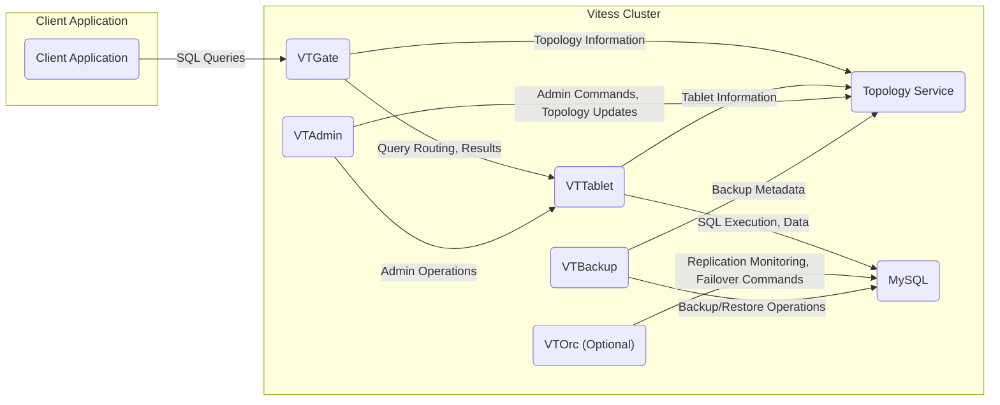

## Project Design Document: Vitess (Improved)

**1. Introduction**

This document provides a detailed architectural design of the Vitess project, an open-source database clustering system for horizontal scaling of MySQL. This document is specifically tailored to serve as a foundation for subsequent threat modeling activities. It outlines the key components, their interactions, and the data flow within a Vitess deployment, with a focus on security-relevant aspects.

**2. Goals**

*   Provide a comprehensive and security-focused overview of the Vitess architecture.
*   Clearly identify key components and their specific responsibilities, including security-related functions.
*   Describe the data flow within the system for various operations, highlighting potential points of interaction and vulnerability.
*   Elaborate on initial security considerations and potential threat areas.
*   Serve as a robust and detailed basis for identifying potential threats, vulnerabilities, and attack vectors.

**3. Scope**

This document covers the core architectural components of Vitess and their interactions in a typical deployment scenario, with a strong emphasis on security boundaries and data flow. It focuses on both the control plane and data plane aspects of the system, highlighting areas where security controls are necessary. Specific deployment configurations and advanced features are mentioned where relevant to security considerations, but the core principles are the primary focus.

**4. Target Audience**

This document is intended for:

*   Security engineers and architects responsible for performing threat modeling and security assessments.
*   Software developers working on the Vitess project or integrating applications with Vitess.
*   Cloud and infrastructure engineers responsible for deploying, configuring, and managing Vitess clusters.
*   Anyone needing a detailed understanding of the Vitess architecture from a security perspective.

**5. System Overview**

Vitess enables horizontal scaling of MySQL by providing features like connection pooling, query rewriting, distributed transaction management, and schema management. It presents a single logical database to applications, abstracting away the complexity of managing multiple underlying MySQL instances (shards). This abstraction layer introduces specific security considerations related to routing, access control, and data integrity.

**6. Architectural Components**

*   **VTGate:**
    *   The intelligent proxy and entry point for client applications connecting to the Vitess cluster.
    *   **Responsibilities:**
        *   Receives SQL queries from clients.
        *   Authenticates and potentially authorizes client connections.
        *   Parses and analyzes SQL queries to understand their intent and target shards.
        *   Routes queries to the appropriate VTTablet instances based on the sharding key and current topology.
        *   Rewrites queries as needed for execution on individual shards.
        *   Aggregates and merges results received from multiple VTTablet instances.
        *   Manages connection pooling to optimize resource utilization.
        *   Enforces read-write splitting based on configured policies.
    *   **Security Relevance:** A critical component for access control and preventing unauthorized data access. Vulnerabilities here could expose the entire database.
*   **VTTablet:**
    *   Acts as an agent on each MySQL instance (or replica set), managing and protecting access to that specific database.
    *   **Responsibilities:**
        *   Manages connections to the underlying MySQL server.
        *   Enforces fine-grained access control policies based on user and query context.
        *   Performs query rewriting and optimization specific to the local shard.
        *   Provides schema management capabilities for the local shard.
        *   Facilitates backup and restore operations for the local MySQL instance.
        *   Monitors the health of the local MySQL instance.
    *   **Security Relevance:**  A key defense against unauthorized access to individual shards. Compromise here could lead to data breaches within a specific shard.
*   **VTAdmin:**
    *   The central management interface (web UI and CLI) for the Vitess cluster, used for administrative tasks.
    *   **Responsibilities:**
        *   Provides functionalities for managing the cluster topology (adding/removing tablets, managing shards).
        *   Enables schema management operations across the cluster.
        *   Facilitates shard management tasks (splitting, merging).
        *   Orchestrates backup and restore operations.
        *   Provides monitoring and health check dashboards.
        *   Manages user accounts and roles for administrative access.
    *   **Security Relevance:**  Highly privileged access. Compromise of VTAdmin could allow an attacker to take full control of the Vitess cluster and its data.
*   **Topology Service (e.g., etcd, Consul, ZooKeeper):**
    *   A distributed, consistent key-value store that serves as the source of truth for the Vitess cluster's metadata.
    *   **Responsibilities:**
        *   Stores information about keyspaces, shards, and tablets.
        *   Maintains the current serving graph, indicating which tablets are serving read and write traffic.
        *   Stores schema information for the cluster.
        *   Facilitates leader election for various Vitess components.
    *   **Security Relevance:**  Contains sensitive metadata about the cluster. Unauthorized access or modification could disrupt the cluster's operation or lead to data corruption.
*   **MySQL:**
    *   The underlying relational database management system where the actual data is stored.
    *   **Responsibilities:**
        *   Stores and manages the persistent data.
        *   Executes SQL queries.
        *   Provides standard database security features (user management, access control).
    *   **Security Relevance:** The ultimate target for data breaches. Vitess relies on the security of the underlying MySQL instances.
*   **VTOrc (Optional):**
    *   An optional component for automated orchestration of MySQL replication and failover within the Vitess cluster.
    *   **Responsibilities:**
        *   Monitors the health of MySQL replication within shards.
        *   Automatically promotes replica instances to master in case of master failures.
        *   Ensures data consistency and high availability.
    *   **Security Relevance:** While primarily for availability, its actions can have security implications if compromised, potentially leading to data loss or inconsistencies.
*   **VTBackup:**
    *   A component responsible for taking and restoring consistent backups of the underlying MySQL instances within the Vitess cluster.
    *   **Responsibilities:**
        *   Coordinates with VTTablet to take backups of individual shards.
        *   Stores backups in a configured storage backend.
        *   Facilitates the restoration of backups.
    *   **Security Relevance:**  Backup data needs to be protected. Unauthorized access to backups could lead to data breaches.

**7. System Architecture Diagram**

**8. Data Flow**

*   **Client Query Execution (Read/Write):**
    1. The client application initiates a database connection to VTGate. This connection may involve authentication.
    2. The client application sends an SQL query to VTGate.
    3. VTGate parses the query and, based on the query and the current topology information from the Topology Service, determines the target shards.
    4. VTGate may rewrite the query to be suitable for execution on individual shards.
    5. VTGate sends the rewritten query (or parts of the original query) to the relevant VTTablet instances. This communication should be secured (e.g., using TLS).
    6. Each VTTablet receives the query, performs authorization checks, and executes it on the local MySQL instance.
    7. The MySQL instance processes the query and returns the results to VTTablet.
    8. VTTablet returns the results to VTGate.
    9. VTGate aggregates the results from different VTTablet instances (if necessary) and returns the final result set to the client application.
*   **Schema Change Operation:**
    1. An administrator initiates a schema change through the VTAdmin interface or CLI, authenticating their identity.
    2. VTAdmin validates the schema change and updates the schema information in the Topology Service.
    3. VTAdmin instructs the relevant VTTablet instances (potentially all tablets in the keyspace) to apply the schema change. This communication should be authenticated and authorized.
    4. Each VTTablet applies the schema change to its local MySQL instance.
    5. VTTablet reports the success or failure of the schema change back to VTAdmin.
*   **Tablet State Change (e.g., Reparenting/Failover):**
    1. An administrator initiates a tablet state change through VTAdmin, or VTOrc automatically triggers it based on monitoring.
    2. VTAdmin/VTOrc updates the tablet's role and status in the Topology Service.
    3. VTAdmin/VTOrc instructs the relevant VTTablet instances to change their roles (e.g., promote a replica to master, demote a master). This involves secure communication and coordination.
    4. VTTablet updates its internal configuration and connects to the appropriate MySQL instance based on its new role.
    5. VTGate monitors the Topology Service for changes and updates its routing information accordingly.
*   **Backup and Restore Operation:**
    1. An administrator initiates a backup operation through VTAdmin, authenticating their request.
    2. VTAdmin instructs the VTBackup component to perform the backup.
    3. VTBackup coordinates with the VTTablet instances of the relevant shards to initiate the backup process on the underlying MySQL instances. This may involve authentication with VTTablet.
    4. VTBackup retrieves the backup data from the MySQL instances (potentially through VTTablet) and stores it in the configured secure backup storage.
    5. For a restore operation, the process is reversed, with VTAdmin instructing VTBackup to retrieve the backup and coordinate with VTTablet to restore it to the MySQL instances.

**9. Security Considerations**

*   **Authentication and Authorization:**
    *   **Client Authentication:** How are client applications authenticating to VTGate? (e.g., MySQL protocol authentication, mutual TLS).
    *   **Client Authorization:** How does VTGate enforce access control policies to ensure clients can only access authorized data?
    *   **Inter-Component Authentication:** How do Vitess components authenticate to each other (e.g., VTGate to VTTablet, VTAdmin to Topology Service)? Mutual TLS or other secure mechanisms should be used.
    *   **Administrative Authentication:** How is access to VTAdmin secured? Strong authentication mechanisms are crucial.
    *   **Administrative Authorization:** How are permissions managed within VTAdmin to control who can perform sensitive operations? Role-Based Access Control (RBAC) is recommended.
*   **Communication Security:**
    *   **Encryption in Transit:** All communication between Vitess components should be encrypted using TLS to protect data confidentiality and integrity. This includes communication between clients and VTGate, VTGate and VTTablet, and VTAdmin and other components.
*   **Access Control to Topology Service:**
    *   **Secure Access:** Access to the Topology Service (etcd, Consul, ZooKeeper) must be strictly controlled. Use authentication and authorization mechanisms provided by the Topology Service.
    *   **Principle of Least Privilege:** Only necessary components should have write access to the Topology Service.
*   **Data at Rest Encryption:**
    *   **MySQL Encryption:** Consider enabling encryption at rest for the underlying MySQL instances to protect data stored on disk.
    *   **Backup Encryption:** Backups stored by VTBackup should be encrypted to prevent unauthorized access to sensitive data.
*   **Input Validation and Sanitization:**
    *   **SQL Injection Prevention:** VTGate and VTTablet must implement robust input validation and sanitization to prevent SQL injection attacks.
*   **Secure Defaults and Configuration:**
    *   **Hardening:** Ensure secure default configurations for all Vitess components and the underlying infrastructure.
    *   **Regular Review:** Regularly review configuration settings to identify and address potential security weaknesses.
*   **Security Auditing and Logging:**
    *   **Audit Trails:** Implement comprehensive audit logging for all security-relevant events, including authentication attempts, authorization decisions, and administrative actions.
    *   **Centralized Logging:** Centralize logs for analysis and monitoring.
*   **Dependency Management:**
    *   **Vulnerability Scanning:** Regularly scan dependencies for known vulnerabilities and apply necessary patches.
*   **Secrets Management:**
    *   **Secure Storage:** Securely store and manage sensitive credentials, such as database passwords and API keys, used by Vitess components. Avoid storing secrets in configuration files. Consider using dedicated secrets management solutions.

**10. Assumptions and Constraints**

*   The underlying network infrastructure is assumed to be reasonably secure and protected by firewalls and other network security controls.
*   The operating systems hosting Vitess components are assumed to be hardened and regularly patched.
*   This document focuses on the core Vitess components. Security considerations for external integrations or custom extensions are not covered in detail.

**11. Future Considerations**

*   Detailed threat modeling exercises for each component and data flow to identify specific vulnerabilities and attack vectors.
*   Development of specific security controls and mitigation strategies for identified threats.
*   Integration with security monitoring and alerting systems to detect and respond to security incidents.
*   Implementation of security scanning and testing as part of the development and deployment pipeline.
*   Further exploration of zero-trust security principles within the Vitess architecture to minimize the impact of potential breaches.
