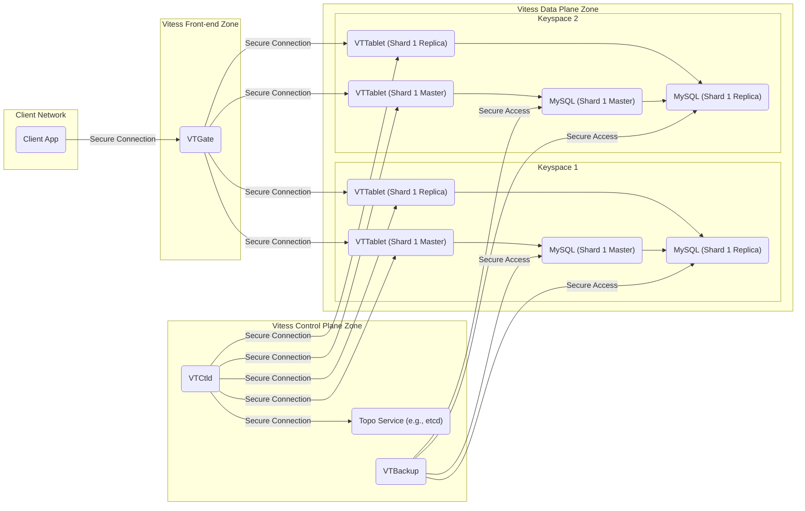
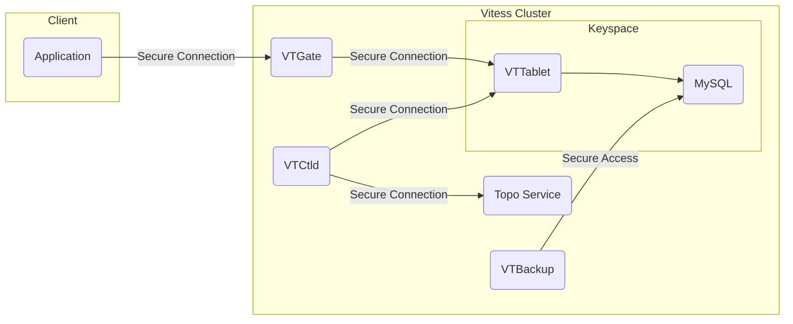
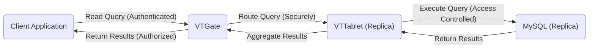
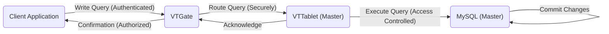
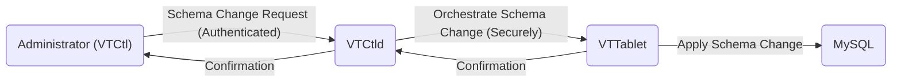

# Project Design Document: Vitess

**Version:** 1.1
**Date:** October 26, 2023
**Authors:** Gemini (AI Assistant)

## 1. Introduction

This document provides an enhanced architectural overview of the Vitess project, a database clustering system for horizontal scaling of MySQL. This revised document aims to provide a more detailed foundation for subsequent threat modeling activities. It elaborates on the key components, their interactions, and the data flow within a Vitess deployment, with a stronger emphasis on security-relevant aspects.

## 2. System Overview

Vitess is a mature, production-ready database solution designed to address the scaling limitations of traditional single MySQL instances. It achieves horizontal scalability through techniques like sharding, replication, and intelligent query routing. By presenting a unified, logical database view to applications, Vitess simplifies development and management while handling the complexities of a distributed database backend.

## 3. Architectural Components

This section provides a more detailed description of the core components of a Vitess deployment, highlighting their security responsibilities and interactions.

*   **VTGate ('VTGate'):**
    *   The primary entry point for client applications.
    *   Maintains knowledge of the Vitess schema and routing rules.
    *   Authenticates and authorizes client connections (pluggable authentication mechanisms).
    *   Parses and rewrites SQL queries for distributed execution.
    *   Routes queries to the appropriate VTTablets based on sharding keys and query characteristics.
    *   Aggregates results from multiple shards before returning to the client.
    *   Implements connection pooling to backend VTTablets.
    *   Can enforce query limits and resource constraints.
*   **VTTablet ('VTTablet'):**
    *   An agent deployed alongside each managed MySQL instance.
    *   Manages the lifecycle of the associated MySQL server.
    *   Enforces fine-grained access control policies on queries executed against the local MySQL instance.
    *   Provides connection pooling to the local MySQL server.
    *   Performs query rewriting and optimization specific to the shard.
    *   Operates in different roles (master, replica, rdonly), impacting write and read capabilities.
    *   Communicates with VTGate to receive and execute queries.
    *   Communicates with VTCtld for management and control plane operations.
*   **VTCtld ('VTCtld'):**
    *   The central control plane daemon for the Vitess cluster.
    *   Stores and manages the cluster's topology information (shard assignments, server roles, etc.) in the Topo Service.
    *   Handles administrative operations like shard creation, schema changes, and failover orchestration.
    *   Authenticates and authorizes administrative requests (typically via mutual TLS or similar mechanisms).
    *   Provides APIs for monitoring and management.
*   **VTCtl ('VTCtl'):**
    *   The command-line interface (CLI) for interacting with VTCtld.
    *   Used by administrators to manage the Vitess cluster.
    *   Relies on secure communication with VTCtld (authenticated and encrypted).
*   **VTBackup ('VTBackup'):**
    *   Responsible for creating and restoring backups of the underlying MySQL instances.
    *   Supports various backup strategies (logical, physical).
    *   Integrates with storage systems for backup persistence.
    *   Access to backup data needs to be controlled to prevent unauthorized access or modification.
*   **VTExplain ('VTExplain'):**
    *   A utility to analyze how VTGate will route and execute a given query.
    *   Useful for understanding query performance and potential routing issues.
    *   Does not directly handle sensitive data but can reveal schema information.
*   **VTCombo ('VTCombo'):**
    *   A single binary bundling VTGate, VTTablet, and VTCtld functionality.
    *   Primarily intended for development and testing environments.
    *   Security considerations for production deployments are the same as the individual components.
*   **Topo Service (e.g., etcd, Consul) ('Topo Service'):**
    *   A distributed, consistent key-value store used by VTCtld to maintain cluster metadata.
    *   Critical for the operation and consistency of the Vitess cluster.
    *   Access control and security of the Topo Service are paramount.
    *   Data stored in the Topo Service includes sensitive configuration information.
*   **MySQL ('MySQL'):**
    *   The underlying relational database management system managed by Vitess.
    *   Stores the actual application data.
    *   Security configurations of individual MySQL instances (authentication, authorization, encryption) are still relevant within a Vitess deployment.

## 4. Data Flow

This section describes the typical flow of data within a Vitess cluster for various operations, emphasizing security touchpoints.

*   **Write Operation:**
    1. A client application ('Client App') sends a write query to VTGate ('VTGate').
    2. VTGate ('VTGate') authenticates and authorizes the client.
    3. VTGate ('VTGate') analyzes the query and determines the target shard(s) based on the sharding key.
    4. VTGate ('VTGate') routes the query securely to the appropriate VTTablet(s) ('VTTablet') in master mode (communication is typically secured with TLS).
    5. The VTTablet ('VTTablet') enforces access control policies and executes the query on the local MySQL master ('MySQL').
    6. MySQL ('MySQL') replicates the changes to its replicas.
    7. The VTTablet ('VTTablet') sends the result back to VTGate ('VTGate').
    8. VTGate ('VTGate') returns the result to the client application ('Client App').
*   **Read Operation:**
    1. A client application ('Client App') sends a read query to VTGate ('VTGate').
    2. VTGate ('VTGate') authenticates and authorizes the client.
    3. VTGate ('VTGate') analyzes the query and determines the target shard(s).
    4. VTGate ('VTGate') routes the query securely to VTTablets ('VTTablet') in replica or read-only mode to distribute read load.
    5. The VTTablet ('VTTablet') enforces access control policies and executes the query on the local MySQL instance ('MySQL').
    6. The VTTablet ('VTTablet') sends the result back to VTGate ('VTGate').
    7. VTGate ('VTGate') aggregates the results from multiple shards if necessary.
    8. VTGate ('VTGate') returns the result to the client application ('Client App').
*   **Schema Change Operation:**
    1. An administrator initiates a schema change using VTCtl ('VTCtl').
    2. VTCtl ('VTCtl') securely communicates with VTCtld ('VTCtld'), authenticating the request.
    3. VTCtld ('VTCtld') orchestrates the schema change across all relevant VTTablets ('VTTablet').
    4. VTCtld ('VTCtld') communicates securely with each VTTablet ('VTTablet').
    5. VTTablets ('VTTablet') apply the schema change to their respective MySQL instances ('MySQL'). This may involve privileged operations on the MySQL servers.

## 5. Deployment Architecture (Illustrative Example)

This is a more detailed example of a Vitess deployment, highlighting potential network zones and security boundaries.

## 6. Key Security Considerations (For Threat Modeling)

This section expands on the initial security considerations, providing more specific areas to focus on during threat modeling.

*   **Authentication and Authorization:**
    *   **Client Authentication to VTGate:**
        *   What authentication mechanisms are supported (e.g., MySQL protocol authentication, gRPC authentication, custom plugins)?
        *   How are client credentials managed and stored?
        *   Are there options for multi-factor authentication?
    *   **Authorization at VTGate:**
        *   How are user permissions and access control policies defined and enforced?
        *   Is there integration with external authorization systems (e.g., RBAC, ABAC)?
        *   How are permissions managed for different keyspaces and tables?
    *   **Administrative Authentication to VTCtld:**
        *   What methods are used to authenticate administrators (e.g., mutual TLS, API keys)?
        *   How is access to sensitive VTCtld operations controlled?
    *   **VTTablet Authentication:**
        *   How does VTGate authenticate to VTTablets?
        *   How does VTCtld authenticate to VTTablets?
*   **Communication Security:**
    *   **Inter-Component Communication:**
        *   Is communication between VTGate, VTTablet, and VTCtld encrypted (e.g., TLS with mutual authentication)?
        *   Are there options for message signing or integrity checks?
    *   **VTTablet to MySQL Communication:**
        *   Is the connection between VTTablet and the local MySQL instance encrypted?
        *   How are MySQL credentials managed by VTTablet?
    *   **Client to VTGate Communication:**
        *   Is client communication with VTGate encrypted (e.g., TLS)?
        *   Are there options for enforcing secure connections?
*   **Data Security:**
    *   **Data at Rest Encryption (MySQL):**
        *   Is data at rest in the underlying MySQL instances encrypted?
        *   How are encryption keys managed?
    *   **Data in Transit Encryption:**
        *   Covered under Communication Security.
    *   **Sensitive Data Handling:**
        *   How is sensitive data handled within Vitess logs and metadata stored in the Topo Service?
        *   Are there mechanisms to redact sensitive information?
*   **Topology Service Security:**
    *   **Access Control:**
        *   How is access to the Topo Service (etcd, Consul) controlled and secured?
        *   Who has permissions to read and write topology data?
    *   **Data Protection:**
        *   Is the data stored in the Topo Service encrypted at rest and in transit?
        *   What are the implications of a compromise of the Topo Service (e.g., data loss, cluster disruption)?
*   **VTTablet Security:**
    *   **Isolation:**
        *   How are VTTablets isolated from each other and other processes on the same host?
        *   Are there mechanisms to limit resource consumption?
    *   **Query Limits and Enforcement:**
        *   How are query limits and access controls enforced by VTTablet to prevent malicious queries?
*   **VTCtld Security:**
    *   **Access Control:**
        *   Who has administrative access to VTCtld and its functionalities?
        *   Are there different levels of administrative privileges?
    *   **Audit Logging:**
        *   Are administrative actions performed via VTCtl and VTCtld logged and auditable?
*   **Backup Security:**
    *   **Storage Security:**
        *   How are backups stored and secured?
        *   Is backup data encrypted at rest and in transit?
        *   Are access controls in place for backup storage?
    *   **Access Control:**
        *   Who has access to create, restore, and delete backups?
*   **Supply Chain Security:**
    *   **Binary Verification:**
        *   How are the integrity and authenticity of Vitess binaries verified?
    *   **Dependency Management:**
        *   How are dependencies managed and are there checks for known vulnerabilities?
*   **Operational Security:**
    *   **Monitoring and Alerting:**
        *   Are there security-related metrics and alerts in place?
    *   **Patching and Updates:**
        *   How are security patches and updates applied to Vitess components and dependencies?

## 7. Diagrams

This section contains updated visual representations of the Vitess architecture and data flow.

### 7.1. High-Level Architecture

### 7.2. Data Flow (Read Operation)

### 7.3. Data Flow (Write Operation)

### 7.4. Data Flow (Schema Change)

## 8. Future Considerations

This design document will continue to evolve. Future iterations may include more detailed information on:

*   Specific security configurations and best practices for different deployment environments (e.g., cloud platforms, on-premises).
*   Integration with security information and event management (SIEM) systems.
*   Detailed threat models for specific components and data flows.
*   Guidance on implementing security controls and mitigations.
*   Considerations for compliance with relevant security standards and regulations.

This enhanced document provides a more robust foundation for conducting a thorough threat modeling exercise, enabling the identification of potential security vulnerabilities and the development of appropriate mitigation strategies for the Vitess project.