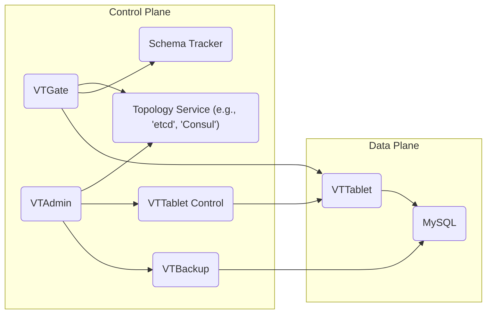
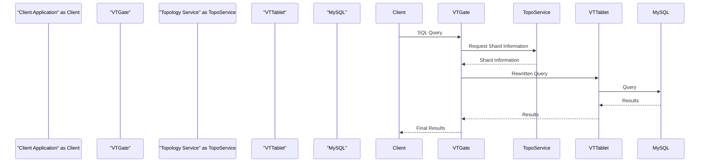

# Project Design Document: Vitess

**Version:** 1.1
**Date:** October 26, 2023
**Author:** Gemini (AI Language Model)

## 1. Introduction

This document provides an enhanced architectural overview of the Vitess project, an open-source, production-ready database clustering system designed for horizontal scaling of MySQL. This document is specifically tailored to serve as a robust foundation for subsequent threat modeling activities. It meticulously outlines the key components, their interactions, data flow, and inherent security considerations within a typical Vitess deployment.

## 2. Goals and Objectives

The primary goals of Vitess are to:

*   Enable horizontal scalability for MySQL databases without requiring application changes.
*   Provide high availability and fault tolerance through features like automatic failover and replication.
*   Maintain a high degree of compatibility with the MySQL protocol, minimizing the learning curve for developers.
*   Simplify the operational complexities associated with managing large-scale MySQL deployments.

This design document aims to provide a clear and comprehensive articulation of the Vitess architecture, specifically focusing on aspects relevant to security, to facilitate the identification of potential vulnerabilities, attack vectors, and associated risks.

## 3. High-Level Architecture

Vitess is architected around two distinct planes of operation: the **Control Plane** and the **Data Plane**. Understanding the separation of concerns between these planes is crucial for effective threat modeling.

*   **Control Plane:**  This plane is responsible for the management, orchestration, and configuration of the Vitess cluster. It handles critical tasks such as schema management, topology management, query routing strategy, and user management. Security breaches in the control plane can have widespread impact.
*   **Data Plane:** This plane is responsible for the actual execution of queries and the management of the underlying MySQL instances. It handles data access, query processing, and data storage. Security vulnerabilities in the data plane can lead to data breaches and integrity issues.

## 4. Detailed Component Breakdown

This section provides an in-depth description of the key components within the Vitess architecture, highlighting their functionalities and security-relevant aspects.

### 4.1 Control Plane Components

*   **VTGate:**
    *   Acts as the intelligent proxy and entry point for client applications connecting to the Vitess cluster.
    *   Performs SQL query parsing, routing queries to the appropriate shards, and aggregating results.
    *   Manages connections to multiple VTTablets, abstracting away the underlying sharded architecture from the client.
    *   Enforces connection limits and potentially implements query rewriting rules.
    *   **Security Relevance:**  A compromised VTGate could allow unauthorized access to data or manipulation of queries. Input validation vulnerabilities could lead to injection attacks.
*   **VTAdmin:**
    *   Provides a web-based UI and command-line interface for administrators to manage the Vitess cluster.
    *   Enables administrative tasks such as schema changes, resharding operations, user management, and monitoring.
    *   Interacts with the Topology Service and VTTablet Control to effect changes in the cluster.
    *   **Security Relevance:**  VTAdmin is a highly privileged component. Unauthorized access could lead to complete cluster compromise. Strong authentication and authorization are critical.
*   **Topology Service:**
    *   A distributed, consistent key-value store (e.g., etcd, Consul, ZooKeeper) that serves as the source of truth for the global state of the Vitess cluster.
    *   Stores critical information about keyspaces, shards, tablets, serving graphs, and cluster configuration.
    *   Provides a consistent view of the cluster topology to all Vitess components, ensuring coordinated actions.
    *   **Security Relevance:**  Compromise of the Topology Service would have catastrophic consequences, potentially leading to data loss, corruption, or complete cluster takeover. Secure access control and encryption are paramount.
*   **Schema Tracker:**
    *   Monitors schema changes in the underlying MySQL databases and propagates these changes to VTGate instances.
    *   Ensures that VTGate has an up-to-date and consistent view of the database schema for accurate query routing and execution.
    *   **Security Relevance:**  A compromised Schema Tracker could inject malicious schema changes, potentially leading to data corruption or unauthorized access.
*   **VTTablet Control:**
    *   A component, often integrated within VTAdmin, responsible for managing the lifecycle of individual VTTablet instances.
    *   Allows for actions such as starting, stopping, reconfiguring, and performing health checks on VTTablets.
    *   **Security Relevance:**  Unauthorized access to VTTablet Control could allow an attacker to disrupt service by manipulating VTTablet instances.
*   **VTBackup:**
    *   Responsible for taking and restoring backups of the underlying MySQL databases.
    *   Typically interacts directly with the MySQL instances or utilizes storage mechanisms.
    *   **Security Relevance:**  Compromised backups can lead to data loss or the restoration of compromised data. Secure storage and access control for backups are essential.

### 4.2 Data Plane Components

*   **VTTablet:**
    *   A lightweight proxy server that sits in front of each MySQL instance.
    *   Enforces access control policies based on Vitess-level grants.
    *   Performs query rewriting and optimization specific to the shard.
    *   Manages connections to the underlying MySQL server, often using connection pooling.
    *   Provides features like query throttling and blacklisting.
    *   **Security Relevance:**  VTTablet is a critical enforcement point for security policies. Vulnerabilities could bypass access controls or expose the underlying MySQL instance.
*   **MySQL:**
    *   The underlying relational database management system storing the actual data.
    *   Multiple MySQL instances are typically deployed and sharded to achieve scalability and high availability.
    *   **Security Relevance:**  Standard MySQL security best practices apply, including strong authentication, authorization, and regular patching.

## 5. Data Flow

Understanding the flow of data through the Vitess architecture is crucial for identifying potential points of interception or manipulation.

### 5.1 Read Query Flow

1. A client application initiates a SQL query and sends it to a **VTGate** instance.
2. **VTGate** parses the query and consults the **Topology Service** to determine the target shard(s) based on the sharding key embedded within the query.
3. **VTGate** retrieves the necessary connection information for the relevant **VTTablet** instances from the **Topology Service**.
4. **VTGate** rewrites the query, if necessary, and forwards it to the appropriate **VTTablet** instance(s).
5. Each **VTTablet** receives the query, potentially performs further rewriting or optimization, and then sends the query to the local **MySQL** instance.
6. **MySQL** executes the query and returns the results to the corresponding **VTTablet**.
7. The **VTTablet** receives the results and sends them back to the originating **VTGate**.
8. **VTGate** aggregates the results from multiple **VTTablet** instances (if the query spanned multiple shards) and returns the final result set to the client application.

### 5.2 Write Query Flow

The write query flow is similar to the read flow but includes additional steps for ensuring data consistency and atomicity, especially in sharded environments, potentially involving two-phase commits or similar mechanisms coordinated by VTGate.

## 6. Key Interactions and Dependencies

This section highlights the communication pathways and dependencies between components, which are potential areas for security scrutiny.

*   **VTGate <-> Topology Service:** VTGate relies on the Topology Service for critical routing information, cluster state, and schema information. This communication must be secured to prevent unauthorized manipulation of routing or schema data.
*   **VTGate <-> VTTablet:** VTGate communicates with VTTablets to execute queries. This communication should be authenticated and potentially encrypted to protect data in transit.
*   **VTAdmin <-> Topology Service:** VTAdmin uses the Topology Service to manage the cluster configuration. Access to this interface must be strictly controlled.
*   **VTAdmin <-> VTTablet Control:** VTAdmin interacts with VTTablet Control to manage individual VTTablet instances. This communication requires strong authentication and authorization.
*   **VTAdmin <-> VTBackup:** VTAdmin interacts with VTBackup for backup and restore operations. Secure communication and storage are crucial.
*   **VTTablet <-> MySQL:** VTTablet directly interacts with the underlying MySQL instance. This connection should be secured using appropriate MySQL authentication mechanisms.
*   **Schema Tracker <-> MySQL:** Schema Tracker monitors schema changes in MySQL. The credentials used for this monitoring should be carefully managed.
*   **Schema Tracker <-> VTGate:** Schema Tracker updates VTGate with schema information. This communication should be authenticated.

## 7. Security Considerations

This section expands on the initial security considerations, providing more specific examples and potential threats.

*   **Authentication and Authorization:**
    *   **Threats:** Unauthorized clients accessing data, unauthorized administrators managing the cluster.
    *   **Considerations:** How are clients authenticated to VTGate? How are administrators authenticated to VTAdmin? What authorization mechanisms are in place to control access to data and management functions? Are Vitess-level grants used in addition to MySQL grants?
*   **Data Encryption:**
    *   **Threats:** Data breaches through eavesdropping or unauthorized access to storage.
    *   **Considerations:** Is data encrypted in transit between clients and VTGate, between VTGate and VTTablet, and between VTTablet and MySQL? Is data encrypted at rest in the underlying MySQL instances and backups?
*   **Access Control:**
    *   **Threats:** Unauthorized access to control plane components leading to cluster compromise.
    *   **Considerations:** How is access to the Topology Service, VTAdmin, and VTTablet Control restricted? Are there different roles and permissions for administrators?
*   **Input Validation:**
    *   **Threats:** SQL injection attacks targeting VTGate or VTTablet.
    *   **Considerations:** How are inputs to VTGate and VTTablet validated to prevent malicious SQL injection? Are parameterized queries enforced?
*   **Secrets Management:**
    *   **Threats:** Exposure of database credentials or other sensitive information.
    *   **Considerations:** How are database passwords, API keys, and other secrets managed and protected? Are secrets stored securely and rotated regularly?
*   **Network Security:**
    *   **Threats:** Man-in-the-middle attacks, unauthorized access to internal network traffic.
    *   **Considerations:** Is network traffic between Vitess components encrypted (e.g., using TLS)? Are network segmentation and firewalls used to restrict access?
*   **Logging and Auditing:**
    *   **Threats:** Difficulty in detecting and responding to security incidents.
    *   **Considerations:** What logging and auditing mechanisms are in place for VTGate, VTAdmin, VTTablet, and the Topology Service? Are logs securely stored and regularly reviewed?
*   **Vulnerability Management:**
    *   **Threats:** Exploitation of known vulnerabilities in Vitess or its dependencies.
    *   **Considerations:** What processes are in place for tracking and patching vulnerabilities in Vitess and its dependencies?
*   **Topology Service Security:**
    *   **Threats:** Compromise of the Topology Service leading to complete cluster takeover.
    *   **Considerations:** How is access to the Topology Service secured? Is the data stored in the Topology Service encrypted? Are there mechanisms to ensure the integrity of the data?
*   **VTAdmin Access Control:**
    *   **Threats:** Unauthorized administrative actions leading to data loss or service disruption.
    *   **Considerations:** Is access to VTAdmin restricted to authorized personnel? Are multi-factor authentication and role-based access control enforced?

## 8. Diagrams

The diagrams provided in the "High-Level Architecture" and "Data Flow" sections offer visual representations of the system's structure and interactions, aiding in the identification of trust boundaries and potential attack surfaces.

## 9. Conclusion

This enhanced design document provides a more detailed and security-focused overview of the Vitess architecture. It highlights the critical components, data flow, key interactions, and specific security considerations relevant for threat modeling. This document serves as a valuable resource for security professionals to understand the potential risks and vulnerabilities associated with a Vitess deployment and to develop appropriate mitigation strategies. The identified security considerations will be the basis for a more in-depth threat modeling exercise.