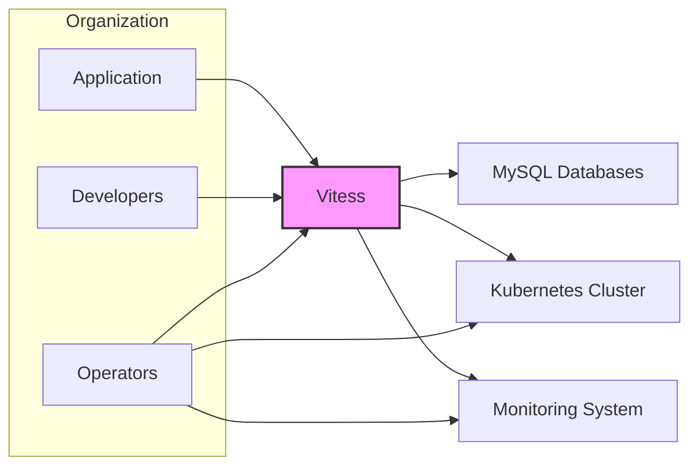
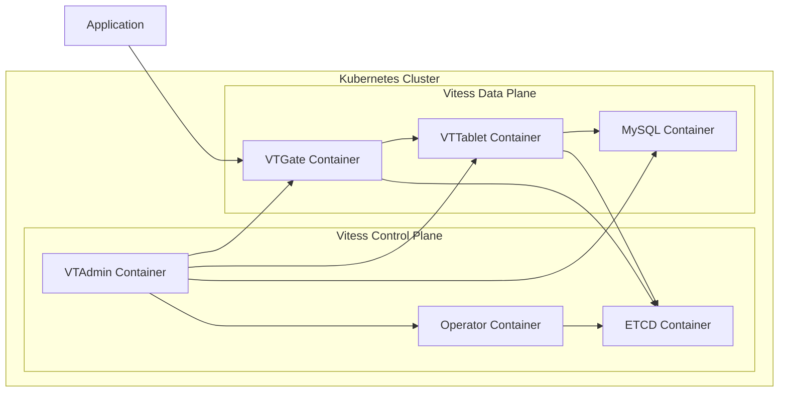
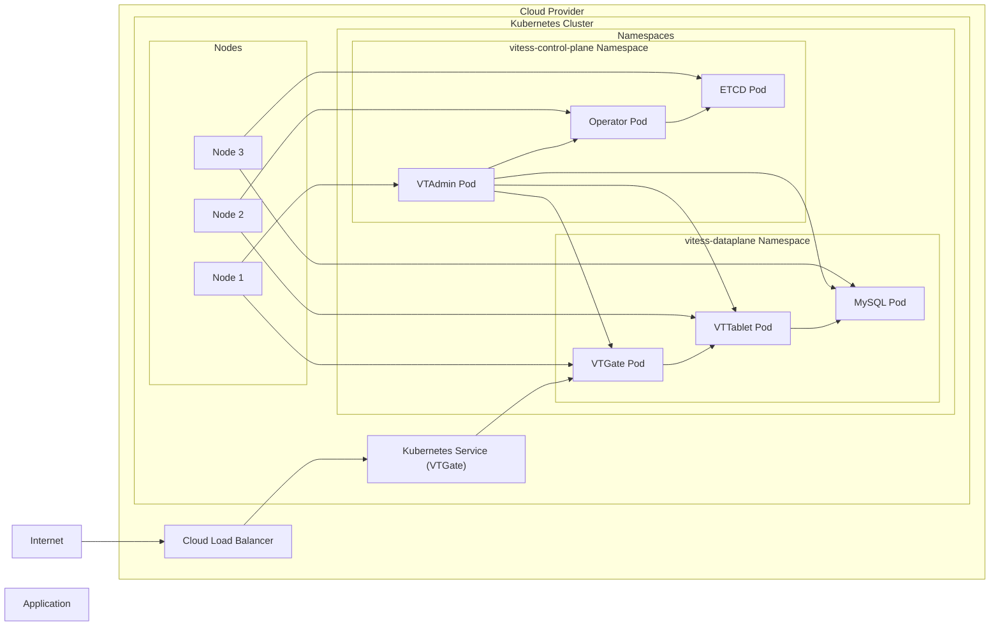
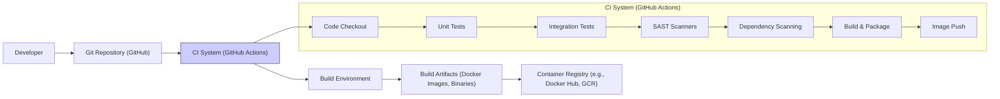

# BUSINESS POSTURE

Vitess is a database clustering system for horizontal scaling of MySQL. It enables applications to scale beyond the limits of a single database server by distributing data across multiple MySQL instances. It also provides features for managing and operating large MySQL deployments, including connection pooling, query rewriting, and online schema changes.

Business priorities and goals for adopting Vitess:
- Scalability: Handle increasing data volumes and query loads as the application grows.
- High Availability: Ensure continuous database service availability even in the face of hardware or software failures.
- Operational Efficiency: Simplify the management and operation of large MySQL deployments.
- Performance: Maintain or improve application performance as the database scales.

Most important business risks to address:
- Data Loss: Risk of losing critical application data due to failures or misconfigurations in the distributed database system.
- Data Corruption: Risk of data inconsistencies or corruption across the distributed shards.
- Security Breaches: Risk of unauthorized access to sensitive application data stored in the database.
- Performance Degradation: Risk of application performance suffering due to misconfiguration or operational issues in Vitess.
- Operational Complexity: Risk of increased operational overhead and complexity in managing a distributed database system.

# SECURITY POSTURE

Existing security controls:
- security control: MySQL Authentication: Vitess relies on MySQL's built-in authentication mechanisms for users connecting to the underlying MySQL instances. Described in MySQL documentation.
- security control: MySQL Authorization: MySQL's grant system is used to control access to data within the MySQL instances. Described in MySQL documentation.
- security control: TLS Encryption for MySQL connections: Vitess supports TLS encryption for connections between Vitess components and MySQL instances, as well as for client connections to VTGate. Configured in Vitess and MySQL configurations.
- security control: Role-Based Access Control (RBAC) for Vitess Admin UI and VTAdmin API: Vitess provides RBAC to control access to administrative functions. Described in Vitess documentation.

Accepted risks:
- accepted risk: Complexity of Security Configuration: Securing a distributed system like Vitess can be complex, requiring careful configuration of multiple components.
- accepted risk: Operational Overhead of Security Management: Managing security in a distributed environment may require additional operational effort.

Recommended security controls:
- security control: Vulnerability Scanning: Implement regular vulnerability scanning for Vitess components and underlying infrastructure.
- security control: Security Audits: Conduct periodic security audits of Vitess deployments and configurations.
- security control: Penetration Testing: Perform penetration testing to identify potential security weaknesses in Vitess deployments.
- security control: Security Information and Event Management (SIEM) integration: Integrate Vitess logs and security events with a SIEM system for monitoring and alerting.
- security control: Data Loss Prevention (DLP) measures: Implement DLP measures to prevent sensitive data leakage from the database.
- security control: Regular Security Patching: Establish a process for timely application of security patches to Vitess and its dependencies.
- security control: Secure Software Development Lifecycle (SSDLC) practices: Incorporate security considerations throughout the software development lifecycle of Vitess itself and applications using Vitess.

Security Requirements:
- Authentication:
    - requirement: Strong authentication mechanisms should be used for all access to Vitess components, including VTGate, VTTablet, VTAdmin, and underlying MySQL instances.
    - requirement: Support for multi-factor authentication (MFA) should be considered for administrative access.
- Authorization:
    - requirement: Implement fine-grained authorization controls to restrict access to Vitess resources and data based on roles and responsibilities.
    - requirement: Principle of least privilege should be applied to all access control configurations.
- Input Validation:
    - requirement: All inputs to Vitess components, including queries, commands, and configuration parameters, must be thoroughly validated to prevent injection attacks (e.g., SQL injection).
    - requirement: Input validation should be performed at multiple layers, including VTGate and VTTablet.
- Cryptography:
    - requirement: Sensitive data at rest and in transit should be encrypted using strong cryptographic algorithms.
    - requirement: Key management practices should be implemented to securely manage encryption keys.
    - requirement: TLS encryption should be enforced for all network communication between Vitess components and clients.

# DESIGN

## C4 CONTEXT

Context Diagram Elements:

- Element:
    - Name: Application
    - Type: Software System
    - Description: The application that uses Vitess as its database. It interacts with Vitess to store and retrieve data.
    - Responsibilities: Sending queries to Vitess, processing data received from Vitess.
    - Security controls: Application-level authentication and authorization, input validation before sending queries to Vitess, secure handling of data received from Vitess.

- Element:
    - Name: Developers
    - Type: Person
    - Description: Software developers who develop and maintain the application that uses Vitess. They interact with Vitess for development and testing purposes.
    - Responsibilities: Developing and testing application code that interacts with Vitess, configuring Vitess for development environments.
    - Security controls: Access control to development environments, secure coding practices, code review processes.

- Element:
    - Name: Operators
    - Type: Person
    - Description: Operations team responsible for deploying, managing, and monitoring the Vitess infrastructure. They interact with Vitess and Kubernetes to operate the system.
    - Responsibilities: Deploying and configuring Vitess, monitoring Vitess performance and health, managing Vitess clusters, applying security patches, incident response.
    - Security controls: Strong authentication and authorization for accessing Vitess administrative interfaces and Kubernetes, access control to production environments, security training.

- Element:
    - Name: Vitess
    - Type: Software System
    - Description: The Vitess database clustering system. It sits between the application and the underlying MySQL databases, providing scalability and management features.
    - Responsibilities: Query routing, connection pooling, query rewriting, schema management, shard management, data replication, security enforcement within Vitess components.
    - Security controls: RBAC for VTAdmin, TLS encryption for internal communication and client connections, input validation within VTGate, secure configuration management.

- Element:
    - Name: MySQL Databases
    - Type: Software System
    - Description: The underlying MySQL database instances that store the actual data. Vitess shards data across these MySQL instances.
    - Responsibilities: Data storage, data retrieval, data replication within MySQL clusters.
    - Security controls: MySQL authentication and authorization, TLS encryption for connections, data at rest encryption (if configured in MySQL), regular security patching of MySQL instances.

- Element:
    - Name: Kubernetes Cluster
    - Type: Infrastructure
    - Description: The Kubernetes cluster used to orchestrate and manage Vitess components.
    - Responsibilities: Container orchestration, service discovery, resource management for Vitess components.
    - Security controls: Kubernetes RBAC, network policies to isolate Vitess components, security hardening of Kubernetes nodes, regular security patching of Kubernetes cluster.

- Element:
    - Name: Monitoring System
    - Type: Software System
    - Description: A monitoring system used to monitor the health and performance of Vitess and the underlying infrastructure. Examples include Prometheus, Grafana.
    - Responsibilities: Collecting metrics from Vitess components and MySQL, alerting on anomalies, providing dashboards for visualization.
    - Security controls: Access control to monitoring dashboards and data, secure configuration of monitoring agents, TLS encryption for communication with monitoring system.

## C4 CONTAINER

Container Diagram Elements:

- Element:
    - Name: VTGate Container
    - Type: Container
    - Description: Vitess Gateway. The entry point for client applications. It routes queries to the appropriate VTTablet instances.
    - Responsibilities: Query parsing, query routing, connection pooling, query rewriting, security enforcement for client connections.
    - Security controls: Input validation, authentication and authorization of client requests, TLS termination, rate limiting, query sanitization.

- Element:
    - Name: VTTablet Container
    - Type: Container
    - Description: Vitess Tablet Server. Manages a MySQL instance. Executes queries on the MySQL instance and provides data access to VTGate.
    - Responsibilities: Query execution, connection management to MySQL, schema management, data replication, enforcing access control policies for data access.
    - Security controls: Authentication and authorization for VTGate connections, input validation for queries from VTGate, secure communication with MySQL, data at rest encryption (relies on MySQL capabilities).

- Element:
    - Name: MySQL Container
    - Type: Container
    - Description: The MySQL database instance managed by VTTablet. Stores the actual data shards.
    - Responsibilities: Data storage, data retrieval, data replication within MySQL, enforcing MySQL security controls.
    - Security controls: MySQL authentication and authorization, TLS encryption for connections, data at rest encryption (if configured), regular security patching.

- Element:
    - Name: VTAdmin Container
    - Type: Container
    - Description: Vitess Admin UI and API. Provides a web UI and API for managing and monitoring Vitess clusters.
    - Responsibilities: Cluster management, schema management, user management, monitoring, providing administrative interface.
    - Security controls: RBAC for access control, authentication for administrative users, audit logging of administrative actions, secure configuration management.

- Element:
    - Name: Operator Container
    - Type: Container
    - Description: Kubernetes Operator for Vitess. Automates the deployment, scaling, and management of Vitess clusters in Kubernetes.
    - Responsibilities: Vitess cluster lifecycle management, automated deployments, scaling, upgrades, and repairs.
    - Security controls: Kubernetes RBAC for operator permissions, secure handling of Kubernetes secrets, reconciliation logic to maintain desired state and security configurations.

- Element:
    - Name: ETCD Container
    - Type: Container
    - Description: Distributed key-value store used by Vitess for storing cluster metadata and coordination.
    - Responsibilities: Storing cluster topology, schema information, locking and coordination between Vitess components.
    - Security controls: Access control to ETCD, TLS encryption for communication, data at rest encryption (if configured), secure configuration management.

## DEPLOYMENT

Deployment Architecture: Kubernetes on Cloud Provider (e.g., AWS, GCP, Azure)

Deployment Diagram Elements:

- Element:
    - Name: Cloud Provider
    - Type: Infrastructure
    - Description: The cloud provider infrastructure (e.g., AWS, GCP, Azure) hosting the Kubernetes cluster and other cloud services.
    - Responsibilities: Providing underlying compute, network, and storage infrastructure, cloud-level security controls.
    - Security controls: Cloud provider security controls (e.g., VPCs, security groups, IAM), physical security of data centers.

- Element:
    - Name: Kubernetes Cluster
    - Type: Infrastructure
    - Description: The Kubernetes cluster deployed on the cloud provider, used to orchestrate Vitess components.
    - Responsibilities: Container orchestration, resource management, service discovery, network management within the cluster.
    - Security controls: Kubernetes RBAC, network policies, security hardening of Kubernetes nodes, regular security patching, access control to Kubernetes API.

- Element:
    - Name: Nodes
    - Type: Infrastructure
    - Description: Worker nodes in the Kubernetes cluster where Vitess pods are deployed.
    - Responsibilities: Running containerized Vitess components, providing compute resources.
    - Security controls: Operating system security hardening, security monitoring on nodes, regular security patching of OS and container runtime.

- Element:
    - Name: Namespaces (vitess-control-plane, vitess-dataplane)
    - Type: Kubernetes Resource
    - Description: Kubernetes namespaces used to logically isolate Vitess control plane and data plane components.
    - Responsibilities: Providing isolation and resource management within the Kubernetes cluster.
    - Security controls: Kubernetes RBAC for namespace access control, network policies to restrict traffic between namespaces.

- Element:
    - Name: VTAdmin Pod, Operator Pod, ETCD Pod, VTGate Pod, VTTablet Pod, MySQL Pod
    - Type: Kubernetes Pod
    - Description: Kubernetes pods encapsulating the respective Vitess containers.
    - Responsibilities: Running individual Vitess containers, providing isolation and resource limits for containers.
    - Security controls: Container security context, pod security policies (or pod security admission), resource limits to prevent resource exhaustion.

- Element:
    - Name: Kubernetes Service (VTGate)
    - Type: Kubernetes Resource
    - Description: Kubernetes service that exposes VTGate pods to external traffic.
    - Responsibilities: Load balancing traffic across VTGate pods, providing a stable endpoint for applications.
    - Security controls: Network policies to control access to the service, service account security.

- Element:
    - Name: Cloud Load Balancer
    - Type: Infrastructure
    - Description: Cloud provider load balancer that distributes external traffic to the Kubernetes service.
    - Responsibilities: Load balancing external traffic, TLS termination (optional), providing external access point.
    - Security controls: Load balancer security configurations, TLS termination policies, access control lists.

- Element:
    - Name: Internet
    - Type: External Environment
    - Description: The public internet from where application traffic originates.
    - Responsibilities: Source of application traffic.
    - Security controls: Network security controls at the perimeter (e.g., firewalls, DDoS protection).

- Element:
    - Name: Application
    - Type: Software System
    - Description: The application accessing Vitess.
    - Responsibilities: Sending requests to Vitess.
    - Security controls: Application-level security controls, secure communication protocols.

## BUILD

Build Process Description:

1. Developer commits code changes to the Git Repository (GitHub).
2. GitHub Actions CI pipeline is triggered upon code changes (e.g., push, pull request).
3. CI pipeline stages:
    - Code Checkout: Source code is checked out from the Git repository.
    - Unit Tests: Unit tests are executed to verify code functionality.
    - Integration Tests: Integration tests are executed to test interactions between components.
    - SAST Scanners: Static Application Security Testing (SAST) scanners are run to identify potential security vulnerabilities in the code.
    - Dependency Scanning: Dependency scanning tools are used to check for known vulnerabilities in project dependencies.
    - Build & Package: Code is compiled, and build artifacts (e.g., Docker images, binaries) are created.
    - Image Push: Docker images are pushed to a container registry (e.g., Docker Hub, Google Container Registry).
4. Build Artifacts (Docker images, binaries) are stored in the Container Registry.

Build Process Security Controls:

- security control: Automated Build Pipeline: Using a CI system like GitHub Actions ensures a consistent and repeatable build process, reducing manual errors and potential security gaps.
- security control: Source Code Management: Using Git for version control and code review helps track changes and ensures code integrity.
- security control: Unit and Integration Tests: Automated tests help ensure code quality and reduce the risk of introducing vulnerabilities.
- security control: Static Application Security Testing (SAST): SAST scanners identify potential security vulnerabilities in the source code early in the development cycle.
- security control: Dependency Scanning: Scanning dependencies for known vulnerabilities helps prevent supply chain attacks.
- security control: Container Image Scanning: Container images in the registry should be scanned for vulnerabilities before deployment. (Recommended additional control).
- security control: Secure Build Environment: The CI build environment should be secured and hardened to prevent tampering and unauthorized access.
- security control: Access Control to CI/CD Pipeline: Access to modify and manage the CI/CD pipeline should be restricted to authorized personnel.
- security control: Code Signing: Signing build artifacts (e.g., binaries, container images) can ensure their integrity and authenticity. (Consider for future implementation).

# RISK ASSESSMENT

Critical business processes we are trying to protect:
- Application Data Storage and Retrieval: Ensuring reliable and scalable storage and retrieval of application data is critical for the application's functionality.
- Application Availability: Maintaining high availability of the database service is crucial for business continuity and user experience.
- Data Consistency: Ensuring data consistency across the distributed database shards is important for data integrity and application correctness.

Data we are trying to protect and their sensitivity:
- Application Data: The primary data stored in Vitess is application data. Sensitivity depends on the application, but it can range from low to high sensitivity, potentially including personally identifiable information (PII), financial data, or other confidential information.
- Database Credentials: Credentials for accessing MySQL instances and Vitess components are highly sensitive and must be protected to prevent unauthorized access.
- Configuration Data: Vitess configuration data, including cluster topology and access control settings, is sensitive and needs to be protected to maintain system security and integrity.
- Logs and Audit Data: Logs and audit data may contain sensitive information and should be protected to ensure confidentiality and integrity.

Data Sensitivity Level: High (assuming application data is sensitive and requires protection).

# QUESTIONS & ASSUMPTIONS

Questions:
- What is the sensitivity level of the application data that will be stored in Vitess?
- What are the specific compliance requirements (e.g., GDPR, HIPAA, PCI DSS) that apply to the application and its data?
- What is the organization's risk appetite for security vulnerabilities and data breaches?
- What existing security monitoring and incident response capabilities are in place?
- Are there specific performance or scalability requirements that might impact security design choices?
- What is the expected deployment environment (cloud provider, on-premises, hybrid)?
- Are there any specific security tools or technologies that are already in use or preferred by the organization?

Assumptions:
- BUSINESS POSTURE: The primary business goal is to achieve scalability and high availability for the application database while maintaining data security and integrity. Security is a high priority.
- SECURITY POSTURE: The organization is security-conscious and aims to implement robust security controls. They are willing to invest in security measures to mitigate risks. The deployment environment is assumed to be in a cloud provider (Kubernetes).
- DESIGN: The design is based on a typical Kubernetes deployment of Vitess. TLS encryption is assumed to be enabled for all sensitive communication. RBAC is used for access control within Vitess and Kubernetes.