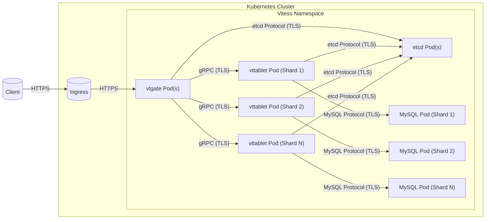
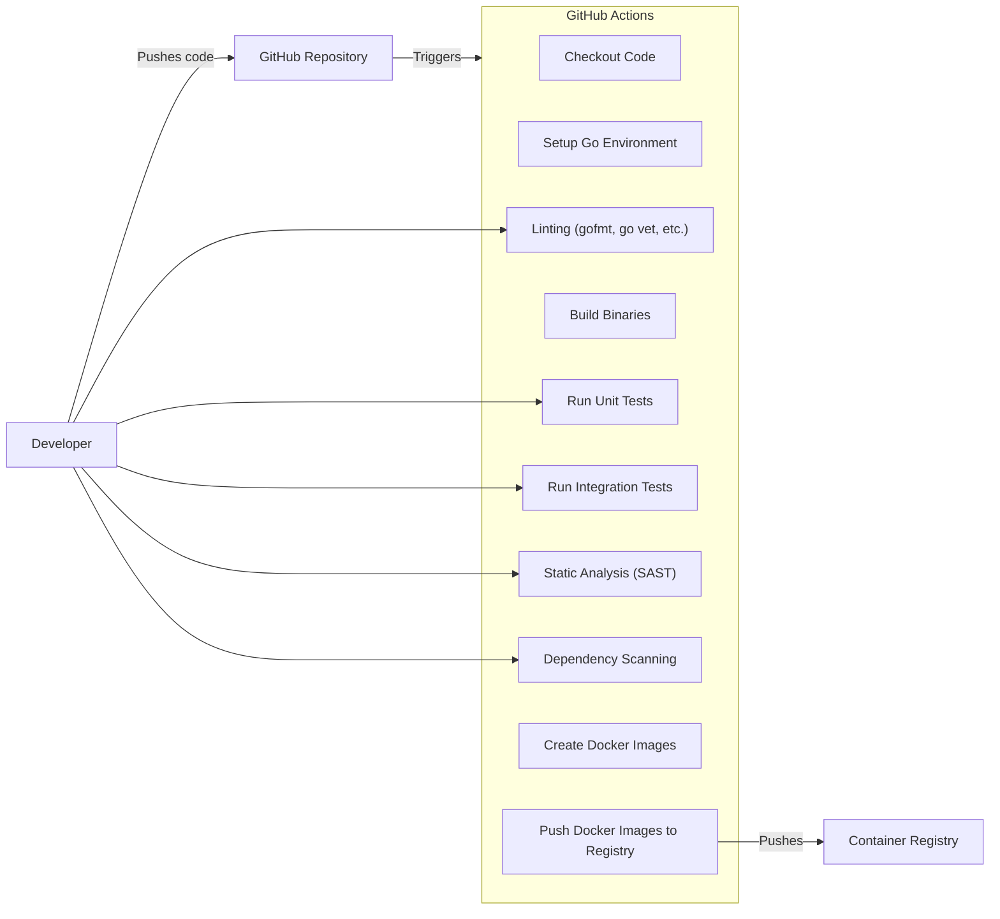

Okay, let's create a design document for Vitess, based on the provided GitHub repository.

# BUSINESS POSTURE

Vitess is a database clustering system for horizontal scaling of MySQL.  It's used by large organizations to manage massive MySQL deployments.  The primary business goals driving Vitess are:

*   Scalability:  Enable MySQL to scale horizontally to handle massive datasets and high query loads, beyond what a single MySQL instance (or even a traditional replica set) can support.
*   Availability:  Provide high availability and fault tolerance for MySQL databases, minimizing downtime and ensuring business continuity.
*   Manageability: Simplify the management of large-scale MySQL deployments, including sharding, replication, and failover.
*   Performance: Maintain high performance and low latency even at scale.
*   Cloud-Native: Operate effectively in cloud environments, particularly Kubernetes.
*   Open Source: Foster a community-driven project with contributions from various organizations and individuals.

Based on these goals, the most important business risks that need to be addressed are:

*   Data Loss: Any failure leading to data loss is unacceptable, given the mission-critical nature of the databases Vitess manages.
*   Data Corruption:  Silent data corruption is equally dangerous, potentially leading to incorrect business decisions or application malfunctions.
*   Downtime:  Outages of the Vitess system (or the underlying MySQL databases) can directly impact business operations and revenue.
*   Performance Degradation:  Significant performance slowdowns can render applications unusable and frustrate users.
*   Security Breaches:  Unauthorized access to data or control of the Vitess system could have catastrophic consequences.
*   Operational Complexity: If Vitess itself becomes too complex to manage, it negates its own benefits.

# SECURITY POSTURE

Vitess, being a critical infrastructure component, has several existing and recommended security controls.  It also has some inherent accepted risks due to its nature.

Existing Security Controls:

*   security control: Authentication: Vitess supports various authentication mechanisms for clients connecting to the database, including MySQL-compatible authentication and integration with external authentication providers (e.g., via gRPC and TLS). Described in Vitess documentation and code.
*   security control: Authorization: Vitess provides access control mechanisms to restrict database operations based on user roles and privileges. This includes granular control over which users can access which tables and perform which actions. Described in Vitess documentation and code.
*   security control: Encryption in Transit: Vitess strongly encourages (and often enforces) the use of TLS for all communication, both between Vitess components and between clients and Vitess. Described in Vitess documentation and code.
*   security control: Auditing: Vitess can be configured to log database queries and other operations, providing an audit trail for security monitoring and compliance. Described in Vitess documentation and code.
*   security control: Topology Service: The topology service (etcd, Consul, ZooKeeper) used by Vitess is itself a critical security component.  Securing this service (authentication, encryption, access control) is paramount. Described in Vitess documentation and code.
*   security control: Input Validation: Vitess performs input validation to prevent SQL injection and other common database attacks. Implemented in Vitess code.
*   security control: Regular Security Audits: The Vitess project undergoes regular security audits and penetration testing. Described in Vitess community and documentation.
*   security control: Secure Software Development Practices: The Vitess project follows secure coding practices, including code reviews, static analysis, and dependency management. Described in Vitess community and documentation.

Accepted Risks:

*   accepted risk: Complexity: Vitess is a complex system, and its inherent complexity introduces a larger attack surface compared to a single MySQL instance.
*   accepted risk: Reliance on External Components: Vitess relies on external components like etcd, Consul, or ZooKeeper for topology management.  The security of Vitess is dependent on the security of these components.
*   accepted risk: Operational Overhead:  Managing a distributed system like Vitess requires specialized expertise and operational overhead, increasing the risk of misconfiguration.

Recommended Security Controls:

*   Network Segmentation: Implement strict network segmentation to isolate Vitess components and limit the impact of potential breaches.
*   Secrets Management: Use a dedicated secrets management solution (e.g., HashiCorp Vault) to securely store and manage sensitive information like database credentials and TLS certificates.
*   Intrusion Detection and Prevention: Deploy intrusion detection and prevention systems (IDS/IPS) to monitor network traffic and identify malicious activity.
*   Regular Vulnerability Scanning: Perform regular vulnerability scans of Vitess components and dependencies to identify and address known vulnerabilities.

Security Requirements:

*   Authentication:
    *   All client connections to Vitess must be authenticated.
    *   Support for strong authentication mechanisms (e.g., multi-factor authentication) should be considered.
    *   Authentication credentials must be securely stored and managed.

*   Authorization:
    *   Implement granular access control to restrict database operations based on user roles and privileges.
    *   Follow the principle of least privilege.
    *   Regularly review and update access control policies.

*   Input Validation:
    *   Validate all user inputs to prevent SQL injection and other injection attacks.
    *   Use parameterized queries or prepared statements whenever possible.
    *   Implement output encoding to prevent cross-site scripting (XSS) vulnerabilities.

*   Cryptography:
    *   Use TLS for all communication between Vitess components and between clients and Vitess.
    *   Use strong cryptographic algorithms and key lengths.
    *   Regularly rotate cryptographic keys.
    *   Consider data-at-rest encryption for sensitive data.

# DESIGN

## C4 CONTEXT

```mermaid
graph LR
    subgraph Clients
        direction LR
        App1["Application 1"]
        App2["Application 2"]
        AppN["Application N"]
    end

    subgraph Vitess Cluster["Vitess Cluster"]
        direction LR
        vtgate["vtgate"]
    end
    
    MySQL[(MySQL Databases)]
    Topo[(Topology Service\n(etcd, Consul, ZooKeeper))]

    App1 -- "Queries" --> vtgate
    App2 -- "Queries" --> vtgate
    AppN -- "Queries" --> vtgate
    vtgate -- "Reads/Writes" --> MySQL
    vtgate -- "Reads/Writes" --> Topo

```

C4 Context Element Descriptions:

*   Clients:
    *   Name: Application 1
    *   Type: External System
    *   Description: An application that uses Vitess to access MySQL databases.
    *   Responsibilities: Sending queries to Vitess, processing results.
    *   Security controls: Authentication to Vitess, TLS encryption.
    *   Name: Application 2
    *   Type: External System
    *   Description: An application that uses Vitess to access MySQL databases.
    *   Responsibilities: Sending queries to Vitess, processing results.
    *   Security controls: Authentication to Vitess, TLS encryption.
    *   Name: Application N
    *   Type: External System
    *   Description: An application that uses Vitess to access MySQL databases.
    *   Responsibilities: Sending queries to Vitess, processing results.
    *   Security controls: Authentication to Vitess, TLS encryption.

*   Vitess Cluster:
    *   Name: vtgate
    *   Type: Internal Component
    *   Description: The Vitess gateway, which receives queries from clients and routes them to the appropriate MySQL shards.
    *   Responsibilities: Query routing, connection pooling, schema management, transaction handling.
    *   Security controls: Authentication, authorization, input validation, TLS encryption, auditing.

*   External Systems:
    *   Name: MySQL Databases
    *   Type: External System
    *   Description: The underlying MySQL databases managed by Vitess.
    *   Responsibilities: Storing and retrieving data.
    *   Security controls: MySQL's built-in security features, network segmentation, data-at-rest encryption (if applicable).
    *   Name: Topology Service (etcd, Consul, ZooKeeper)
    *   Type: External System
    *   Description: A distributed key-value store used by Vitess for service discovery and configuration management.
    *   Responsibilities: Storing Vitess cluster metadata, coordinating Vitess components.
    *   Security controls: Authentication, authorization, TLS encryption, access control lists.

## C4 CONTAINER

```mermaid
graph LR
    subgraph Clients
        direction LR
        App1["Application 1"]
        App2["Application 2"]
        AppN["Application N"]
    end

    subgraph Vitess Cluster["Vitess Cluster"]
        direction LR
        vtgate["vtgate"]
        vttablet1["vttablet (Shard 1)"]
        vttablet2["vttablet (Shard 2)"]
        vttabletN["vttablet (Shard N)"]
    end
    
    MySQL1[(MySQL (Shard 1))]
    MySQL2[(MySQL (Shard 2))]
    MySQLN[(MySQL (Shard N))]
    Topo[(Topology Service\n(etcd, Consul, ZooKeeper))]

    App1 -- "Queries" --> vtgate
    App2 -- "Queries" --> vtgate
    AppN -- "Queries" --> vtgate
    vtgate -- "Queries" --> vttablet1
    vtgate -- "Queries" --> vttablet2
    vtgate -- "Queries" --> vttabletN
    vttablet1 -- "Reads/Writes" --> MySQL1
    vttablet2 -- "Reads/Writes" --> MySQL2
    vttabletN -- "Reads/Writes" --> MySQLN
    vtgate -- "Reads/Writes" --> Topo
    vttablet1 -- "Reads/Writes" --> Topo
    vttablet2 -- "Reads/Writes" --> Topo
    vttabletN -- "Reads/Writes" --> Topo
```

C4 Container Element Descriptions:

*   Clients:
    *   Name: Application 1
    *   Type: External System
    *   Description: An application that uses Vitess to access MySQL databases.
    *   Responsibilities: Sending queries to Vitess, processing results.
    *   Security controls: Authentication to Vitess, TLS encryption.
    *   Name: Application 2
    *   Type: External System
    *   Description: An application that uses Vitess to access MySQL databases.
    *   Responsibilities: Sending queries to Vitess, processing results.
    *   Security controls: Authentication to Vitess, TLS encryption.
    *   Name: Application N
    *   Type: External System
    *   Description: An application that uses Vitess to access MySQL databases.
    *   Responsibilities: Sending queries to Vitess, processing results.
    *   Security controls: Authentication to Vitess, TLS encryption.

*   Vitess Cluster:
    *   Name: vtgate
    *   Type: Internal Component
    *   Description: The Vitess gateway, which receives queries from clients and routes them to the appropriate MySQL shards.
    *   Responsibilities: Query routing, connection pooling, schema management, transaction handling.
    *   Security controls: Authentication, authorization, input validation, TLS encryption, auditing.
    *   Name: vttablet (Shard 1)
    *   Type: Internal Component
    *   Description: A Vitess tablet server that manages a single MySQL shard.
    *   Responsibilities: Serving queries for a specific shard, managing replication, performing backups.
    *   Security controls: Authentication, authorization, TLS encryption, auditing.
    *   Name: vttablet (Shard 2)
    *   Type: Internal Component
    *   Description: A Vitess tablet server that manages a single MySQL shard.
    *   Responsibilities: Serving queries for a specific shard, managing replication, performing backups.
    *   Security controls: Authentication, authorization, TLS encryption, auditing.
    *   Name: vttablet (Shard N)
    *   Type: Internal Component
    *   Description: A Vitess tablet server that manages a single MySQL shard.
    *   Responsibilities: Serving queries for a specific shard, managing replication, performing backups.
    *   Security controls: Authentication, authorization, TLS encryption, auditing.

*   External Systems:
    *   Name: MySQL (Shard 1)
    *   Type: External System
    *   Description: A MySQL instance representing a single shard of the database.
    *   Responsibilities: Storing and retrieving data for a specific shard.
    *   Security controls: MySQL's built-in security features, network segmentation, data-at-rest encryption (if applicable).
    *   Name: MySQL (Shard 2)
    *   Type: External System
    *   Description: A MySQL instance representing a single shard of the database.
    *   Responsibilities: Storing and retrieving data for a specific shard.
    *   Security controls: MySQL's built-in security features, network segmentation, data-at-rest encryption (if applicable).
    *   Name: MySQL (Shard N)
    *   Type: External System
    *   Description: A MySQL instance representing a single shard of the database.
    *   Responsibilities: Storing and retrieving data for a specific shard.
    *   Security controls: MySQL's built-in security features, network segmentation, data-at-rest encryption (if applicable).
    *   Name: Topology Service (etcd, Consul, ZooKeeper)
    *   Type: External System
    *   Description: A distributed key-value store used by Vitess for service discovery and configuration management.
    *   Responsibilities: Storing Vitess cluster metadata, coordinating Vitess components.
    *   Security controls: Authentication, authorization, TLS encryption, access control lists.

## DEPLOYMENT

Vitess is designed for cloud-native deployments, and Kubernetes is the recommended and most common deployment platform. Other options include deploying directly on virtual machines or bare-metal servers, but these are less common and require more manual configuration. We will focus on Kubernetes deployment.



Deployment Element Descriptions:

*   Kubernetes Cluster:
    *   Name: Kubernetes Cluster
    *   Type: Infrastructure
    *   Description: The Kubernetes cluster where Vitess is deployed.
    *   Responsibilities: Orchestrating containers, managing resources, providing networking.
    *   Security controls: Kubernetes RBAC, network policies, pod security policies, secrets management.
    *   Name: Ingress
    *   Type: Infrastructure
    *   Description: Kubernetes Ingress controller for external access.
    *   Responsibilities: Routing external traffic to vtgate pods.
    *   Security controls: TLS termination, potentially WAF integration.

*   Vitess Namespace:
    *   Name: Vitess Namespace
    *   Type: Logical Grouping
    *   Description: A Kubernetes namespace dedicated to Vitess components.
    *   Responsibilities: Isolating Vitess resources from other applications.
    *   Security controls: Kubernetes network policies.
    *   Name: vtgate Pod(s)
    *   Type: Container
    *   Description: Pods running the vtgate container.
    *   Responsibilities: See vtgate description in the Container diagram.
    *   Security controls: See vtgate security controls in the Container diagram.
    *   Name: vttablet Pod (Shard 1)
    *   Type: Container
    *   Description: A pod running the vttablet container for shard 1.
    *   Responsibilities: See vttablet description in the Container diagram.
    *   Security controls: See vttablet security controls in the Container diagram.
    *   Name: vttablet Pod (Shard 2)
    *   Type: Container
    *   Description: A pod running the vttablet container for shard 2.
    *   Responsibilities: See vttablet description in the Container diagram.
    *   Security controls: See vttablet security controls in the Container diagram.
    *   Name: vttablet Pod (Shard N)
    *   Type: Container
    *   Description: A pod running the vttablet container for shard N.
    *   Responsibilities: See vttablet description in the Container diagram.
    *   Security controls: See vttablet security controls in the Container diagram.
    *   Name: etcd Pod(s)
    *   Type: Container
    *   Description: Pods running the etcd container.
    *   Responsibilities: See Topology Service description in the Context diagram.
    *   Security controls: See Topology Service security controls in the Context diagram.
    *   Name: MySQL Pod (Shard 1)
    *   Type: Container
    *   Description: A pod running the MySQL container for shard 1.
    *   Responsibilities: See MySQL description in the Container diagram.
    *   Security controls: See MySQL security controls in the Container diagram.
    *   Name: MySQL Pod (Shard 2)
    *   Type: Container
    *   Description: A pod running the MySQL container for shard 2.
    *   Responsibilities: See MySQL description in the Container diagram.
    *   Security controls: See MySQL security controls in the Container diagram.
    *   Name: MySQL Pod (Shard N)
    *   Type: Container
    *   Description: A pod running the MySQL container for shard N.
    *   Responsibilities: See MySQL description in the Container diagram.
    *   Security controls: See MySQL security controls in the Container diagram.

*   External:
    *   Name: Client
    *   Type: External System
    *   Description: External client accessing Vitess.
    *   Responsibilities: Connecting to Vitess, sending queries.
    *   Security controls: TLS encryption, authentication.

## BUILD

Vitess uses a robust CI/CD pipeline based on GitHub Actions. The build process is fully automated and includes several security checks.



Build Process Security Controls:

*   Automated Builds: All builds are triggered automatically by code commits to the GitHub repository.
*   Linting: Code is checked for style and potential errors using tools like `gofmt`, `go vet`, and other linters.
*   Unit Tests: Comprehensive unit tests are run to verify the correctness of individual components.
*   Integration Tests: Integration tests are performed to ensure that different parts of the system work together correctly.
*   Static Analysis (SAST): Static analysis tools are used to identify potential security vulnerabilities in the code.
*   Dependency Scanning: Dependencies are scanned for known vulnerabilities.
*   Containerization: Vitess components are packaged as Docker containers, promoting consistency and portability.
*   Container Registry: Docker images are pushed to a container registry (e.g., Docker Hub, Google Container Registry).
*   Signed Commits: Developers are encouraged to sign their commits using GPG keys.

# RISK ASSESSMENT

*   Critical Business Processes:
    *   Serving database queries for applications.
    *   Maintaining data consistency and integrity.
    *   Ensuring high availability of the database.
    *   Facilitating database scaling and management.

*   Data Sensitivity:
    *   The data managed by Vitess can range from non-sensitive to highly sensitive, depending on the specific application and use case.  This could include:
        *   Personally Identifiable Information (PII)
        *   Financial data
        *   Protected Health Information (PHI)
        *   Proprietary business data
        *   Authentication credentials
    *   The sensitivity of the data dictates the level of security controls required.  For example, deployments handling PHI would need to comply with HIPAA regulations.

# QUESTIONS & ASSUMPTIONS

*   Questions:
    *   What specific compliance requirements (e.g., PCI DSS, HIPAA, GDPR) apply to deployments of Vitess?
    *   What are the specific threat models for different deployments of Vitess (e.g., public cloud vs. private cloud)?
    *   What are the existing security policies and procedures of organizations using Vitess?
    *   What level of access do Vitess operators have to the underlying MySQL data?
    *   What are the specific monitoring and alerting capabilities in place for Vitess deployments?

*   Assumptions:
    *   BUSINESS POSTURE: Organizations deploying Vitess prioritize high availability, scalability, and performance.
    *   SECURITY POSTURE: Organizations deploying Vitess have a basic understanding of security best practices and are willing to invest in security controls.
    *   DESIGN: The deployment environment is Kubernetes. The topology service is etcd. The build process uses GitHub Actions.
    *   RISK ASSESSMENT: The data stored in databases managed by Vitess is considered valuable and requires protection.