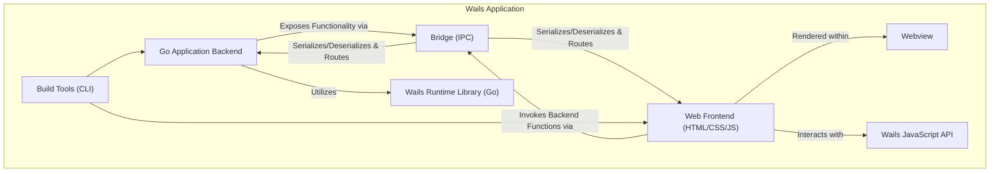
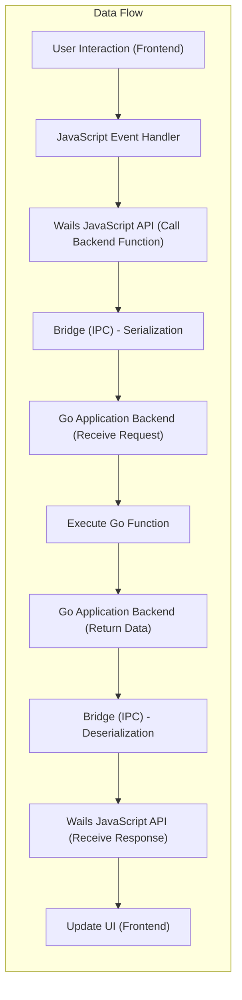

# Project Design Document: Wails Application Framework

**Version:** 1.1
**Date:** October 26, 2023
**Author:** AI Software Architect

## 1. Introduction

This document provides an enhanced and more detailed architectural design of the Wails application framework. Building upon the previous version, it further elaborates on the key components, their interactions, data flow, and security considerations. This document serves as a robust foundation for understanding the system's intricate structure and will be used as a critical input for subsequent threat modeling activities.

## 2. Goals and Objectives

The primary goal of Wails remains to empower developers to build desktop applications using the efficiency of Go for the backend and the flexibility of web technologies (HTML, CSS, JavaScript) for crafting engaging user interfaces. Key objectives include:

*   Providing a highly efficient and secure bridge for seamless communication between the Go backend and the web frontend.
*   Delivering a truly native application experience that feels integrated with the underlying operating system across Windows, macOS, and Linux.
*   Significantly simplifying the complexities involved in developing cross-platform desktop applications.
*   Establishing a secure, stable, and performant environment for running desktop applications built with web technologies.

## 3. System Overview

At its core, a Wails application is composed of a robust Go backend process working in concert with a dynamic web frontend, all rendered within a carefully embedded webview. The Wails framework acts as the conductor, orchestrating communication between these two distinct parts. This allows the Go backend to expose its powerful functionalities to the user interface built with web technologies, while the frontend can seamlessly trigger actions and data processing within the backend.

## 4. Architectural Design

The Wails architecture is composed of the following key components, each with specific responsibilities:

*   **Go Application Backend:** The foundational element, written in Go, responsible for the application's core logic, data management, and interactions with the operating system. It exposes specific functionalities that the frontend can invoke.
*   **Web Frontend:** The user interface layer, constructed using standard web technologies (HTML for structure, CSS for styling, and JavaScript for interactivity). This runs entirely within the confines of the embedded webview.
*   **Webview:** An embedded browser component, crucial for rendering the web frontend. The specific implementation varies by operating system (e.g., WebView2 on Windows, WebKit on macOS and Linux), ensuring a native look and feel.
*   **Bridge (IPC Layer):** The critical communication pathway enabling bidirectional interaction between the Go backend and the JavaScript frontend. This layer handles message serialization, deserialization, and routing.
*   **Wails Runtime Library (Go):** A comprehensive Go library providing the essential APIs and functionalities for building Wails applications. This includes managing the bridge, handling application lifecycle events, and offering utilities for interacting with the operating system.
*   **Wails JavaScript API:** A JavaScript library injected into the webview, providing the necessary functions for the frontend to communicate with and invoke methods in the Go backend.
*   **Build Tools (CLI):** A set of command-line interface tools used for project creation, building, packaging, and managing Wails applications.

### 4.1. Component Details

*   **Go Application Backend:**
    *   Encapsulates the core business logic and application state.
    *   Manages data persistence, retrieval, and manipulation.
    *   Interacts directly with operating system APIs for tasks like file access, network communication, and system notifications.
    *   Exposes methods and functions that can be securely invoked by the frontend through the bridge.
    *   Handles the application's lifecycle, including startup, shutdown, and event handling.

*   **Web Frontend:**
    *   Provides the interactive user interface that users directly interact with.
    *   Handles user input events (e.g., clicks, keyboard input).
    *   Uses JavaScript to dynamically update the UI based on user interactions and data received from the backend.
    *   Typically structured as a Single Page Application (SPA) for a fluid user experience.

*   **Webview:**
    *   Leverages the underlying operating system's web rendering engine to display the HTML, CSS, and JavaScript of the frontend.
    *   Provides browser-like functionalities, including JavaScript execution, DOM manipulation, and network requests (primarily for initial asset loading).
    *   The specific webview implementation is chosen by Wails based on the target platform to ensure optimal performance and native integration.

*   **Bridge (IPC Layer):**
    *   Acts as a secure and efficient conduit for bidirectional communication between the isolated Go backend and the JavaScript frontend.
    *   Handles the serialization of Go data structures into a format suitable for JavaScript (e.g., JSON) and vice-versa.
    *   Implements a mechanism for routing messages and function calls between the two layers, often involving code generation to create type-safe interfaces.
    *   May employ techniques like message queues, custom protocols over local sockets, or platform-specific IPC mechanisms.

*   **Wails Runtime Library (Go):**
    *   Provides the foundational infrastructure for Wails applications.
    *   Manages the creation and lifecycle of the webview instance.
    *   Implements the core logic of the communication bridge.
    *   Offers a set of Go APIs for interacting with system resources and the webview.
    *   Handles application events such as window creation, resizing, and closing.

*   **Wails JavaScript API:**
    *   A JavaScript library automatically injected into the webview context when a Wails application starts.
    *   Provides a set of JavaScript functions that mirror the methods exposed by the Go backend, allowing the frontend to invoke backend logic seamlessly.
    *   Handles the asynchronous nature of communication with the backend, typically using Promises or async/await patterns.

*   **Build Tools (CLI):**
    *   Provides commands for initializing new Wails projects with a predefined structure.
    *   Compiles the Go backend code into a native executable for the target platform.
    *   Bundles the frontend assets (HTML, CSS, JavaScript) into the application package.
    *   Generates platform-specific application installers or bundles (e.g., `.exe` for Windows, `.app` for macOS, `.deb` or `.rpm` for Linux).

## 5. Data Flow

The primary data flow within a Wails application revolves around the interaction between the user interface in the frontend and the processing logic in the backend.

1. **Initiating Action from Frontend:**
    *   A user interacts with the web frontend, triggering an event (e.g., clicking a button).
    *   An associated JavaScript event handler is executed.
    *   This JavaScript function utilizes the Wails JavaScript API to initiate a call to a specific function exposed by the Go backend.

2. **Transmission via the Bridge:**
    *   The Wails JavaScript API serializes the function name and any arguments into a message format suitable for transmission.
    *   This message is sent across the bridge (IPC layer) to the Go backend.

3. **Processing in the Backend:**
    *   The Wails Runtime Library in the Go backend receives the message from the bridge.
    *   It deserializes the message to identify the target function and its arguments.
    *   The corresponding Go function is invoked.
    *   The Go function executes the necessary logic, potentially interacting with databases, file systems, or other system resources.

4. **Returning Data to the Frontend:**
    *   The Go function may return data as a result of its execution.
    *   The Wails Runtime Library serializes this return data into a message format.
    *   This message is sent back across the bridge to the JavaScript frontend.

5. **Updating the Frontend:**
    *   The Wails JavaScript API in the frontend receives the message containing the return data.
    *   It deserializes the data and makes it available to the JavaScript code.
    *   JavaScript code then updates the user interface based on the received data, providing feedback to the user.

## 6. Security Considerations

Security is a paramount concern in Wails applications, requiring careful consideration at each architectural layer:

*   **Input Validation and Sanitization:**
    *   All data received from the frontend must be rigorously validated on the backend to prevent injection attacks (e.g., SQL injection, command injection).
    *   Similarly, data displayed in the frontend should be sanitized to prevent Cross-Site Scripting (XSS) vulnerabilities.

*   **Secure Inter-Process Communication (IPC):**
    *   The communication channel between the frontend and backend is a critical security boundary.
    *   Wails aims to provide a secure bridge, but developers should be aware of potential vulnerabilities if custom IPC mechanisms are introduced.
    *   Ensure that only intended functions are exposed to the frontend.

*   **Remote Code Execution (RCE) Prevention:**
    *   The design of the bridge and the way backend functions are exposed must prevent malicious frontend code from executing arbitrary code on the backend.
    *   Carefully consider the types of data and operations allowed through the bridge.

*   **Dependency Management and Supply Chain Security:**
    *   Dependencies used in both the Go backend and the web frontend should be carefully vetted and regularly updated to address known vulnerabilities.
    *   Utilize dependency management tools to track and manage dependencies effectively.

*   **Binary Protection and Code Obfuscation:**
    *   Consider techniques to protect the compiled application binary from tampering or reverse engineering, especially for sensitive applications.

*   **Secure Update Mechanism:**
    *   Implement a secure mechanism for delivering application updates to ensure that updates are authentic and have not been tampered with.

*   **Permissions and Capabilities:**
    *   The application should request only the necessary permissions and capabilities from the operating system to minimize the attack surface.

*   **Content Security Policy (CSP):**
    *   Implementing a strong Content Security Policy for the webview can significantly mitigate the risk of XSS attacks by controlling the sources from which the webview can load resources.

*   **Principle of Least Privilege:**
    *   Ensure that both the backend and frontend components operate with the minimum necessary privileges.

*   **Regular Security Audits and Penetration Testing:**
    *   Conduct regular security audits and penetration testing to identify and address potential vulnerabilities.

## 7. Deployment

Wails applications are designed for cross-platform deployment, resulting in native executables for each target operating system. The deployment process involves:

*   **Compilation:** The Go backend code is compiled into a platform-specific executable.
*   **Bundling:** The web frontend assets (HTML, CSS, JavaScript, images) are bundled along with the compiled backend executable.
*   **Packaging:** The Wails CLI tools handle the packaging process, creating installers or application bundles.
    *   Windows: Typically packaged as an `.exe` installer or a portable application.
    *   macOS: Packaged as an `.app` bundle.
    *   Linux: Packaged as `.deb`, `.rpm`, or other distribution-specific packages, or as a portable application.
*   **Distribution:** Applications can be distributed through various channels, including:
    *   Direct downloads from a website.
    *   App stores (e.g., Microsoft Store, macOS App Store, Snap Store, Flatpak).
    *   Enterprise deployment systems.

## 8. Technologies Used

*   **Backend Programming Language:** Go
*   **Frontend Technologies:** HTML5, CSS3, JavaScript
*   **Webview Components:**
    *   Windows: Microsoft Edge WebView2 (Chromium-based)
    *   macOS: WebKit
    *   Linux: WebKitGTK
*   **Build Tools and CLI:** Go, Node.js (for frontend asset management and tooling)
*   **Inter-Process Communication (IPC):**  A custom implementation within the Wails Runtime Library, potentially leveraging techniques like:
    *   Message passing over local sockets.
    *   Direct function calls via generated bindings.
    *   Platform-specific IPC mechanisms.

## 9. Future Considerations

*   **Enhanced Security Features:** Continuously exploring and implementing more robust security mechanisms for the bridge, application updates, and protection against emerging threats.
*   **Improved Testing Framework:** Developing more comprehensive tools and frameworks for testing the integration and security of Wails applications.
*   **Plugin System Enhancements:** Expanding the plugin system to allow for more secure and isolated extensions of application functionality.
*   **Mobile Platform Support:** Investigating the feasibility and challenges of extending Wails to support building applications for mobile platforms like iOS and Android.
*   **Accessibility Improvements:** Focusing on making Wails applications more accessible to users with disabilities.

This enhanced design document provides a more in-depth understanding of the Wails application framework's architecture, highlighting the key components, their interactions, data flow, and crucial security considerations. This detailed information is essential for conducting thorough threat modeling and building secure and reliable desktop applications with Wails.