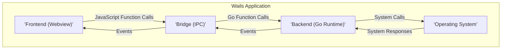
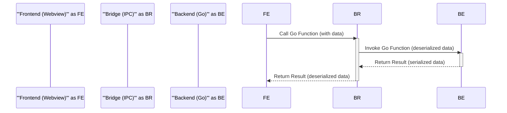
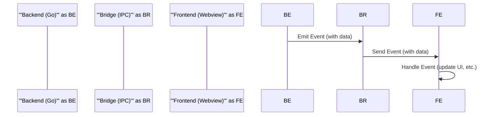

# Project Design Document: Wails Application Framework

**Version:** 1.1
**Date:** October 26, 2023
**Prepared By:** Gemini (AI Language Model)

## 1. Project Overview

Wails is a framework designed for building native desktop applications. It leverages the Go programming language for the application's backend logic, providing performance and access to system-level functionalities. The user interface is built using standard web technologies (HTML, CSS, and JavaScript), allowing developers familiar with web development to create desktop applications. Wails acts as a bridge, seamlessly connecting the Go backend with the web-based frontend. This document details the architectural design of a typical Wails application to facilitate comprehensive threat modeling.

## 2. Project Goals

* Clearly articulate the architecture of an application built using the Wails framework.
* Identify the primary components within a Wails application and describe their interactions.
* Illustrate the flow of data between the frontend and backend of a Wails application.
* Highlight potential security vulnerabilities and areas of concern based on the architectural design.

## 3. Non-Goals

* An in-depth tutorial on Go programming or web development practices.
* A detailed examination of the internal implementation of the Wails framework itself. The focus is on the application architecture *built with* Wails.
* A complete security audit or penetration testing report for Wails applications.
* Advanced deployment strategies beyond basic application packaging.

## 4. Target Audience

* Security professionals conducting threat modeling exercises.
* Software developers building desktop applications with the Wails framework.
* System architects designing or integrating with Wails-based applications.

## 5. Architectural Overview

A Wails application employs a layered architecture, effectively separating the user interface from the application logic. The core of this architecture involves communication between a web-based frontend and a Go-powered backend.

**Key Components:**

* **Frontend (Webview):**
    * The user interface layer, responsible for rendering the application's visual elements and handling user interactions.
    * Implemented using standard web technologies: HTML for structure, CSS for styling, and JavaScript for interactivity.
    * Runs within a webview component, typically based on a browser engine like Chromium.
    * Communicates with the backend via the Bridge component.

* **Bridge (Inter-Process Communication - IPC):**
    * The crucial intermediary that enables communication between the isolated frontend and backend processes.
    * Handles the marshaling (serialization) and unmarshaling (deserialization) of data exchanged between JavaScript and Go.
    * Provides a mechanism for the frontend to invoke functions exposed by the Go backend.
    * Often utilizes techniques like JSON serialization over a local communication channel.

* **Backend (Go Runtime):**
    * The application's logic and data processing layer, written in the Go programming language.
    * Has direct access to system resources and the capabilities of the Go standard library.
    * Exposes functions that can be called remotely by the frontend via the Bridge.
    * Manages application state, interacts with databases or file systems, and performs core business logic.

* **Operating System:**
    * The underlying platform on which the Wails application executes.
    * Provides essential services like process management, memory management, and access to hardware resources.
    * The Wails application runs as a native process within the operating system.

## 6. Component Details

### 6.1. Frontend (Webview)

* **Responsibilities:**
    * Rendering the user interface elements based on HTML, CSS, and JavaScript.
    * Handling user input events (mouse clicks, keyboard input, etc.).
    * Making asynchronous requests to the backend to retrieve or manipulate data.
    * Displaying data received from the backend.
    * Potentially managing local UI state.

* **Technology:**
    * HTML5, CSS3.
    * JavaScript (ECMAScript).
    * May utilize frontend frameworks or libraries (e.g., React, Vue, Svelte).
    * Relies on the capabilities of the embedded webview engine (e.g., Chromium).

* **Security Considerations:**
    * Susceptible to standard web application vulnerabilities such as Cross-Site Scripting (XSS) if user-provided data is not properly sanitized before rendering.
    * The security of the underlying webview engine is paramount. Vulnerabilities in the engine can directly impact the application's security.
    * Access to local resources (e.g., local storage, cookies) within the webview needs careful consideration.
    * Communication with the backend must be secured to prevent eavesdropping or tampering.

### 6.2. Bridge (Inter-Process Communication - IPC)

* **Responsibilities:**
    * Establishing and maintaining a communication channel between the frontend and backend processes.
    * Marshaling JavaScript data into a format suitable for transmission to the Go backend (e.g., JSON serialization).
    * Unmarshaling data received from the Go backend into JavaScript objects.
    * Facilitating the invocation of Go functions from JavaScript code.
    * Potentially managing event subscriptions and dispatching events between the frontend and backend.

* **Technology:**
    * Often employs a custom-designed communication protocol within the Wails framework.
    * Commonly uses JSON for data serialization due to its simplicity and compatibility with JavaScript and Go.
    * May utilize local sockets or other operating system-level IPC mechanisms for communication.

* **Security Considerations:**
    * Vulnerable to injection attacks if data received from either the frontend or backend is not properly validated and sanitized before being processed or used.
    * The integrity and confidentiality of the communication channel are critical. Man-in-the-middle attacks could be possible if the communication is not secured.
    * Authentication and authorization mechanisms might be necessary at the bridge level to control which frontend components can access specific backend functions.
    * Performance overhead associated with serialization and deserialization should be considered.

### 6.3. Backend (Go Runtime)

* **Responsibilities:**
    * Implementing the core business logic and application functionality.
    * Managing the application's data and state.
    * Interacting with external systems, such as databases, file systems, or network services.
    * Handling requests received from the frontend via the Bridge.
    * Emitting events that can be consumed by the frontend.

* **Technology:**
    * Go programming language.
    * Go standard library.
    * May utilize third-party Go libraries for specific functionalities (e.g., database interaction, networking).

* **Security Considerations:**
    * Susceptible to common backend application vulnerabilities, including SQL injection, command injection, and path traversal, if input validation is insufficient.
    * Access control and authorization are crucial to protect sensitive data and functionalities.
    * Secure handling of sensitive information, such as API keys and passwords, is essential.
    * Proper error handling is important to prevent information leakage.
    * Dependencies on third-party libraries introduce potential security risks if those libraries have vulnerabilities.

### 6.4. Operating System

* **Responsibilities:**
    * Providing the runtime environment for the Wails application.
    * Managing process isolation and security boundaries between applications.
    * Handling system calls made by the Go backend.
    * Providing APIs for accessing system resources (e.g., file system, network).

* **Technology:**
    * Windows, macOS, Linux, and potentially other operating systems.

* **Security Considerations:**
    * The security of the underlying operating system is a fundamental prerequisite for the security of the Wails application.
    * Permissions granted to the Wails application process need to be carefully managed to adhere to the principle of least privilege.
    * Interactions with operating system-level APIs can introduce security risks if not handled securely.

## 7. Data Flow

Data flow within a Wails application primarily occurs during communication between the frontend and the backend, either through direct function calls or via an event system.

**Function Call Data Flow:**

**Description:**

1. The frontend initiates an action that requires backend processing.
2. JavaScript code in the frontend calls a function exposed by the Go backend through the Wails Bridge. Data to be sent is serialized by the Bridge.
3. The Bridge receives the function call and the serialized data. It deserializes the data and invokes the corresponding Go function in the backend.
4. The Go function executes its logic, potentially interacting with other system components.
5. The Go function returns a result to the Bridge. This result is serialized by the Bridge.
6. The Bridge receives the serialized result and deserializes it.
7. The deserialized result is passed back to the JavaScript code in the frontend.

**Event System Data Flow:**

**Description:**

1. The backend executes some logic that necessitates informing the frontend about a change or event.
2. The Go backend emits an event, potentially including relevant data, through the Wails Bridge.
3. The Bridge receives the event and forwards it to the frontend.
4. JavaScript code in the frontend, which has subscribed to this event, receives the event and its associated data.
5. The frontend handles the event, typically by updating the user interface or performing other actions.

## 8. Security Considerations

Based on the architecture described, several key security considerations need to be addressed during the development and deployment of Wails applications:

* **Frontend Security:**
    * **Cross-Site Scripting (XSS):**  Ensure proper sanitization of user inputs and outputs within the webview to prevent malicious scripts from being injected and executed.
    * **Content Security Policy (CSP):** Implement a strong CSP to restrict the sources from which the webview can load resources, mitigating XSS risks.
    * **Dependency Vulnerabilities:** Regularly audit and update frontend dependencies to patch known security flaws.

* **Bridge Security:**
    * **Input Validation:**  Thoroughly validate all data received by the backend from the frontend via the Bridge to prevent injection attacks and other forms of malicious input.
    * **Secure Communication Channel:**  Consider encrypting communication between the frontend and backend, especially for sensitive data.
    * **Authentication and Authorization:** Implement mechanisms to verify the identity of the frontend and control access to backend functions.

* **Backend Security:**
    * **Injection Attacks:** Employ parameterized queries or prepared statements when interacting with databases to prevent SQL injection. Sanitize user inputs to prevent command injection vulnerabilities.
    * **Authentication and Authorization:** Implement robust authentication and authorization mechanisms to control access to sensitive resources and functionalities.
    * **Secure Secret Management:**  Store and manage sensitive information (e.g., API keys, database credentials) securely, avoiding hardcoding them in the application.
    * **Error Handling and Logging:** Implement secure error handling to prevent information leakage and maintain comprehensive logs for auditing and security monitoring.
    * **Dependency Vulnerabilities:** Regularly audit and update backend dependencies to patch known security flaws.

* **Operating System Interactions:**
    * **Principle of Least Privilege:** Ensure the Wails application runs with the minimum necessary privileges to perform its functions.
    * **Secure File System Access:** Carefully control file system access to prevent unauthorized reading or modification of files.
    * **Secure Process Management:**  Avoid executing external commands or processes based on untrusted input.

* **General Security Practices:**
    * **Code Signing:** Sign the application executable to ensure its integrity and authenticity.
    * **Secure Distribution Channels:** Distribute the application through trusted channels to prevent tampering.
    * **Regular Security Audits:** Conduct periodic security assessments and penetration testing to identify and address potential vulnerabilities.
    * **Secure Update Mechanisms:** Implement a secure mechanism for delivering updates to the application to patch vulnerabilities and introduce new features.

## 9. Deployment Model

Wails applications are typically deployed as self-contained, native executables for various operating systems. The deployment process involves packaging the Go backend, the frontend assets, and any necessary dependencies into a single distributable package.

**Deployment Steps:**

* **Compilation:** The Go backend code is compiled into a platform-specific executable.
* **Asset Packaging:** The frontend HTML, CSS, JavaScript files, and other assets are packaged into a distributable format.
* **Bundling:** The compiled backend executable and the packaged frontend assets are bundled together using the Wails build tools.
* **Installer Creation:**  Platform-specific installers or packages (e.g., MSI for Windows, DMG for macOS, DEB/RPM for Linux) are created to facilitate easy installation and distribution.

**Security Considerations for Deployment:**

* **Code Signing:**  Signing the application executable is crucial for verifying its authenticity and ensuring that it has not been tampered with.
* **Secure Distribution Channels:**  Distribute the application through trusted channels (e.g., official website, app stores) to prevent users from downloading compromised versions.
* **Update Mechanisms:**  Implement a secure and reliable update mechanism to deliver security patches and new features to users. The update process itself should be secured to prevent man-in-the-middle attacks.
* **Permissions and Sandboxing:**  Consider the default permissions granted to the application during installation and runtime. Employ operating system-level sandboxing techniques where appropriate to limit the application's access to system resources.

## 10. Technologies Used

* **Backend Programming Language:** Go
* **Frontend Technologies:** HTML, CSS, JavaScript
* **Webview Engine (Commonly):** Chromium Embedded Framework (CEF) or equivalent
* **Inter-Process Communication:**  Custom implementation within the Wails framework, likely using JSON serialization and local communication channels (e.g., sockets).
* **Operating Systems Supported:** Windows, macOS, Linux (primary targets)