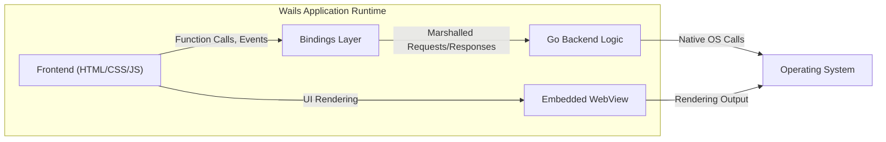
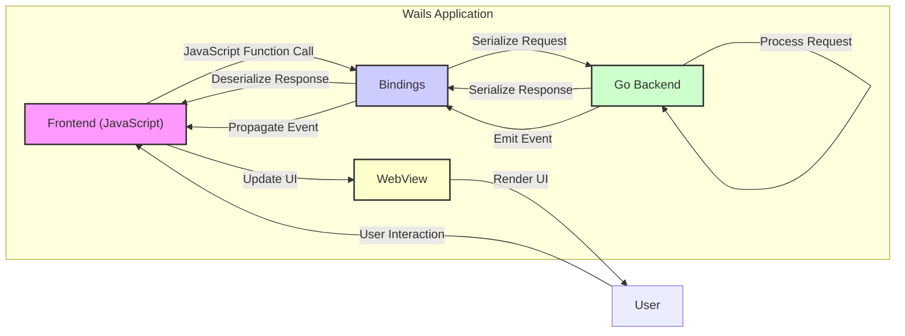

## Project Design Document: Wails Application Framework (Improved)

**1. Introduction**

This document provides a detailed architectural design of the Wails application framework (as represented by the GitHub repository: https://github.com/wailsapp/wails). This design specification is intended to serve as a foundational resource for subsequent threat modeling activities, offering a clear understanding of the framework's structure, components, and interactions.

**2. Goals**

*   Articulate a comprehensive and precise overview of the Wails architecture.
*   Clearly define the responsibilities and functionalities of each key component within the framework.
*   Illustrate the flow of data and the nature of interactions between these components.
*   Establish well-defined system boundaries and interfaces to facilitate security analysis.
*   Provide a solid basis for identifying potential security vulnerabilities and attack vectors during threat modeling exercises.

**3. Target Audience**

This document is primarily intended for:

*   Security architects and engineers tasked with performing threat modeling and security assessments.
*   Developers actively contributing to the development and maintenance of the Wails project.
*   Technical stakeholders seeking an in-depth understanding of the Wails framework's internal mechanisms and design principles.

**4. Overview of Wails**

Wails empowers developers to create native desktop applications by leveraging web technologies for the user interface and Go for the backend logic. It achieves this by embedding a web browser engine to render the frontend (HTML, CSS, JavaScript) and providing a robust mechanism for seamless, type-safe communication between the frontend and the Go backend. This approach allows web developers to build cross-platform desktop applications with a familiar skillset, reducing the need for platform-specific UI development.

**5. High-Level Architecture**

The Wails application architecture can be conceptually represented by the following core components and their relationships:

**6. Detailed Component Description and Interactions**

*   **Go Backend Logic:**
    *   Serves as the core of the application, implementing the primary business logic and application functionality.
    *   Manages data persistence, processing, and manipulation.
    *   Exposes specific Go functions and methods that can be invoked by the frontend JavaScript code through the bindings layer.
    *   Interacts with the underlying operating system through standard Go libraries or Wails-provided native integration APIs.
    *   May incorporate custom Go packages and external dependencies to extend functionality.
    *   Listens for and processes requests originating from the frontend, returning appropriate responses.

*   **Frontend (HTML/CSS/JavaScript):**
    *   Defines the user interface elements, layout, and visual presentation of the application.
    *   Handles user interactions, events (e.g., button clicks, form submissions), and user input.
    *   Initiates asynchronous calls to the Go backend via the well-defined bindings interface.
    *   Dynamically renders and updates the user interface based on data received from the backend.
    *   May utilize various JavaScript frameworks (e.g., React, Vue, Svelte) and libraries for enhanced UI development.

*   **Bindings Layer:**
    *   Acts as a crucial communication bridge, enabling seamless interaction between the type-safe Go backend and the dynamically-typed JavaScript frontend.
    *   Employs a mechanism, often involving code generation or reflection, to automatically expose designated Go functions and methods to the JavaScript environment.
    *   Handles the serialization and deserialization of data passed between the frontend and backend, ensuring data integrity and type compatibility.
    *   Provides a structured and secure way for JavaScript to invoke Go methods and receive corresponding return values or error information.

*   **Embedded WebView:**
    *   Provides the runtime environment for the frontend application, rendering the HTML and CSS and executing the JavaScript code.
    *   Leverages the host operating system's native web rendering engine (e.g., WebView2 on Windows, WebKit on macOS/Linux) for optimal performance and platform consistency.
    *   Manages the Document Object Model (DOM) and handles the execution of JavaScript within a sandboxed environment.
    *   Handles network requests initiated by the frontend, although primary backend communication occurs through the bindings.

*   **Wails CLI (Command Line Interface):**
    *   A developer tool providing commands for project scaffolding, building, and managing Wails applications throughout their lifecycle.
    *   Automates tasks such as creating new project structures, managing dependencies, and compiling the Go backend and frontend assets.
    *   Generates the necessary binding code to facilitate communication between the frontend and backend.
    *   Offers development-time features like hot reloading and debugging capabilities to enhance the development experience.

*   **Native OS Integration:**
    *   Provides a set of APIs and mechanisms that allow the Go backend to interact with platform-specific functionalities and resources of the underlying operating system.
    *   Enables access to features such as file system operations, system notifications, clipboard access, window management, and more.
    *   These integrations are typically implemented within the Go backend and can be exposed to the frontend via the bindings layer.

**7. Data Flow Diagram (Detailed)**

**8. Key Interactions and Communication Paths**

*   **User Initiated Action:** The user interacts with the application's frontend UI, which is rendered by the embedded WebView.
*   **Frontend Request to Backend:** When the frontend requires backend processing, it invokes a JavaScript function that corresponds to an exposed Go function. This call is intercepted by the bindings layer.
*   **Binding Layer Processing (Request):** The bindings layer serializes the JavaScript function call and its arguments into a format suitable for transmission to the Go backend (e.g., using JSON).
*   **Backend Processing:** The Go backend receives the serialized request, deserializes the data, and executes the corresponding Go function.
*   **Backend Response:** The Go backend processes the request and generates a response, which may include data or error information.
*   **Binding Layer Processing (Response):** The bindings layer serializes the Go response back into a format understandable by the JavaScript frontend.
*   **Frontend Receives Response:** The frontend receives the deserialized response and updates the UI or performs other actions accordingly.
*   **Backend Initiated Communication (Events):** The Go backend can also initiate communication with the frontend by emitting events. These events are routed through the bindings layer and can be subscribed to by the frontend.

**9. Security Considerations (Initial Assessment)**

*   **Frontend Input Validation:**  Sanitizing and validating user input within the frontend before sending it to the backend can prevent certain client-side vulnerabilities.
*   **Backend Input Validation and Sanitization:**  Robust validation and sanitization of all data received from the frontend within the Go backend is paramount to prevent injection attacks (e.g., SQL injection, command injection).
*   **Authorization and Access Control:** Implementing mechanisms to control which frontend components or users can access specific backend functionalities is crucial for maintaining data integrity and security.
*   **Secure Communication Channels:** While communication primarily occurs within the same process, understanding the serialization and deserialization processes is important to mitigate potential vulnerabilities related to data manipulation or injection during transit.
*   **Dependency Management Security:**  Maintaining up-to-date and secure dependencies in both the Go backend and the frontend is essential to prevent exploitation of known vulnerabilities. Employing tools for dependency scanning is recommended.
*   **Build Process Integrity:**  Ensuring the security and integrity of the build process, including the Wails CLI and related tools, is vital to prevent the introduction of malicious code during compilation and packaging.
*   **WebView Security Hardening:**  Understanding and configuring the security settings of the embedded WebView is crucial to mitigate risks associated with rendering untrusted content or executing malicious scripts. Consider Content Security Policy (CSP) implementation.
*   **Native API Access Control:**  Carefully controlling and auditing the Go backend's interactions with native operating system APIs is essential to prevent unauthorized access to system resources or sensitive data. Employ principle of least privilege.
*   **Protection Against Cross-Site Scripting (XSS):** While the frontend and backend are tightly coupled, developers should still be mindful of potential XSS vulnerabilities if external content is being incorporated into the frontend.

**10. Technologies Used**

*   **Core Programming Languages:** Go (Backend), JavaScript, HTML, CSS (Frontend)
*   **Backend Framework/Libraries:** Go standard library, potentially specific Go libraries for tasks like HTTP handling, database interaction, etc.
*   **Frontend Rendering Engine:**  Operating system's native web rendering engine (WebView2 on Windows, WebKit on macOS/Linux).
*   **Build and Management Tools:** Wails CLI, Go build tools (e.g., `go build`).
*   **Inter-Process Communication (IPC) / Binding Mechanism:**  Likely a custom implementation leveraging JSON or a similar serialization format for data exchange between Go and JavaScript.

**11. Future Considerations (Beyond Initial Scope)**

*   Exploring options for enhanced security features such as sandboxing or process isolation to further isolate the frontend and backend.
*   Developing a plugin architecture that allows for secure and controlled extension of Wails application functionality.
*   Investigating support for alternative frontend rendering technologies or frameworks.

**12. Conclusion**

This improved design document provides a more detailed and refined architectural overview of the Wails application framework. By clearly outlining the components, their responsibilities, and the communication pathways, this document serves as a robust foundation for conducting comprehensive threat modeling activities. The enhanced descriptions and the inclusion of initial security considerations will facilitate a more thorough analysis of potential vulnerabilities and the development of effective mitigation strategies.