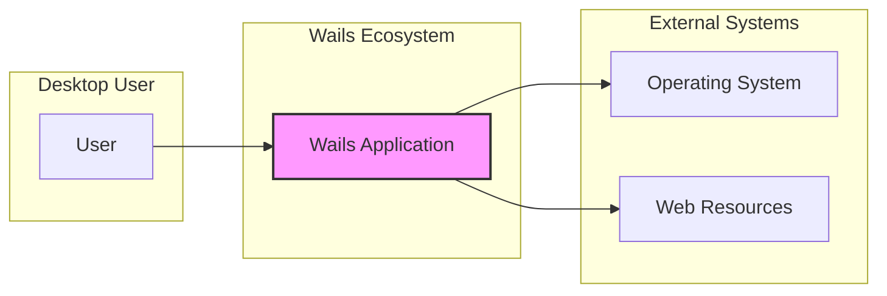
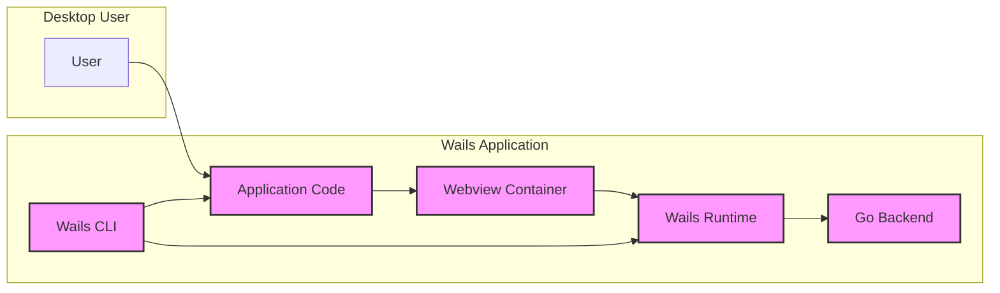
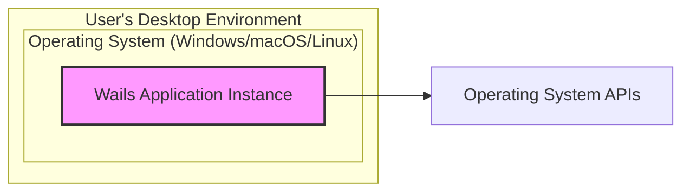

# BUSINESS POSTURE

The Wails project aims to provide a framework for developers to build desktop applications using web technologies like HTML, CSS, and JavaScript, powered by Go for the backend. This allows developers familiar with web development to create cross-platform desktop applications more easily and efficiently than using traditional native desktop development approaches.

Business priorities and goals for the Wails project include:
- Empowering web developers to create desktop applications.
- Providing a cross-platform solution, reducing development effort for multiple operating systems.
- Offering a performant and efficient desktop application framework by leveraging Go.
- Fostering a strong community and ecosystem around Wails.
- Enabling rapid application development and iteration.

Most important business risks that need to be addressed:
- Security vulnerabilities in applications built with Wails, potentially leading to data breaches or system compromise.
- Lack of developer trust if Wails is perceived as insecure or difficult to secure.
- Dependence on underlying technologies (Go, webview) and their security posture.
- Community support and maintenance sustainability.
- Potential performance bottlenecks or limitations compared to native applications.

# SECURITY POSTURE

Existing security controls:
- security control: Go language's inherent memory safety features, reducing certain classes of vulnerabilities like buffer overflows. (Implemented in: Go runtime)
- security control: Use of webview technologies (like Chromium) which have their own security models and update mechanisms. (Implemented in: Webview container)
- security control:  Wails documentation and examples likely provide guidance on best practices, potentially including security considerations. (Implemented in: Documentation)

Accepted risks:
- accepted risk: Reliance on the security of third-party dependencies (Go libraries, npm packages).
- accepted risk: Potential for developers to introduce security vulnerabilities in their application code built on top of Wails.
- accepted risk:  Security of the webview environment is largely dependent on the webview provider (e.g., Chromium).
- accepted risk:  Initial adoption phase might prioritize features and functionality over exhaustive security audits.

Recommended security controls:
- security control: Implement automated Static Application Security Testing (SAST) and Dynamic Application Security Testing (DAST) in the development and CI/CD pipelines.
- security control: Perform regular dependency scanning to identify and address vulnerabilities in third-party libraries.
- security control: Conduct security code reviews, especially for core Wails framework components and critical application code.
- security control: Establish a secure software development lifecycle (SSDLC) incorporating security considerations at each stage.
- security control: Provide clear and comprehensive security guidelines and best practices for developers using Wails.
- security control: Implement a vulnerability disclosure program to encourage responsible reporting of security issues.

Security requirements:
- Authentication:
  - Applications built with Wails may need to implement user authentication.
  - Wails should provide mechanisms or guidance for secure authentication practices within applications.
  - Recommended security control: Provide secure authentication libraries or examples for common authentication patterns (e.g., OAuth 2.0, JWT).
- Authorization:
  - Applications need to enforce authorization to control access to resources and functionalities.
  - Wails should allow developers to implement fine-grained authorization within their applications.
  - Recommended security control: Offer authorization patterns and best practices within Wails documentation and examples.
- Input validation:
  - All inputs from the webview to the Go backend must be rigorously validated to prevent injection attacks (e.g., command injection, SQL injection if applicable).
  - Wails framework should encourage or enforce input validation at the framework level.
  - security control: Implement input validation mechanisms within the Wails framework to help developers sanitize inputs.
- Cryptography:
  - Applications may need to handle sensitive data and require cryptographic operations (encryption, hashing, signing).
  - Wails should provide access to secure cryptographic libraries or functionalities within the Go backend.
  - security control: Integrate or recommend secure cryptographic libraries within the Wails framework and documentation.

# DESIGN

## C4 CONTEXT



Context Diagram Elements:

- Element:
  - Name: Desktop User
  - Type: Person
  - Description: End-user who interacts with the Wails desktop application.
  - Responsibilities: Uses the desktop application to perform tasks.
  - Security controls: Operating system level security controls, user account management.

- Element:
  - Name: Wails Application
  - Type: Software System
  - Description: The desktop application built using the Wails framework. This is the system being designed.
  - Responsibilities: Provides application functionality to the user, interacts with the operating system and potentially web resources.
  - Security controls: Application-level security controls, input validation, authorization, secure communication, secure storage.

- Element:
  - Name: Operating System
  - Type: External System
  - Description: The underlying operating system (Windows, macOS, Linux) on which the Wails application runs.
  - Responsibilities: Provides system resources, manages processes, enforces operating system level security.
  - Security controls: Operating system security features (firewall, access control, kernel security).

- Element:
  - Name: Web Resources
  - Type: External System
  - Description: External web services or APIs that the Wails application might interact with.
  - Responsibilities: Provides data or services to the Wails application.
  - Security controls: Network security, API security (authentication, authorization), data encryption in transit.

## C4 CONTAINER



Container Diagram Elements:

- Element:
  - Name: Wails CLI
  - Type: Container - Command Line Interface Application
  - Description: Command-line tool used by developers to create, build, and manage Wails projects.
  - Responsibilities: Project scaffolding, build process orchestration, development server, packaging.
  - Security controls: Secure handling of developer credentials, protection against malicious project templates, secure build process.

- Element:
  - Name: Wails Runtime
  - Type: Container - Go Application
  - Description: Go runtime environment that bridges the webview and the Go backend, providing core Wails functionalities.
  - Responsibilities: Inter-process communication between webview and Go, exposing Go functionalities to the webview, managing application lifecycle.
  - Security controls: Secure IPC mechanisms, input validation at the bridge, secure API exposure to webview.

- Element:
  - Name: Webview Container
  - Type: Container - Web Browser Engine (Chromium, etc.)
  - Description:  Embedded web browser engine responsible for rendering the user interface built with HTML, CSS, and JavaScript.
  - Responsibilities: Rendering UI, executing JavaScript code, handling user interactions, communicating with Wails Runtime.
  - Security controls: Webview security sandbox, Content Security Policy (CSP), secure handling of web content, protection against XSS and other web vulnerabilities.

- Element:
  - Name: Application Code
  - Type: Container - Web Application (HTML, CSS, JavaScript)
  - Description: The frontend application code developed by the user using web technologies.
  - Responsibilities: User interface logic, presentation, user interaction handling, communication with the Go backend via Wails Runtime.
  - Security controls: Input validation on user inputs, output encoding, protection against XSS, secure handling of sensitive data in the frontend.

- Element:
  - Name: Go Backend
  - Type: Container - Go Application
  - Description: Go code that provides the backend logic and functionalities for the desktop application.
  - Responsibilities: Business logic, data processing, interacting with system resources, exposing APIs to the frontend.
  - Security controls: Secure coding practices, input validation, authorization, secure database access, protection against injection attacks, secure handling of sensitive data.

## DEPLOYMENT

Deployment Architecture: Standalone Desktop Application



Deployment Diagram Elements:

- Element:
  - Name: Wails Application Instance
  - Type: Software Instance
  - Description: A single running instance of the packaged Wails desktop application on a user's machine.
  - Responsibilities: Executing the application logic, providing user interface, interacting with the operating system.
  - Security controls: Application-level security controls, operating system security controls, user account permissions.

- Element:
  - Name: Operating System (Windows/macOS/Linux)
  - Type: Infrastructure
  - Description: The user's desktop operating system environment.
  - Responsibilities: Providing runtime environment, managing resources, enforcing system-level security.
  - Security controls: Operating system security features (firewall, antivirus, access control), user account management, patch management.

## BUILD

Build Process Diagram:

```mermaid
flowchart LR
    subgraph "Developer Workstation"
        DEV[Developer]
        CODE[Source Code]
    end
    subgraph "Build System (e.g., GitHub Actions)"
        BC[Build Container]
        BUILD_TOOLS[Build Tools (Go, npm, etc.)]
        SAST[SAST Scanner]
        LINTER[Linter]
        PACKAGE[Packager]
    end
    subgraph "Artifact Repository"
        ARTIFACTS[Build Artifacts (Installers)]
    end

    DEV --> CODE
    CODE --> BC
    BC --> BUILD_TOOLS
    BUILD_TOOLS --> SAST
    BUILD_TOOLS --> LINTER
    BUILD_TOOLS --> PACKAGE
    PACKAGE --> ARTIFACTS

    style BC fill:#f9f,stroke:#333,stroke-width:2px
    style BUILD_TOOLS fill:#f9f,stroke:#333,stroke-width:2px
    style SAST fill:#f9f,stroke:#333,stroke-width:2px
    style LINTER fill:#f9f,stroke:#333,stroke-width:2px
    style PACKAGE fill:#f9f,stroke:#333,stroke-width:2px
    style ARTIFACTS fill:#f9f,stroke:#333,stroke-width:2px
```

Build Process Description:

1. Developer writes source code (Go backend, web frontend) on their workstation.
2. Source code is committed to a version control system (e.g., GitHub).
3. Build system (e.g., GitHub Actions) is triggered upon code changes.
4. Build container is provisioned with necessary build tools (Go compiler, npm, etc.).
5. Source code is checked out into the build container.
6. Build tools compile Go backend and build web frontend assets.
7. SAST scanner performs static analysis of the code to identify potential security vulnerabilities.
8. Linter checks code style and potential code quality issues.
9. Packager creates installers or packages for different operating systems (Windows, macOS, Linux).
10. Build artifacts (installers, packages) are stored in an artifact repository.

Build Security Controls:
- security control: Use of hardened build containers to minimize the risk of compromised build environments.
- security control: Automated build process to ensure consistency and repeatability.
- security control: Integration of SAST scanners to detect potential vulnerabilities early in the development lifecycle.
- security control: Dependency scanning to identify and address vulnerabilities in third-party libraries.
- security control: Code signing of build artifacts to ensure integrity and authenticity.
- security control: Access control to the build system and artifact repository to prevent unauthorized modifications.
- security control: Regular security audits of the build pipeline and build tools.

# RISK ASSESSMENT

Critical business process we are trying to protect:
- Secure development and distribution of desktop applications built with Wails.
- Maintaining the reputation and trust in the Wails framework as a secure platform.

Data we are trying to protect and their sensitivity:
- Source code of the Wails framework and applications built with it: Confidential, Integrity.
- Build artifacts (installers, packages): Integrity, Availability.
- User data within applications built with Wails: Sensitivity depends on the application, could be Confidential, Integrity, Availability.
- Developer credentials and secrets used in the build process: Confidential, Integrity.

# QUESTIONS & ASSUMPTIONS

Questions:
- What is the target audience for this design document? Is it primarily for developers, security auditors, or project stakeholders?
- Are there any specific security concerns or compliance requirements that need to be addressed?
- What is the expected deployment environment for applications built with Wails (e.g., corporate networks, public internet)?
- What is the acceptable risk level for the Wails project and applications built with it?
- Are there any existing security policies or guidelines that need to be considered?

Assumptions:
- BUSINESS POSTURE: The primary goal is to provide a secure and user-friendly framework for building cross-platform desktop applications. Security is a critical factor for the success and adoption of Wails.
- SECURITY POSTURE:  Current security controls are basic and need to be enhanced. There is an understanding of the importance of security but it might not be fully implemented yet. Focus on implementing standard security best practices for software development and deployment.
- DESIGN: The architecture is based on a webview frontend and a Go backend communicating through a runtime bridge. Deployment is primarily as standalone desktop applications. The build process can be automated and secured using modern CI/CD practices.