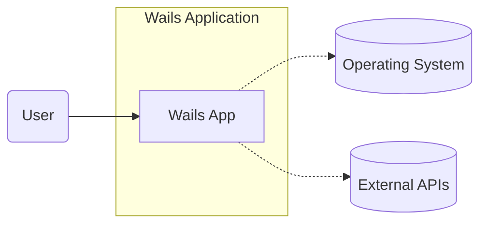
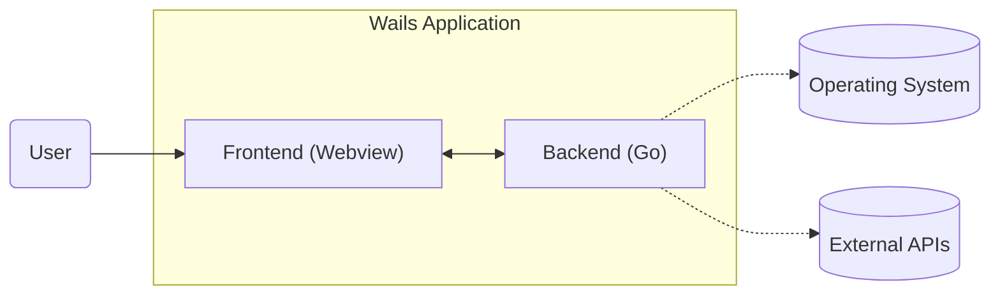

Okay, let's create a design document for the Wails project.

# BUSINESS POSTURE

Wails is a framework for building desktop applications using Go and web technologies. It appears to be targeting developers who prefer Go for backend logic and want a streamlined way to create cross-platform desktop applications without delving deep into native UI frameworks.

Priorities:

*   Ease of Use: Simplify the development of desktop applications for Go developers.
*   Cross-Platform Compatibility: Support major operating systems (Windows, macOS, Linux) with a single codebase.
*   Performance: Leverage Go's performance characteristics for the application's backend.
*   Developer Experience: Provide a smooth and efficient development workflow, including tooling for building, packaging, and debugging.
*   Maintainability: Offer a clean and well-structured framework that is easy to maintain and extend.

Goals:

*   Attract Go developers to build desktop applications.
*   Provide a viable alternative to Electron and other cross-platform desktop frameworks.
*   Grow a community around the project.
*   Enable the creation of performant and visually appealing desktop applications.

Business Risks:

*   Security vulnerabilities in the bridge between Go and the webview could expose applications to attacks.
*   Inconsistent behavior or rendering issues across different operating systems could damage the user experience.
*   Performance bottlenecks, especially in the webview, could lead to sluggish applications.
*   Lack of adoption by the Go community could limit the project's growth and sustainability.
*   Falling behind in supporting new operating system features or web standards could make the framework obsolete.
*   Supply chain attacks that can compromise build and distribution process.

# SECURITY POSTURE

Existing Security Controls:

*   security control: Go's built-in memory safety features (compared to C/C++) reduce the risk of buffer overflows and other memory-related vulnerabilities. (Described in Go documentation)
*   security control: Use of a webview (likely based on WebKit or Chromium) which benefits from the security sandboxing and updates provided by those projects. (Described in Wails documentation and the respective webview engine documentation)
*   security control: The project's GitHub repository likely has some level of code review and issue tracking, which helps identify and address security bugs. (Visible in the GitHub repository)

Accepted Risks:

*   accepted risk: Reliance on third-party webview engines introduces a dependency on their security posture and update cycles.
*   accepted risk: The bridge between Go and the webview is a potential attack surface that requires careful design and security review.
*   accepted risk: Cross-platform compatibility may introduce platform-specific vulnerabilities or inconsistencies.

Recommended Security Controls:

*   security control: Implement Content Security Policy (CSP) to mitigate XSS attacks within the webview.
*   security control: Conduct regular security audits and penetration testing, focusing on the Go/webview bridge.
*   security control: Provide clear documentation and guidelines for developers on secure coding practices when using Wails.
*   security control: Implement a mechanism for securely updating the webview component independently of the application.
*   security control: Consider using a hardened webview or exploring alternative rendering engines with a strong security focus.
*   security control: Implement code signing to ensure the integrity of distributed binaries.
*   security control: Use static analysis tools (SAST) during development to identify potential vulnerabilities in the Go code.
*   security control: Use dynamic analysis tools (DAST) to test the running application for vulnerabilities.
*   security control: Implement a vulnerability disclosure program to encourage responsible reporting of security issues.
*   security control: Implement Software Bill of Materials (SBOM) to track all dependencies and their versions.
*   security control: Implement SLSA framework to secure build and deployment process.

Security Requirements:

*   Authentication:
    *   If the Wails application requires user authentication, it should use secure methods like OAuth 2.0 or OpenID Connect.
    *   Credentials should never be stored directly within the application.
    *   Support for multi-factor authentication (MFA) should be considered.
*   Authorization:
    *   If the application handles sensitive data or resources, it should implement proper authorization mechanisms to control access.
    *   Role-Based Access Control (RBAC) or Attribute-Based Access Control (ABAC) should be considered.
*   Input Validation:
    *   All input received from the webview (user input, data from external sources) must be strictly validated on the Go side.
    *   Use a whitelist approach to allow only known-good input.
    *   Sanitize input to prevent injection attacks (XSS, SQL injection, etc.).
*   Cryptography:
    *   If the application handles sensitive data, it should use strong encryption algorithms (e.g., AES-256, RSA-2048) and secure key management practices.
    *   Use established cryptographic libraries rather than implementing custom cryptography.
    *   Follow best practices for secure communication (TLS/SSL).

# DESIGN

## C4 CONTEXT



Element Descriptions:

*   Element:
    *   Name: User
    *   Type: Person
    *   Description: A person interacting with the Wails application.
    *   Responsibilities: Interacting with the application's user interface, providing input, and receiving output.
    *   Security controls: None (the user is external to the system).

*   Element:
    *   Name: Wails App
    *   Type: Software System
    *   Description: The desktop application built using the Wails framework.
    *   Responsibilities: Providing the application's functionality, handling user interactions, managing data, and communicating with external systems.
    *   Security controls: Input validation, output encoding, secure communication (if applicable), authentication and authorization (if applicable), CSP, secure coding practices.

*   Element:
    *   Name: Operating System
    *   Type: Software System
    *   Description: The underlying operating system (Windows, macOS, Linux) on which the Wails application runs.
    *   Responsibilities: Providing system resources, managing processes, handling file system access, and providing the native UI rendering engine.
    *   Security controls: OS-level security features (sandboxing, access controls, etc.).

*   Element:
    *   Name: External APIs
    *   Type: Software System
    *   Description: External APIs that the Wails application might interact with.
    *   Responsibilities: Providing specific services or data to the Wails application.
    *   Security controls: Secure communication (TLS/SSL), API keys, authentication and authorization mechanisms.

## C4 CONTAINER



Element Descriptions:

*   Element:
    *   Name: Frontend (Webview)
    *   Type: Container (Webview)
    *   Description: The user interface of the Wails application, rendered within a webview.
    *   Responsibilities: Displaying the UI, handling user input events, and communicating with the backend.
    *   Security controls: CSP, input validation (client-side), output encoding, secure communication with the backend.

*   Element:
    *   Name: Backend (Go)
    *   Type: Container (Go Runtime)
    *   Description: The backend logic of the Wails application, written in Go.
    *   Responsibilities: Handling business logic, managing data, interacting with the operating system and external APIs, and communicating with the frontend.
    *   Security controls: Input validation (server-side), output encoding, secure communication, authentication and authorization (if applicable), secure coding practices, data validation.

*   Element:
    *   Name: User
    *   Type: Person
    *   Description: A person interacting with the Wails application.
    *   Responsibilities: Interacting with the application's user interface, providing input, and receiving output.
    *   Security controls: None (the user is external to the system).

*   Element:
    *   Name: Operating System
    *   Type: Software System
    *   Description: The underlying operating system.
    *   Responsibilities: Providing system resources.
    *   Security controls: OS-level security features.

*   Element:
    *   Name: External APIs
    *   Type: Software System
    *   Description: External APIs that the Wails application might interact with.
    *   Responsibilities: Providing specific services or data to the Wails application.
    *   Security controls: Secure communication (TLS/SSL), API keys, authentication and authorization mechanisms.

## DEPLOYMENT

Possible deployment solutions:

1.  Manual packaging and distribution: The developer manually builds the application for each target platform and distributes the binaries through their own channels.
2.  Using a third-party packaging tool: Tools like `go-packager` or `appify` can automate the process of creating platform-specific installers.
3.  Using a continuous integration/continuous deployment (CI/CD) pipeline: Services like GitHub Actions, Travis CI, or CircleCI can be used to automate the build, packaging, and release process.

Chosen solution (example using GitHub Actions):

```mermaid
graph LR
    subgraph GitHub Actions
        Build["Build & Package"]
    end
    subgraph Deployment Environment (User's Machine)
        App["Wails Application"]
    end
    Developer[Developer] --> GitHub[GitHub Repository]
    GitHub --> Build
    Build --> Artifacts[Release Artifacts]
    Artifacts --> App
```

Element Descriptions:

*   Element:
    *   Name: Developer
    *   Type: Person
    *   Description: The developer of the Wails application.
    *   Responsibilities: Writing code, committing changes, and triggering builds.
    *   Security controls: Code review, secure coding practices.

*   Element:
    *   Name: GitHub Repository
    *   Type: Version Control System
    *   Description: The source code repository hosted on GitHub.
    *   Responsibilities: Storing the application's code, managing versions, and triggering CI/CD workflows.
    *   Security controls: Access controls, branch protection rules, code scanning.

*   Element:
    *   Name: Build & Package
    *   Type: Process
    *   Description: The GitHub Actions workflow that builds and packages the Wails application.
    *   Responsibilities: Compiling the Go code, bundling the frontend assets, creating platform-specific installers.
    *   Security controls: SAST, SBOM generation, dependency scanning.

*   Element:
    *   Name: Release Artifacts
    *   Type: File
    *   Description: The packaged application binaries (e.g., .exe, .dmg, .deb) created by the build process.
    *   Responsibilities: Providing the distributable application to users.
    *   Security controls: Code signing.

*   Element:
    *   Name: Wails Application
    *   Type: Application
    *   Description: The running instance of the Wails application on the user's machine.
    *   Responsibilities: Providing the application's functionality.
    *   Security controls: All previously mentioned application-level security controls.

*   Element:
    *   Name: Deployment Environment (User's Machine)
    *   Type: Environment
    *   Description: User machine where application will be installed.
    *   Responsibilities: Run application.
    *   Security controls: OS-level security features.

## BUILD

```mermaid
graph LR
    Developer[Developer] --> GitHub[GitHub Repository]
    GitHub -- Trigger --> BuildServer[Build Server (e.g., GitHub Actions)]
    BuildServer -- Lint --> Linter[Linter (e.g., golangci-lint)]
    BuildServer -- SAST --> SASTScanner[SAST Scanner (e.g., gosec)]
    BuildServer -- Build --> GoCompiler[Go Compiler]
    GoCompiler -- Compile --> Binary[Application Binary]
    BuildServer -- Package --> Packager[Packager (e.g., wails build)]
    Packager -- Create --> Artifacts[Release Artifacts]
    Artifacts -- Publish --> Release[GitHub Release]
```

Build Process Description:

1.  Developer commits code to the GitHub repository.
2.  A GitHub Actions workflow is triggered.
3.  The workflow checks out the code.
4.  A linter (e.g., `golangci-lint`) checks the code for style and potential errors.
5.  A SAST scanner (e.g., `gosec`) analyzes the code for security vulnerabilities.
6.  The Go compiler builds the application binary.
7.  The `wails build` command (or a similar packaging tool) creates platform-specific installers.
8.  The release artifacts are published to a GitHub Release.

Security Controls in Build Process:

*   security control: Linting: Enforces code style and helps prevent common errors.
*   security control: SAST: Identifies potential security vulnerabilities in the code.
*   security control: Dependency Scanning: Checks for known vulnerabilities in third-party dependencies (can be integrated into the build process).
*   security control: SBOM Generation: Creates a list of all software components and their versions.
*   security control: Code Signing: Ensures the integrity of the released binaries.

# RISK ASSESSMENT

Critical Business Processes:

*   Application Functionality: The core functionality of the Wails application must be protected from disruption or compromise.
*   User Data Handling (if applicable): If the application handles user data, it must be protected from unauthorized access, modification, or disclosure.
*   Reputation: Security vulnerabilities could damage the reputation of the Wails project and the applications built with it.

Data Sensitivity:

*   The sensitivity of the data handled by a Wails application depends on the specific application.
*   If the application handles personal data, financial information, or other sensitive data, it must be treated with a high level of security.
*   Even if the application does not handle sensitive data directly, it could be used as a vector for attacks on other systems.

# QUESTIONS & ASSUMPTIONS

Questions:

*   What specific webview engine is used by Wails on each platform?
*   What is the exact mechanism for communication between the Go backend and the webview frontend?
*   Are there any existing security audits or penetration tests of the Wails framework?
*   What are the plans for supporting future web standards and security features?
*   What level of support is provided for developers to build secure applications with Wails?
*   What are the plans for handling updates to the webview component?
*   What is the process for reporting and addressing security vulnerabilities in Wails?

Assumptions:

*   BUSINESS POSTURE: The Wails project prioritizes security and is committed to addressing vulnerabilities promptly.
*   SECURITY POSTURE: Developers using Wails are expected to have a basic understanding of secure coding practices.
*   DESIGN: The communication between the Go backend and the webview frontend is designed to minimize the attack surface.
*   DESIGN: Wails applications will be deployed to environments with basic OS-level security features enabled.
*   DESIGN: Wails will keep up with updates of underlying webview.