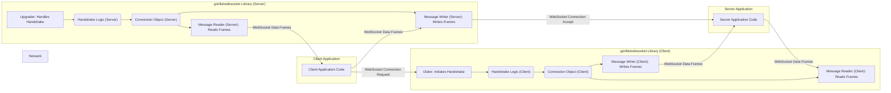

## Project Design Document: gorilla/websocket Library (Improved)

**1. Introduction**

This document provides an enhanced architectural design overview of the `gorilla/websocket` Go library. This library offers a robust and RFC 6455 compliant implementation of the WebSocket protocol, enabling the development of efficient WebSocket clients and servers in Go. This improved document is specifically structured to facilitate effective threat modeling.

**2. Goals**

*   Provide a clear and concise architectural overview of the `gorilla/websocket` library.
*   Clearly identify key components and their interactions, emphasizing security-relevant aspects.
*   Describe the data flow within the library during connection establishment and message exchange, highlighting potential security checkpoints.
*   Explicitly outline security considerations relevant to each component and process.
*   Serve as a focused and actionable foundation for identifying potential security threats and vulnerabilities during threat modeling.

**3. Non-Goals**

*   In-depth, line-by-line code implementation details.
*   Comprehensive performance benchmarking and optimization strategies.
*   Specific and detailed deployment environment configurations.
*   A complete re-explanation of the WebSocket protocol defined in RFC 6455.

**4. Architectural Overview**

The `gorilla/websocket` library is architected around managing WebSocket connections, handling message framing, and ensuring protocol adherence. It provides distinct implementations for client and server roles.

**4.1. High-Level Architecture**

**5. Detailed Component Design**

The library comprises several key components, each responsible for specific aspects of the WebSocket protocol. Security considerations are interwoven into the description of each component.

**5.1. Core Components**

*   **`Dialer` (Client-Side):**
    *   **Function:** Initiates WebSocket connections. Constructs and sends the initial HTTP handshake request.
    *   **Security Relevance:** Responsible for setting crucial handshake headers (e.g., `Upgrade`, `Connection`, `Sec-WebSocket-Key`). Improper header construction or lack of randomness in `Sec-WebSocket-Key` can be a vulnerability.
*   **`Upgrader` (Server-Side):**
    *   **Function:** Handles incoming HTTP requests and attempts to upgrade them to WebSocket connections. Validates the client's handshake request.
    *   **Security Relevance:** Critical for security. Must strictly validate handshake headers (`Upgrade`, `Connection`, `Sec-WebSocket-Key`, `Sec-WebSocket-Version`, `Origin`). Failure to validate can lead to unauthorized upgrades and cross-site WebSocket hijacking.
*   **`Conn` (Connection Object):**
    *   **Function:** Represents an established WebSocket connection. Manages the underlying network connection, provides methods for sending and receiving messages, and handles connection state.
    *   **Security Relevance:**  Manages the lifecycle of the secure communication channel. Proper state management is important to prevent issues like use-after-close. Also encapsulates the `Reader` and `Writer`.
*   **`Message Reader`:**
    *   **Function:** Reads incoming WebSocket frames from the network. Handles frame parsing, defragmentation of messages, and processing of control frames (ping, pong, close).
    *   **Security Relevance:**  Must validate frame headers to prevent malformed frames from causing errors or potential exploits. Needs to handle large frames and potential fragmentation bombs to prevent denial-of-service. Properly handles close frames for secure termination.
*   **`Message Writer`:**
    *   **Function:** Takes outgoing messages, frames them according to the WebSocket protocol, and writes them to the network connection. Manages concurrency for safe writing.
    *   **Security Relevance:**  Ensures messages are correctly framed to avoid interpretation errors on the receiving end. Concurrency control prevents race conditions that could lead to data corruption or unexpected behavior.
*   **`Handshake Logic`:**
    *   **Function:** Implemented within both `Dialer` and `Upgrader`. Enforces the correct exchange of HTTP headers required for establishing a WebSocket connection as per RFC 6455.
    *   **Security Relevance:**  The foundation of secure WebSocket establishment. Any deviation from the standard can introduce vulnerabilities. Includes generating and verifying the `Sec-WebSocket-Accept` header.
*   **`Frame Handling`:**
    *   **Function:**  Parses incoming frame headers and constructs outgoing frame headers. Manages the structure of WebSocket frames (opcode, flags, payload length, masking).
    *   **Security Relevance:**  Incorrect parsing can lead to misinterpretation of messages. Proper handling of masking (required for client-to-server messages) is crucial to prevent proxy-related attacks.
*   **`Control Message Handling`:**
    *   **Function:**  Specific logic for processing control frames like Ping, Pong, and Close. Manages connection health and termination.
    *   **Security Relevance:**  Ensures timely responses to Ping frames to maintain connection health. Securely handles Close frames to prevent resource leaks and ensure proper connection closure.
*   **`Extension Handling`:**
    *   **Function:**  Supports WebSocket extensions, allowing negotiation and application of features like compression (e.g., Per-Message Deflate).
    *   **Security Relevance:**  Extensions can introduce new attack vectors if not implemented correctly. Vulnerabilities in compression algorithms or improper negotiation can be exploited.

**5.2. Key Data Structures (Relevant for Security)**

*   **`Header` (Frame Header):**
    *   **Security Relevance:** Contains critical information about the frame. Maliciously crafted headers can be used to exploit vulnerabilities.
*   **`Message` (Conceptual):**
    *   **Security Relevance:** The actual data being transmitted. Applications must sanitize this data to prevent injection attacks, but the library's handling of message boundaries and fragmentation is also relevant.
*   **`State` (Connection State):**
    *   **Security Relevance:**  Incorrect state transitions can lead to vulnerabilities like double-frees or use-after-close.

**6. Data Flow (with Security Checkpoints)**

**6.1. Client Connection Establishment (Potential Vulnerabilities)**

1. Client Application uses `Dialer` to initiate a connection.
    *   **Security Checkpoint:** Ensure the target URL is validated to prevent connecting to malicious servers.
2. `Dialer` sends an HTTP GET request with handshake headers.
    *   **Security Checkpoint:** Verify that `Sec-WebSocket-Key` is generated securely (cryptographically random).
3. Server's `Upgrader` receives the request.
    *   **Security Checkpoint:**  The server must strictly validate `Upgrade`, `Connection`, `Sec-WebSocket-Key`, `Sec-WebSocket-Version`, and potentially `Origin` headers.
4. `Upgrader` sends an HTTP 101 Switching Protocols response.
    *   **Security Checkpoint:**  The `Sec-WebSocket-Accept` header must be correctly calculated based on the `Sec-WebSocket-Key`.
5. `Dialer` verifies the server's response.
    *   **Security Checkpoint:**  The client must verify the `Sec-WebSocket-Accept` header to ensure the server performed the handshake correctly.
6. A `Conn` object is established.

**6.2. Server Connection Establishment (Potential Vulnerabilities)**

1. Server Application uses `Upgrader` to handle incoming requests.
2. `Upgrader` receives an HTTP request with potential WebSocket handshake headers.
    *   **Security Checkpoint:**  The server must validate the incoming request method (should be GET).
3. `Upgrader` validates handshake headers.
    *   **Security Checkpoint:**  Strict validation of `Upgrade`, `Connection`, `Sec-WebSocket-Key`, `Sec-WebSocket-Version`, and `Origin` is crucial.
4. `Upgrader` sends an HTTP 101 Switching Protocols response.
5. A `Conn` object is established.

**6.3. Message Sending (Client or Server) (Potential Vulnerabilities)**

1. Application calls `WriteMessage` on the `Conn`.
    *   **Security Checkpoint:**  The library should enforce any configured message size limits to prevent DoS.
2. `Writer` frames the message.
    *   **Security Checkpoint (Client-Side):** Ensure proper masking of the payload.
3. Framed message is sent over the network.

**6.4. Message Receiving (Client or Server) (Potential Vulnerabilities)**

1. `Reader` reads data from the network.
2. `Reader` parses incoming frames.
    *   **Security Checkpoint:**  Validate frame headers (opcode, length, reserved bits). Handle potential errors gracefully.
3. `Reader` defragments messages if necessary.
    *   **Security Checkpoint:**  Guard against fragmentation bombs (excessive fragmentation leading to resource exhaustion).
4. `Reader` delivers the message to the application.

**6.5. Connection Closure (Potential Vulnerabilities)**

1. Either endpoint sends a Close control frame.
    *   **Security Checkpoint:**  Validate the close code and reason (if provided).
2. The other endpoint responds with a Close frame.
3. The connection is closed.
    *   **Security Checkpoint:**  Ensure proper cleanup of resources to prevent leaks.

**7. Key Security Considerations (Categorized)**

*   **Handshake Security:**
    *   Strict validation of handshake headers (`Upgrade`, `Connection`, `Sec-WebSocket-Key`, `Sec-WebSocket-Version`, `Origin`).
    *   Proper generation and verification of `Sec-WebSocket-Accept`.
    *   Mitigation of cross-site WebSocket hijacking through `Origin` header validation.
*   **Frame Processing Security:**
    *   Validation of frame headers (opcode, length, reserved bits).
    *   Handling of malformed or invalid frames to prevent crashes or unexpected behavior.
    *   Protection against fragmentation bombs through limits on the number and size of fragments.
*   **Control Message Security:**
    *   Proper handling of Close frames for graceful termination and resource cleanup.
    *   Mechanisms to prevent abuse of Ping/Pong frames.
*   **Extension Security:**
    *   Security implications of negotiated extensions (e.g., vulnerabilities in compression algorithms).
    *   Proper implementation of extension negotiation and application.
*   **Connection Management Security:**
    *   Prevention of race conditions in `Writer` through proper concurrency control.
    *   Robust error handling to prevent unexpected states and potential vulnerabilities.
    *   Protection against denial-of-service attacks through message size limits and connection limits.
*   **Transport Security:**
    *   Emphasis on using TLS/SSL (`wss://`) for secure communication.
*   **Application Layer Security:**
    *   The library does not handle application-level data sanitization. Applications using the library are responsible for this.

**8. Deployment Considerations (Security Implications)**

The security of deployments using `gorilla/websocket` depends on several factors:

*   **Secure Configuration:**  Properly configuring the `Upgrader` with appropriate security settings (e.g., `CheckOrigin` function).
*   **TLS/SSL Configuration:** Ensuring TLS/SSL is correctly configured for `wss://` connections.
*   **Network Security:**  Firewall rules and network segmentation to restrict access to WebSocket endpoints.
*   **Resource Limits:**  Setting appropriate limits on connections, message sizes, and other resources to prevent DoS.

**9. Future Considerations (Security Implications)**

*   **Standardized Authentication/Authorization Mechanisms:**  Exploring secure and standardized ways to integrate authentication and authorization directly within the WebSocket handshake or protocol.
*   **Improved Extension Security Framework:**  Developing more robust mechanisms for managing and securing WebSocket extensions.
*   **Built-in Security Auditing/Logging:**  Adding features to facilitate security auditing and logging of WebSocket events.

This improved design document provides a more security-focused overview of the `gorilla/websocket` library, making it a more effective tool for subsequent threat modeling activities. The explicit mention of security considerations within each component and data flow stage aims to highlight potential areas of vulnerability.