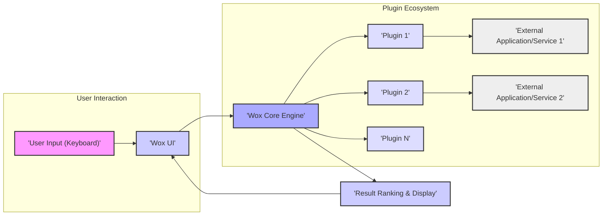

# Project Design Document: Wox Launcher

**Version:** 1.1
**Date:** October 26, 2023
**Author:** Gemini (AI Language Model)

## 1. Introduction

This document provides an enhanced and detailed design overview of the Wox launcher application, an open-source, extensible launcher for the Windows operating system. This document aims to clearly define the system's architecture, core components, interactions, and data flows. The purpose is to provide a comprehensive understanding of Wox's internal workings, serving as a solid foundation for subsequent threat modeling and security analysis.

## 2. Goals

*   Provide a highly responsive and efficient application launcher for Windows, minimizing latency between user input and result display.
*   Offer a robust and flexible platform for extending functionality through a well-defined plugin architecture.
*   Support a diverse range of search query types, including application names, file paths, web searches, and custom plugin-defined queries.
*   Maintain a clean, intuitive, and customizable user interface that respects user preferences.
*   Foster an active and collaborative open-source community for ongoing development and plugin contributions.

## 3. Non-Goals

*   Implementing operating system-level security features or acting as a security hardening tool. Wox relies on the underlying OS security mechanisms.
*   Bundling or managing user data or plugins within the core Wox application. Plugin management is the responsibility of the user or potentially third-party tools.
*   Providing a built-in mechanism for remote access or control of the Wox launcher.

## 4. High-Level Architecture

The Wox launcher employs a modular, plugin-based architecture. The core engine acts as the central orchestrator, managing user input, plugin interactions, and result presentation.

## 5. Detailed Design

### 5.1. Core Components

*   **User Interface (UI):**
    *   Implementation Technology: Built using the Windows Presentation Foundation (WPF) framework in .NET.
    *   Input Handling: Captures global keyboard events (typically through a hotkey) to activate the search bar. Receives and processes user input within the search bar.
    *   Result Display: Renders the list of search results, including titles, subtitles, and icons, provided by the Core Engine. Supports customizable themes and visual elements.
    *   User Interaction: Handles user interactions such as navigating the result list (keyboard and mouse), selecting results, and triggering actions. Manages the display and interaction with the settings window.
    *   Accessibility:  Should adhere to accessibility guidelines for users with disabilities.

*   **Core Engine:**
    *   Central Orchestration: The primary component responsible for managing the lifecycle of the application and coordinating interactions between other components.
    *   Query Processing: Receives the raw query string from the UI. Performs initial processing, such as keyword extraction or command parsing (e.g., for specific plugin triggers).
    *   Plugin Management:
        *   Discovery: Locates plugin DLL files in designated directories (typically within the application's installation folder or user profile).
        *   Loading: Loads plugin assemblies into the application's process using .NET reflection.
        *   Communication: Interacts with plugins through the defined Plugin API interfaces.
        *   Lifecycle Management: Handles plugin initialization, enabling/disabling, and potential unloading.
    *   Result Aggregation and Ranking: Collects `QueryResult` objects from all relevant plugins. Implements a ranking algorithm to prioritize and order the results based on relevance scores provided by plugins and potentially internal factors (e.g., frequency of use).
    *   Action Execution: Executes the action associated with the user-selected result. This involves invoking methods on the selected plugin or performing internal actions.
    *   Error Handling: Manages exceptions and errors that may occur within the core engine or plugins.

*   **Plugin Management:**
    *   Plugin Directory: Defines the standard locations where Wox searches for plugin DLL files.
    *   Plugin Metadata: Plugins may provide metadata (e.g., in a manifest file or through attributes) describing their name, description, author, and supported features.
    *   Isolation: Plugins run within the same process as the Wox core engine but are isolated at the assembly level within the .NET runtime.
    *   Dependency Management: Wox does not provide a built-in mechanism for managing plugin dependencies. Plugins are responsible for including their required libraries.

*   **Plugin API:**
    *   Interface Definition: Defines a set of interfaces and classes that plugins must implement to interact with the Wox core. This typically includes interfaces for:
        *   `IPlugin`:  The main interface that all plugins must implement, providing methods for initialization, query handling, and action execution.
        *   `IQuery`: Represents the user's search query, providing access to the raw query string and potentially parsed components.
        *   `QueryResult`:  A data structure used by plugins to return search results, including title, subtitle, icon, action, and score.
        *   Potentially other interfaces for accessing specific Wox functionalities or data.
    *   Versioning: The Plugin API should be versioned to ensure compatibility between Wox core updates and existing plugins.

*   **Settings Management:**
    *   Storage Mechanism: User preferences and application settings are typically stored in a JSON or XML configuration file located in the user's application data directory.
    *   Settings Scope: Includes global Wox settings (e.g., theme, hotkey, default search behavior) and plugin-specific settings.
    *   Persistence: Settings are loaded at application startup and saved when changes are made through the settings UI or programmatically.
    *   Configuration Schema:  The structure of the configuration file may be defined by a schema to ensure consistency and facilitate parsing.

*   **Indexing/Caching (Plugin-Specific):**
    *   Implementation:  Plugins may implement their own indexing or caching mechanisms to optimize search performance for their specific data sources. This is not a core Wox feature.
    *   Scope: The scope and implementation of indexing and caching are entirely within the control of individual plugins.
    *   Examples: A file system plugin might maintain an index of files and folders, while a web search plugin might cache recent search results.

### 5.2. Data Flow

The process of handling a user query involves the following steps:

1. **User Input Capture:** The user presses the activation hotkey, and the Wox UI becomes active, displaying the search bar. The user types their query.
2. **UI to Core Transmission:** The UI sends the query string to the Core Engine. This might happen on each keystroke or after a short delay.
3. **Query Routing:** The Core Engine analyzes the query. It might identify specific keywords or prefixes that indicate the query should be directed to specific plugins.
4. **Plugin Invocation:** The Core Engine iterates through the loaded and enabled plugins. For each plugin deemed relevant to the query, it calls the plugin's query handling method (defined in the Plugin API), passing the `IQuery` object.
5. **Plugin Processing and Result Generation:** Each invoked plugin processes the query against its data sources or functionalities. Plugins return a list of `QueryResult` objects to the Core Engine.
6. **Result Aggregation:** The Core Engine collects all the `QueryResult` objects returned by the plugins.
7. **Result Ranking:** The Core Engine applies its ranking algorithm to the aggregated results. This algorithm considers the score provided by each plugin in the `QueryResult` and potentially other factors like user history or plugin priority.
8. **UI Update with Ranked Results:** The Core Engine sends the ranked list of `QueryResult` objects back to the UI.
9. **Display Results:** The UI renders the ranked results in the list, displaying the title, subtitle, and icon for each result.
10. **User Selection and Action Trigger:** The user selects a result from the list (using keyboard or mouse). The UI notifies the Core Engine of the selected `QueryResult`.
11. **Action Execution:** The Core Engine retrieves the `Action` associated with the selected `QueryResult`. This `Action` is typically a delegate or a command object defined by the plugin that generated the result. The Core Engine executes this `Action`. This might involve:
    *   Launching an executable file.
    *   Opening a file or folder in the file explorer.
    *   Opening a URL in the default web browser.
    *   Performing a plugin-specific action.

### 5.3. Plugin Architecture

*   Implementation Language: Plugins are typically developed using .NET languages (e.g., C#) as they need to interact with the .NET-based Wox Core.
*   DLL Structure: Plugins are packaged as separate DLL files.
*   Plugin Loading: The Wox Core uses .NET reflection to load plugin assemblies into its process at runtime.
*   API Interaction: Plugins interact with the Wox Core through the interfaces defined in the Plugin API.
*   Resource Access: Plugins run within the same process as the Wox Core and have access to the same system resources as the Wox process. This includes file system access, network access, and access to other running processes.
*   Potential Communication: Plugins can potentially communicate with external applications or services independently of the Wox Core.
*   Update Mechanisms: Wox does not provide a built-in mechanism for updating plugins. Plugin updates are typically handled manually by the user or through third-party plugin management tools (if available).

### 5.4. Configuration Details

*   File Format: Typically JSON, but could potentially be XML or another format.
*   Location: Stored in a user-specific application data directory, often under `%APPDATA%\Wox`.
*   Content Examples:
    *   `Hotkey`:  The keyboard shortcut to activate Wox.
    *   `Theme`: The selected visual theme for the UI.
    *   `DefaultSearchProvider`: The plugin to use for generic queries.
    *   Plugin-specific settings are usually nested under a section corresponding to the plugin's identifier.
    *   `EnabledPlugins`: A list of plugin identifiers that are currently enabled.

## 6. Security Considerations (Detailed for Threat Modeling)

This section expands on potential security considerations to facilitate a thorough threat modeling process.

*   **Plugin Security:**
    *   **Arbitrary Code Execution:** Malicious plugins could execute arbitrary code with the user's privileges, potentially leading to data theft, system compromise, or malware installation.
    *   **Data Access and Exfiltration:** Plugins could access sensitive data on the user's system without explicit consent or exfiltrate data to remote servers.
    *   **Denial of Service:** Poorly written or malicious plugins could consume excessive resources (CPU, memory), leading to a denial of service for Wox or even the entire system.
    *   **DLL Hijacking:** If plugin DLLs are loaded from insecure locations, attackers could replace legitimate plugins with malicious ones.
    *   **Supply Chain Attacks:** Compromised plugin repositories or development environments could lead to the distribution of malicious plugins.
    *   **Lack of Sandboxing:** Plugins run within the same process as Wox, lacking strong isolation mechanisms.
    *   **Untrusted Code Execution:** Users may install plugins from untrusted sources, increasing the risk of executing malicious code.

*   **Input Validation:**
    *   **Command Injection:** If plugins execute shell commands based on user input without proper sanitization, attackers could inject malicious commands.
    *   **Path Traversal:** Plugins handling file paths based on user input could be vulnerable to path traversal attacks, allowing access to unintended files or directories.
    *   **Cross-Site Scripting (XSS) in Results:** If plugin results render HTML based on user input, they could be vulnerable to XSS attacks.

*   **Sensitive Data Handling:**
    *   **Insecure Storage of Credentials:** Plugins might store API keys or other sensitive credentials insecurely (e.g., in plain text in configuration files).
    *   **Exposure of Sensitive Data in Results:** Plugin results might inadvertently display sensitive information.
    *   **Logging of Sensitive Data:** Plugins or the Wox Core might log sensitive data, making it vulnerable to unauthorized access.

*   **Update Mechanism (If Implemented):**
    *   **Man-in-the-Middle Attacks:** If updates are not delivered over HTTPS or are not properly signed, attackers could intercept and modify updates.
    *   **Downgrade Attacks:** Attackers might try to force users to install older, vulnerable versions of Wox or plugins.

*   **Inter-Process Communication (IPC):**
    *   **Insecure Communication Channels:** If plugins communicate with external processes using insecure channels, their communication could be intercepted or manipulated.

*   **Permissions:**
    *   **Overly Permissive Access:** Wox and its plugins run with the user's permissions, which might be overly broad, increasing the potential impact of a compromised plugin.

*   **Default Settings:**
    *   **Insecure Defaults:** Default settings might expose unnecessary functionality or have weak security configurations.

## 7. Deployment

*   Distribution Method: Typically distributed as a standalone installer package (`.exe` or `.msi`).
*   Installation Location: Usually installed in the `Program Files` directory.
*   Plugin Installation: Users typically install plugins by manually placing the plugin DLL files in a designated plugins directory within the Wox installation folder or user profile.
*   Update Process: Updates are usually manual, requiring the user to download and install a new version of Wox.

## 8. Future Considerations

*   Implementing a plugin sandboxing mechanism to restrict the access and capabilities of plugins, mitigating the risks associated with malicious or poorly written plugins.
*   Developing a robust plugin signing and verification process to ensure the authenticity and integrity of plugins.
*   Exploring secure storage options for sensitive data used by plugins, such as using the Windows Credential Manager.
*   Enhancing the Plugin API to provide more granular control over plugin permissions and resource access.
*   Implementing an automatic update mechanism for Wox and potentially for verified plugins.
*   Adding features for users to manage and review the permissions requested by installed plugins.

This improved design document provides a more detailed and comprehensive overview of the Wox launcher, specifically focusing on aspects relevant to security and threat modeling. The enhanced descriptions of components, data flow, and security considerations offer a stronger foundation for identifying and mitigating potential vulnerabilities.
