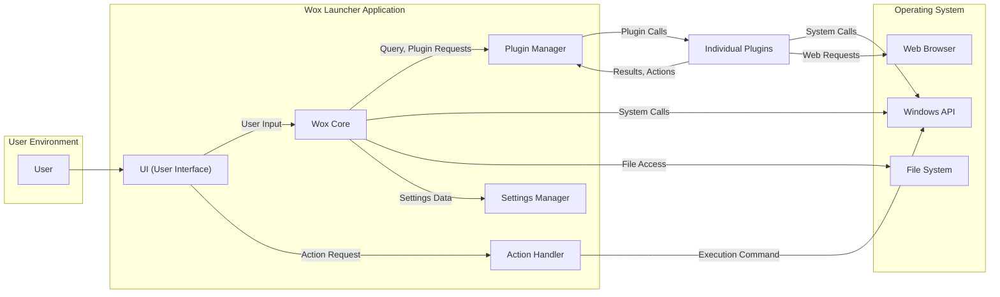

## Project Design Document: Wox Launcher

**Version:** 1.1
**Date:** October 26, 2023
**Author:** AI Software Architect

### 1. Introduction

This document provides an enhanced and detailed design overview of the Wox launcher application, building upon the previous version. It outlines the system's architecture, key components, data flow, and security considerations with greater depth. This document serves as a robust foundation for subsequent threat modeling activities.

Wox is a free, open-source launcher application for Windows, designed to enhance user productivity. It enables users to swiftly locate and launch applications, files, and initiate web searches by simply typing keywords. Its modular design, particularly its extensibility through plugins, makes it a highly adaptable tool.

### 2. Goals and Objectives

* **Primary Goal:** To provide an improved and more detailed design document of the Wox launcher application, specifically tailored for effective threat modeling.
* **Objectives:**
    * Clearly and comprehensively define the system architecture and the responsibilities of each component.
    * Provide a detailed description of the data flow within the application, including specific data types where relevant.
    * Identify key interactions, dependencies, and communication pathways between components.
    * Thoroughly highlight potential security considerations and vulnerabilities based on the refined design.

### 3. System Architecture

The Wox launcher employs a modular architecture, centered around a core application that orchestrates the functionality of various plugins.

**Components:**

* **User:** The individual who interacts with the Wox launcher to initiate searches and actions.
* **Wox Core:** The central orchestrator of the application, responsible for:
    * Receiving and interpreting user input from the UI.
    * Processing search queries and determining relevant plugins.
    * Managing communication with the Plugin Manager.
    * Aggregating, ranking, and formatting search results from plugins.
    * Coordinating action execution through the Action Handler.
* **Plugin Manager:**  A crucial component responsible for the dynamic management of plugins:
    * Discovering available plugins within designated directories.
    * Loading and unloading plugin assemblies at runtime.
    * Providing a communication interface for the Wox Core to interact with plugins.
    * Maintaining a registry of loaded plugins and their capabilities.
* **UI (User Interface):** The visual interface through which the user interacts with Wox:
    * Providing an input field for users to enter their search queries.
    * Displaying ranked search results in a user-friendly manner.
    * Handling user selection of results and associated actions.
    * Presenting the application's settings and configuration options.
* **Settings Manager:** Responsible for persistent storage and retrieval of application and user settings:
    * Loading application settings from configuration files (e.g., JSON, XML).
    * Saving modified settings back to configuration files.
    * Providing an API for other components to access and modify settings.
* **Action Handler:**  Manages the execution of actions triggered by user selection:
    * Receiving action requests from the UI.
    * Identifying the appropriate handler for the selected action (either within the core or a plugin).
    * Interacting with the Operating System (via Windows API) to execute the action (e.g., launching an application, opening a file).
* **Individual Plugins:** Independent, dynamically loaded modules that extend Wox's functionality:
    * **Search Providers:**  Plugins that implement logic to search specific data sources (e.g., file system, web, applications).
    * **Action Providers:** Plugins that define custom actions that can be performed on search results.
    * **Custom Functionality:** Plugins can introduce entirely new features and integrations.
* **Windows API:** The interface through which Wox and its plugins interact with the underlying Windows operating system for core functionalities.
* **File System:** Used by Wox, the Settings Manager, and plugins to access and manage files and directories.
* **Web Browser:** Utilized by Wox and plugins to perform web searches, open URLs, and potentially display web content within the application.

### 4. Component Details

This section provides a more granular description of the key components and their internal workings.

* **Wox Core:**
    * **Input Handling:** Listens for and captures user keystrokes from the UI input field.
    * **Query Parsing & Intent Recognition:** Analyzes the user's input to extract keywords and determine the user's intent (e.g., launching an application, performing a web search).
    * **Plugin Selection:** Based on the parsed query, the Core determines which plugins are relevant and should be invoked.
    * **Query Dispatch:**  Sends the user's query to the selected plugins via the Plugin Manager's interface.
    * **Result Merging & Deduplication:** Collects results from various plugins and removes duplicate entries.
    * **Scoring & Ranking:** Applies a ranking algorithm to order the results based on relevance, frequency of use, and potentially other factors.
    * **Result Formatting:**  Prepares the ranked results for display in the UI.
    * **Action Request Handling:** Receives requests from the UI to execute actions on selected results and forwards them to the Action Handler.

* **Plugin Manager:**
    * **Plugin Directory Monitoring:** Monitors designated directories for new or updated plugin files.
    * **Assembly Loading & Isolation (Conceptual):** Loads plugin assemblies into the Wox process, ideally with some level of isolation to prevent crashes in one plugin from affecting the entire application.
    * **Plugin Metadata Extraction:** Reads metadata from plugin assemblies (e.g., plugin name, description, supported keywords, implemented interfaces).
    * **Plugin Registration:** Maintains a registry of loaded plugins and their capabilities, allowing the Wox Core to query for relevant plugins.
    * **Communication Interface:** Provides a well-defined interface (likely using .NET interfaces or delegates) for the Wox Core to invoke plugin methods and for plugins to return results.

* **UI (User Interface):**
    * **Input Field (WPF TextBox):**  A standard text input control for capturing user queries.
    * **Results List (WPF ListView/ItemsControl):**  Displays the ranked search results, potentially with icons and descriptions.
    * **Action Menu/Context Menu:** Presents available actions for a selected result.
    * **Settings Window (WPF Window):**  Provides a graphical interface for configuring Wox settings and potentially plugin-specific settings.
    * **Theme Management:** Handles the visual appearance of the UI.

* **Settings Manager:**
    * **Configuration File Parsing (JSON/XML Deserialization):** Reads and parses configuration files into application objects.
    * **Configuration Object Serialization:** Writes application settings back to configuration files.
    * **In-Memory Cache:**  May maintain an in-memory cache of settings for faster access.
    * **Settings Change Notifications:**  May provide a mechanism for other components to be notified of settings changes.

* **Action Handler:**
    * **Action Mapping:** Maintains a mapping between user-selected actions and the corresponding execution logic (either within the core or a plugin).
    * **Execution Context Creation:**  Prepares the necessary context for executing an action (e.g., the selected result, relevant file paths).
    * **Operating System Interaction (via Windows API):**  Uses the Windows API to perform actions like launching executables, opening files, and navigating to URLs.

* **Individual Plugins:**
    * **Search Logic Implementation:** Contains the specific logic for searching a particular data source (e.g., iterating through files, querying a web API).
    * **Result Formatting (Plugin-Specific):**  Formats search results according to the plugin's requirements.
    * **Action Implementation (Optional):**  May implement custom actions that can be performed on the plugin's results.
    * **Configuration Handling (Optional):**  May have its own configuration settings that are managed independently or through the Wox Settings Manager.

### 5. Data Flow

The primary data flow remains the user initiating a search and Wox displaying results, but with more detail on the data exchanged.

```mermaid
graph LR
    A["User Input (Keystrokes)"] --> B("UI Input Field");
    B -- "Query String" --> C("Wox Core - Input Handling");
    C -- "Query String" --> D("Wox Core - Query Processing & Intent");
    D -- "Query, Plugin Requirements" --> E("Plugin Manager");
    E -- "Query" --> F("Individual Plugins");
    F -- "List<SearchResult>" --> E;
    E -- "Aggregated List<SearchResult>" --> G("Wox Core - Result Aggregation");
    G -- "Ranked List<SearchResult>" --> H("Wox Core - Result Ranking");
    H -- "Formatted Results" --> I("UI - Results Display");
    I -- "Selected Result, Action" --> J["User Selection (Action)"];
    J -- "Action Request, Context" --> K("Action Handler");
    K -- "OS Command/API Call" --> L("Operating System / Application");
```

**Detailed Data Flow Description:**

1. **User Input (Keystrokes):** The user types a search query into the Wox UI.
2. **UI Input Field:** The UI captures the sequence of keystrokes.
3. **Wox Core - Input Handling:** The UI sends the raw query string to the Wox Core.
4. **Wox Core - Query Processing & Intent:** The Core parses the query string to understand the user's intent and identify relevant keywords.
5. **Plugin Manager:** The Core communicates with the Plugin Manager, potentially specifying requirements based on the query.
6. **Individual Plugins:** The Plugin Manager forwards the query string to the appropriate plugins.
7. **List<SearchResult>:** Plugins process the query and return a list of `SearchResult` objects, each containing information about a potential match (title, subtitle, icon, action).
8. **Wox Core - Result Aggregation:** The Plugin Manager aggregates the `SearchResult` lists from all invoked plugins.
9. **Wox Core - Result Ranking:** The Core applies a ranking algorithm to the aggregated list of `SearchResult` objects, producing a ranked list.
10. **UI - Results Display:** The Core sends the ranked and formatted results to the UI for display to the user.
11. **User Selection (Action):** The user selects a result and an associated action from the UI.
12. **Action Handler:** The UI sends an action request, along with the context of the selected result, to the Action Handler.
13. **Operating System / Application:** The Action Handler interacts with the operating system or the target application via the Windows API to execute the requested action.

**Other Data Flows:**

* **Settings Management:** User interactions in the settings UI trigger data reads and writes to configuration files via the Settings Manager. This involves data structures representing application and plugin settings.
* **Plugin Configuration:** Plugins may read their configuration data upon loading and potentially write updated configuration data, either through the Settings Manager or their own mechanisms.

### 6. Security Considerations

This section provides a more detailed examination of potential security considerations.

* **Plugin Security:**
    * **Malicious Plugins:**  Plugins, being third-party code, pose a significant risk of introducing malicious functionality (e.g., data exfiltration, system compromise).
    * **Insufficient Plugin Isolation:**  Lack of robust isolation between plugins and the core application could allow a compromised plugin to affect the entire system.
    * **Plugin Permissions & Access Control:** The absence of a granular permission model for plugins could lead to plugins having excessive access to system resources.
    * **Vulnerable Plugin Dependencies:** Plugins may rely on external libraries with known vulnerabilities.
    * **Unverified Plugin Sources:**  If users can load plugins from arbitrary sources, the risk of installing malicious plugins increases.
    * **Code Injection via Plugin Vulnerabilities:** Vulnerabilities in plugin code could be exploited to inject malicious code into the Wox process.
* **Input Validation:**
    * **Command Injection:** Improper sanitization of user input could allow attackers to inject arbitrary commands that are executed by the system.
    * **Path Traversal:** If user input is used to construct file paths, vulnerabilities could allow access to unauthorized files.
* **Data Security:**
    * **Storage of Sensitive Data:** Configuration files or plugin data stores might contain sensitive information (API keys, credentials) that could be compromised if not properly protected.
    * **Data Tampering:**  Configuration files could be modified by malicious actors to alter application behavior or inject malicious settings.
* **UI Security:**
    * **Clickjacking (Mitigation Likely):** While less probable for a desktop application, if the UI embeds web content, clickjacking could be a concern.
* **Update Mechanism:**
    * **Insecure Update Channel:**  If the update process is not secured with HTTPS and signature verification, attackers could perform man-in-the-middle attacks to deliver malicious updates.
* **Inter-Process Communication (IPC):**
    * **Insecure IPC Channels:** If plugins communicate with external processes using insecure methods, this could be a point of vulnerability.
* **Code Signing:** Lack of code signing for the core application and plugins makes it difficult to verify the authenticity and integrity of the software.
* **Default Settings:** Insecure default settings could expose users to vulnerabilities.

### 7. Technologies Used (Based on Project Repository)

* **Programming Language:** C# (.NET Framework)
* **UI Framework:** WPF (Windows Presentation Foundation) - Provides rich UI capabilities and data binding.
* **Plugin Architecture:**  Utilizes .NET's assembly loading mechanisms (`System.Reflection`) and likely employs interfaces or abstract classes to define plugin contracts.
* **Configuration Management:**  Likely uses JSON.NET or similar libraries for serializing and deserializing JSON configuration files. May also use XML.
* **Inter-Process Communication (Potentially):**  Depending on plugin functionality, may use techniques like named pipes or TCP sockets for communication with external processes.

### 8. Deployment Model

Wox is typically deployed as a standalone desktop application installed on a user's Windows machine.

* **Installation:**  Users download an installer package (e.g., MSI) and install the application.
* **Plugin Deployment:** Plugins are typically deployed as separate DLL files placed within a designated "Plugins" directory within the Wox application folder.

### 9. Future Considerations

* **Robust Plugin Sandboxing:** Implementing a more secure sandboxing mechanism for plugins, potentially using AppContainers or similar technologies, to strictly limit their access to system resources and APIs.
* **Mandatory Plugin Signing and Verification:**  Requiring plugins to be digitally signed by trusted developers and verifying these signatures before loading to mitigate the risk of malicious plugins.
* **Granular Permission Model for Plugins:** Implementing a fine-grained permission system that allows users to grant specific permissions to individual plugins (e.g., network access, file system access).
* **Secure and Automated Update Mechanism:** Implementing a secure update process with HTTPS and signature verification for both the core application and plugins, potentially with automatic updates.
* **Enhanced Input Sanitization and Validation:** Implementing robust input validation and sanitization techniques to prevent command injection and other input-related vulnerabilities.
* **Code Audits and Security Reviews:** Regularly conducting code audits and security reviews to identify and address potential vulnerabilities.
* **Security Policy Enforcement:** Implementing mechanisms to enforce security policies related to plugin loading and execution.

This improved design document provides a more detailed and comprehensive overview of the Wox launcher application, offering a stronger foundation for thorough threat modeling. The enhanced descriptions of components, data flows, and security considerations will be invaluable in identifying potential attack vectors and designing effective security mitigations.