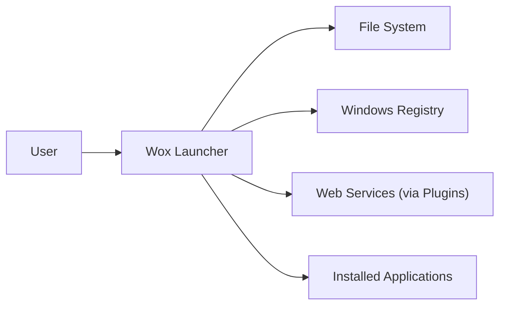
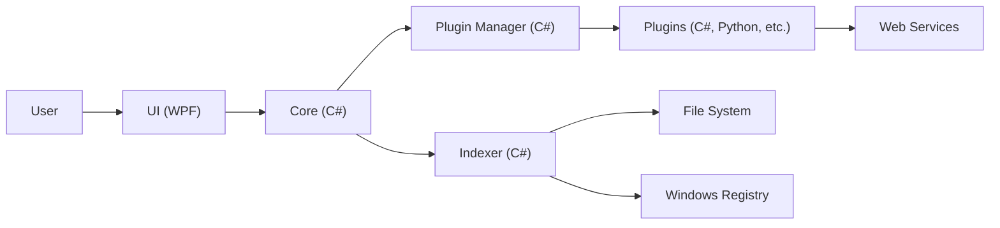
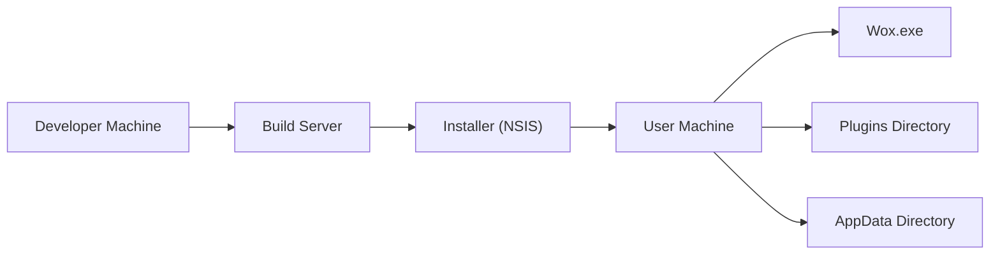
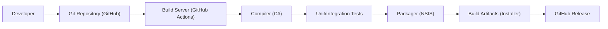

Okay, let's create a design document for the Wox launcher project.

# BUSINESS POSTURE

Wox is a free and open-source launcher for Windows. It aims to provide a fast and efficient way for users to find and launch applications, files, and other resources on their system. It also supports plugins to extend its functionality.

Priorities:

-   User Experience: Provide a seamless and responsive user experience.
-   Extensibility: Allow developers to easily create and integrate plugins.
-   Performance: Minimize resource usage (CPU, memory) and maintain high performance.
-   Stability: Ensure the application is stable and reliable.
-   Community: Foster a community around the project for contributions and support.

Goals:

-   Become a popular alternative to the built-in Windows search and other launcher applications.
-   Provide a platform for developers to create useful extensions.
-   Maintain a high level of user satisfaction.

Business Risks:

-   Loss of user trust due to security vulnerabilities (e.g., arbitrary code execution through plugins).
-   Reputational damage from instability or poor performance.
-   Competition from other launcher applications.
-   Lack of community engagement and contributions.
-   Inability to keep up with changes in the Windows operating system.

# SECURITY POSTURE

Existing Security Controls:

-   security control: The project is open-source, allowing for community review of the codebase. (GitHub repository)
-   security control: Wox uses a plugin architecture, which can potentially isolate plugin failures. (Plugin architecture documentation)
-   security control: Wox is written in C#, a memory-safe language, reducing the risk of memory corruption vulnerabilities.

Accepted Risks:

-   accepted risk: Third-party plugins may introduce security vulnerabilities. The project relies on plugin developers to follow secure coding practices.
-   accepted risk: The application runs with the same privileges as the logged-in user.

Recommended Security Controls:

-   security control: Implement a plugin signing mechanism to verify the authenticity and integrity of plugins.
-   security control: Sandboxing for plugins: Explore options for running plugins in a sandboxed environment to limit their access to the system. Consider using technologies like Windows AppContainers.
-   security control: Regular security audits of the core Wox application.
-   security control: Implement a vulnerability disclosure program to encourage responsible reporting of security issues.
-   security control: Provide clear security guidelines for plugin developers.

Security Requirements:

-   Authentication: Not directly applicable, as Wox runs in the context of the logged-in user.
-   Authorization:
    -   Wox should only access files and resources that the user has permission to access.
    -   Plugins should have limited permissions by default, and users should be able to control plugin permissions.
-   Input Validation:
    -   Wox should properly validate user input to prevent injection attacks.
    -   Plugin input should be carefully validated to prevent vulnerabilities.
-   Cryptography:
    -   If Wox stores sensitive data (e.g., API keys for plugins), it should be encrypted at rest.
    -   Secure communication channels (HTTPS) should be used when interacting with external services.

# DESIGN

## C4 CONTEXT

Context Diagram Element Description:

-   User:
    -   Name: User
    -   Type: Person
    -   Description: The person using Wox to launch applications and find files.
    -   Responsibilities: Interacts with Wox by typing queries and selecting results.
    -   Security controls: Runs Wox within their existing user account privileges.
-   Wox:
    -   Name: Wox Launcher
    -   Type: Software System
    -   Description: The core Wox application.
    -   Responsibilities: Processes user input, manages plugins, interacts with the operating system, and displays results.
    -   Security controls: Open-source codebase, written in a memory-safe language (C#).
-   FileSystem:
    -   Name: File System
    -   Type: System
    -   Description: The Windows file system.
    -   Responsibilities: Stores files and folders.
    -   Security controls: Standard Windows file system permissions.
-   Registry:
    -   Name: Windows Registry
    -   Type: System
    -   Description: The Windows Registry.
    -   Responsibilities: Stores system and application settings.
    -   Security controls: Standard Windows Registry permissions.
-   WebServices:
    -   Name: Web Services (via Plugins)
    -   Type: System
    -   Description: External web services accessed by plugins.
    -   Responsibilities: Provide data and functionality to plugins.
    -   Security controls: Dependent on the specific web service; should use HTTPS.
-   InstalledApps:
    -   Name: Installed Applications
    -   Type: System
    -   Description: Applications installed on the user's system.
    -   Responsibilities: Executed when launched by Wox.
    -   Security controls: Standard application security mechanisms.

## C4 CONTAINER

Container Diagram Element Description:

-   UI:
    -   Name: UI (WPF)
    -   Type: Container (UI)
    -   Description: The user interface, built using Windows Presentation Foundation (WPF).
    -   Responsibilities: Displays the search bar and results, handles user input.
    -   Security controls: Input validation.
-   Core:
    -   Name: Core (C#)
    -   Type: Container (Application)
    -   Description: The core logic of Wox, written in C#.
    -   Responsibilities: Processes user queries, manages the application lifecycle, interacts with other components.
    -   Security controls: Memory-safe language.
-   PluginManager:
    -   Name: Plugin Manager (C#)
    -   Type: Container (Application)
    -   Description: Manages the loading, execution, and communication of plugins.
    -   Responsibilities: Loads plugins, handles inter-process communication (IPC) with plugins, provides an API for plugins.
    -   Security controls: Plugin isolation (potentially through sandboxing).
-   Plugins:
    -   Name: Plugins (C#, Python, etc.)
    -   Type: Container (Application)
    -   Description: Extensions that provide additional functionality to Wox.
    -   Responsibilities: Perform specific tasks, such as searching web services, calculating values, or interacting with other applications.
    -   Security controls: Plugin signing, sandboxing (recommended).
-   Indexer:
    -   Name: Indexer (C#)
    -   Type: Container (Application)
    -   Description: Indexes files and applications for fast searching.
    -   Responsibilities: Monitors the file system and registry for changes, builds and maintains an index.
    -   Security controls: Accesses files and registry with user permissions.
-   FileSystem:
     -   Name: File System
     -   Type: System
     -   Description: The Windows file system.
     -   Responsibilities: Stores files and folders.
     -   Security controls: Standard Windows file system permissions.
-   Registry:
     -   Name: Windows Registry
     -   Type: System
     -   Description: The Windows Registry.
     -   Responsibilities: Stores system and application settings.
     -   Security controls: Standard Windows Registry permissions.
-   WebServices:
    -   Name: Web Services
    -   Type: System
    -   Description: External web services accessed by plugins.
    -   Responsibilities: Provide data and functionality to plugins.
    -   Security controls: Dependent on the specific web service; should use HTTPS.

## DEPLOYMENT

Possible Deployment Solutions:

1.  Installer (MSI, NSIS, Inno Setup): Traditional Windows installer.
2.  Portable Application:  A self-contained executable that doesn't require installation.
3.  Microsoft Store:  Distribution through the Microsoft Store.
4.  Chocolatey/Winget: Package managers for Windows.

Chosen Solution (for detailed description): Installer (e.g., using NSIS)

Deployment Diagram Element Description:

-   DevMachine:
    -   Name: Developer Machine
    -   Type: Node
    -   Description: The machine where the Wox code is developed.
    -   Responsibilities: Code development, testing, and building.
    -   Security controls: Developer access controls.
-   BuildServer:
    -   Name: Build Server
    -   Type: Node
    -   Description: A server that automates the build process (can be a developer machine or a dedicated CI/CD server).
    -   Responsibilities: Compiles the code, runs tests, creates the installer.
    -   Security controls: Limited access, build process integrity checks.
-   Installer:
    -   Name: Installer (NSIS)
    -   Type: Node
    -   Description: The NSIS installer package.
    -   Responsibilities: Installs Wox on the user's machine.
    -   Security controls: Code signing of the installer.
-   UserMachine:
    -   Name: User Machine
    -   Type: Node
    -   Description: The user's computer where Wox is installed.
    -   Responsibilities: Runs Wox.
    -   Security controls: Standard Windows security features.
-   WoxExe:
    -   Name: Wox.exe
    -   Type: Node
    -   Description: The main Wox executable.
    -   Responsibilities: Runs the Wox application.
    -   Security controls: Runs with user privileges.
-   PluginsDir:
    -   Name: Plugins Directory
    -   Type: Node
    -   Description: The directory where plugins are stored.
    -   Responsibilities: Contains the plugin files.
    -   Security controls: File system permissions, plugin signing (recommended).
-   AppData:
    -   Name: AppData Directory
    -   Type: Node
    -   Description: The directory where Wox stores its settings and data.
    -   Responsibilities: Stores configuration files, logs, and potentially cached data.
    -   Security controls: File system permissions, data encryption (if sensitive data is stored).

## BUILD

Build Process Description:

1.  Developer commits code to the Git repository (GitHub).
2.  GitHub Actions (or another CI/CD system) triggers a build.
3.  The build server checks out the code.
4.  The C# compiler compiles the code.
5.  Unit and integration tests are run.
6.  The NSIS packager creates the installer.
7.  Build artifacts (the installer) are created.
8.  The artifacts are published as a GitHub Release.

Security Controls in Build Process:

-   security control: Version control (Git) provides an audit trail of code changes.
-   security control: Build automation (GitHub Actions) ensures a consistent and repeatable build process.
-   security control: Unit and integration tests help to identify bugs and vulnerabilities early.
-   security control: Code signing of the installer (recommended) to verify its authenticity.
-   security control: Static analysis security testing (SAST) can be integrated into the build process to identify potential security vulnerabilities in the code. (Recommended)
-   security control: Dependency scanning can be used to identify known vulnerabilities in third-party libraries. (Recommended)

# RISK ASSESSMENT

Critical Business Processes:

-   Application Launching: The core functionality of Wox is to launch applications quickly and efficiently.
-   File Searching: Users rely on Wox to find files on their system.
-   Plugin Execution: Plugins extend the functionality of Wox and are a key part of the user experience.

Data to Protect:

-   User Queries (Low Sensitivity): Wox processes user queries, which may contain sensitive information (e.g., file paths, search terms).  While not stored permanently, they are transiently in memory.
-   Plugin Data (Variable Sensitivity): Plugins may handle sensitive data, such as API keys or personal information. The sensitivity depends on the specific plugin.
-   Configuration Data (Low-Medium Sensitivity): Wox stores configuration data, which may include user preferences and plugin settings.

# QUESTIONS & ASSUMPTIONS

Questions:

-   What specific web services do the most popular Wox plugins interact with? This will help to assess the risks associated with those plugins.
-   Are there any plans to monetize Wox in the future? This could impact the business risks and security priorities.
-   What is the current process for handling user-reported bugs and security vulnerabilities?
-   What level of logging is currently implemented in Wox?
-   Is there any existing documentation for plugin developers, particularly regarding security best practices?

Assumptions:

-   BUSINESS POSTURE: The primary goal is to provide a free and open-source tool, with user experience and community engagement being high priorities.
-   SECURITY POSTURE: The project relies heavily on the security of the underlying Windows operating system and the responsibility of plugin developers.
-   DESIGN: The current architecture is relatively simple, with a focus on extensibility through plugins. The use of C# provides some inherent security benefits. The deployment method is assumed to be a standard Windows installer.