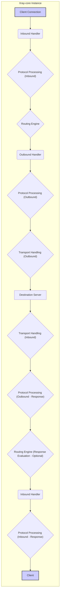
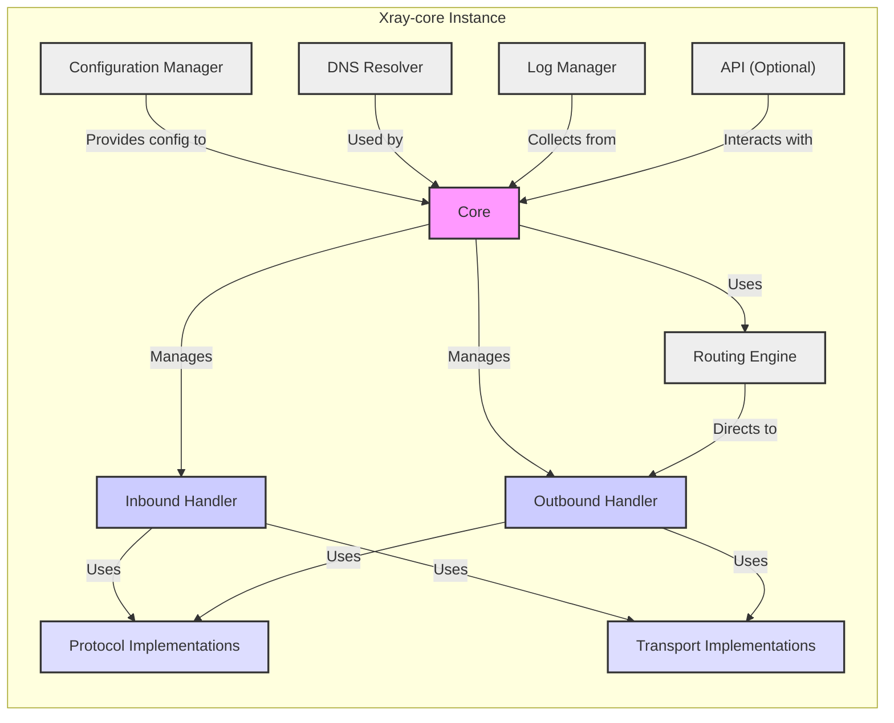

# Project Design Document: Xray-core

**Version:** 1.1
**Date:** October 26, 2023
**Author:** AI Software Architect

## 1. Introduction

This document provides an enhanced and more detailed architectural design of the Xray-core project, an open-source network utility for building private networks. This revised document aims to provide a stronger foundation for subsequent threat modeling activities by offering deeper insights into the system's components and their interactions.

## 2. Project Overview

Xray-core is a highly configurable and modular network tool primarily employed for circumventing network censorship and optimizing network performance. It achieves this through a diverse set of proxying techniques and protocol implementations. Its flexible architecture allows for tailored configurations and seamless integration of various protocols and transport mechanisms.

## 3. Goals

* Deliver a more granular and comprehensive architectural overview of Xray-core.
* Provide detailed descriptions of key components, emphasizing their responsibilities and interactions.
* Clearly illustrate the data flow within the system, including different scenarios.
* Elaborate on common deployment scenarios with practical examples.
* Serve as a robust and detailed basis for identifying potential security threats and vulnerabilities during threat modeling.

## 4. Target Audience

This document is intended for:

* Security engineers and architects tasked with performing threat modeling on Xray-core.
* Developers actively contributing to the Xray-core project, requiring a deep understanding of its architecture.
* System administrators responsible for deploying, configuring, and managing Xray-core instances in various environments.

## 5. Architectural Overview

Xray-core boasts a highly modular architecture, enabling significant customization and extensibility. The core functionality centers around the intelligent handling of network connections based on a flexible set of user-defined rules and protocol configurations. This modularity allows for independent development and updates of individual components.

## 6. Key Components

* **Core:** The central orchestrator of Xray-core. It manages the entire lifecycle of network connections, enforces routing rules, and coordinates the interactions between all other components. It acts as the central control plane.
* **Inbound Handler:** The entry point for client connections. It listens on specified network interfaces and ports, managing the initial handshake and protocol negotiation with connecting clients.
    * Supports protocols such as:
        * `dokodemo-door`: Allows listening on any address and port.
        * `http`: Handles incoming HTTP proxy requests.
        * `socks`: Supports SOCKS4 and SOCKS5 proxy protocols.
        * `trojan`: Implements the Trojan protocol for secure tunneling.
        * `vmess`:  A proprietary protocol offering various obfuscation and encryption options.
* **Outbound Handler:** Responsible for establishing connections to destination servers based on routing decisions. It selects the appropriate protocol and transport mechanism as dictated by the routing engine and configuration.
    * Supports protocols such as:
        * `freedom`: Directly connects to the destination without proxying.
        * `http`: Makes outbound HTTP requests.
        * `socks`: Connects to a SOCKS proxy server.
        * `trojan`: Connects to a Trojan server.
        * `vmess`: Connects to a VMess server.
        * `shadowsocks`: Connects to a Shadowsocks server.
* **Protocol Implementations:** Independent modules dedicated to implementing specific network protocols. These modules handle the encoding, decoding, encryption, decryption, and overall processing of protocol-specific data. They are responsible for adhering to the protocol specifications.
    * Examples include: `VMess`, `Trojan`, `Shadowsocks`, `HTTP`, `SOCKS`. Each protocol implementation has its own configuration options and security considerations.
* **Transport Implementations:** Modules that manage the underlying transport layer for network communication. They handle the establishment and management of connections over various transport protocols.
    * Examples include: `TCP`, `mKCP` (KCP over UDP), `WebSocket`, `HTTP/2`, `QUIC`, `gRPC`. Each transport has different performance and security characteristics.
* **Routing Engine:** The decision-making center of Xray-core. It evaluates incoming connections against a defined set of rules to determine the most appropriate outbound handler and protocol to utilize. This enables sophisticated routing strategies based on criteria like destination domain, IP address, client attributes, and time.
* **Configuration Manager:** Responsible for the crucial task of loading, parsing, validating, and managing the Xray-core configuration file (typically `config.json`). It ensures the configuration is syntactically correct and semantically valid before applying it to the system.
* **DNS Resolver:** Handles DNS queries originating from Xray-core or proxied through it. It can be configured to use specific DNS servers, implement DNS over HTTPS (DoH), or other custom DNS resolution strategies.
* **Log Manager:** Manages the logging of events, errors, and debugging information within Xray-core. It allows for configuring log levels and output destinations, aiding in monitoring and troubleshooting.
* **API (Optional):** Provides an external interface, often via gRPC, for other applications to interact with Xray-core. This can include querying statistics, managing connections, or dynamically updating configurations.

## 7. Data Flow

The typical data flow within Xray-core for a single client connection can be broken down into the following stages:

1. **Client Initiates Connection:** A client application initiates a network connection destined for a service accessible through Xray-core.
2. **Inbound Handler Receives Connection:** The designated Inbound Handler, listening on the configured port and interface, accepts the incoming connection.
3. **Inbound Protocol Negotiation/Processing:** The Inbound Handler negotiates the initial protocol with the client (e.g., SOCKS handshake, HTTP CONNECT). The corresponding protocol implementation processes the incoming data stream according to the negotiated protocol.
4. **Routing Engine Evaluates Rules:** The Routing Engine examines the connection details (destination IP, domain, client information, etc.) and compares them against the configured routing rules.
5. **Outbound Handler Selection:** Based on the matching routing rule, the Routing Engine selects the appropriate Outbound Handler to handle the connection.
6. **Outbound Protocol Processing:** The selected Outbound Handler utilizes its associated protocol implementation to prepare the data for transmission to the destination server. This might involve encryption, encapsulation, or other protocol-specific transformations.
7. **Transport Layer Handling (Outbound):** The chosen Transport Implementation establishes a connection to the destination server (or the next hop in a chained proxy setup) using the specified transport protocol (TCP, WebSocket, etc.) and sends the processed data.
8. **Response from Destination:** The destination server sends a response back through the established connection.
9. **Transport Layer Handling (Inbound):** The Transport Implementation receives the response data.
10. **Outbound Protocol Processing (Reverse):** The Outbound Handler's protocol implementation processes the incoming response data, potentially decrypting or de-encapsulating it.
11. **Routing Engine (Response Handling - if applicable):** In some scenarios, response routing might be necessary, although less common than initial request routing.
12. **Inbound Protocol Processing (Reverse):** The Inbound Handler's protocol implementation processes the response data to format it according to the client's expected protocol.
13. **Response Sent to Client:** The Inbound Handler sends the processed response back to the originating client.

## 8. Deployment Model

Xray-core's flexibility allows for diverse deployment scenarios:

* **Standalone Client Application:** An Xray-core instance runs directly on a user's device (desktop, mobile) to proxy their network traffic through remote servers, often to bypass censorship or improve privacy.
* **Dedicated Proxy Server:** An Xray-core instance is deployed on a server in a data center or cloud environment, acting as a central proxy server for multiple clients or an entire network.
* **Client-Server Architecture:** A combination of client-side Xray-core instances connecting to a dedicated server-side instance. This is a common setup for personal VPNs or small teams.
* **Network Gateway Integration:** Xray-core is integrated into a network gateway or router, allowing it to transparently route traffic for all devices on the network based on configured rules. This is suitable for home or small office networks.
* **Chained Proxy Setup:** Multiple Xray-core instances are chained together, where the outbound of one instance connects to the inbound of another. This can provide enhanced anonymity or routing flexibility.

## 9. Configuration

Xray-core's behavior is primarily defined through a JSON-based configuration file (`config.json`). This file structures the system's operation by defining various settings:

* **Inbound Configurations:**
    * `protocol`: Specifies the protocol to be used for the inbound handler (e.g., "vmess", "trojan", "http").
    * `port`: The network port on which the inbound handler will listen for connections.
    * `listen`: The network interface address to listen on.
    * `settings`: Protocol-specific settings (e.g., user IDs, passwords, encryption methods).
    * `streamSettings`: Transport-related settings (e.g., network, security, TLS).
* **Outbound Configurations:**
    * `protocol`: Specifies the protocol for the outbound connection.
    * `settings`: Protocol-specific settings for the outbound connection.
    * `streamSettings`: Transport settings for the outbound connection.
    * `servers`: For protocols like `shadowsocks`, a list of server configurations.
* **Routing Configuration:**
    * `rules`: An array of rules that define how incoming connections should be routed.
    * Each rule can match based on: domain, IP, port, user, inbound tag, etc.
    * Each rule specifies an `outboundTag` to direct the connection to a specific outbound handler.
* **Transport Configurations (`streamSettings`):**
    * `network`: The underlying network transport (e.g., "tcp", "ws", "kcp").
    * `security`: Security settings (e.g., "none", "tls").
    * `tlsSettings`: TLS-specific configurations (e.g., server name, certificates).
    * `wsSettings`: WebSocket-specific configurations (e.g., path, headers).
* **Log Configuration:**
    * `loglevel`: The verbosity of the logs (e.g., "debug", "info", "warning", "error").
    * `logOutput`: The destination for log output (e.g., "stdout", file path).
* **DNS Configuration:**
    * `servers`: A list of DNS servers to use.
    * `clientIP`: The IP address to use for DNS queries.
    * `disableCache`: Whether to disable DNS caching.
* **API Configuration (if enabled):**
    * `services`:  Specifies which API services are enabled.
    * `bind`: The address and port for the API server.

## 10. Security Considerations (Detailed)

This section expands on the preliminary security considerations, providing more specific examples and potential threats:

* **Configuration Security:**
    * **Threat:** Exposure of `config.json` can lead to complete compromise, as it contains sensitive credentials (passwords, private keys).
    * **Mitigation:** Secure storage with appropriate file permissions, encryption at rest, and avoiding committing sensitive information to version control.
* **Protocol Vulnerabilities:**
    * **Threat:** Exploitation of vulnerabilities in specific protocols (e.g., known weaknesses in older VMess versions, replay attacks on certain protocols).
    * **Mitigation:** Using the latest stable versions of Xray-core, employing strong and up-to-date protocol configurations, and staying informed about security advisories.
* **Transport Security:**
    * **Threat:** Man-in-the-middle attacks if TLS is not properly configured or if weak ciphers are used.
    * **Mitigation:** Enforcing TLS with strong cipher suites, proper certificate management, and using secure transport protocols like QUIC where applicable.
* **Access Control:**
    * **Threat:** Unauthorized access to the Xray-core instance, allowing malicious actors to use it as an open proxy or to intercept traffic.
    * **Mitigation:** Implementing authentication mechanisms in inbound protocols (e.g., strong passwords for Trojan, secure key exchange for VMess), and potentially using firewall rules to restrict access.
* **Logging and Monitoring:**
    * **Threat:** Insufficient logging can hinder incident response and make it difficult to detect malicious activity.
    * **Mitigation:** Configuring comprehensive logging to capture relevant events, and implementing monitoring systems to detect anomalies.
* **Dependency Management:**
    * **Threat:** Vulnerabilities in third-party libraries used by Xray-core could be exploited.
    * **Mitigation:** Regularly updating dependencies and being aware of security vulnerabilities in those dependencies.
* **Denial of Service (DoS):**
    * **Threat:** Attackers could overwhelm the Xray-core instance with connection requests, rendering it unavailable.
    * **Mitigation:** Implementing rate limiting on inbound connections, using techniques like SYN cookies, and potentially deploying Xray-core behind a DDoS mitigation service.
* **Code Injection:**
    * **Threat:** Although less likely due to the nature of Xray-core's configuration, vulnerabilities in parsing or processing configuration data could potentially lead to code injection.
    * **Mitigation:** Rigorous input validation and sanitization of configuration data.
* **DNS Security:**
    * **Threat:** DNS spoofing or poisoning attacks could redirect traffic to malicious servers.
    * **Mitigation:** Using secure DNS protocols like DNS over HTTPS (DoH) or DNS over TLS (DoT), and validating DNS responses.

## 11. Diagrams

### 11.1. High-Level Architecture Diagram

## 12. Future Considerations

* **Enhanced Plugin Architecture:** Develop a more robust plugin system to allow for easier extension with custom protocols, transports, and routing strategies by third-party developers.
* **Centralized Management Interface:** Create tools or APIs for centrally managing and monitoring multiple Xray-core instances, simplifying administration for larger deployments.
* **Improved Observability and Metrics:** Enhance the collection and reporting of metrics and tracing data to provide deeper insights into Xray-core's performance and behavior.
* **Formal Security Audits:** Conduct regular formal security audits by independent security experts to identify and address potential vulnerabilities.

## 13. Conclusion

This improved design document offers a more detailed and comprehensive understanding of the Xray-core architecture. By elaborating on the responsibilities of each component, clarifying the data flow, and providing more specific security considerations, this document serves as a significantly enhanced foundation for effective threat modeling and security analysis of the Xray-core project.