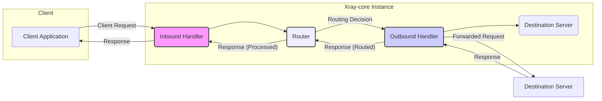

## Project Design Document: Xray-core (Improved)

**1. Introduction**

This document provides an enhanced and detailed design overview of the Xray-core project, an open-source network utility designed for building secure and private networks. It aims to be a comprehensive resource for understanding the system's architecture, components, and data flow, specifically tailored for use in subsequent threat modeling activities.

**2. Project Overview**

Xray-core is a versatile platform for creating proxies and network tunnels, offering a high degree of flexibility and customization. It supports a wide array of protocols and transport layers, enabling diverse networking solutions. Key features include:

*   Support for multiple inbound and outbound proxy protocols, such as VMess, Trojan, Shadowsocks, and Socks.
*   Sophisticated routing capabilities based on a rich set of rules and conditions, allowing for granular traffic management.
*   Diverse transport layers, including TCP, mKCP, WebSocket, HTTP/2, and QUIC, providing options for different network environments.
*   Advanced obfuscation and encryption techniques to enhance user privacy and circumvent network censorship.
*   A modular and extensible design that allows for the integration of custom functionalities and protocols.

**3. System Architecture**

The core architecture of Xray-core centers around the processing of network connections through a series of well-defined and interconnected components. The following diagram illustrates the high-level architecture and data flow:

**4. Key Components**

This section provides a more in-depth look at the major components within the Xray-core architecture:

*   **Inbound Handler:**
    *   Function: Accepts incoming network connections from clients.
    *   Responsibilities:
        *   Listens on configured network interfaces and ports.
        *   Negotiates the initial protocol handshake with the client based on the configured inbound protocol (e.g., VMess, Trojan, Shadowsocks).
        *   Performs client authentication and authorization, if required by the protocol.
        *   Decrypts incoming data if the protocol involves encryption.
        *   Packages the processed connection data and metadata for the Router.

*   **Router:**
    *   Function:  The central decision-making engine for directing network traffic.
    *   Responsibilities:
        *   Receives processed connection data and metadata from Inbound Handlers.
        *   Evaluates a series of user-defined routing rules. These rules can be based on various criteria, including:
            *   Source and destination IP addresses and ports.
            *   Domain names and patterns.
            *   Protocol types.
            *   User identifiers (if authenticated).
            *   Time-based conditions.
            *   Regular expressions on data content (through extensions).
        *   Selects the appropriate Outbound Handler or action (e.g., direct connection, blocking) based on the first matching rule.

*   **Outbound Handler:**
    *   Function: Establishes connections to destination servers and manages data transmission.
    *   Responsibilities:
        *   Receives routing decisions and connection details from the Router.
        *   Selects and initializes the configured outbound protocol (e.g., Direct, VMess, Trojan, Shadowsocks).
        *   Performs protocol-specific actions, such as encryption, obfuscation, and header manipulation.
        *   Establishes a connection to the destination server using the specified transport layer (e.g., TCP, WebSocket).
        *   Forwards the processed request data to the destination server.
        *   Receives the response from the destination server.
        *   Performs any necessary protocol transformations or decryption on the response.

*   **Transport Layer:**
    *   Function: Manages the underlying communication protocols used for data transmission between Xray-core and other network entities.
    *   Examples:
        *   TCP (Transmission Control Protocol): Reliable, connection-oriented protocol.
        *   mKCP (Multiplexed KCP): A reliable UDP-based protocol with focus on low latency.
        *   WebSocket: Enables full-duplex communication over a single TCP connection.
        *   HTTP/2:  An improved version of HTTP with features like header compression and multiplexing.
        *   QUIC (Quick UDP Internet Connections): A secure and efficient transport protocol built on UDP.
    *   Responsibilities: Handling connection establishment, data segmentation, transmission, error detection, and retransmission (depending on the protocol).

*   **Protocol Layer:**
    *   Function: Defines the specific proxy protocols used for communication with clients and destination servers.
    *   Examples:
        *   VMess: Xray's proprietary protocol, known for its strong encryption and obfuscation capabilities.
        *   Trojan: A lightweight protocol designed to mimic legitimate HTTPS traffic.
        *   Shadowsocks: A popular open-source suite of encryption protocols.
        *   SOCKS (SOCKS4, SOCKS5): General-purpose proxy protocols.
    *   Responsibilities: Handling authentication, encryption/decryption, data formatting, and protocol-specific features.

*   **Configuration:**
    *   Function: Defines the operational parameters and behavior of the Xray-core instance.
    *   Format: Typically stored in JSON or YAML files.
    *   Content: Specifies inbound and outbound configurations, routing rules, transport settings, logging levels, and other critical parameters.
    *   Management: Changes to the configuration can often be applied dynamically without requiring a full restart of the Xray-core process.

*   **Logics (Internal Modules):**
    *   Function: Encompasses various internal modules responsible for supporting core functionalities.
    *   Examples:
        *   DNS Resolver: Handles domain name resolution.
        *   Connection Manager: Manages active network connections.
        *   Traffic Statistics: Collects and reports on traffic usage.
        *   Plugin System: Enables the extension of Xray-core's functionality through external modules (e.g., GeoIP databases for routing).

**5. Data Flow (Detailed)**

A detailed breakdown of the data flow through an Xray-core instance:

1. A client application initiates a network connection to the Xray-core instance's configured listening address and port.
2. The **Inbound Handler** accepts the connection.
3. The **Inbound Handler** negotiates the inbound proxy protocol with the client (e.g., VMess handshake, SOCKS authentication). This may involve cryptographic operations for authentication and session key establishment.
4. If the inbound protocol involves encryption, the **Inbound Handler** decrypts the incoming data stream.
5. The **Inbound Handler** extracts relevant metadata from the connection and the negotiated protocol (e.g., destination address, user information).
6. The **Inbound Handler** packages the processed data and metadata and passes it to the **Router**.
7. The **Router** iterates through its configured routing rules, comparing the connection metadata against the rule criteria.
8. Upon finding a matching rule, the **Router** determines the appropriate **Outbound Handler** or action.
9. The **Router** forwards the data and routing decision to the selected **Outbound Handler**.
10. The **Outbound Handler** selects the configured outbound protocol and transport.
11. If the outbound protocol requires encryption or obfuscation, the **Outbound Handler** applies the necessary transformations to the data.
12. The **Outbound Handler** establishes a connection to the destination server using the chosen transport layer.
13. The **Outbound Handler** sends the processed request data to the destination server.
14. The destination server processes the request and sends a response back to the **Outbound Handler**.
15. The **Outbound Handler** receives the response.
16. If the outbound protocol involves encryption, the **Outbound Handler** decrypts the response.
17. The **Outbound Handler** sends the processed response back to the **Router**.
18. The **Router** forwards the response back to the originating **Inbound Handler**.
19. The **Inbound Handler** applies any necessary protocol transformations or encryption to the response before sending it back to the client application.
20. The client application receives the response.

**6. Security Considerations (Expanded)**

Xray-core incorporates several security features and requires careful consideration of potential vulnerabilities:

*   **Encryption Strength:** The security of protocols like VMess and Shadowsocks depends on the strength of the chosen encryption algorithms and key management practices. Weak or compromised keys can lead to data breaches.
*   **Authentication Mechanisms:** Robust authentication mechanisms are crucial for preventing unauthorized access. Vulnerabilities in the authentication process can allow attackers to impersonate legitimate users.
*   **Obfuscation Effectiveness:** While obfuscation techniques aim to disguise traffic, their effectiveness can vary and may be circumvented by sophisticated adversaries. Relying solely on obfuscation for security is not recommended.
*   **Routing Rule Security:** Misconfigured routing rules can create security loopholes, allowing unauthorized traffic or exposing internal services.
*   **Configuration Vulnerabilities:**  The configuration file contains sensitive information. Unauthorized access or modification of the configuration can severely compromise the system. Secure storage and access control for the configuration file are essential.
*   **Logging Security:** Logs can contain sensitive information. Proper log management, including secure storage and access control, is necessary to prevent information leaks.
*   **Transport Layer Security:** Using secure transport layers like TLS (over WebSocket or HTTP/2) adds an extra layer of encryption and authentication. However, vulnerabilities in the TLS implementation or configuration can be exploited.
*   **Denial of Service (DoS) Attacks:** Xray-core instances can be targeted by DoS attacks, overwhelming their resources and preventing legitimate traffic from being processed. Rate limiting and other defensive measures may be necessary.
*   **Protocol-Specific Vulnerabilities:** Each supported protocol may have its own set of vulnerabilities. Staying up-to-date with security advisories and applying necessary patches is important.

**7. Deployment Scenarios (Detailed Examples)**

Xray-core's versatility allows for diverse deployment scenarios:

*   **Individual User Privacy (Client Proxy):**
    *   A user runs Xray-core on their personal computer or mobile device.
    *   All internet traffic from the user's device is routed through a remote Xray-core server, masking their IP address and encrypting their communication.
    *   This scenario helps bypass geographical restrictions and enhance online privacy.

*   **Bypassing Network Censorship (Client Proxy):**
    *   Users in regions with internet censorship can use Xray-core to connect to servers outside the censored network, accessing blocked content.
    *   Obfuscation features are crucial in this scenario to make the proxy traffic appear as legitimate traffic.

*   **Secure Access to Internal Networks (Client Proxy/Server Proxy):**
    *   Employees can use Xray-core on their devices to securely access internal company resources when working remotely.
    *   An Xray-core server acts as a gateway, authenticating users and routing their traffic to the internal network.

*   **Load Balancing and Traffic Management (Server Proxy):**
    *   Organizations can deploy multiple Xray-core instances to distribute incoming traffic across different backend servers, improving performance and resilience.
    *   Routing rules can be used to implement sophisticated traffic management policies.

*   **Creating Secure Communication Channels (Chaining Proxies):**
    *   Multiple Xray-core instances can be chained together to create multi-hop proxy networks, further enhancing anonymity and security.
    *   Each hop adds a layer of encryption and obfuscation.

**8. Technology Stack**

*   **Primary Programming Language:** Go (Golang)
*   **Core Networking Libraries:**  Standard Go libraries (`net`, `crypto`, `tls`)
*   **Potential External Libraries:**  May utilize third-party libraries for specific transport protocols (e.g., QUIC implementations) or cryptographic functions.
*   **Configuration Language:** JSON or YAML

**9. Assumptions and Limitations**

*   This document provides a general overview of Xray-core's architecture. Specific implementations and features may vary across different versions and configurations.
*   The security of an Xray-core deployment is highly dependent on the user's configuration choices and secure management practices. This document does not cover operational security aspects in detail.
*   The performance characteristics of Xray-core can vary depending on the chosen protocols, transport layers, and network conditions. Performance analysis is outside the scope of this document.
*   This document focuses on the core components and data flow. Detailed specifications of individual protocol implementations are not exhaustively covered.

This improved design document provides a more comprehensive and detailed understanding of the Xray-core project, specifically tailored to serve as a solid foundation for subsequent threat modeling activities. It highlights potential attack surfaces and security considerations in greater detail.